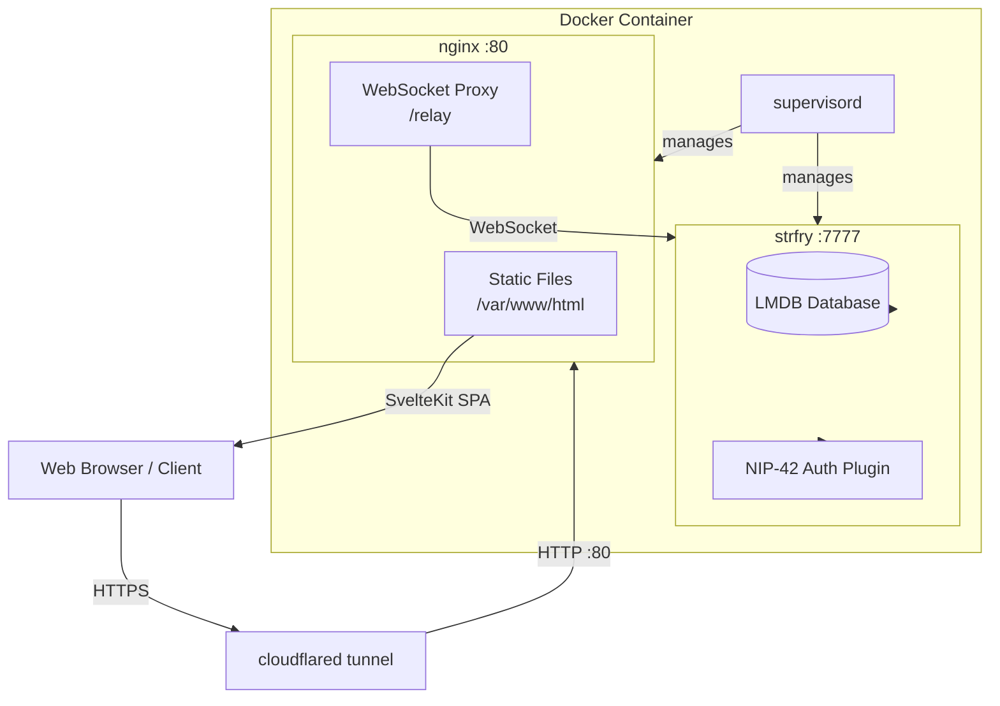
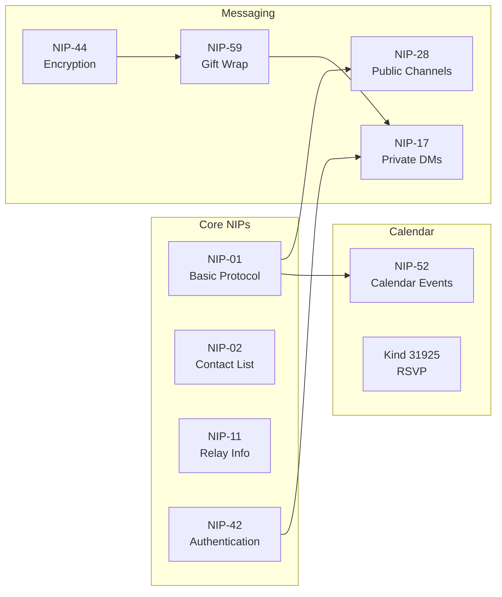
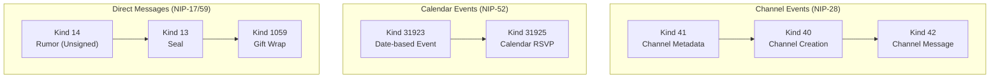
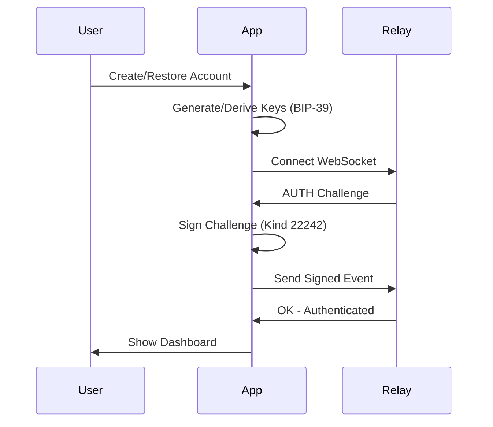
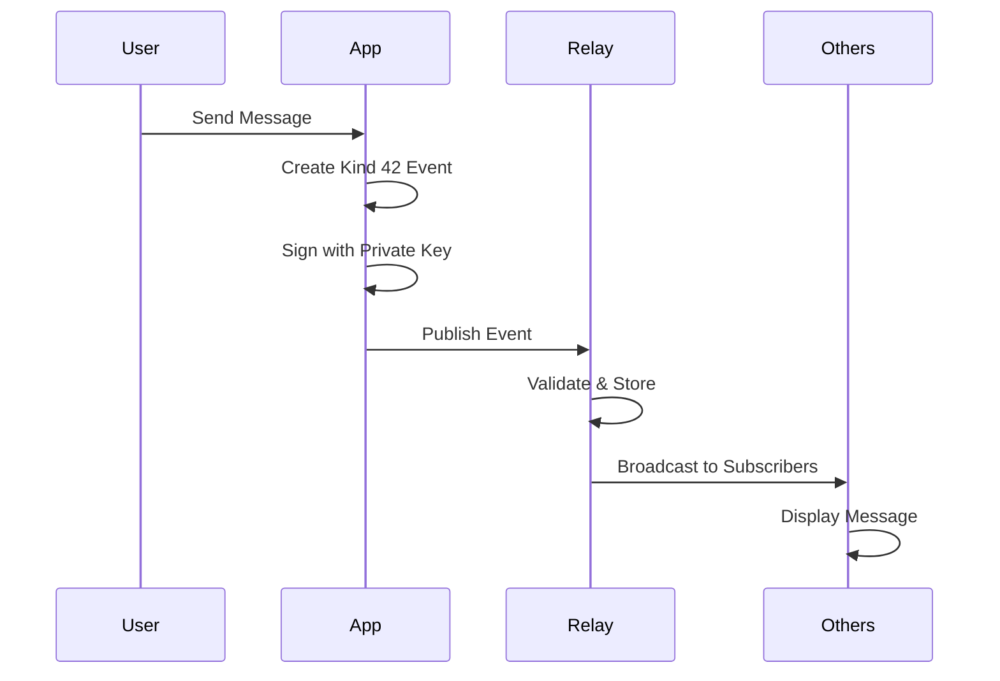
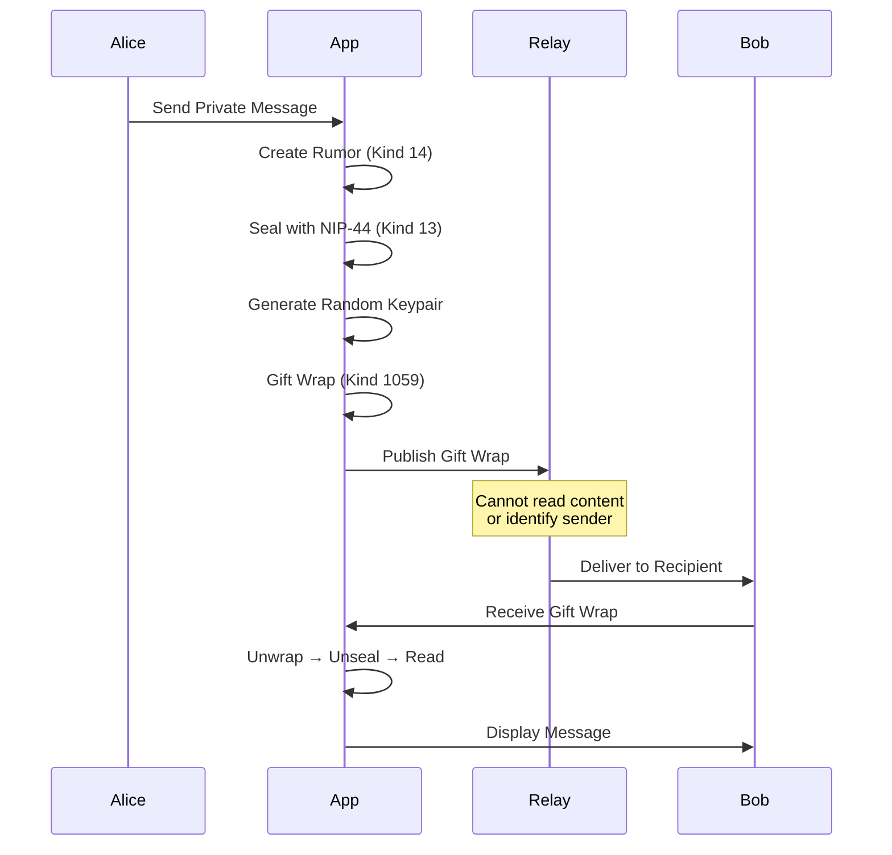
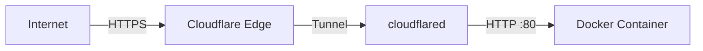

# Fairfield Nostr

A privacy-first community messaging platform built on the Nostr protocol. Features NIP-52 calendar events, NIP-28 public chat channels, NIP-17/59 encrypted direct messages, and a built-in strfry relay in a single Docker container.

[](LICENSE)
[](https://nostr.com)
[](https://kit.svelte.dev)
[](https://docker.com)

## Features

- **Public Chat Channels** - NIP-28 group messaging with admin-managed channels
- **Calendar Events** - NIP-52 event scheduling with RSVP support
- **Encrypted DMs** - NIP-17/59 gift-wrapped private messages
- **PWA Support** - Installable app with offline message queue
- **Single Container** - Website + strfry relay in one Docker image
- **Cloudflared Ready** - HTTP exposed for tunnel-based HTTPS termination

## Architecture



## Quick Start

### Using Docker Compose (Recommended)

```bash
# Clone and start
git clone https://github.com/jjohare/fairfield-nostr.git
cd fairfield-nostr
docker-compose up -d --build

# Access
# Website: http://localhost:8080
# Relay:   ws://localhost:8080/relay
```

### Local Development

```bash
# Install dependencies
npm install

# Start development server
npm run dev

# Build for production
npm run build

# Preview production build
npm run preview
```

## Nostr Implementation Protocols (NIPs)



### Supported NIPs

| NIP | Name | Description |
|-----|------|-------------|
| [NIP-01](https://github.com/nostr-protocol/nips/blob/master/01.md) | Basic Protocol | Core event format and relay communication |
| [NIP-02](https://github.com/nostr-protocol/nips/blob/master/02.md) | Contact List | Following list management |
| [NIP-11](https://github.com/nostr-protocol/nips/blob/master/11.md) | Relay Information | Relay metadata document |
| [NIP-17](https://github.com/nostr-protocol/nips/blob/master/17.md) | Private DMs | Sealed rumors for private messaging |
| [NIP-28](https://github.com/nostr-protocol/nips/blob/master/28.md) | Public Chat | Group channels with moderation |
| [NIP-42](https://github.com/nostr-protocol/nips/blob/master/42.md) | Authentication | Relay authentication challenges |
| [NIP-44](https://github.com/nostr-protocol/nips/blob/master/44.md) | Versioned Encryption | Modern encryption for DMs |
| [NIP-52](https://github.com/nostr-protocol/nips/blob/master/52.md) | Calendar Events | Event scheduling with RSVP |
| [NIP-59](https://github.com/nostr-protocol/nips/blob/master/59.md) | Gift Wrap | Metadata protection layer |

## Event Kinds



## User Flows

### Authentication Flow



### Channel Messaging Flow



### Gift-Wrapped DM Flow



## Project Structure

```
fairfield-nostr/
├── src/
│   ├── lib/
│   │   ├── components/      # Svelte components
│   │   │   ├── auth/        # Login, signup, profile
│   │   │   ├── chat/        # Channel list, messages
│   │   │   ├── events/      # Calendar, booking
│   │   │   └── layout/      # Navigation, modals
│   │   ├── nostr/           # Nostr protocol implementation
│   │   │   ├── dm.ts        # NIP-17/59 DM functions
│   │   │   ├── relay.ts     # NDK relay manager
│   │   │   └── types.ts     # TypeScript definitions
│   │   ├── stores/          # Svelte stores
│   │   └── utils/           # Helper functions
│   ├── routes/              # SvelteKit routes
│   └── service-worker.ts    # PWA service worker
├── relay/
│   ├── strfry.conf          # Relay configuration
│   └── whitelist.json       # Authorized pubkeys
├── static/                  # Static assets
├── tests/                   # Playwright E2E tests
├── Dockerfile               # Multi-stage Docker build
├── docker-compose.yml       # Deployment config
└── nginx.conf               # Web server config
```

## Configuration

### Environment Variables

```bash
# .env
VITE_RELAY_URL=ws://localhost:8080/relay    # Relay WebSocket URL
VITE_ADMIN_PUBKEY=<hex-pubkey>              # Admin public key (hex)
VITE_NDK_DEBUG=false                         # Enable NDK debug logging
```

### Relay Configuration

The strfry relay is configured in `relay/strfry.conf`:

```conf
relay {
    name = "Fairfield Private Relay"
    bind = "127.0.0.1"
    port = 7777
    noTLS = true
}

events {
    maxEventSize = 65536
    maxNumTags = 2000
}

negentropy {
    enabled = true
    maxSyncEvents = 1000000
}
```

## Deployment Options

### Option 1: Docker with Cloudflared



1. Create a Cloudflare tunnel:
   ```bash
   cloudflared tunnel create fairfield
   ```

2. Configure tunnel to point to `http://fairfield:80`

3. Enable the cloudflared service in `docker-compose.yml`:
   ```yaml
   cloudflared:
     image: cloudflare/cloudflared:latest
     environment:
       - TUNNEL_TOKEN=${CLOUDFLARED_TOKEN}
   ```

### Option 2: Reverse Proxy (nginx/Caddy)

```bash
# Caddy example
fairfield.example.com {
    reverse_proxy localhost:8080
}
```

### Option 3: Direct Docker

```bash
docker run -d \
  -p 8080:80 \
  -v fairfield-data:/app/strfry-db \
  fairfield-nostr
```

## API Reference

### Relay Manager

```typescript
import { connectRelay, publishEvent, subscribe } from '$lib/nostr';

// Connect to relay
await connectRelay('ws://localhost:8080/relay', privateKey);

// Publish event
const event = new NDKEvent();
event.kind = 1;
event.content = 'Hello Nostr!';
await publishEvent(event);

// Subscribe to events
const sub = subscribe({ kinds: [1], limit: 10 });
sub.on('event', (event) => console.log(event));
```

### Direct Messages

```typescript
import { sendDM, receiveDM, createDMFilter } from '$lib/nostr/dm';

// Send encrypted DM
await sendDM('Hello!', recipientPubkey, senderPrivkey, relay);

// Receive and decrypt
const dm = receiveDM(giftWrapEvent, myPrivkey);
console.log(dm.content, dm.senderPubkey);

// Subscribe to DMs
const filter = createDMFilter(myPubkey);
```

### Channel Operations

```typescript
import { createChannel, sendChannelMessage } from '$lib/nostr/channels';

// Create channel (admin only)
await createChannel({
  name: 'General',
  about: 'General discussion',
  picture: 'https://example.com/icon.png'
});

// Send message
await sendChannelMessage(channelId, 'Hello channel!');
```

## Testing

```bash
# Run unit tests
npm test

# Run E2E tests with Playwright
npm run test:e2e

# Test specific file
npm test src/lib/nostr/dm.test.ts
```

## Security Considerations

### Key Management
- Private keys are stored encrypted in localStorage
- BIP-39 mnemonic backup for key recovery
- Never transmitted to server or relay

### Message Privacy
- NIP-44 encryption for all DMs
- Gift wrap hides sender identity from relay
- Timestamp fuzzing prevents timing analysis

### Relay Security
- NIP-42 authentication required for writes
- Optional whitelist for private communities
- Rate limiting and event validation

## Contributing

1. Fork the repository
2. Create your feature branch (`git checkout -b feature/amazing-feature`)
3. Commit your changes (`git commit -m 'Add amazing feature'`)
4. Push to the branch (`git push origin feature/amazing-feature`)
5. Open a Pull Request

## Documentation

- [DM Implementation](docs/dm-implementation.md) - NIP-17/59 encrypted messaging
- [PWA Implementation](docs/pwa-implementation.md) - Offline support and installation
- [Events Module](docs/events-module-example.md) - NIP-52 calendar events
- [Architecture](docs/sparc/02-architecture.md) - System design details

## License

MIT License - see [LICENSE](LICENSE) for details.

## Acknowledgments

- [Nostr Protocol](https://nostr.com) - The protocol specification
- [NDK](https://github.com/nostr-dev-kit/ndk) - Nostr Development Kit
- [strfry](https://github.com/hoytech/strfry) - High-performance Nostr relay
- [SvelteKit](https://kit.svelte.dev) - Web application framework
