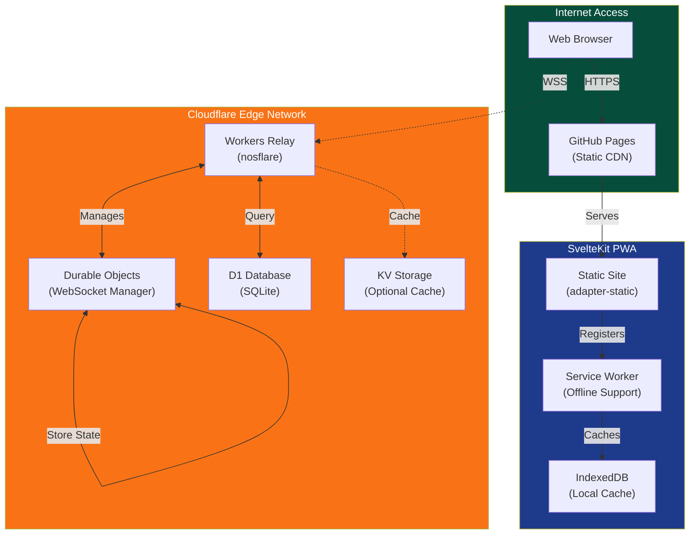
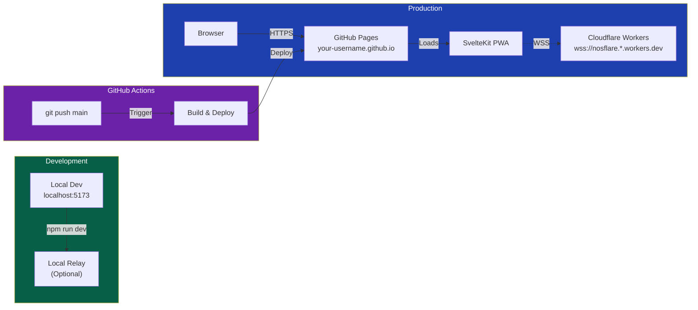
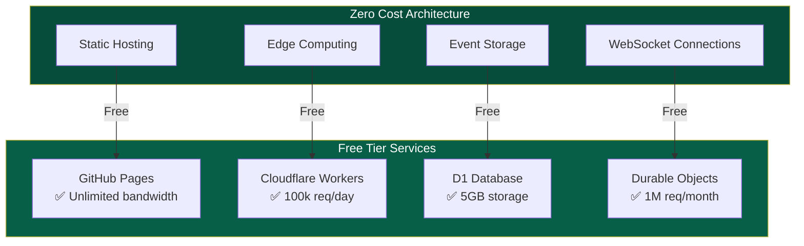
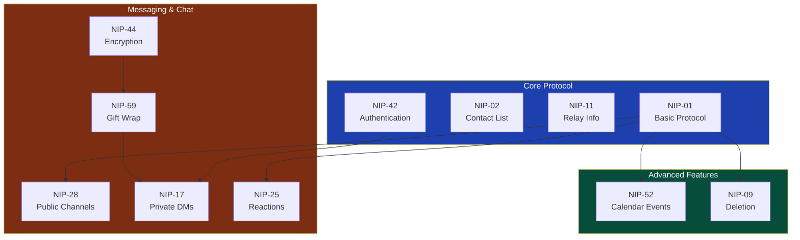
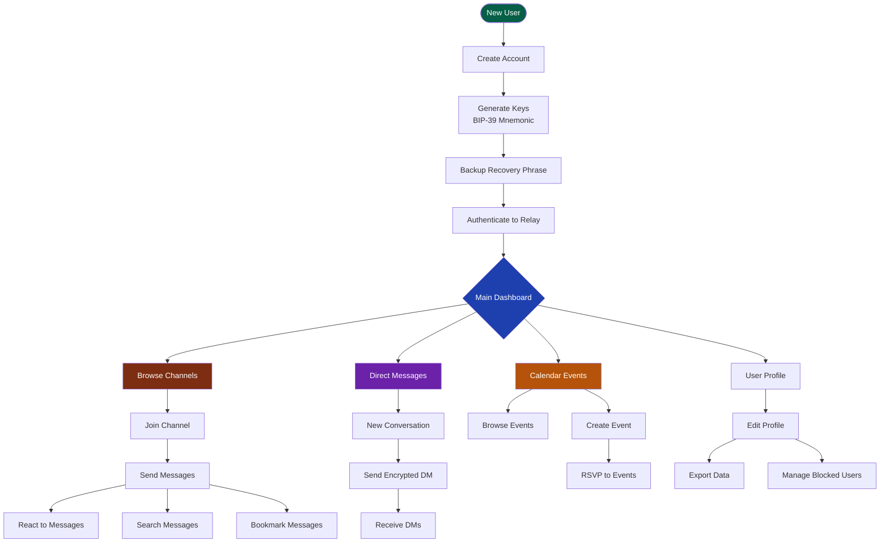
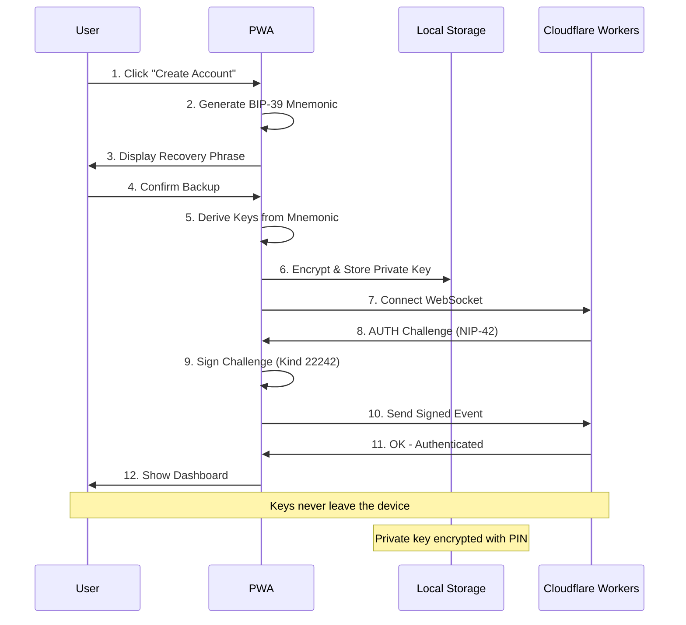
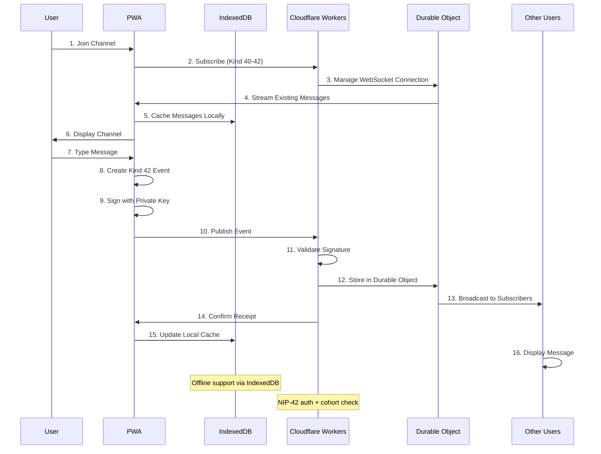
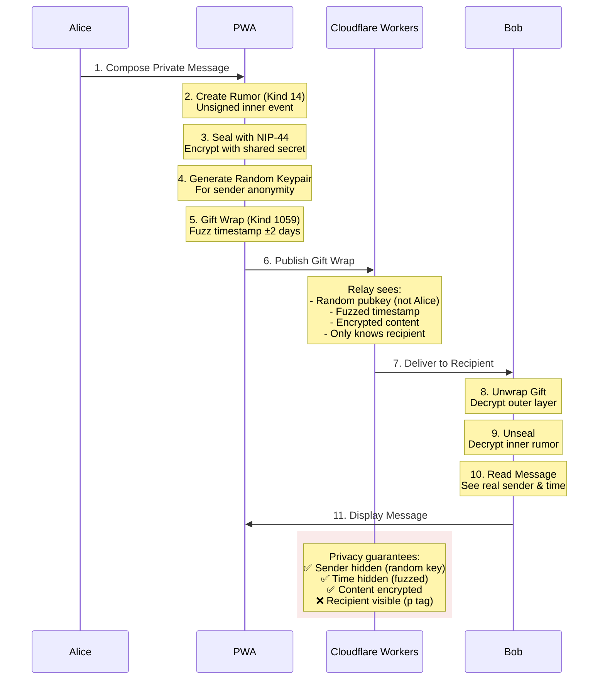

# Minimoonoir

A privacy-first community messaging platform built on the Nostr protocol. Features NIP-52 calendar events, NIP-28 public chat channels, NIP-17/59 encrypted direct messages, and cohort-based access control. Fully serverless architecture with SvelteKit PWA on GitHub Pages and Cloudflare Workers relay.

[](LICENSE)
[](https://nostr.com)
[](https://kit.svelte.dev)
[](https://workers.cloudflare.com)

## Features

- **Public Chat Channels** - NIP-28 group messaging with cohort-based access control
- **Calendar Events** - NIP-52 event scheduling with RSVP support
- **Encrypted DMs** - NIP-17/59 gift-wrapped private messages
- **PWA Support** - Installable app with offline message queue
- **Serverless Architecture** - Zero infrastructure costs on free tier
- **Cohort-Based Access** - Business, moomaa-tribe, and admin roles

## Quick Start

### Prerequisites

- Node.js 18+ and npm
- Cloudflare account (free tier)
- GitHub account (for deployment)

### Local Development

```bash
# Clone the repository
git clone https://github.com/jjohare/minimoonoir.git
cd minimoonoir

# Install dependencies
npm install

# Configure environment
cp .env.example .env
# Edit .env with your relay URL and admin pubkey

# Start development server
npm run dev

# Access: http://localhost:5173
```

### Deploy to Production

**Frontend (GitHub Pages):**

```bash
# Build PWA for production
npm run build

# Deployment happens automatically via GitHub Actions on push to main
# Or deploy manually:
npm run deploy
```

**Backend (Cloudflare Workers):**

The relay is already deployed at `wss://nosflare.solitary-paper-764d.workers.dev`

To deploy your own relay, see the [nosflare repository](https://github.com/Spl0itable/nosflare) and follow the Cloudflare Workers deployment instructions.

## Architecture

### System Overview



### Deployment Architecture



### Free Tier Compatibility



## Nostr Implementation

### Supported NIPs



### NIP Implementation Table

| NIP | Name | Status | Description |
|-----|------|--------|-------------|
| [NIP-01](https://github.com/nostr-protocol/nips/blob/master/01.md) | Basic Protocol | ✅ Complete | Core event format and relay communication |
| [NIP-02](https://github.com/nostr-protocol/nips/blob/master/02.md) | Contact List | ✅ Complete | Following list management |
| [NIP-09](https://github.com/nostr-protocol/nips/blob/master/09.md) | Event Deletion | ✅ Complete | Message deletion support |
| [NIP-11](https://github.com/nostr-protocol/nips/blob/master/11.md) | Relay Information | ✅ Complete | Relay metadata document |
| [NIP-17](https://github.com/nostr-protocol/nips/blob/master/17.md) | Private DMs | ✅ Complete | Sealed rumors for private messaging |
| [NIP-25](https://github.com/nostr-protocol/nips/blob/master/25.md) | Reactions | ✅ Complete | Message reactions (emoji) |
| [NIP-28](https://github.com/nostr-protocol/nips/blob/master/28.md) | Public Chat | ✅ Complete | Group channels with moderation |
| [NIP-42](https://github.com/nostr-protocol/nips/blob/master/42.md) | Authentication | ✅ Complete | Relay authentication challenges |
| [NIP-44](https://github.com/nostr-protocol/nips/blob/master/44.md) | Versioned Encryption | ✅ Complete | Modern encryption for DMs |
| [NIP-52](https://github.com/nostr-protocol/nips/blob/master/52.md) | Calendar Events | ✅ Complete | Event scheduling with RSVP |
| [NIP-59](https://github.com/nostr-protocol/nips/blob/master/59.md) | Gift Wrap | ✅ Complete | Metadata protection layer |

### Event Kinds

| Kind | NIP | Purpose | Documentation |
|------|-----|---------|---------------|
| 0 | 01 | User Profile | Metadata (name, avatar, bio) |
| 1 | 01 | Text Note | Channel messages |
| 4 | 04 | Encrypted DM | Legacy DMs (read-only) |
| 5 | 09 | Deletion | Delete own messages |
| 7 | 25 | Reaction | Emoji reactions |
| 40 | 28 | Channel Creation | Create channel |
| 41 | 28 | Channel Metadata | Update channel |
| 42 | 28 | Channel Message | Post to channel |
| 1059 | 59 | Gift Wrap | Wrapped DMs |
| 31923 | 52 | Calendar Event | Date-based events |
| 31925 | 52 | Calendar RSVP | Event responses |

## User Flows

### Complete User Journey



### Authentication Flow



### Channel Messaging Flow



### Gift-Wrapped DM Flow (NIP-17/59)



### Offline Message Queue Flow


## Project Structure

```
minimoonoir/
├── src/
│   ├── lib/
│   │   ├── components/      # Svelte components
│   │   │   ├── auth/        # Login, signup, profile
│   │   │   ├── chat/        # Channel list, messages
│   │   │   ├── dm/          # Direct messages
│   │   │   ├── events/      # Calendar, booking
│   │   │   ├── admin/       # Admin panel
│   │   │   ├── forum/       # Forum-style features
│   │   │   └── ui/          # Reusable UI components
│   │   ├── nostr/           # Nostr protocol implementation
│   │   │   ├── keys.ts      # BIP-39 key generation
│   │   │   ├── encryption.ts # NIP-44 encryption
│   │   │   ├── dm.ts        # NIP-17/59 DM functions
│   │   │   ├── channels.ts  # NIP-28 channels
│   │   │   ├── reactions.ts # NIP-25 reactions
│   │   │   ├── calendar.ts  # NIP-52 events
│   │   │   └── relay.ts     # NDK relay manager
│   │   ├── stores/          # Svelte stores
│   │   │   ├── auth.ts      # Authentication state
│   │   │   ├── channels.ts  # Channel subscriptions
│   │   │   ├── messages.ts  # Message cache
│   │   │   ├── dm.ts        # DM conversations
│   │   │   ├── pwa.ts       # PWA state
│   │   │   ├── bookmarks.ts # Bookmarked messages
│   │   │   ├── drafts.ts    # Message drafts
│   │   │   └── mute.ts      # Blocked users
│   │   └── utils/           # Helper functions
│   │       ├── storage.ts   # IndexedDB operations
│   │       ├── crypto.ts    # Cryptographic utilities
│   │       ├── search.ts    # Message search
│   │       └── export.ts    # Data export
│   ├── routes/              # SvelteKit routes
│   │   ├── +page.svelte     # Landing page
│   │   ├── chat/            # Chat interface
│   │   ├── dm/              # Direct messages
│   │   ├── events/          # Calendar events
│   │   ├── admin/           # Admin dashboard
│   │   └── settings/        # User settings
│   └── service-worker.ts    # PWA service worker
├── nosflare/                # Cloudflare Workers relay (customized)
│   ├── worker.js            # Compiled relay worker
│   ├── wrangler.toml        # Free tier configuration
│   ├── schema.sql           # D1 database schema
│   └── CUSTOMIZATION.md     # Our customizations documentation
├── .github/
│   └── workflows/
│       ├── deploy-pages.yml  # Frontend deployment to GitHub Pages
│       └── deploy-relay.yml  # Backend deployment to Cloudflare Workers
├── static/                  # Static assets
│   ├── manifest.json        # PWA manifest
│   └── icon-*.png           # PWA icons
├── tests/                   # Test suites
│   ├── unit/                # Unit tests
│   └── e2e/                 # E2E tests
├── docs/                    # Documentation
├── svelte.config.js         # SvelteKit config (adapter-static)
└── package.json             # Node dependencies
```

## Configuration

### Environment Variables

```bash
# .env (local development)
VITE_RELAY_URL=wss://nosflare.solitary-paper-764d.workers.dev
VITE_ADMIN_PUBKEY=<hex-pubkey>              # Admin public key (hex)
VITE_NDK_DEBUG=false                         # Enable NDK debug logging

# GitHub Secrets (for CI/CD)
# Add these in repository Settings > Secrets and variables > Actions
CLOUDFLARE_API_TOKEN=<your-api-token>        # For relay deployment
ADMIN_PUBKEY=<hex-pubkey>                    # Admin public key
```

### Relay Configuration

The Cloudflare Workers relay is deployed separately. Key configuration:

- **Relay URL:** `wss://nosflare.solitary-paper-764d.workers.dev`
- **Admin Pubkey:** Set via `VITE_ADMIN_PUBKEY` environment variable
- **Access Control:** D1 database whitelist with cohort support
- **Storage:** Durable Objects (SQLite-backed) for event storage

### PWA Configuration

PWA settings in `static/manifest.json`:

```json
{
  "name": "Minimoonoir",
  "short_name": "Minimoonoir",
  "start_url": "/",
  "display": "standalone",
  "background_color": "#1a1a1a",
  "theme_color": "#3b82f6",
  "icons": [
    {
      "src": "/icon-192.png",
      "sizes": "192x192",
      "type": "image/png"
    },
    {
      "src": "/icon-512.png",
      "sizes": "512x512",
      "type": "image/png"
    }
  ]
}
```

## Deployment

### GitHub Pages (Frontend)

The frontend is automatically deployed via GitHub Actions on every push to `main`:

1. **Setup GitHub Pages:**
   - Go to repository Settings > Pages
   - Source: GitHub Actions
   - Branch: main

2. **GitHub Actions workflow** (`.github/workflows/deploy.yml`):
   ```yaml
   name: Deploy to GitHub Pages
   on:
     push:
       branches: [main]
   jobs:
     deploy:
       runs-on: ubuntu-latest
       steps:
         - uses: actions/checkout@v4
         - uses: actions/setup-node@v4
           with:
             node-version: 18
         - run: npm ci
         - run: npm run build
         - uses: actions/upload-pages-artifact@v2
           with:
             path: build
         - uses: actions/deploy-pages@v2
   ```

3. **Manual deployment:**
   ```bash
   npm run build
   npm run deploy
   ```

### Cloudflare Workers (Backend)

The relay is pre-deployed at `wss://nosflare.solitary-paper-764d.workers.dev`.

For custom deployments using our customized relay:

```bash
cd nosflare/

# Create D1 database (first time only)
wrangler d1 create minimoonoir
# Update database_id in wrangler.toml with the returned ID

# Apply schema
wrangler d1 execute minimoonoir --file=schema.sql

# Add admin to whitelist
wrangler d1 execute minimoonoir --command="INSERT INTO whitelist (pubkey, cohorts, added_at, added_by) VALUES ('YOUR_HEX_PUBKEY', '[\"admin\"]', unixepoch(), 'system')"

# Deploy
wrangler deploy
```

See also:
- [nosflare/CUSTOMIZATION.md](nosflare/CUSTOMIZATION.md) - Our free tier customizations
- [nosflare](https://github.com/Spl0itable/nosflare) - Original Cloudflare Workers relay by @Spl0itable
- [docs/DEPLOYMENT.md](docs/DEPLOYMENT.md) - Full deployment guide

### Access Control

Users are managed via D1 database whitelist with cohort-based access:

| Cohort | Access Level |
|--------|--------------|
| `admin` | Full access, can manage users/channels |
| `business` | Business community members |
| `moomaa-tribe` | Community group members |

Contact admin to be added to the whitelist.

## Testing

```bash
# Run all tests
npm test

# Run unit tests
npm test -- unit

# Run E2E tests with Playwright
npm run test:e2e

# Test specific file
npm test src/lib/nostr/dm.test.ts

# Run tests in watch mode
npm test -- --watch
```

## Security Considerations

### Key Management
- Private keys stored encrypted in localStorage
- BIP-39 mnemonic backup for key recovery
- Keys never transmitted to server or relay
- Optional PIN/passphrase protection

### Message Privacy
- NIP-44 encryption for all DMs
- Gift wrap hides sender identity from relay
- Timestamp fuzzing prevents timing analysis
- Content encrypted end-to-end

### Relay Security
- NIP-42 authentication required for writes
- Cohort-based whitelist (business, moomaa-tribe, admin)
- Event validation and signature verification
- NIP-09 deletion support

### Network Security
- HTTPS for GitHub Pages (automatic)
- WebSocket Secure (WSS) for relay connections
- Content Security Policy headers
- CORS configuration
- Cloudflare edge protection

### Serverless Security Benefits
- No server to compromise
- Durable Objects provide isolated execution
- D1 database with prepared statements (SQL injection prevention)
- Cloudflare DDoS protection
- Zero-trust architecture

## GitHub Labels

Our project uses a comprehensive labeling system for issue and PR management:

### Priority Labels
- `priority: critical` - Security issues, data loss bugs, service outages
- `priority: high` - Major features, significant bugs affecting many users
- `priority: medium` - Regular features, moderate bugs
- `priority: low` - Nice-to-have features, minor improvements

### Type Labels
- `type: bug` - Something isn't working
- `type: feature` - New feature request
- `type: enhancement` - Improvement to existing feature
- `type: documentation` - Documentation improvements
- `type: refactor` - Code refactoring
- `type: test` - Test-related changes
- `type: security` - Security-related issues

### Area Labels
- `area: relay` - Cloudflare Workers relay, NIP implementation
- `area: pwa` - Progressive Web App, service worker
- `area: ui/ux` - User interface and experience
- `area: encryption` - NIP-44, NIP-17/59 encryption
- `area: channels` - NIP-28 public channels
- `area: dm` - Direct messaging (NIP-17/59)
- `area: calendar` - NIP-52 calendar events
- `area: admin` - Admin panel and moderation
- `area: deployment` - GitHub Pages, Cloudflare Workers

### Status Labels
- `status: needs triage` - Needs review and classification
- `status: blocked` - Blocked by dependencies
- `status: in progress` - Currently being worked on
- `status: needs review` - Awaiting code review
- `status: ready to merge` - Approved and ready

### Special Labels
- `good first issue` - Good for newcomers
- `help wanted` - Extra attention needed
- `breaking change` - Breaking API changes
- `dependencies` - Dependency updates

## API Reference

### Relay Manager

```typescript
import { connectRelay, publishEvent, subscribe } from '$lib/nostr';

// Connect to relay
await connectRelay('wss://nosflare.solitary-paper-764d.workers.dev', privateKey);

// Publish event
const event = new NDKEvent();
event.kind = 1;
event.content = 'Hello Nostr!';
await publishEvent(event);

// Subscribe to events
const sub = subscribe({ kinds: [1], limit: 10 });
sub.on('event', (event) => console.log(event));
```

### Direct Messages

```typescript
import { sendDM, receiveDM, createDMFilter } from '$lib/nostr/dm';

// Send encrypted DM
await sendDM('Hello!', recipientPubkey, senderPrivkey, relay);

// Receive and decrypt
const dm = receiveDM(giftWrapEvent, myPrivkey);
console.log(dm.content, dm.senderPubkey);

// Subscribe to DMs
const filter = createDMFilter(myPubkey);
```

### Channel Operations

```typescript
import { createChannel, sendChannelMessage } from '$lib/nostr/channels';

// Create channel (admin only)
await createChannel({
  name: 'General',
  about: 'General discussion',
  picture: 'https://example.com/icon.png'
});

// Send message
await sendChannelMessage(channelId, 'Hello channel!');
```

## Documentation

### User Guides
- [Deployment Guide](docs/DEPLOYMENT.md) - Serverless deployment and configuration
- [Security Audit](docs/SECURITY_AUDIT.md) - Security analysis and recommendations
- [PWA Implementation](docs/pwa-implementation.md) - Offline support and installation
- [DM Implementation](docs/dm-implementation.md) - NIP-17/59 encrypted messaging

### Feature Documentation
- [Calendar Events](docs/events-module-example.md) - NIP-52 calendar implementation
- [Message Threading](docs/threading-implementation.md) - Threaded conversations
- [Reactions](docs/nip-25-reactions-implementation.md) - NIP-25 emoji reactions
- [Search](docs/search-implementation.md) - Global message search
- [Mute & Block](docs/mute-implementation-summary.md) - User blocking system
- [Pinned Messages](docs/pinned-messages-implementation.md) - Pin important messages
- [Link Previews](docs/link-preview-implementation.md) - URL preview generation
- [Drafts](docs/drafts-implementation.md) - Message draft persistence
- [Export](docs/export-implementation.md) - Data export functionality

### Architecture Documentation
- [System Architecture](docs/sparc/02-architecture.md) - System design details
- [Specification](docs/sparc/01-specification.md) - Requirements and specs
- [Pseudocode](docs/sparc/03-pseudocode.md) - Algorithm design
- [Refinement](docs/sparc/04-refinement.md) - Implementation refinement
- [Completion](docs/sparc/05-completion.md) - Integration and deployment

## Contributing

1. Fork the repository
2. Create your feature branch (`git checkout -b feature/amazing-feature`)
3. Commit your changes (`git commit -m 'Add amazing feature'`)
4. Push to the branch (`git push origin feature/amazing-feature`)
5. Open a Pull Request

### Development Guidelines

- Follow the existing code style
- Write tests for new features
- Update documentation as needed
- Use semantic commit messages
- Ensure all tests pass before submitting PR

## License

MIT License - see [LICENSE](LICENSE) for details.

## Acknowledgments

### Core Technologies

- [Nostr Protocol](https://nostr.com) - Decentralized social protocol specification
- [NDK](https://github.com/nostr-dev-kit/ndk) - Nostr Development Kit by @pablof7z
- [SvelteKit](https://kit.svelte.dev) - Web application framework
- [Tailwind CSS](https://tailwindcss.com) - Utility-first CSS framework

### Infrastructure

- [nosflare](https://github.com/Spl0itable/nosflare) - Cloudflare Workers relay by [@Spl0itable](https://github.com/Spl0itable)
- [Cloudflare Workers](https://workers.cloudflare.com) - Edge computing platform
- [Cloudflare D1](https://developers.cloudflare.com/d1) - Serverless SQLite database
- [Cloudflare Durable Objects](https://developers.cloudflare.com/workers/runtime-apis/durable-objects) - Stateful serverless storage
- [GitHub Pages](https://pages.github.com) - Static site hosting

### Development Tools

- [Agentic QE Fleet](https://github.com/proffesor-for-testing/agentic-qe) - AI-powered quality engineering agents (31 QE agents, 53 QE skills)
- [Claude Code](https://claude.ai/claude-code) - AI-assisted development by Anthropic
- [Claude Flow](https://github.com/ruvnet/claude-flow) - Swarm coordination for parallel development
- [ruv-swarm](https://github.com/ruv/ruv-swarm) - Multi-agent orchestration

### NIPs Implemented

Special thanks to the Nostr community for the NIP specifications:
- NIP-01, NIP-02, NIP-09, NIP-11, NIP-17, NIP-25, NIP-28, NIP-42, NIP-44, NIP-52, NIP-59

### Contributors

- John O'Hare ([@jjohare](https://github.com/jjohare)) - Project lead
- Claude Opus 4.5 / Claude Sonnet 4.5 - AI development assistance

## Support

- Documentation: See [docs/](docs/) directory
- Issues: [GitHub Issues](https://github.com/jjohare/minimoonoir/issues)
- Discussions: [GitHub Discussions](https://github.com/jjohare/minimoonoir/discussions)
