# Nostr BBS

A decentralized community bulletin board system built on the Nostr protocol. Features NIP-52 calendar events, NIP-28 public chat channels, NIP-17/59 encrypted direct messages, and cohort-based access control. Fully serverless architecture with SvelteKit PWA on GitHub Pages and Google Cloud Platform backend.

[](LICENSE)
[](https://nostr.com)
[](https://kit.svelte.dev)
[](https://cloud.google.com)

## Features

- **Public Chat Channels** - NIP-28 group messaging with cohort-based access control
- **Calendar Events** - NIP-52 event scheduling with RSVP support
- **Encrypted DMs** - NIP-17/59 gift-wrapped private messages
- **Semantic Vector Search** - AI-powered similarity search with HNSW indexing (100k+ messages)
- **PWA Support** - Installable app with offline message queue
- **Serverless Architecture** - Zero infrastructure costs on free tier
- **Cohort-Based Access** - Business, moomaa-tribe, and admin roles

## Quick Start

### Prerequisites

- Node.js 18+ and npm
- Google Cloud Platform account (free tier)
- GitHub account (for deployment)

### Local Development

```bash
# Clone the repository
git clone https://github.com/jjohare/Nostr-BBS.git
cd Nostr-BBS

# Install dependencies
npm install

# Configure environment
cp .env.example .env
# Edit .env with your relay URL and admin pubkey

# Start development server
npm run dev

# Access: http://localhost:5173
```

### Deploy to Production

**Frontend (GitHub Pages):**

```bash
# Build PWA for production
npm run build

# Deployment happens automatically via GitHub Actions on push to main
# Or deploy manually:
npm run deploy
```

**Backend (Google Cloud Run):**

The embedding service is deployed at: `https://embedding-api-617806532906.us-central1.run.app`

To deploy your own instance, see the [Deployment](#deployment) section below for Google Cloud Platform setup instructions.

## Architecture

### System Overview

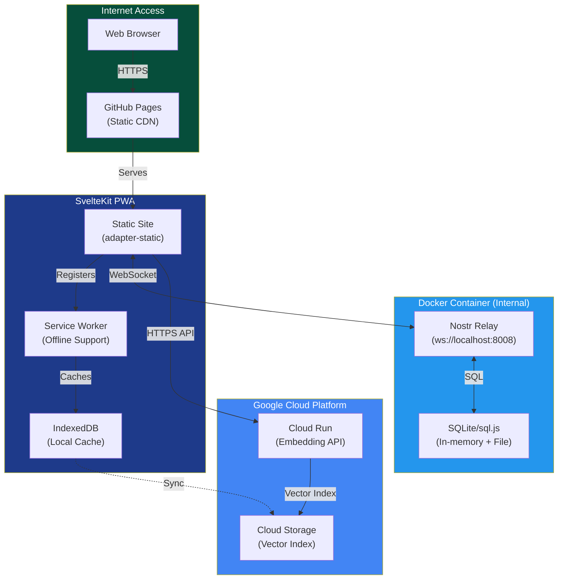

### Deployment Architecture

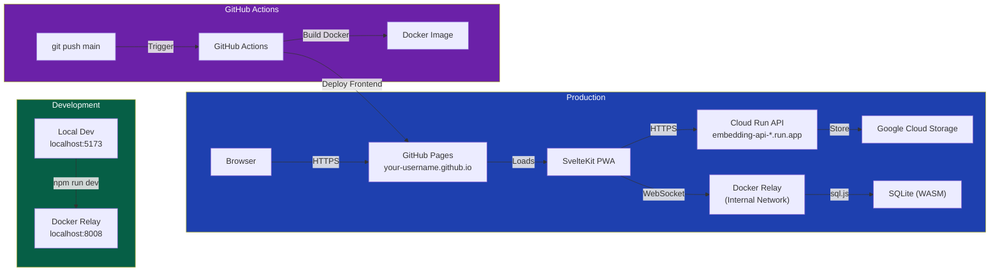

### Free Tier Compatibility

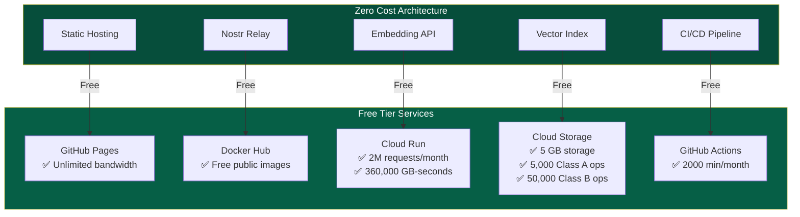

## Semantic Vector Search

Nostr-BBS includes AI-powered semantic search that understands meaning, not just keywords. Search for "schedule tomorrow's meeting" and find messages about "planning the session for Friday" - the system understands context and intent.

### Architecture Overview

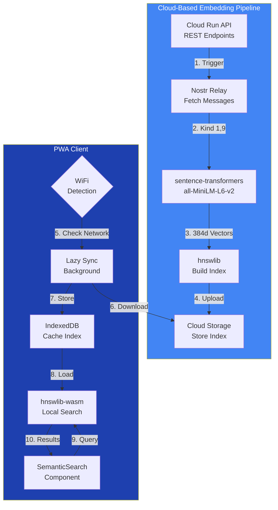

### Key Features

| Feature | Implementation | Benefit |
|---------|----------------|---------|
| **Semantic Understanding** | sentence-transformers/all-MiniLM-L6-v2 | Find by meaning, not just keywords |
| **HNSW Index** | O(log n) approximate nearest neighbors | Sub-millisecond search on 100k+ vectors |
| **Int8 Quantization** | 75% storage reduction | 100k messages = ~15MB index |
| **WiFi-Only Sync** | Network Information API | Respects mobile data caps |
| **Offline Search** | IndexedDB + hnswlib-wasm | Works without connectivity |
| **Nightly Updates** | GitHub Actions cron | Always fresh index |

### Data Flow

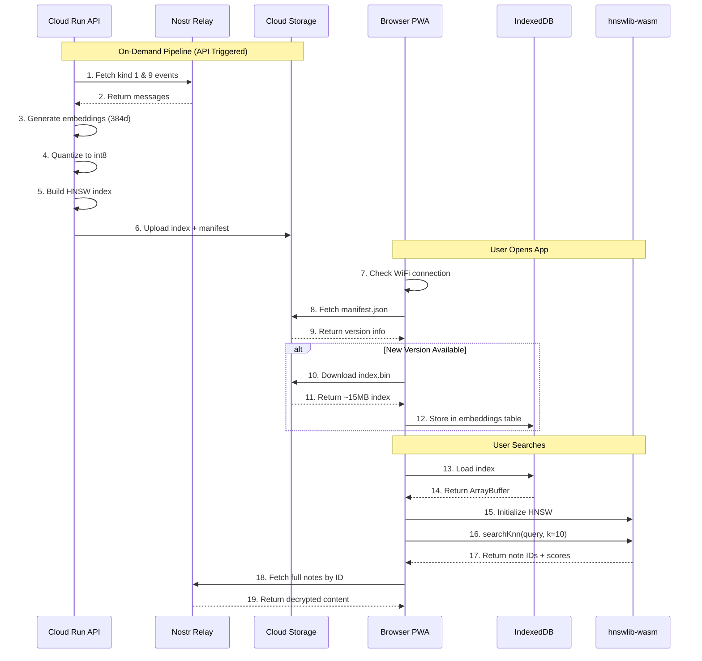

### Technical Specifications

```yaml
Embedding Model:
  name: sentence-transformers/all-MiniLM-L6-v2
  dimensions: 384
  performance: ~30 sec per 1,000 messages
  quantization: int8 (75% size reduction)

HNSW Index:
  library: hnswlib (Python) + hnswlib-wasm (Browser)
  space: cosine similarity
  ef_construction: 200
  M: 16
  ef_search: 50

Storage:
  platform: Google Cloud Storage
  bucket: Nostr-BBS-nostr-embeddings
  structure:
    - latest/manifest.json
    - latest/index.bin
    - latest/index_mapping.json
  versioning: Incremental (v1, v2, ...)

Client Sync:
  trigger: WiFi or unmetered connection
  storage: IndexedDB (embeddings table)
  lazy_load: true (background, non-blocking)
```

### Free Tier Budget

| Resource | Limit | Usage (100k msgs) | Headroom |
|----------|-------|-------------------|----------|
| **Cloud Run** | 2M requests/month | ~10k/month | 99.5% free |
| **Cloud Storage** | 5 GB storage | ~20 MB | 99.6% free |
| **GCS Reads** | 50k Class B ops/month | ~10k/month | 80% free |
| **GCS Egress** | 1 GB/month (free tier) | ~500 MB | 50% free |
| **Firestore** | 50k reads/day | ~1k/day | 98% free |

### Usage

```typescript
import { SemanticSearch } from '$lib/semantic';

// In your Svelte component
<SemanticSearch
  onSelect={(noteId) => navigateToMessage(noteId)}
  placeholder="Search by meaning..."
/>
```

```typescript
// Programmatic API
import { searchSimilar, syncEmbeddings, isSearchAvailable } from '$lib/semantic';

// Sync index (automatic on WiFi)
await syncEmbeddings();

// Search for similar messages
const results = await searchSimilar('meeting tomorrow', 10, 0.5);
// Returns: [{ noteId: 'abc123', score: 0.89, distance: 0.11 }, ...]
```

### Privacy Considerations

- **No Content Storage**: Only embeddings stored, not message text
- **Encrypted Messages Excluded**: NIP-17/59 DMs not indexed (v1)
- **Local Processing**: Search runs entirely in browser via WASM
- **User Control**: Manual sync button, no automatic uploads

## Nostr Implementation

### Supported NIPs

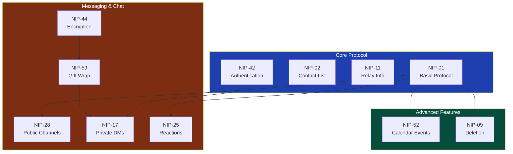

### NIP Implementation Table

| NIP | Name | Status | Description |
|-----|------|--------|-------------|
| [NIP-01](https://github.com/nostr-protocol/nips/blob/master/01.md) | Basic Protocol | ✅ Complete | Core event format and relay communication |
| [NIP-02](https://github.com/nostr-protocol/nips/blob/master/02.md) | Contact List | ✅ Complete | Following list management |
| [NIP-09](https://github.com/nostr-protocol/nips/blob/master/09.md) | Event Deletion | ✅ Complete | Message deletion support |
| [NIP-11](https://github.com/nostr-protocol/nips/blob/master/11.md) | Relay Information | ✅ Complete | Relay metadata document |
| [NIP-17](https://github.com/nostr-protocol/nips/blob/master/17.md) | Private DMs | ✅ Complete | Sealed rumors for private messaging |
| [NIP-25](https://github.com/nostr-protocol/nips/blob/master/25.md) | Reactions | ✅ Complete | Message reactions (emoji) |
| [NIP-28](https://github.com/nostr-protocol/nips/blob/master/28.md) | Public Chat | ✅ Complete | Group channels with moderation |
| [NIP-42](https://github.com/nostr-protocol/nips/blob/master/42.md) | Authentication | ✅ Complete | Relay authentication challenges |
| [NIP-44](https://github.com/nostr-protocol/nips/blob/master/44.md) | Versioned Encryption | ✅ Complete | Modern encryption for DMs |
| [NIP-52](https://github.com/nostr-protocol/nips/blob/master/52.md) | Calendar Events | ✅ Complete | Event scheduling with RSVP |
| [NIP-59](https://github.com/nostr-protocol/nips/blob/master/59.md) | Gift Wrap | ✅ Complete | Metadata protection layer |

### Event Kinds

| Kind | NIP | Purpose | Documentation |
|------|-----|---------|---------------|
| 0 | 01 | User Profile | Metadata (name, avatar, bio) |
| 1 | 01 | Text Note | Channel messages |
| 4 | 04 | Encrypted DM | Legacy DMs (read-only) |
| 5 | 09 | Deletion | Delete own messages |
| 7 | 25 | Reaction | Emoji reactions |
| 40 | 28 | Channel Creation | Create channel |
| 41 | 28 | Channel Metadata | Update channel |
| 42 | 28 | Channel Message | Post to channel |
| 1059 | 59 | Gift Wrap | Wrapped DMs |
| 31923 | 52 | Calendar Event | Date-based events |
| 31925 | 52 | Calendar RSVP | Event responses |
| 9022 | Custom | Section Access | Cohort-based channel access control |
| 9023 | Custom | Calendar-Channel Link | Event-chatroom integration |

### Cohort-Based Access Control

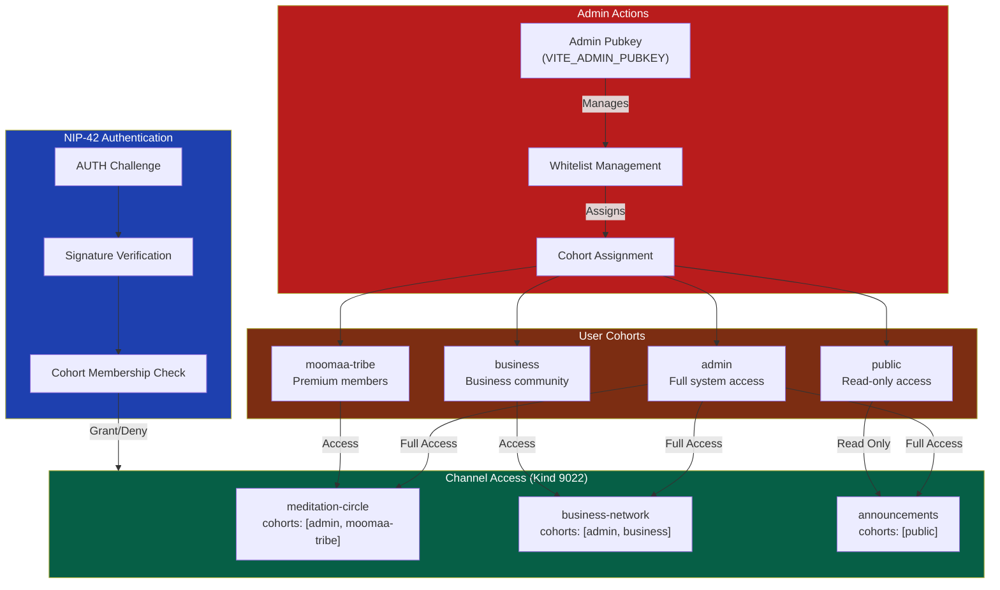

### Calendar Events with Channel Integration (NIP-52)

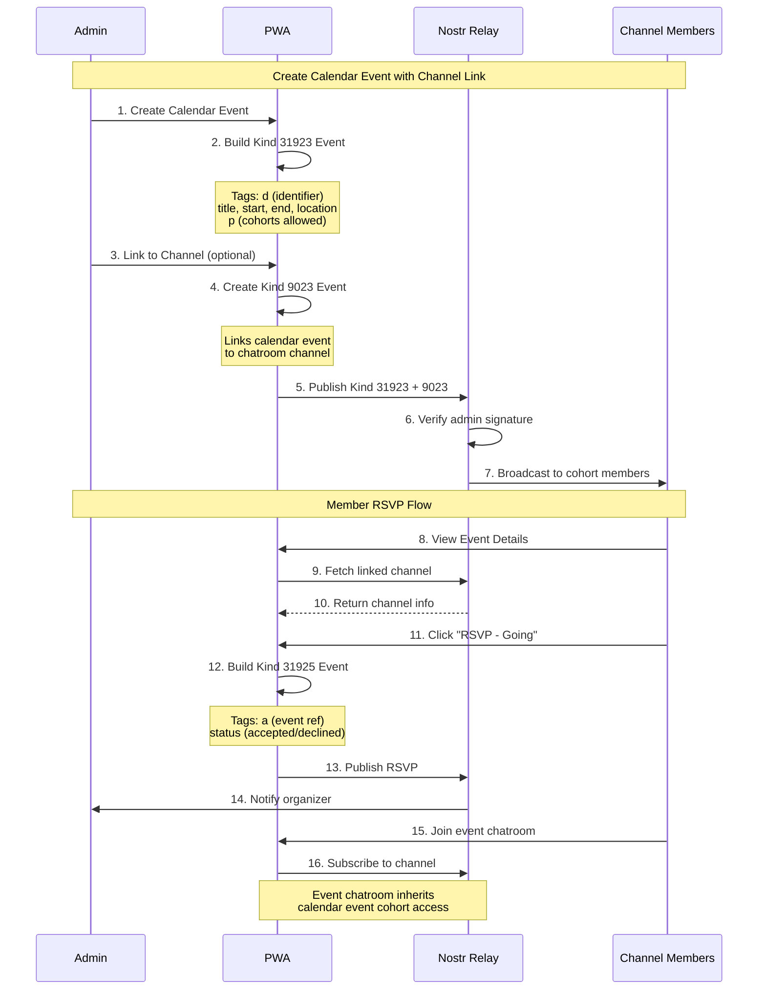

### Admin Workflow

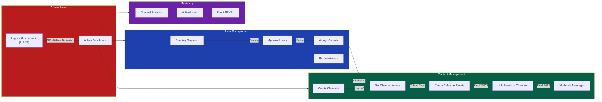

## User Flows

### Complete User Journey


### Authentication Flow

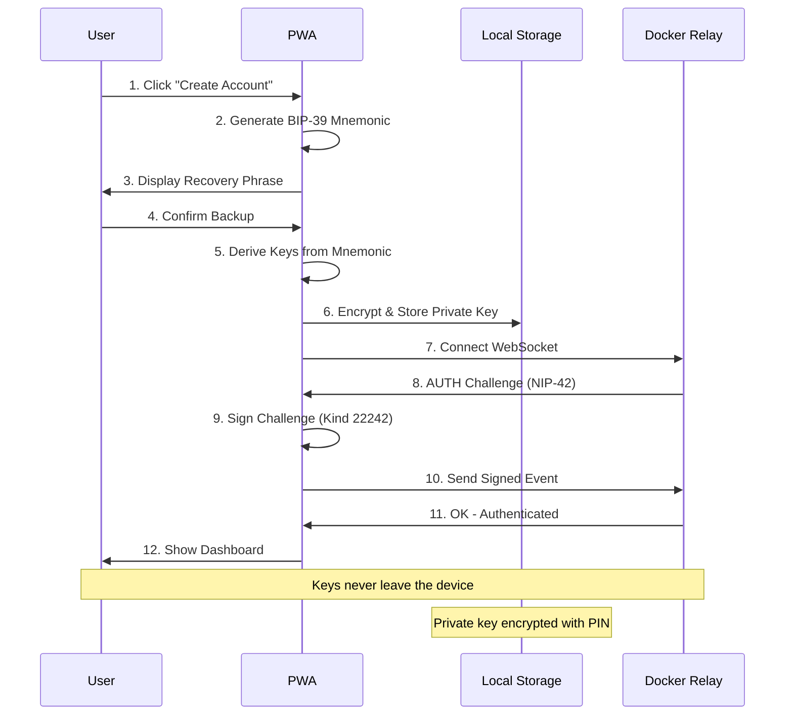

### Channel Messaging Flow

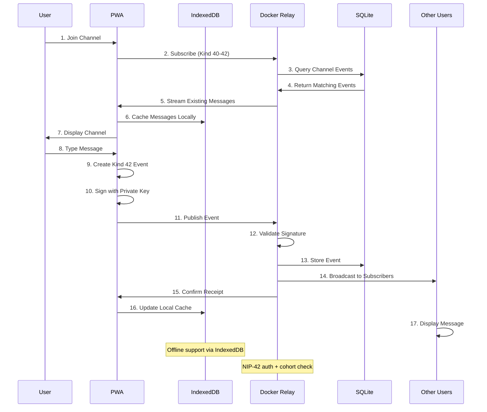

### Gift-Wrapped DM Flow (NIP-17/59)

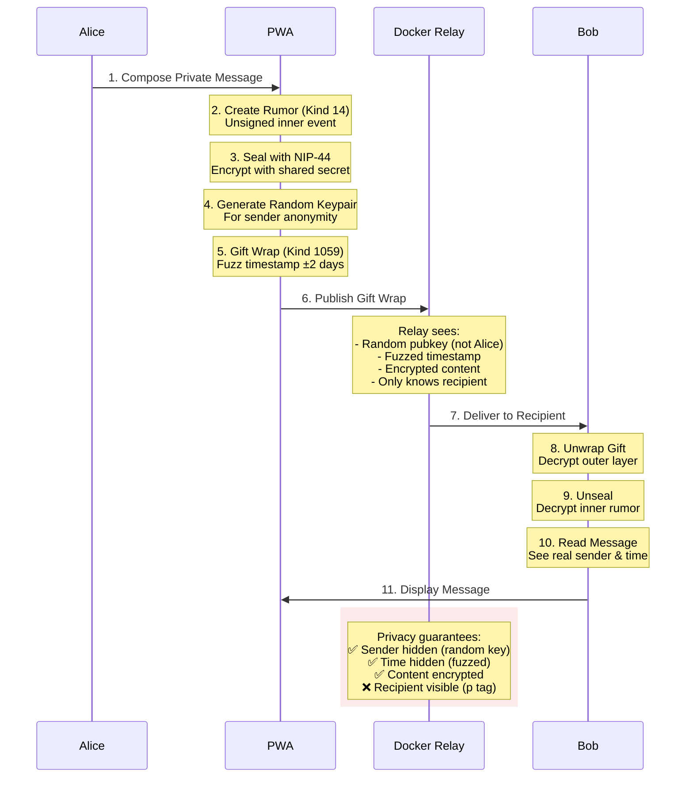

### Offline Message Queue Flow

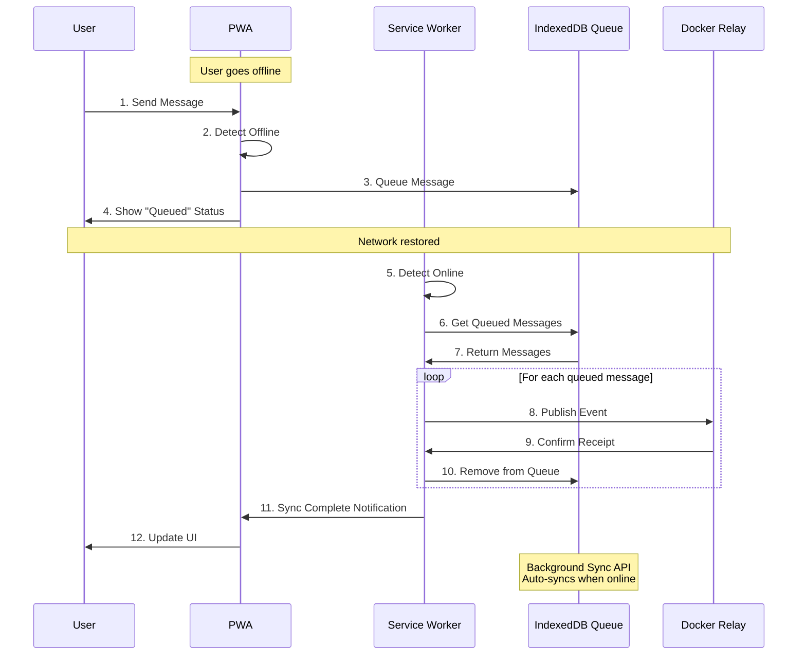

## Project Structure

```
Nostr-BBS-nostr/
├── src/
│   ├── lib/
│   │   ├── components/      # Svelte components
│   │   │   ├── auth/        # Login, signup, profile
│   │   │   ├── chat/        # Channel list, messages
│   │   │   ├── dm/          # Direct messages
│   │   │   ├── events/      # Calendar, booking
│   │   │   ├── admin/       # Admin panel
│   │   │   ├── forum/       # Forum-style features
│   │   │   └── ui/          # Reusable UI components
│   │   ├── nostr/           # Nostr protocol implementation
│   │   │   ├── keys.ts      # BIP-39 key generation
│   │   │   ├── encryption.ts # NIP-44 encryption
│   │   │   ├── dm.ts        # NIP-17/59 DM functions
│   │   │   ├── channels.ts  # NIP-28 channels
│   │   │   ├── reactions.ts # NIP-25 reactions
│   │   │   ├── calendar.ts  # NIP-52 events
│   │   │   └── relay.ts     # NDK relay manager
│   │   ├── semantic/        # Semantic vector search
│   │   │   ├── embeddings-sync.ts  # WiFi-only GCS sync
│   │   │   ├── hnsw-search.ts      # WASM vector search
│   │   │   ├── SemanticSearch.svelte # Search UI component
│   │   │   └── index.ts            # Module exports
│   │   ├── stores/          # Svelte stores
│   │   │   ├── auth.ts      # Authentication state
│   │   │   ├── channels.ts  # Channel subscriptions
│   │   │   ├── messages.ts  # Message cache
│   │   │   ├── dm.ts        # DM conversations
│   │   │   ├── pwa.ts       # PWA state
│   │   │   ├── bookmarks.ts # Bookmarked messages
│   │   │   ├── drafts.ts    # Message drafts
│   │   │   └── mute.ts      # Blocked users
│   │   └── utils/           # Helper functions
│   │       ├── storage.ts   # IndexedDB operations
│   │       ├── crypto.ts    # Cryptographic utilities
│   │       ├── search.ts    # Message search
│   │       └── export.ts    # Data export
│   ├── routes/              # SvelteKit routes
│   │   ├── +page.svelte     # Landing page
│   │   ├── chat/            # Chat interface
│   │   ├── dm/              # Direct messages
│   │   ├── events/          # Calendar events
│   │   ├── admin/           # Admin dashboard
│   │   └── settings/        # User settings
│   └── service-worker.ts    # PWA service worker
├── embedding-service/       # Google Cloud Run service
│   ├── src/
│   │   ├── main.py          # FastAPI application
│   │   ├── embeddings.py    # Embedding generation
│   │   ├── hnsw_index.py    # HNSW index builder
│   │   ├── gcs_client.py    # Cloud Storage client
│   │   └── firestore_client.py  # Firestore client
│   ├── Dockerfile           # Container definition
│   ├── requirements.txt     # Python dependencies
│   ├── cloudbuild.yaml      # Cloud Build config
│   └── .gcloudignore        # GCP ignore patterns
├── .github/
│   └── workflows/
│       ├── deploy-pages.yml  # Frontend deployment to GitHub Pages
│       └── deploy-backend.yml  # Backend deployment to Cloud Run
├── static/                  # Static assets
│   ├── manifest.json        # PWA manifest
│   └── icon-*.png           # PWA icons
├── tests/                   # Test suites
│   ├── unit/                # Unit tests
│   └── e2e/                 # E2E tests
├── docs/                    # Documentation
├── svelte.config.js         # SvelteKit config (adapter-static)
└── package.json             # Node dependencies
```

## Configuration

### Environment Variables

```bash
# .env (local development)
VITE_RELAY_URL=wss://your-nostr-relay.com
VITE_ADMIN_PUBKEY=<hex-pubkey>              # Admin public key (64-char hex)
VITE_NDK_DEBUG=false                         # Enable NDK debug logging

# Semantic Search (Cloud Storage public URL)
VITE_GCS_EMBEDDINGS_URL=https://storage.googleapis.com/Nostr-BBS-nostr-embeddings

# Cloud Run API
VITE_EMBEDDING_API_URL=https://embedding-api-617806532906.us-central1.run.app

# GCP Configuration (for deployment)
GCP_PROJECT_ID=<your-project-id>
GCP_REGION=us-central1
GCS_BUCKET_NAME=Nostr-BBS-nostr-embeddings
```

### GitHub Configuration (for CI/CD)

**Repository Variables** (Settings → Secrets and variables → Actions → Variables):

| Variable | Description |
|----------|-------------|
| `ADMIN_PUBKEY` | Admin public key (64-char hex format) |

**Repository Secrets** (Settings → Secrets and variables → Actions → Secrets):

| Secret | Description |
|--------|-------------|
| `GCP_PROJECT_ID` | Google Cloud project ID |
| `GCP_SA_KEY` | Service account JSON key (for Cloud Build) |
| `GCS_BUCKET_NAME` | Cloud Storage bucket name |

The deploy workflow uses `${{ vars.ADMIN_PUBKEY }}` to inject the admin key at build time.

### Cloud Run API Configuration

The embedding service runs on Google Cloud Run. Key configuration:

- **API URL:** `https://embedding-api-617806532906.us-central1.run.app`
- **Region:** `us-central1`
- **Concurrency:** 80 requests per instance
- **Memory:** 2 GB
- **CPU:** 2 vCPU
- **Auto-scaling:** 0 to 10 instances

### PWA Configuration

PWA settings in `static/manifest.json`:

```json
{
  "name": "Nostr-BBS",
  "short_name": "Nostr-BBS",
  "start_url": "/",
  "display": "standalone",
  "background_color": "#1a1a1a",
  "theme_color": "#3b82f6",
  "icons": [
    {
      "src": "/icon-192.png",
      "sizes": "192x192",
      "type": "image/png"
    },
    {
      "src": "/icon-512.png",
      "sizes": "512x512",
      "type": "image/png"
    }
  ]
}
```

## Google Cloud Platform Free Tier

This application is designed to run entirely on GCP's free tier:

### Free Tier Limits

**Cloud Run:**
- 2 million requests per month
- 360,000 GB-seconds of memory
- 180,000 vCPU-seconds of compute
- Scale to zero (no charges when idle)

**Cloud Storage:**
- 5 GB storage
- 5,000 Class A operations (writes) per month
- 50,000 Class B operations (reads) per month
- 1 GB network egress per month

**Firestore:**
- 1 GiB storage
- 50,000 reads per day
- 20,000 writes per day
- 20,000 deletes per day

**Expected Usage (100k messages):**
- Cloud Run: ~10k requests/month (0.5% of limit)
- Storage: ~20 MB (0.4% of limit)
- Reads: ~1k/day (2% of daily limit)
- Egress: ~500 MB/month (50% of monthly limit)

**Cost Estimate:** $0/month on free tier for typical usage

## Deployment

### GitHub Pages (Frontend)

The frontend is automatically deployed via GitHub Actions on every push to `main`:

1. **Setup GitHub Pages:**
   - Go to repository Settings > Pages
   - Source: GitHub Actions
   - Branch: main

2. **GitHub Actions workflow** (`.github/workflows/deploy.yml`):
   ```yaml
   name: Deploy to GitHub Pages
   on:
     push:
       branches: [main]
   jobs:
     deploy:
       runs-on: ubuntu-latest
       steps:
         - uses: actions/checkout@v4
         - uses: actions/setup-node@v4
           with:
             node-version: 18
         - run: npm ci
         - run: npm run build
         - uses: actions/upload-pages-artifact@v2
           with:
             path: build
         - uses: actions/deploy-pages@v2
   ```

3. **Manual deployment:**
   ```bash
   npm run build
   npm run deploy
   ```

### Google Cloud Run (Backend)

The embedding API is deployed at `https://embedding-api-617806532906.us-central1.run.app`.

For custom deployments:

**Prerequisites:**
- Google Cloud SDK installed
- GCP project created
- Billing enabled (free tier available)

**Deployment Steps:**

```bash
# Authenticate with GCP
gcloud auth login
gcloud config set project YOUR_PROJECT_ID

# Create Cloud Storage bucket (first time only)
gsutil mb -l us-central1 gs://Nostr-BBS-nostr-embeddings
gsutil iam ch allUsers:objectViewer gs://Nostr-BBS-nostr-embeddings

# Build and deploy to Cloud Run
cd embedding-service/
gcloud builds submit --tag gcr.io/YOUR_PROJECT_ID/embedding-api
gcloud run deploy embedding-api \
  --image gcr.io/YOUR_PROJECT_ID/embedding-api \
  --platform managed \
  --region us-central1 \
  --allow-unauthenticated \
  --memory 2Gi \
  --cpu 2 \
  --concurrency 80 \
  --min-instances 0 \
  --max-instances 10
```

**Environment Configuration:**

```bash
# Set environment variables for Cloud Run
gcloud run services update embedding-api \
  --region us-central1 \
  --set-env-vars GCS_BUCKET_NAME=Nostr-BBS-nostr-embeddings
```

See also:
- [docs/DEPLOYMENT.md](docs/DEPLOYMENT.md) - Full deployment guide
- [Google Cloud Run Documentation](https://cloud.google.com/run/docs)

### API Endpoints

The Cloud Run service provides the following REST endpoints:

| Endpoint | Method | Description |
|----------|--------|-------------|
| `/health` | GET | Health check endpoint |
| `/api/embeddings/generate` | POST | Generate embeddings for messages |
| `/api/embeddings/index` | POST | Build and upload HNSW index |
| `/api/embeddings/manifest` | GET | Get current index version |
| `/api/embeddings/sync` | POST | Trigger full sync pipeline |

## Testing

```bash
# Run all tests
npm test

# Run unit tests
npm test -- unit

# Run E2E tests with Playwright
npm run test:e2e

# Test specific file
npm test src/lib/nostr/dm.test.ts

# Run tests in watch mode
npm test -- --watch
```

## Security Considerations

### Key Management
- Private keys stored encrypted in localStorage
- BIP-39 mnemonic backup for key recovery
- Keys never transmitted to server or relay
- Optional PIN/passphrase protection

### Message Privacy
- NIP-44 encryption for all DMs
- Gift wrap hides sender identity from relay
- Timestamp fuzzing prevents timing analysis
- Content encrypted end-to-end

### Relay Security
- NIP-42 authentication required for writes
- Cohort-based whitelist (business, moomaa-tribe, admin)
- Event validation and signature verification
- NIP-09 deletion support

### Network Security
- HTTPS for GitHub Pages (automatic)
- HTTPS for Cloud Run (Google-managed certificates)
- Content Security Policy headers
- CORS configuration
- Google Cloud Armor protection (available)

### Serverless Security Benefits
- No server to compromise
- Cloud Run provides isolated container execution
- Automatic HTTPS with Google-managed certificates
- Google Cloud's DDoS protection
- IAM-based access control
- Zero-trust architecture

## GitHub Labels

Our project uses a comprehensive labeling system for issue and PR management:

### Priority Labels
- `priority: critical` - Security issues, data loss bugs, service outages
- `priority: high` - Major features, significant bugs affecting many users
- `priority: medium` - Regular features, moderate bugs
- `priority: low` - Nice-to-have features, minor improvements

### Type Labels
- `type: bug` - Something isn't working
- `type: feature` - New feature request
- `type: enhancement` - Improvement to existing feature
- `type: documentation` - Documentation improvements
- `type: refactor` - Code refactoring
- `type: test` - Test-related changes
- `type: security` - Security-related issues

### Area Labels
- `area: api` - Cloud Run API, backend services
- `area: pwa` - Progressive Web App, service worker
- `area: ui/ux` - User interface and experience
- `area: encryption` - NIP-44, NIP-17/59 encryption
- `area: channels` - NIP-28 public channels
- `area: dm` - Direct messaging (NIP-17/59)
- `area: calendar` - NIP-52 calendar events
- `area: admin` - Admin panel and moderation
- `area: deployment` - GitHub Pages, Google Cloud Platform
- `area: embeddings` - Semantic search, vector embeddings

### Status Labels
- `status: needs triage` - Needs review and classification
- `status: blocked` - Blocked by dependencies
- `status: in progress` - Currently being worked on
- `status: needs review` - Awaiting code review
- `status: ready to merge` - Approved and ready

### Special Labels
- `good first issue` - Good for newcomers
- `help wanted` - Extra attention needed
- `breaking change` - Breaking API changes
- `dependencies` - Dependency updates

## API Reference

### Relay Manager

```typescript
import { connectRelay, publishEvent, subscribe } from '$lib/nostr';

// Connect to relay (local development)
await connectRelay('ws://localhost:8080', privateKey);

// Publish event
const event = new NDKEvent();
event.kind = 1;
event.content = 'Hello Nostr!';
await publishEvent(event);

// Subscribe to events
const sub = subscribe({ kinds: [1], limit: 10 });
sub.on('event', (event) => console.log(event));
```

### Direct Messages

```typescript
import { sendDM, receiveDM, createDMFilter } from '$lib/nostr/dm';

// Send encrypted DM
await sendDM('Hello!', recipientPubkey, senderPrivkey, relay);

// Receive and decrypt
const dm = receiveDM(giftWrapEvent, myPrivkey);
console.log(dm.content, dm.senderPubkey);

// Subscribe to DMs
const filter = createDMFilter(myPubkey);
```

### Channel Operations

```typescript
import { createChannel, sendChannelMessage } from '$lib/nostr/channels';

// Create channel (admin only)
await createChannel({
  name: 'General',
  about: 'General discussion',
  picture: 'https://example.com/icon.png'
});

// Send message
await sendChannelMessage(channelId, 'Hello channel!');
```

## Documentation

### Deployment & Operations
- [Deployment Guide](docs/deployment/DEPLOYMENT.md) - Serverless deployment and configuration
- [GCP Architecture](docs/deployment/gcp-architecture.md) - Google Cloud Platform setup
- [GCP Deployment](docs/deployment/GCP_DEPLOYMENT.md) - Cloud Run deployment guide
- [GitHub Workflows](docs/deployment/github-workflows.md) - CI/CD pipeline configuration

### Security
- [Security Audit](docs/security/SECURITY_AUDIT.md) - Security analysis and recommendations
- [Audit Report](docs/security/SECURITY_AUDIT_REPORT.md) - Detailed security findings
- [Admin Key Rotation](docs/security/ADMIN_KEY_ROTATION.md) - Key management procedures
- [SQL Injection Fix](docs/security/security-fix-sql-injection.md) - Database security hardening

### Feature Documentation
- [Direct Messages](docs/features/dm-implementation.md) - NIP-17/59 encrypted messaging
- [Message Threading](docs/features/threading-implementation.md) - Threaded conversations
- [Reactions](docs/features/nip-25-reactions-implementation.md) - NIP-25 emoji reactions
- [Search](docs/features/search-implementation.md) - Semantic & keyword search
- [Mute & Block](docs/features/mute-implementation-summary.md) - User blocking system
- [Pinned Messages](docs/features/pinned-messages-implementation.md) - Pin important messages
- [Link Previews](docs/features/link-preview-implementation.md) - URL preview generation
- [Drafts](docs/features/drafts-implementation.md) - Message draft persistence
- [Export](docs/features/export-implementation.md) - Data export functionality
- [PWA Implementation](docs/features/pwa-implementation.md) - Offline support and installation
- [Notifications](docs/features/notification-system-phase1.md) - Push notification system
- [Accessibility](docs/features/accessibility-improvements.md) - WCAG compliance

### Architecture (SPARC Methodology)
- [Specification](docs/architecture/01-specification.md) - Requirements and specs
- [System Architecture](docs/architecture/02-architecture.md) - System design details
- [Pseudocode](docs/architecture/03-pseudocode.md) - Algorithm design
- [Refinement](docs/architecture/04-refinement.md) - Implementation refinement
- [Completion](docs/architecture/05-completion.md) - Integration and deployment
- [Semantic Search Spec](docs/architecture/06-semantic-search-spec.md) - Vector search requirements
- [Search Architecture](docs/architecture/07-semantic-search-architecture.md) - Embedding pipeline design
- [Search Algorithms](docs/architecture/08-semantic-search-pseudocode.md) - HNSW implementation
- [Risk Assessment](docs/architecture/09-semantic-search-risks.md) - Integration risks

## Contributing

1. Fork the repository
2. Create your feature branch (`git checkout -b feature/amazing-feature`)
3. Commit your changes (`git commit -m 'Add amazing feature'`)
4. Push to the branch (`git push origin feature/amazing-feature`)
5. Open a Pull Request

### Development Guidelines

- Follow the existing code style
- Write tests for new features
- Update documentation as needed
- Use semantic commit messages
- Ensure all tests pass before submitting PR

## License

MIT License - see [LICENSE](LICENSE) for details.

## Credits and Attribution

This project builds upon exceptional open-source work from the Nostr ecosystem and broader web development community.

### Core Nostr Technologies

- **[Nostr Protocol](https://github.com/nostr-protocol/nostr)** - The foundation protocol enabling decentralized, censorship-resistant communication
- **[NDK (Nostr Dev Kit)](https://github.com/nostr-dev-kit/ndk)** - Comprehensive Nostr development toolkit by Pablo Fernandez ([@pablof7z](https://github.com/pablof7z))
- **[nostr-tools](https://github.com/nbd-wtf/nostr-tools)** - Essential Nostr utilities by fiatjaf

### Frontend Framework & UI

- **[SvelteKit](https://kit.svelte.dev)** - Application framework by the Svelte team
- **[DaisyUI](https://daisyui.com)** - Beautiful component library by Pouya Saadeghi
- **[TailwindCSS](https://tailwindcss.com)** - Utility-first CSS framework
- **[Dexie.js](https://dexie.org)** - IndexedDB wrapper by David Fahlander

### Machine Learning & Search

- **[Transformers.js](https://huggingface.co/docs/transformers.js)** - Machine learning models by Hugging Face
- **[sentence-transformers](https://www.sbert.net/)** - Multilingual sentence embeddings
- **[all-MiniLM-L6-v2](https://huggingface.co/sentence-transformers/all-MiniLM-L6-v2)** - Compact 384d embedding model
- **[hnswlib](https://github.com/nmslib/hnswlib)** - Fast approximate nearest neighbor search
- **[hnswlib-wasm](https://github.com/yoshoku/hnswlib-wasm)** - WASM-based vector similarity search

### Infrastructure & Cloud Services

- **[Google Cloud Run](https://cloud.google.com/run)** - Serverless container platform
- **[Google Cloud Storage](https://cloud.google.com/storage)** - Object storage for vector embeddings
- **[Google Firestore](https://cloud.google.com/firestore)** - NoSQL metadata database
- **[Google Cloud Build](https://cloud.google.com/build)** - CI/CD pipeline
- **[GitHub Pages](https://pages.github.com)** - Static site hosting
- **[GitHub Actions](https://github.com/features/actions)** - Frontend deployment automation

### Development & Quality Engineering Tools

- **[Agentic QE Fleet](https://github.com/proffesor-for-testing/agentic-qe)** - AI-powered quality engineering agents (31 QE agents, 53 QE skills)
- **[Claude Code](https://claude.ai/claude-code)** - AI-assisted development by Anthropic
- **[Claude Flow](https://github.com/ruvnet/claude-flow)** - Swarm coordination for parallel development
- **[ruv-swarm](https://github.com/ruv/ruv-swarm)** - Multi-agent orchestration

### NIPs Implemented

Special thanks to the Nostr community for the NIP specifications:
- **[NIP-01](https://github.com/nostr-protocol/nips/blob/master/01.md)** - Basic Protocol
- **[NIP-02](https://github.com/nostr-protocol/nips/blob/master/02.md)** - Contact List
- **[NIP-09](https://github.com/nostr-protocol/nips/blob/master/09.md)** - Event Deletion
- **[NIP-11](https://github.com/nostr-protocol/nips/blob/master/11.md)** - Relay Information
- **[NIP-17](https://github.com/nostr-protocol/nips/blob/master/17.md)** - Private DMs
- **[NIP-25](https://github.com/nostr-protocol/nips/blob/master/25.md)** - Reactions
- **[NIP-28](https://github.com/nostr-protocol/nips/blob/master/28.md)** - Public Chat
- **[NIP-42](https://github.com/nostr-protocol/nips/blob/master/42.md)** - Authentication
- **[NIP-44](https://github.com/nostr-protocol/nips/blob/master/44.md)** - Versioned Encryption
- **[NIP-52](https://github.com/nostr-protocol/nips/blob/master/52.md)** - Calendar Events
- **[NIP-59](https://github.com/nostr-protocol/nips/blob/master/59.md)** - Gift Wrap

### Contributors

- John O'Hare ([@jjohare](https://github.com/jjohare)) - Project lead
- Claude Opus 4.5 / Claude Sonnet 4.5 - AI development assistance

## Support

- Documentation: See [docs/](docs/) directory
- Issues: [GitHub Issues](https://github.com/jjohare/Nostr-BBS/issues)
- Discussions: [GitHub Discussions](https://github.com/jjohare/Nostr-BBS/discussions)
