<div align="center">

# Nostr BBS

### A Decentralized Community Platform Built on Open Protocols

[](LICENSE)
[](https://nostr.com)
[](https://solidproject.org)
[](https://kit.svelte.dev)
[](https://cloud.google.com)

**Nostr BBS** is a fully decentralized bulletin board system combining the censorship-resistant Nostr protocol with SOLID personal data pods. Features end-to-end encrypted messaging, AI-powered semantic search, calendar events with RSVP, and cohort-based access control—all running on a serverless architecture with zero infrastructure costs.

[Features](#features) • [Quick Start](#quick-start) • [Architecture](#architecture) • [Documentation](#documentation) • [Contributing](#contributing)

</div>

---

## Overview

Nostr BBS provides communities with a self-sovereign communication platform where users control their own data and identity. Built on open standards (Nostr NIPs, SOLID/WebID, DIDs), it offers:

- **True Decentralization** — No central authority controls messages, identity, or access
- **Privacy by Design** — End-to-end encryption with NIP-44/59 gift-wrapped DMs
- **Data Sovereignty** — SOLID pod integration for personal data ownership
- **Zero Cost Hosting** — Runs entirely on cloud free tiers (GCP, GitHub Pages)
- **Offline-First PWA** — Full functionality without connectivity

---

## Screenshots

| Homepage | Messages | Calendar |
|:--------:|:--------:|:--------:|
|  |  |  |
| **Login** | **Signup** | **Mobile View** |
| 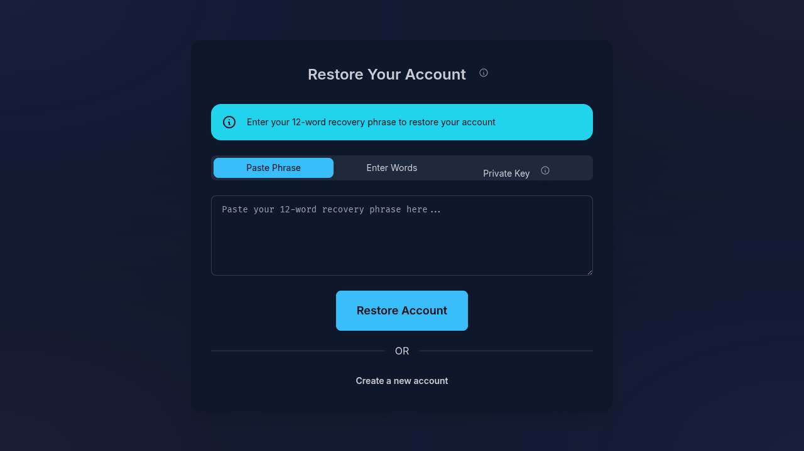 | 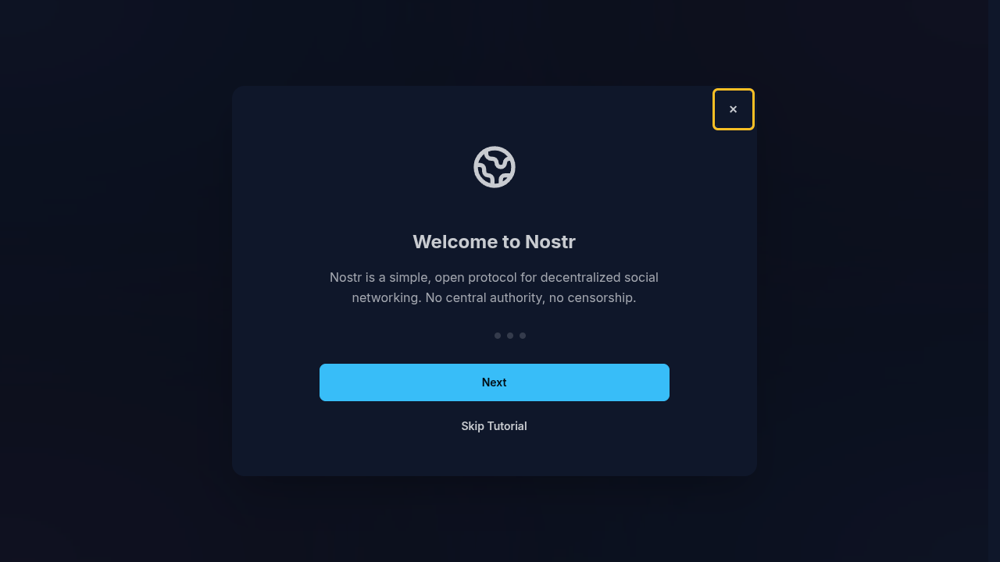 | 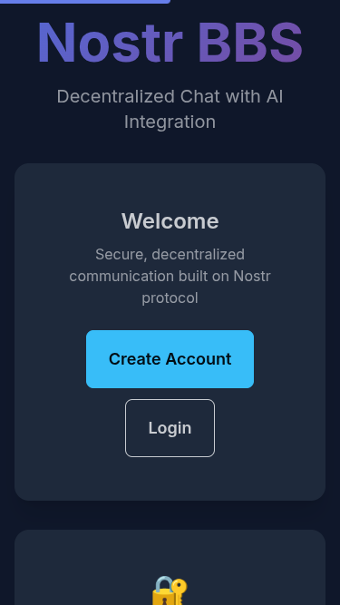 |
| **Profile** | **Semantic Search** | **Admin Dashboard** |
|  |  |  |

---

## Features

### Core Communication
- **Public Chat Channels** — NIP-28 group messaging with cohort-based access control
- **Encrypted Direct Messages** — NIP-17/59 gift-wrapped private messaging with metadata protection
- **Calendar Events** — NIP-52 event scheduling with RSVP and channel integration
- **Reactions & Threading** — NIP-25 emoji reactions and message threading

### Decentralized Identity
- **SOLID/WebID Integration** — Personal data pods for true data ownership
- **DID-Nostr Bridge** — Decentralized identifiers linked to Nostr keypairs
- **NIP-98 HTTP Auth** — Cryptographic authentication for API endpoints
- **BIP-39 Key Management** — Mnemonic-based key generation and recovery

### Advanced Features
- **Semantic Vector Search** — AI-powered similarity search with HNSW indexing (100k+ messages)
- **Link Previews** — Rich URL previews with dedicated microservice
- **NIP-16 Ephemeral Events** — Temporary events that don't persist
- **Offline Message Queue** — Background sync when connectivity returns
- **PWA Support** — Installable app with service worker caching

### Administration
- **Cohort-Based Access** — Business, members, and admin role hierarchies
- **Section Management** — Configurable category/section/forum structure
- **Moderation Tools** — Message deletion, pinning, and user management

---

## Quick Start

### Prerequisites

- Node.js 18+ and npm
- Google Cloud Platform account (free tier)
- GitHub account (for deployment)

### Local Development

```bash
# Clone the repository
git clone https://github.com/jjohare/Nostr-BBS.git
cd Nostr-BBS

# Install dependencies
npm install

# Configure environment
cp .env.example .env
# Edit .env with your relay URL and admin pubkey

# Start development server
npm run dev

# Access: http://localhost:5173
```

### Production Deployment

**Frontend (GitHub Pages):**
```bash
npm run build
# Deployment via GitHub Actions on push to main
```

**Backend (Google Cloud Run):**
See [Deployment Guide](#deployment) for complete GCP setup instructions.

---

## Architecture

<details>
<summary><strong>System Overview</strong></summary>

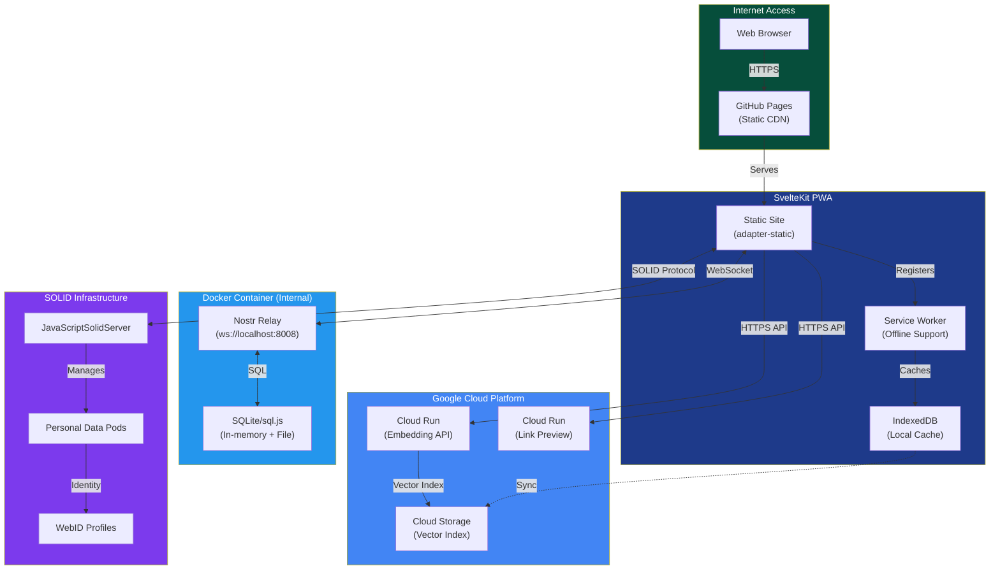

</details>

<details>
<summary><strong>Deployment Architecture</strong></summary>

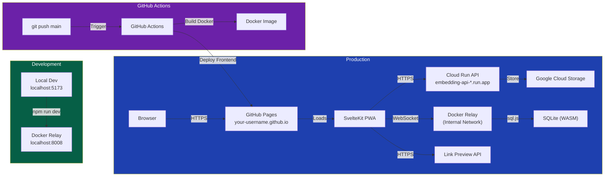

</details>

<details>
<summary><strong>Free Tier Cost Analysis</strong></summary>

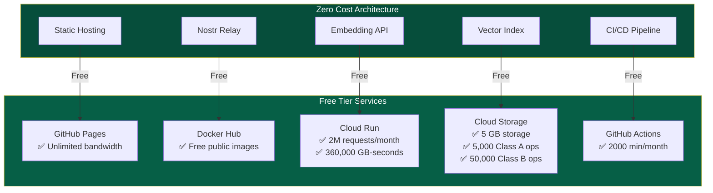

| Resource | Free Tier Limit | Typical Usage (100k msgs) | Utilization |
|----------|-----------------|---------------------------|-------------|
| **Cloud Run** | 2M requests/month | ~10k/month | 0.5% |
| **Cloud Storage** | 5 GB | ~20 MB | 0.4% |
| **GCS Reads** | 50k ops/month | ~10k/month | 20% |
| **GCS Egress** | 1 GB/month | ~500 MB | 50% |
| **Firestore** | 50k reads/day | ~1k/day | 2% |

</details>

---

## Semantic Vector Search

AI-powered search that understands meaning, not just keywords. Search for "schedule tomorrow's meeting" and find messages about "planning the session for Friday."

<details>
<summary><strong>Search Architecture</strong></summary>

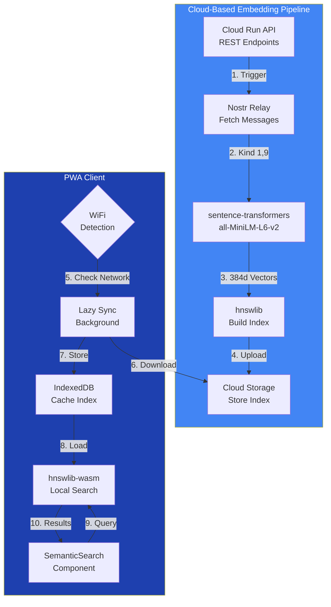

</details>

<details>
<summary><strong>Data Flow Sequence</strong></summary>

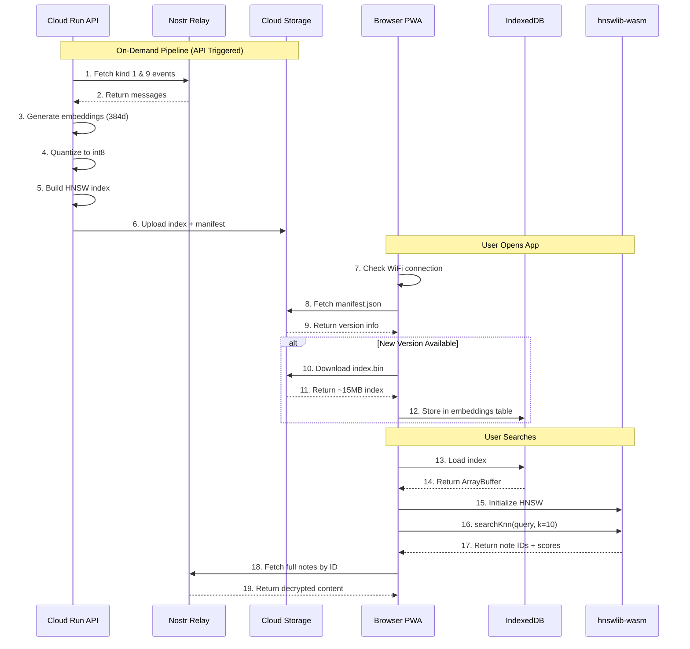

</details>

### Technical Specifications

| Component | Implementation | Benefit |
|-----------|----------------|---------|
| **Embedding Model** | all-MiniLM-L6-v2 (384d) | Semantic understanding |
| **HNSW Index** | O(log n) ANN search | Sub-millisecond on 100k+ vectors |
| **Int8 Quantization** | 75% storage reduction | 100k messages = ~15MB |
| **WiFi-Only Sync** | Network Information API | Respects mobile data |
| **Offline Search** | IndexedDB + hnswlib-wasm | No connectivity required |

---

## Nostr Protocol Implementation

<details>
<summary><strong>NIP Dependency Graph</strong></summary>

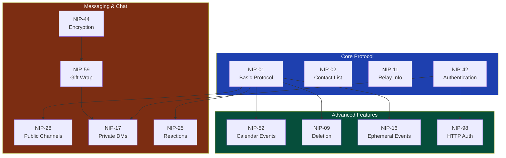

</details>

### Supported NIPs

| NIP | Name | Status | Description |
|-----|------|--------|-------------|
| [NIP-01](https://github.com/nostr-protocol/nips/blob/master/01.md) | Basic Protocol | ✅ | Core event format and relay communication |
| [NIP-02](https://github.com/nostr-protocol/nips/blob/master/02.md) | Contact List | ✅ | Following list management |
| [NIP-09](https://github.com/nostr-protocol/nips/blob/master/09.md) | Event Deletion | ✅ | Message deletion support |
| [NIP-11](https://github.com/nostr-protocol/nips/blob/master/11.md) | Relay Information | ✅ | Relay metadata document |
| [NIP-16](https://github.com/nostr-protocol/nips/blob/master/16.md) | Ephemeral Events | ✅ | Temporary events (not persisted) |
| [NIP-17](https://github.com/nostr-protocol/nips/blob/master/17.md) | Private DMs | ✅ | Sealed rumors for private messaging |
| [NIP-25](https://github.com/nostr-protocol/nips/blob/master/25.md) | Reactions | ✅ | Message reactions (emoji) |
| [NIP-28](https://github.com/nostr-protocol/nips/blob/master/28.md) | Public Chat | ✅ | Group channels with moderation |
| [NIP-42](https://github.com/nostr-protocol/nips/blob/master/42.md) | Authentication | ✅ | Relay authentication challenges |
| [NIP-44](https://github.com/nostr-protocol/nips/blob/master/44.md) | Versioned Encryption | ✅ | Modern encryption for DMs |
| [NIP-52](https://github.com/nostr-protocol/nips/blob/master/52.md) | Calendar Events | ✅ | Event scheduling with RSVP |
| [NIP-59](https://github.com/nostr-protocol/nips/blob/master/59.md) | Gift Wrap | ✅ | Metadata protection layer |
| [NIP-98](https://github.com/nostr-protocol/nips/blob/master/98.md) | HTTP Auth | ✅ | HTTP request authentication |

---

## SOLID/WebID Integration

Nostr BBS integrates with the SOLID ecosystem for true data sovereignty. Users can store personal data in their own pods while authenticating via Nostr keypairs.

<details>
<summary><strong>SOLID Architecture</strong></summary>

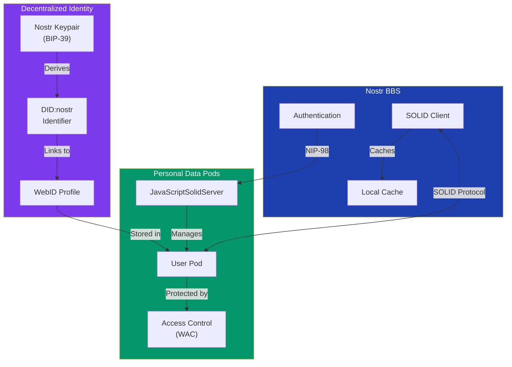

</details>

### Key Capabilities

- **Personal Data Pods** — Store messages, preferences, and media in your own pod
- **DID-Nostr Bridge** — Link decentralized identifiers to Nostr public keys
- **WebID Authentication** — Use Nostr signatures for SOLID authentication
- **Interoperability** — Access data from any SOLID-compatible application

---

## Cohort-Based Access Control

<details>
<summary><strong>Access Control Flow</strong></summary>

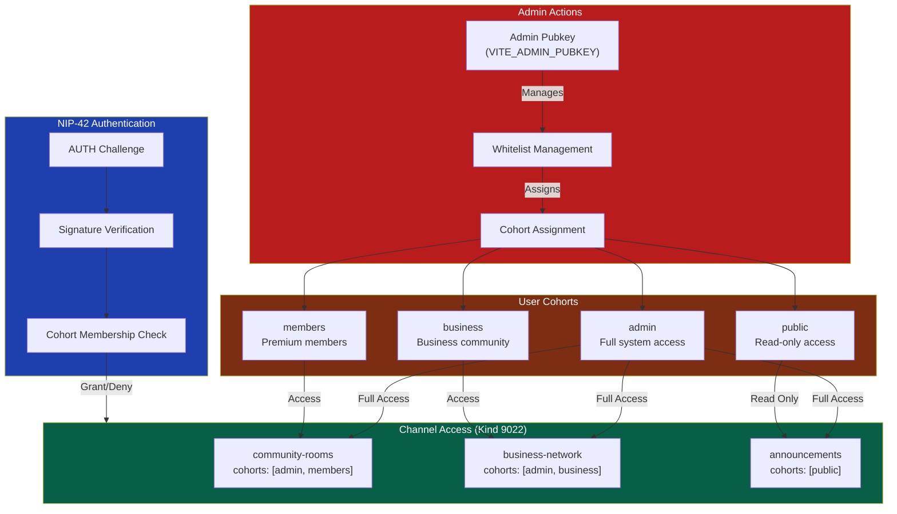

</details>

---

## User Flows

<details>
<summary><strong>Complete User Journey</strong></summary>

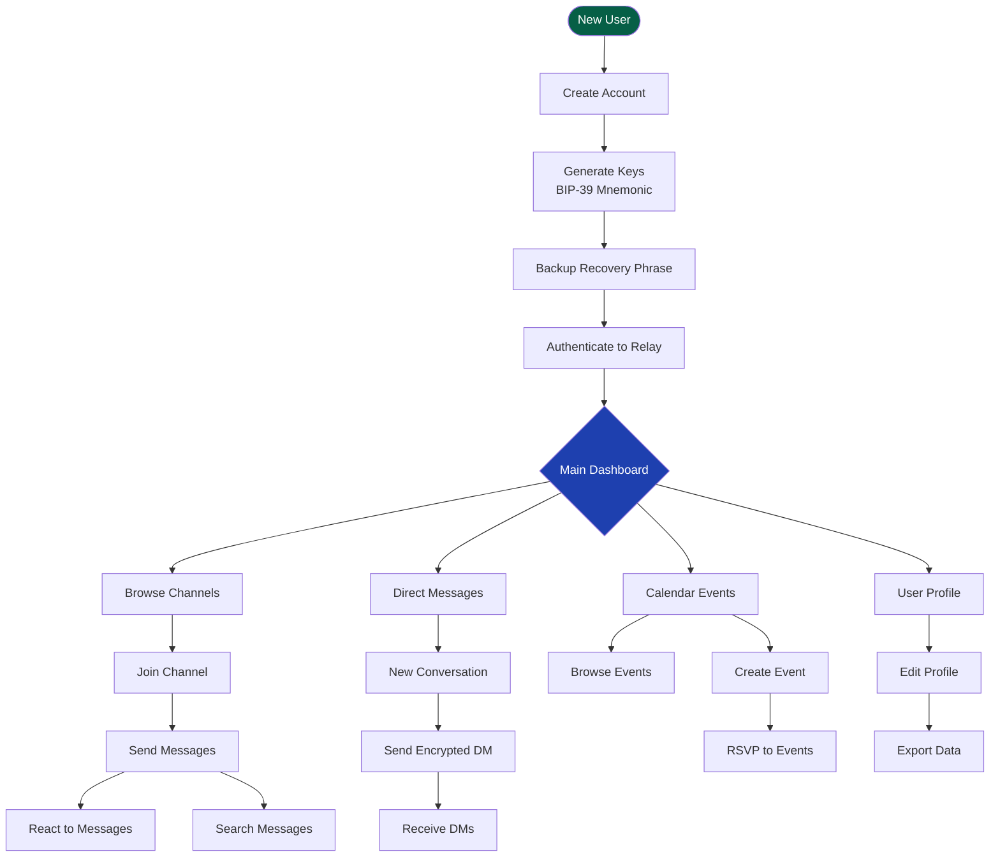

</details>

<details>
<summary><strong>Authentication Flow</strong></summary>

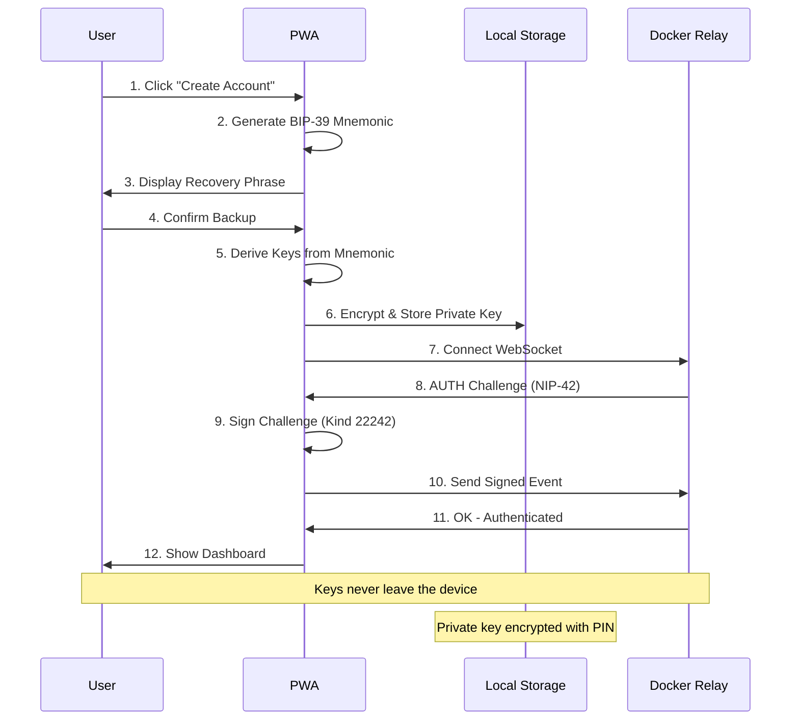

</details>

<details>
<summary><strong>Gift-Wrapped DM Flow (NIP-17/59)</strong></summary>

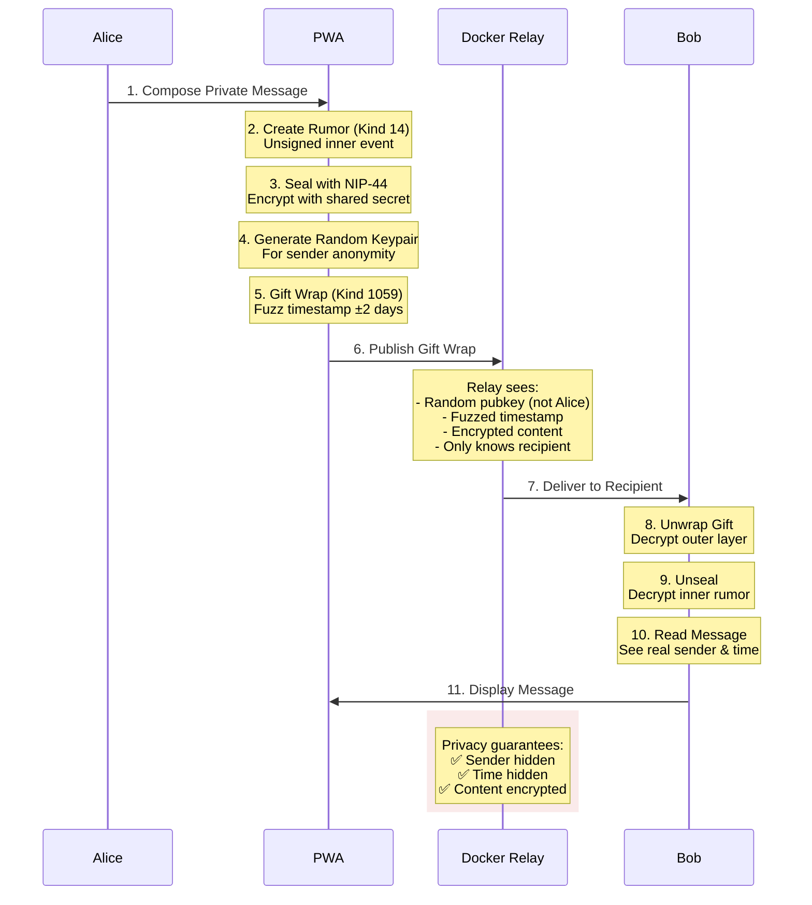

</details>

---

## Project Structure

```
nostr-BBS/
├── src/
│   ├── lib/
│   │   ├── components/         # Svelte components
│   │   │   ├── auth/           # Login, signup, profile
│   │   │   ├── chat/           # Channel list, messages
│   │   │   ├── dm/             # Direct messages
│   │   │   ├── calendar/       # Calendar, events, RSVP
│   │   │   ├── admin/          # Admin panel
│   │   │   └── ui/             # Reusable UI components
│   │   ├── nostr/              # Nostr protocol implementation
│   │   ├── solid/              # SOLID/WebID integration
│   │   │   ├── client.ts       # SOLID client
│   │   │   ├── pods.ts         # Pod management
│   │   │   ├── storage.ts      # Storage operations
│   │   │   └── types.ts        # Type definitions
│   │   ├── semantic/           # Vector search
│   │   ├── stores/             # Svelte stores
│   │   └── utils/              # Helper functions
│   ├── routes/                 # SvelteKit routes
│   └── service-worker.ts       # PWA service worker
├── services/
│   ├── embedding-api/          # Cloud Run embedding service
│   ├── link-preview-api/       # Link preview microservice
│   └── nostr-relay/            # Nostr relay with NIP extensions
├── JavaScriptSolidServer/      # SOLID server submodule
├── config/
│   └── sections.yaml           # BBS configuration
├── .github/workflows/          # CI/CD pipelines
├── docs/                       # Documentation
└── tests/                      # Test suites
```

---

## Configuration

### Environment Variables

```bash
# .env (local development)
VITE_RELAY_URL=wss://your-nostr-relay.com
VITE_ADMIN_PUBKEY=<hex-pubkey>              # Admin public key (64-char hex)
VITE_NDK_DEBUG=false                         # Enable NDK debug logging

# Semantic Search
VITE_GCS_EMBEDDINGS_URL=https://storage.googleapis.com/nostr-bbs-embeddings

# Cloud Run APIs
VITE_EMBEDDING_API_URL=https://embedding-api-*.run.app
VITE_LINK_PREVIEW_API_URL=https://link-preview-api-*.run.app

# SOLID Configuration
VITE_SOLID_SERVER_URL=https://your-solid-server.com

# GCP Configuration (deployment)
GCP_PROJECT_ID=<your-project-id>
GCP_REGION=us-central1
```

### GitHub Actions Secrets

| Secret | Description |
|--------|-------------|
| `GCP_PROJECT_ID` | Google Cloud project ID |
| `GCP_SA_KEY` | Service account JSON key |
| `GCS_BUCKET_NAME` | Cloud Storage bucket name |

| Variable | Description |
|----------|-------------|
| `ADMIN_PUBKEY` | Admin public key (64-char hex) |

---

## Deployment

### GitHub Pages (Frontend)

Automatic deployment via GitHub Actions on push to `main`:

1. Configure repository Settings → Pages → Source: GitHub Actions
2. Push to main branch triggers build and deploy

### Google Cloud Run (Backend)

```bash
# Authenticate
gcloud auth login
gcloud config set project YOUR_PROJECT_ID

# Deploy embedding API
cd services/embedding-api/
gcloud run deploy embedding-api \
  --source . \
  --region us-central1 \
  --allow-unauthenticated

# Deploy link preview API
cd ../link-preview-api/
gcloud run deploy link-preview-api \
  --source . \
  --region us-central1 \
  --allow-unauthenticated
```

See [docs/deployment/DEPLOYMENT.md](docs/deployment/DEPLOYMENT.md) for complete guide.

---

## Testing

```bash
npm test              # Run all tests
npm run test:e2e      # E2E tests with Playwright
npm run check         # Type checking
npm run lint          # Linting
```

---

## Security

### Key Management
- Private keys stored encrypted in localStorage
- BIP-39 mnemonic backup for recovery
- Keys never transmitted to servers
- Optional PIN/passphrase protection

### Message Privacy
- NIP-44 encryption for all DMs
- Gift wrap hides sender from relay
- Timestamp fuzzing prevents timing analysis
- End-to-end encryption

### Infrastructure Security
- HTTPS everywhere (Google-managed certs)
- NIP-42 authentication required
- NIP-98 HTTP authentication for APIs
- Zero-trust serverless architecture

---

## Documentation

### Deployment & Operations
- [Deployment Guide](docs/deployment/DEPLOYMENT.md)
- [GCP Architecture](docs/deployment/gcp-architecture.md)
- [GitHub Workflows](docs/deployment/github-workflows.md)

### Security
- [Security Audit](docs/security/SECURITY_AUDIT.md)
- [Admin Key Rotation](docs/security/ADMIN_KEY_ROTATION.md)

### Features
- [Direct Messages](docs/features/dm-implementation.md)
- [Semantic Search](docs/architecture/06-semantic-search-spec.md)
- [PWA Implementation](docs/features/pwa-implementation.md)
- [SOLID Integration](docs/solid/README.md)

### Architecture (SPARC)
- [Specification](docs/architecture/01-specification.md)
- [Architecture](docs/architecture/02-architecture.md)
- [Pseudocode](docs/architecture/03-pseudocode.md)

---

## Contributing

1. Fork the repository
2. Create feature branch (`git checkout -b feature/amazing-feature`)
3. Commit changes (`git commit -m 'Add amazing feature'`)
4. Push to branch (`git push origin feature/amazing-feature`)
5. Open a Pull Request

### Development Guidelines

- Follow existing code style
- Write tests for new features
- Update documentation as needed
- Use semantic commit messages

---

## License

MIT License - see [LICENSE](LICENSE) for details.

---

## Third Party Dependencies

### JavaScriptSolidServer

- **Repository**: https://github.com/CommunitySolidServer/CommunitySolidServer
- **License**: MIT
- **Usage**: SOLID pod server providing personal data storage with WebID authentication
- **Integration**: Enables users to store and control their own data while authenticating via Nostr keypairs

---

## Credits & Acknowledgements

### Major Contributors

<table>
<tr>
<td align="center" width="50%">
<a href="https://github.com/CommunitySolidServer/CommunitySolidServer">
<strong>Community Solid Server</strong>
</a>
<br/>
<sub>SOLID/WebID infrastructure enabling decentralized personal data storage</sub>
</td>
<td align="center" width="50%">
<a href="https://github.com/Agentic-Alliance">
<strong>Agentic Alliance</strong>
</a>
<br/>
<sub>Major contributors to architecture, NIP implementations, and SOLID integration</sub>
</td>
</tr>
</table>

### Core Technologies

#### Nostr Ecosystem
- **[Nostr Protocol](https://github.com/nostr-protocol/nostr)** — Decentralized communication foundation
- **[NDK (Nostr Dev Kit)](https://github.com/nostr-dev-kit/ndk)** — Development toolkit by [@pablof7z](https://github.com/pablof7z)
- **[nostr-tools](https://github.com/nbd-wtf/nostr-tools)** — Essential utilities by fiatjaf

#### Frontend & UI
- **[SvelteKit](https://kit.svelte.dev)** — Application framework
- **[DaisyUI](https://daisyui.com)** — Component library
- **[TailwindCSS](https://tailwindcss.com)** — Utility-first CSS

#### Machine Learning & Search
- **[sentence-transformers](https://www.sbert.net/)** — Multilingual embeddings
- **[hnswlib](https://github.com/nmslib/hnswlib)** — Fast approximate nearest neighbor search
- **[hnswlib-wasm](https://github.com/yoshoku/hnswlib-wasm)** — Browser-based vector search

#### Infrastructure
- **[Google Cloud Run](https://cloud.google.com/run)** — Serverless containers
- **[GitHub Pages](https://pages.github.com)** — Static hosting
- **[GitHub Actions](https://github.com/features/actions)** — CI/CD automation

### Development Tools
- **[Claude Code](https://claude.ai/claude-code)** — AI-assisted development by Anthropic
- **[Claude Flow](https://github.com/ruvnet/claude-flow)** — Swarm coordination for parallel development

### Project Team
- **John O'Hare** ([@jjohare](https://github.com/jjohare)) — Project Lead
- **Claude Opus 4.5 / Claude Sonnet 4** — AI Development Assistance

---

## Support

- **Documentation**: [docs/](docs/)
- **Issues**: [GitHub Issues](https://github.com/jjohare/Nostr-BBS/issues)
- **Discussions**: [GitHub Discussions](https://github.com/jjohare/Nostr-BBS/discussions)

---

<div align="center">

**Built with open protocols for a decentralized future**

[Nostr Protocol](https://nostr.com) • [SOLID Project](https://solidproject.org) • [SvelteKit](https://kit.svelte.dev)

</div>
