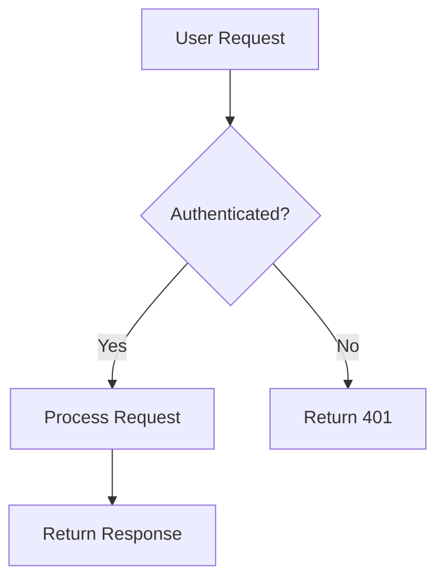

# Documentation Contribution Guidelines

Thank you for contributing to the nostr-BBS documentation. This guide ensures consistent, high-quality documentation across the project.

## Table of Contents

- [Getting Started](#getting-started)
- [Documentation Standards](#documentation-standards)
- [Writing Style Guide](#writing-style-guide)
- [File Organisation](#file-organisation)
- [Front Matter Requirements](#front-matter-requirements)
- [Formatting Guidelines](#formatting-guidelines)
- [Validation and Testing](#validation-and-testing)
- [Submission Process](#submission-process)

## Getting Started

### Prerequisites

1. **Git and GitHub account**
   - Fork the repository
   - Clone your fork locally
   - Set up git configuration

2. **Development tools**
   ```bash
   # Install Node.js (required for validation)
   node --version  # Should be 18+

   # Install Mermaid CLI (for diagram validation)
   npm install -g @mermaid-js/mermaid-cli

   # Install validation hooks
   npm install --save-dev husky
   npx husky install
   ```

3. **Text editor**
   - VS Code, Vim, or preferred markdown editor
   - Install markdown preview plugin
   - Enable spell checker with UK English

### First Steps

1. **Create a new branch**
   ```bash
   git checkout -b docs/your-feature-name
   ```

2. **Choose appropriate directory**
   - `docs/guides/` - Step-by-step tutorials
   - `docs/reference/` - Technical reference material
   - `docs/api/` - API documentation
   - `docs/tutorials/` - Learning-focused content

3. **Use a template**
   ```bash
   cp docs/templates/guide-template.md docs/guides/my-guide.md
   ```

## Documentation Standards

### Diataxis Framework

We follow the [Diataxis framework](https://diataxis.fr/) for documentation structure:

| Type | Purpose | Example |
|------|---------|---------|
| **Tutorial** | Learning-oriented | "Building your first channel" |
| **How-to Guide** | Task-oriented | "How to configure admin permissions" |
| **Reference** | Information-oriented | "API endpoint reference" |
| **Explanation** | Understanding-oriented | "Channel architecture explained" |

### Quality Standards

All documentation must meet these criteria:

- ✅ **Accurate**: Technically correct and tested
- ✅ **Complete**: Covers all necessary information
- ✅ **Clear**: Easy to understand for target audience
- ✅ **Concise**: No unnecessary verbosity
- ✅ **Current**: Reflects current codebase state
- ✅ **Consistent**: Follows style guide and conventions

## Writing Style Guide

### Language

- **Use UK English spelling** (colour, behaviour, organise, analyse)
- **Use present tense** ("The system creates..." not "The system will create...")
- **Use active voice** ("Run the command" not "The command should be run")
- **Use second person** ("You can configure..." not "One can configure...")

### Tone

- **Professional but friendly**
- **Direct and clear**
- **Helpful and encouraging**
- **Avoid jargon** unless necessary (explain when used)

### Examples

✅ **Good**:
```markdown
To create a new channel, use the channel creation form:

1. Click the "New Channel" button
2. Enter the channel name
3. Configure permissions
4. Click "Create"

The system creates the channel and redirects you to its page.
```

❌ **Bad**:
```markdown
You will want to utilize the channel creation functionality by clicking on the
button labeled "New Channel" which will then allow you to input various
parameters including but not limited to the channel name and permission settings.
```

### Technical Writing Best Practices

1. **Start with context**
   - What is this document about?
   - Who is it for?
   - What will they learn?

2. **Use clear headings**
   - Descriptive and hierarchical
   - Use sentence case
   - Maximum 3 levels deep

3. **Break up content**
   - Short paragraphs (3-5 sentences)
   - Use lists for sequences
   - Use tables for comparisons
   - Use code blocks for examples

4. **Provide examples**
   - Show, don't just tell
   - Use realistic scenarios
   - Include expected output
   - Highlight important parts

## File Organisation

### Directory Structure

```
docs/
├── guides/           # Step-by-step how-to guides
├── reference/        # Technical reference documentation
├── api/             # API documentation
├── tutorials/       # Learning-focused tutorials
├── architecture/    # System design documentation
├── diagrams/        # Mermaid diagram source files
├── images/          # Screenshots and images
├── templates/       # Document templates
├── scripts/         # Validation and utility scripts
└── working/         # Work-in-progress documents
```

### Naming Conventions

- **Use kebab-case**: `search-implementation.md`
- **Be descriptive**: `admin-permissions-guide.md` not `admin.md`
- **Group related docs**: `api-channels.md`, `api-users.md`
- **Version API docs**: `api-v1-reference.md`

## Front Matter Requirements

Every markdown file must include YAML front matter:

### Minimum Required Fields

```yaml
---
title: Document Title
description: Brief one-sentence description
status: draft
last_updated: 2025-12-23
---
```

### Complete Example

```yaml
---
title: Channel Configuration Guide
description: Learn how to configure and customise channel settings in nostr-BBS
status: approved
last_updated: 2025-12-23
category: guide
difficulty: intermediate
tags:
  - channels
  - configuration
  - admin
author: Your Name
reviewers:
  - Reviewer Name
related_docs:
  - admin-permissions.md
  - channel-architecture.md
---
```

### Field Specifications

| Field | Required | Valid Values | Description |
|-------|----------|--------------|-------------|
| `title` | Yes | String | Document title |
| `description` | Yes | String | One-sentence summary |
| `status` | Yes | `draft`, `review`, `approved`, `deprecated` | Document status |
| `last_updated` | Yes | YYYY-MM-DD | Last modification date |
| `category` | Recommended | `guide`, `reference`, `api`, `tutorial`, `explanation` | Document type |
| `difficulty` | For guides | `beginner`, `intermediate`, `advanced` | Required skill level |
| `tags` | Optional | Array of strings | Keywords for searchability |
| `author` | Optional | String | Primary author |
| `reviewers` | Optional | Array of strings | Technical reviewers |
| `api_version` | For API docs | String | API version number |

### Status Definitions

- **draft**: Work in progress, not ready for review
- **review**: Ready for technical review
- **approved**: Reviewed and approved for production
- **deprecated**: Outdated, retained for reference only

## Formatting Guidelines

### Headings

```markdown
# H1 - Document Title (use once per document)

## H2 - Main Section

### H3 - Subsection

#### H4 - Detail (use sparingly)
```

### Code Blocks

Always specify the language:

````markdown
```javascript
const channel = await createChannel({
  name: 'My Channel',
  description: 'A test channel'
});
```

```bash
npm run build
npm test
```

```json
{
  "name": "channel-name",
  "permissions": ["read", "write"]
}
```
````

### Links

Use descriptive link text:

```markdown
✅ See the [deployment guide](./deployment/deployment-guide.md)
❌ See [this guide](./deployment/deployment-guide.md)

✅ Learn more about [NIP-29 moderation](https://github.com/nostr-protocol/nips/blob/master/29.md)
❌ Click [here](https://github.com/nostr-protocol/nips/blob/master/29.md) for more info
```

### Lists

**Ordered lists** for sequences:

```markdown
1. First step
2. Second step
3. Third step
```

**Unordered lists** for non-sequential items:

```markdown
- Feature one
- Feature two
- Feature three
```

### Tables

Use tables for comparisons and reference data:

```markdown
| Parameter | Type | Required | Description |
|-----------|------|----------|-------------|
| `name` | string | Yes | Channel name |
| `description` | string | No | Channel description |
| `private` | boolean | No | Private channel flag |
```

### Callouts

Use blockquotes for important notes:

```markdown
> **Note**: This feature requires administrator permissions.

> **Warning**: Deleting a channel is permanent and cannot be undone.

> **Tip**: Use keyboard shortcuts for faster navigation.
```

### Diagrams

Use Mermaid for diagrams:

````markdown

````

Save complex diagrams as mermaid code blocks or external SVG files:

```markdown
<!-- Inline mermaid diagram -->
\```mermaid
graph LR
  A[Client] --> B[Relay]
  B --> C[Storage]
\```

<!-- Or reference external diagram if needed -->

```

## Validation and Testing

### Local Validation

Before committing, validate your changes:

```bash
# Run all validators
docs/scripts/validate-all.sh docs

# Run specific validator
docs/scripts/validate-links.sh docs
docs/scripts/validate-frontmatter.sh docs
docs/scripts/validate-mermaid.sh docs
docs/scripts/validate-spelling.sh docs
```

### Pre-commit Hook

The pre-commit hook automatically validates staged markdown files:

```bash
# Hook runs on commit
git commit -m "docs: add channel configuration guide"

# Skip validation (not recommended)
git commit --no-verify -m "docs: emergency fix"
```

### CI/CD Pipeline

Pull requests trigger automatic validation:

- Link validation
- Front matter compliance
- Mermaid diagram syntax
- UK English spelling
- Quality metrics

Fix any failures before requesting review.

## Submission Process

### 1. Prepare Your Changes

```bash
# Ensure branch is up to date
git checkout main
git pull upstream main
git checkout docs/your-feature
git rebase main

# Run validation
docs/scripts/validate-all.sh docs

# Review changes
git diff main
```

### 2. Commit Guidelines

Follow conventional commits:

```bash
# Format: docs: <description>
git commit -m "docs: add channel configuration guide"
git commit -m "docs: update API reference for v2"
git commit -m "docs: fix broken links in admin guide"
```

### 3. Create Pull Request

```bash
# Push to your fork
git push origin docs/your-feature

# Create PR on GitHub
# Use descriptive title and complete the PR template
```

### 4. PR Template

```markdown
## Description
Brief description of documentation changes

## Type of Change
- [ ] New documentation
- [ ] Documentation update
- [ ] Fix broken links
- [ ] Spelling/grammar corrections
- [ ] Diagram updates

## Checklist
- [ ] Front matter includes all required fields
- [ ] UK English spelling used throughout
- [ ] All links tested and working
- [ ] Code examples tested
- [ ] Diagrams render correctly
- [ ] Local validation passed
- [ ] Screenshots included (if applicable)

## Related Issues
Closes #123
```

### 5. Review Process

1. **Automated checks** run first
2. **Technical review** for accuracy
3. **Editorial review** for clarity and style
4. **Approval** by maintainers
5. **Merge** to main branch

### Addressing Feedback

```bash
# Make requested changes
git add docs/updated-file.md
git commit -m "docs: address review feedback"
git push origin docs/your-feature

# PR updates automatically
```

## Common Pitfalls

### ❌ Don't Do This

1. **Don't skip front matter**
   ```markdown
   # My Document

   This is content...
   ```

2. **Don't use US English**
   ```markdown
   The system organises colours...  ❌
   ```

3. **Don't hard-code version numbers**
   ```markdown
   As of version 1.2.3, the API...  ❌
   ```

4. **Don't include outdated screenshots**
   - Update images when UI changes
   - Use annotations to highlight important parts

5. **Don't create orphan documents**
   - Link from relevant parent documents
   - Update navigation/index as needed

### ✅ Do This Instead

1. **Include complete front matter**
   ```markdown
   ---
   title: My Document
   description: Document description
   status: draft
   last_updated: 2025-12-20
   ---
   ```

2. **Use UK English**
   ```markdown
   The system organises colours...  ✅
   ```

3. **Reference current version**
   ```markdown
   In the current version, the API...  ✅
   ```

4. **Keep screenshots current**
   - Regenerate when needed
   - Store in `docs/images/`
   - Optimise file size

5. **Create navigation**
   - Link from parent documents
   - Update table of contents
   - Add to relevant index pages

## Getting Help

### Resources

- **Diataxis Framework**: https://diataxis.fr/
- **Markdown Guide**: https://www.markdownguide.org/
- **Mermaid Documentation**: https://mermaid.js.org/
- **Project Style Guide**: This document

### Questions and Support

- **Documentation questions**: Create issue with `documentation` label
- **Technical questions**: Create issue with `question` label
- **Urgent issues**: Contact maintainers directly

### Community

- Be respectful and constructive
- Help others improve their contributions
- Share knowledge and best practices
- Celebrate good documentation

## Acknowledgements

Thank you for contributing to making nostr-BBS documentation better. High-quality documentation benefits everyone in the community.

---

**Questions?** Open an issue or reach out to the documentation team.

**Happy documenting!** 📚
