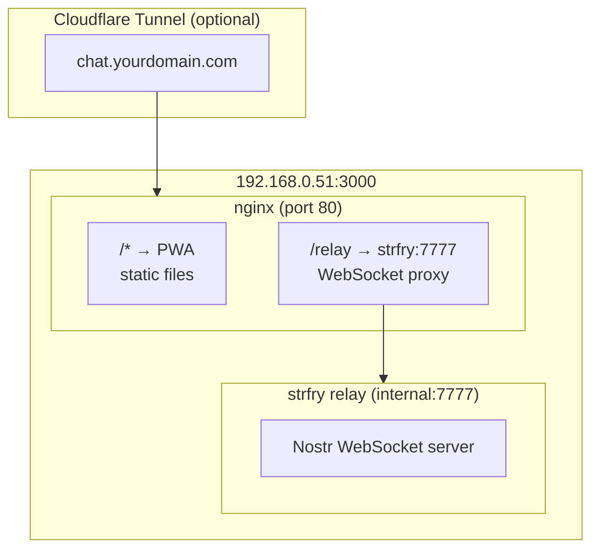

# Deployment Guide - Minimoonoir

## Architecture

Single port deployment serving both PWA and Nostr relay:



## Quick Start

```bash
# Build PWA
npm install
npm run build

# Start services
docker compose up -d

# Test endpoints
curl http://192.168.0.51:3000/health        # → OK
curl http://192.168.0.51:3000/              # → PWA HTML
curl -H "Accept: application/nostr+json" http://192.168.0.51:3000/relay/  # → NIP-11 info
```

## Endpoints

| Path | Service | Description |
|------|---------|-------------|
| `/` | nginx | PWA static files |
| `/relay` | strfry | Nostr WebSocket (wss://domain/relay) |
| `/relay/` | strfry | NIP-11 relay info (HTTP GET) |
| `/health` | nginx | Health check endpoint |

## Docker Commands

```bash
# Start all services
docker compose up -d

# View logs
docker compose logs -f

# Stop services
docker compose down

# Rebuild after code changes
npm run build && docker compose restart nginx

# Full rebuild
docker compose down && npm run build && docker compose up -d
```

## Cloudflare Tunnel Setup

### 1. Install cloudflared

```bash
curl -L https://github.com/cloudflare/cloudflared/releases/latest/download/cloudflared-linux-amd64 -o cloudflared
chmod +x cloudflared
sudo mv cloudflared /usr/local/bin/
```

### 2. Authenticate & Create Tunnel

```bash
cloudflared tunnel login
cloudflared tunnel create minimoonoir
cloudflared tunnel route dns minimoonoir chat.yourdomain.com
```

### 3. Configure Tunnel

Create `~/.cloudflared/config.yml`:

```yaml
tunnel: <TUNNEL_ID>
credentials-file: /home/<user>/.cloudflared/<TUNNEL_ID>.json

ingress:
  - hostname: chat.yourdomain.com
    service: http://192.168.0.51:3000
  - service: http_status:404
```

### 4. Run Tunnel

```bash
# Test
cloudflared tunnel run minimoonoir

# Install as service
sudo cloudflared service install
sudo systemctl enable --now cloudflared
```

## PWA Configuration

Update `src/lib/config.ts` or environment variables to point to your relay:

```typescript
// For production via tunnel
const RELAY_URL = 'wss://chat.yourdomain.com/relay';

// For local testing
const RELAY_URL = 'ws://192.168.0.51:3000/relay';
```

## Files

| File | Purpose |
|------|---------|
| `docker-compose.yml` | Service orchestration |
| `nginx.conf` | Reverse proxy config |
| `relay/strfry-dev.conf` | Strfry relay config (dev) |
| `relay/strfry.conf` | Strfry relay config (prod with NIP-42 auth) |
| `build/` | Built PWA static files |

## Volumes

- `strfry-data` - Persistent Nostr event database

## Health Checks

Both services include health checks:
- **nginx**: HTTP GET `/health` → 200 OK
- **strfry**: TCP connect to port 7777

## Production Checklist

- [ ] Build PWA: `npm run build`
- [ ] Start services: `docker compose up -d`
- [ ] Test health: `curl http://192.168.0.51:3000/health`
- [ ] Test PWA: Open http://192.168.0.51:3000 in browser
- [ ] Test relay: Connect WebSocket to ws://192.168.0.51:3000/relay
- [ ] Configure cloudflared tunnel
- [ ] Test HTTPS access via tunnel
- [ ] Verify PWA is installable (requires HTTPS)
- [ ] Switch to `relay/strfry.conf` for NIP-42 auth (optional)

## Troubleshooting

### Container won't start
```bash
docker compose logs nginx
docker compose logs relay
```

### Relay not responding
```bash
# Check relay is running
docker exec minimoonoir-relay ps aux

# Test internal connectivity
docker exec minimoonoir wget -qO- http://relay:7777/
```

### WebSocket connection fails
- Ensure nginx has WebSocket upgrade headers configured
- Check browser console for CORS or connection errors
- Verify relay is accessible: `docker exec minimoonoir nc -zv relay 7777`
