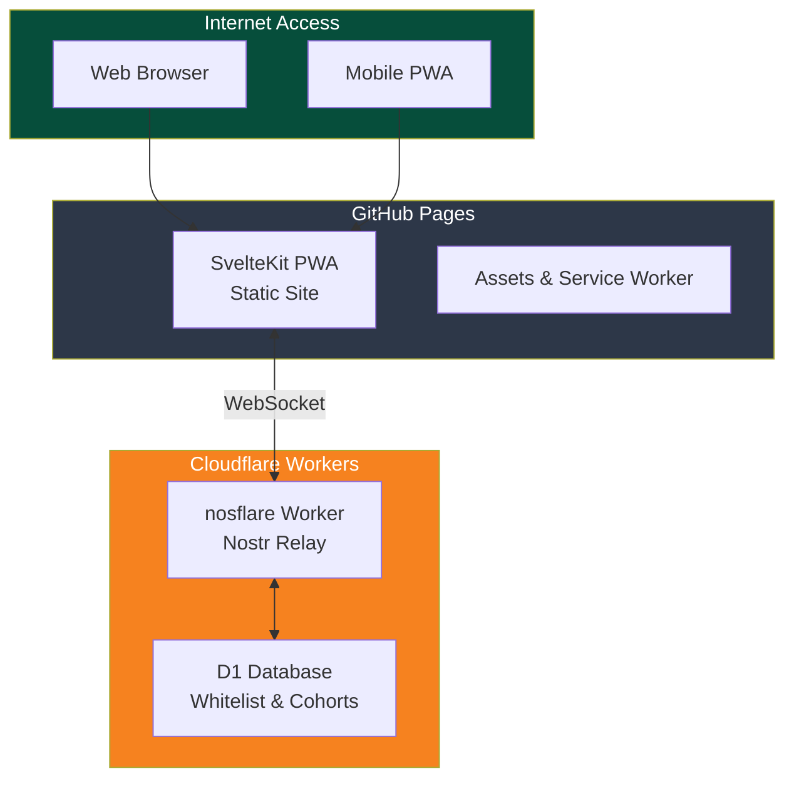

[← Back to Main README](../README.md)

# Deployment Guide - Minimoonoir

## Architecture

Serverless deployment using GitHub Pages and Cloudflare Workers:



## Prerequisites

### Required
- **Node.js 20+** - JavaScript runtime
- **Cloudflare Account** - Free tier works (https://dash.cloudflare.com/sign-up)
- **GitHub Account** - With Pages enabled (free)
- **Git** - Version control

### Optional
- **Wrangler CLI** - For local development and manual deployments
- **Custom Domain** - For production use

## Quick Start

### 1. Fork and Clone Repository

```bash
git clone https://github.com/your-username/fairfield-nostr.git
cd fairfield-nostr
npm install
```

### 2. Configure Environment Variables

Copy `.env.example` to `.env`:

```bash
cp .env.example .env
```

Edit `.env` with your configuration:

```bash
# Cloudflare Workers relay URL (update after deployment)
VITE_RELAY_URL=wss://your-worker.your-subdomain.workers.dev

# Admin pubkey in hex format (64 characters)
VITE_ADMIN_PUBKEY=your-hex-pubkey-here

# Application configuration
VITE_APP_NAME=Minimoonoir
VITE_NDK_DEBUG=false

# Cloudflare credentials (for local development only)
# ⚠️ DO NOT commit these! Use GitHub Secrets for CI/CD
CLOUDFLARE_ACCOUNT_ID=your-account-id
CLOUDFLARE_API_TOKEN=your-api-token
```

### 3. Generate Admin Keypair

If you don't have a Nostr keypair:

```bash
# Generate new keypair
npx nostr-tools-cli generate

# Output will show:
# Private key (nsec): nsec1...
# Public key (npub): npub1...
# Public key (hex): 49dfa09158b64f1c...
```

**Important**: Save your `nsec` (private key) securely. You'll need the hex public key for `VITE_ADMIN_PUBKEY`.

## Cloudflare Workers Setup

### Step 1: Install Wrangler

```bash
npm install -g wrangler
# or use the local version
npx wrangler --version
```

### Step 2: Authenticate with Cloudflare

```bash
wrangler login
```

This opens your browser to authenticate.

### Step 3: Create D1 Database

```bash
wrangler d1 create minimoonoir
```

Output:
```
✅ Successfully created DB 'minimoonoir'
Database ID: xxxxxxxx-xxxx-xxxx-xxxx-xxxxxxxxxxxx
```

**Save the Database ID** - you'll need it for `wrangler.toml`.

### Step 4: Update wrangler.toml

Navigate to the nosflare directory (once created) and update `wrangler.toml`:

```toml
name = "nosflare"
main = "worker.js"
compatibility_date = "2024-01-01"

[[d1_databases]]
binding = "DB"
database_name = "minimoonoir"
database_id = "your-database-id-here"  # From Step 3

[env.production]
name = "nosflare-production"
vars = { ENVIRONMENT = "production" }

[[env.production.d1_databases]]
binding = "DB"
database_name = "minimoonoir"
database_id = "your-database-id-here"
```

### Step 5: Create Database Schema

Create `schema.sql` in the nosflare directory:

```sql
-- Whitelist table for access control
CREATE TABLE IF NOT EXISTS whitelist (
  pubkey TEXT PRIMARY KEY,
  cohorts TEXT NOT NULL DEFAULT '[]',
  added_at INTEGER NOT NULL,
  added_by TEXT NOT NULL
);

-- Cohorts table for group management
CREATE TABLE IF NOT EXISTS cohorts (
  id TEXT PRIMARY KEY,
  name TEXT NOT NULL,
  description TEXT,
  created_at INTEGER NOT NULL,
  created_by TEXT NOT NULL
);

-- Create default admin cohort
INSERT OR IGNORE INTO cohorts (id, name, description, created_at, created_by)
VALUES ('admin', 'Administrators', 'System administrators', strftime('%s','now'), 'system');
```

Apply the schema:

```bash
cd nosflare
wrangler d1 execute minimoonoir --file=schema.sql
```

### Step 6: Add Admin to Whitelist

```bash
# Replace with your admin pubkey (hex format)
wrangler d1 execute minimoonoir --command \
  "INSERT INTO whitelist (pubkey, cohorts, added_at, added_by) \
   VALUES ('your-hex-pubkey', '[\"admin\"]', strftime('%s','now'), 'system')"
```

Verify:

```bash
wrangler d1 execute minimoonoir --command "SELECT * FROM whitelist"
```

### Step 7: Deploy Worker

```bash
cd nosflare
npm install
npm run build
wrangler deploy --env production
```

Output:
```
✅ Deployment complete
Worker URL: https://nosflare.your-subdomain.workers.dev
```

**Save the Worker URL** - you'll use it as `VITE_RELAY_URL`.

### Step 8: Test Worker

```bash
# Test WebSocket connection
curl -H "Upgrade: websocket" \
     -H "Connection: Upgrade" \
     -H "Sec-WebSocket-Version: 13" \
     -H "Sec-WebSocket-Key: test" \
     https://nosflare.your-subdomain.workers.dev

# Test NIP-11 relay info
curl -H "Accept: application/nostr+json" \
     https://nosflare.your-subdomain.workers.dev
```

## GitHub Pages Setup

### Step 1: Configure Repository Settings

1. Go to **Settings** > **Pages**
2. Source: **GitHub Actions**
3. No custom build needed (using workflow)

### Step 2: Add GitHub Secrets

Go to **Settings** > **Secrets and variables** > **Actions** > **New repository secret**:

| Secret Name | Value | Where to Find |
|-------------|-------|---------------|
| `CLOUDFLARE_ACCOUNT_ID` | Your account ID | Cloudflare Dashboard > Workers & Pages > Overview |
| `CLOUDFLARE_API_TOKEN` | API token | Cloudflare Dashboard > Profile > API Tokens |

**Creating API Token**:
1. Go to Cloudflare Dashboard > Profile > API Tokens
2. Click "Create Token"
3. Template: "Edit Cloudflare Workers"
4. Permissions:
   - Account > Workers Scripts > Edit
   - Account > D1 > Edit
5. Continue to summary > Create Token
6. **Copy the token** (shown only once)

### Step 3: Update Environment Variables

Edit `.github/workflows/deploy-pages.yml` with your configuration:

```yaml
env:
  NODE_VERSION: '20'
  VITE_RELAY_URL: wss://nosflare.your-subdomain.workers.dev
  VITE_ADMIN_PUBKEY: your-hex-pubkey-here
  VITE_APP_NAME: Minimoonoir
  VITE_NDK_DEBUG: false
```

### Step 4: Deploy

```bash
# Commit and push to trigger deployment
git add .
git commit -m "Configure deployment"
git push origin main
```

GitHub Actions will:
1. Install dependencies
2. Build SvelteKit PWA
3. Deploy to GitHub Pages

### Step 5: Verify Deployment

1. Check Actions tab for build status
2. Once complete, visit: `https://your-username.github.io/fairfield-nostr/`
3. PWA should load and connect to your relay

### Step 6: Configure Custom Domain (Optional)

1. Go to **Settings** > **Pages**
2. **Custom domain**: `chat.yourdomain.com`
3. Update DNS:
   ```
   Type: CNAME
   Name: chat
   Value: your-username.github.io
   ```
4. Wait for DNS propagation (5-60 minutes)
5. Enable **Enforce HTTPS**

## Local Development

### Development Server

```bash
# Install dependencies
npm install

# Start dev server
npm run dev

# Access at http://localhost:5173
```

The dev server will:
- Hot reload on file changes
- Connect to your deployed Cloudflare Workers relay
- Use environment variables from `.env`

### Development with Local Worker

```bash
# Terminal 1: Start worker locally
cd nosflare
wrangler dev --local

# Terminal 2: Update .env and start PWA
VITE_RELAY_URL=ws://localhost:8787 npm run dev
```

### Testing

```bash
# Unit tests
npm run test

# Type checking
npm run check

# Linting
npm run lint

# E2E tests (requires deployed worker)
npm run test:e2e
```

## Deployment Workflows

### Automatic Deployments

Two separate GitHub Actions workflows:

#### 1. Frontend (PWA) - `.github/workflows/deploy-pages.yml`
Triggers on:
- Push to `main` (excluding `nosflare/**`)
- Manual workflow dispatch

Deploys to: GitHub Pages

#### 2. Backend (Relay) - `.github/workflows/deploy-relay.yml`
Triggers on:
- Push to `main` with changes in `nosflare/**`
- Manual workflow dispatch

Deploys to: Cloudflare Workers

### Manual Deployments

#### Deploy PWA Only
```bash
npm run build
# Manually upload ./build to GitHub Pages
```

#### Deploy Worker Only
```bash
cd nosflare
npm run build
wrangler deploy --env production
```

## Environment Variables Reference

### Frontend (.env)

| Variable | Required | Description | Example |
|----------|----------|-------------|---------|
| `VITE_RELAY_URL` | Yes | Cloudflare Workers relay URL | `wss://nosflare.workers.dev` |
| `VITE_ADMIN_PUBKEY` | Yes | Admin public key (hex) | `49dfa09...` (64 chars) |
| `VITE_APP_NAME` | No | Application name | `Minimoonoir` |
| `VITE_NDK_DEBUG` | No | Enable NDK debug logs | `false` |

### Cloudflare (GitHub Secrets)

| Secret | Required | Description | Where to Find |
|--------|----------|-------------|---------------|
| `CLOUDFLARE_ACCOUNT_ID` | Yes | Account identifier | Dashboard > Workers & Pages |
| `CLOUDFLARE_API_TOKEN` | Yes | API authentication | Dashboard > Profile > API Tokens |

### Build Variables (.github/workflows)

| Variable | Description | Default |
|----------|-------------|---------|
| `NODE_VERSION` | Node.js version | `20` |
| `BASE_PATH` | GitHub Pages base path | `/${{ github.event.repository.name }}` |

## Database Management

### View Whitelist

```bash
wrangler d1 execute minimoonoir --command "SELECT * FROM whitelist"
```

### Add User to Whitelist

```bash
wrangler d1 execute minimoonoir --command \
  "INSERT INTO whitelist (pubkey, cohorts, added_at, added_by) \
   VALUES ('user-pubkey-hex', '[\"members\"]', strftime('%s','now'), 'admin-pubkey')"
```

### Remove User from Whitelist

```bash
wrangler d1 execute minimoonoir --command \
  "DELETE FROM whitelist WHERE pubkey = 'user-pubkey-hex'"
```

### Create Cohort

```bash
wrangler d1 execute minimoonoir --command \
  "INSERT INTO cohorts (id, name, description, created_at, created_by) \
   VALUES ('cohort-id', 'Cohort Name', 'Description', strftime('%s','now'), 'admin-pubkey')"
```

### View All Cohorts

```bash
wrangler d1 execute minimoonoir --command "SELECT * FROM cohorts"
```

### Backup Database

```bash
# Export data
wrangler d1 execute minimoonoir --command "SELECT * FROM whitelist" > whitelist_backup.json
wrangler d1 execute minimoonoir --command "SELECT * FROM cohorts" > cohorts_backup.json
```

### Restore Database

```bash
# Re-create and apply schema
wrangler d1 execute minimoonoir --file=schema.sql

# Import data (requires manual SQL statements)
```

## Monitoring and Debugging

### View Worker Logs

```bash
# Real-time logs
wrangler tail

# Specific deployment
wrangler tail --env production
```

### Check Deployment Status

```bash
# List deployments
wrangler deployments list

# Worker details
wrangler whoami
```

### Debug WebSocket Connection

```javascript
// Browser console
const ws = new WebSocket('wss://nosflare.your-subdomain.workers.dev');
ws.onopen = () => console.log('Connected');
ws.onmessage = (msg) => console.log('Message:', msg.data);
ws.onerror = (err) => console.error('Error:', err);

// Test with Nostr REQ
ws.send(JSON.stringify(["REQ", "test", {"kinds": [1], "limit": 10}]));
```

### Check GitHub Pages Build

1. Go to **Actions** tab
2. Click latest workflow run
3. View logs for each step
4. Check **Deploy to GitHub Pages** step

## Production Checklist

### Pre-Deployment
- [ ] Generate admin keypair and save securely
- [ ] Create Cloudflare account and get credentials
- [ ] Configure GitHub repository secrets
- [ ] Update environment variables in workflows
- [ ] Test local build: `npm run build`

### Cloudflare Setup
- [ ] Create D1 database: `wrangler d1 create minimoonoir`
- [ ] Apply database schema: `wrangler d1 execute minimoonoir --file=schema.sql`
- [ ] Add admin to whitelist
- [ ] Verify whitelist: `wrangler d1 execute minimoonoir --command "SELECT * FROM whitelist"`
- [ ] Deploy worker: `wrangler deploy --env production`
- [ ] Test worker WebSocket connection
- [ ] Test NIP-11 relay info endpoint

### GitHub Pages Setup
- [ ] Enable Pages in repository settings
- [ ] Add Cloudflare secrets to GitHub
- [ ] Update workflow environment variables
- [ ] Push to `main` branch
- [ ] Verify GitHub Actions workflow succeeds
- [ ] Test PWA loads at GitHub Pages URL
- [ ] Verify WebSocket connects to Cloudflare relay

### Post-Deployment
- [ ] Test PWA installation on mobile
- [ ] Verify service worker registers
- [ ] Test offline functionality
- [ ] Configure custom domain (if applicable)
- [ ] Enable HTTPS enforcement
- [ ] Test admin authentication
- [ ] Create additional users and cohorts
- [ ] Monitor worker logs: `wrangler tail`

### Security
- [ ] Verify admin pubkey matches your keypair
- [ ] Confirm whitelist enforces access control
- [ ] Test unauthorized access is blocked
- [ ] Enable rate limiting (if needed)
- [ ] Review worker logs for suspicious activity
- [ ] Rotate API tokens periodically

## Troubleshooting

### PWA Not Loading

**Symptom**: Blank page or 404 error

**Solutions**:
```bash
# Check build output
npm run build
ls -la build/

# Verify GitHub Pages deployment
# Go to Settings > Pages
# Check Actions tab for errors

# Check BASE_PATH in workflow
# Should match repository name
```

### WebSocket Connection Fails

**Symptom**: "Failed to connect to relay" error

**Solutions**:
```bash
# Verify worker is deployed
wrangler deployments list

# Test worker endpoint
curl -H "Upgrade: websocket" https://your-worker.workers.dev

# Check VITE_RELAY_URL in .env and workflow
# Must be wss:// (not ws://)

# Verify CORS headers in worker
wrangler tail
```

### Authentication Fails

**Symptom**: "Not authorized" or "Invalid signature"

**Solutions**:
```bash
# Verify admin pubkey (hex format, 64 chars)
echo $VITE_ADMIN_PUBKEY | wc -c  # Should be 65 (64 + newline)

# Check whitelist
wrangler d1 execute minimoonoir --command "SELECT * FROM whitelist"

# Add admin if missing
wrangler d1 execute minimoonoir --command \
  "INSERT INTO whitelist (pubkey, cohorts, added_at, added_by) \
   VALUES ('your-hex-pubkey', '[\"admin\"]', strftime('%s','now'), 'system')"
```

### D1 Database Errors

**Symptom**: Worker logs show database errors

**Solutions**:
```bash
# Verify database exists
wrangler d1 list

# Check schema
wrangler d1 execute minimoonoir --command "SELECT sql FROM sqlite_master WHERE type='table'"

# Re-apply schema if needed
wrangler d1 execute minimoonoir --file=schema.sql

# Verify binding in wrangler.toml
cat wrangler.toml | grep -A 3 d1_databases
```

### GitHub Actions Workflow Fails

**Symptom**: Red X in Actions tab

**Solutions**:
```bash
# Check secrets are configured
# Go to Settings > Secrets and variables > Actions

# Verify secret names match workflow
# - CLOUDFLARE_ACCOUNT_ID
# - CLOUDFLARE_API_TOKEN

# Test locally
npm run build
cd nosflare && npm run build

# Re-run workflow
# Actions tab > Re-run jobs
```

### Custom Domain Not Working

**Symptom**: Domain shows GitHub 404

**Solutions**:
1. Verify DNS CNAME record:
   ```bash
   dig chat.yourdomain.com
   # Should point to your-username.github.io
   ```

2. Wait for DNS propagation (up to 24 hours)

3. Check GitHub Pages settings:
   - Custom domain: `chat.yourdomain.com`
   - HTTPS enforced: Yes

4. Clear browser cache and retry

## Cost Estimation

### Cloudflare Workers Free Tier
- **Requests**: 100,000/day (more than enough for small communities)
- **D1 Database**: 5 GB storage, 5 million reads/day
- **Cost**: $0/month

### GitHub Pages
- **Bandwidth**: 100 GB/month
- **Build minutes**: 2,000/month
- **Cost**: $0/month (for public repositories)

### Custom Domain (Optional)
- **Domain registration**: ~$10-15/year
- **DNS**: Usually included with domain

**Total estimated cost**: **$0-15/year** (domain only)

## Next Steps

After successful deployment:

1. **Invite Users**: Share your GitHub Pages URL and provide nsec keys
2. **Create Cohorts**: Organize users into groups
3. **Configure Channels**: Set up NIP-28 chat channels
4. **Schedule Events**: Create NIP-52 calendar events
5. **Monitor Usage**: Check worker analytics in Cloudflare Dashboard
6. **Backup Data**: Regularly export D1 database

## Support

- **Issues**: https://github.com/your-username/fairfield-nostr/issues
- **Nostr Protocol**: https://nostr.com
- **Cloudflare Workers**: https://developers.cloudflare.com/workers
- **SvelteKit**: https://kit.svelte.dev

---

**Architecture**: Serverless (GitHub Pages + Cloudflare Workers)
**Database**: Cloudflare D1
**Cost**: Free tier available
**Maintenance**: Minimal (serverless platform manages infrastructure)
