[← Back to Main README](../../README.md)

# Nostr-BBS - SPARC Architecture

> **Phase:** Architecture Design
> **Version:** 0.1.0-draft
> **Date:** 2024-12-11
> **[Back to Main README](../../README.md)**

---

## 1. System Overview

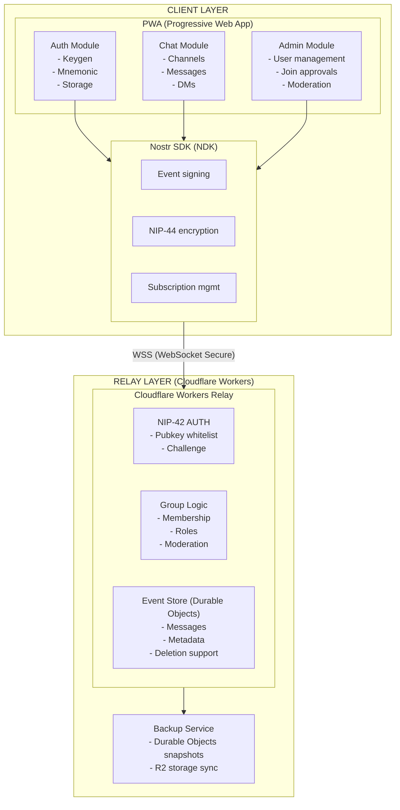

---

## 2. Message Lifecycle & Data Flow

### 2.1 Complete Message Flow (Creation to Delivery)

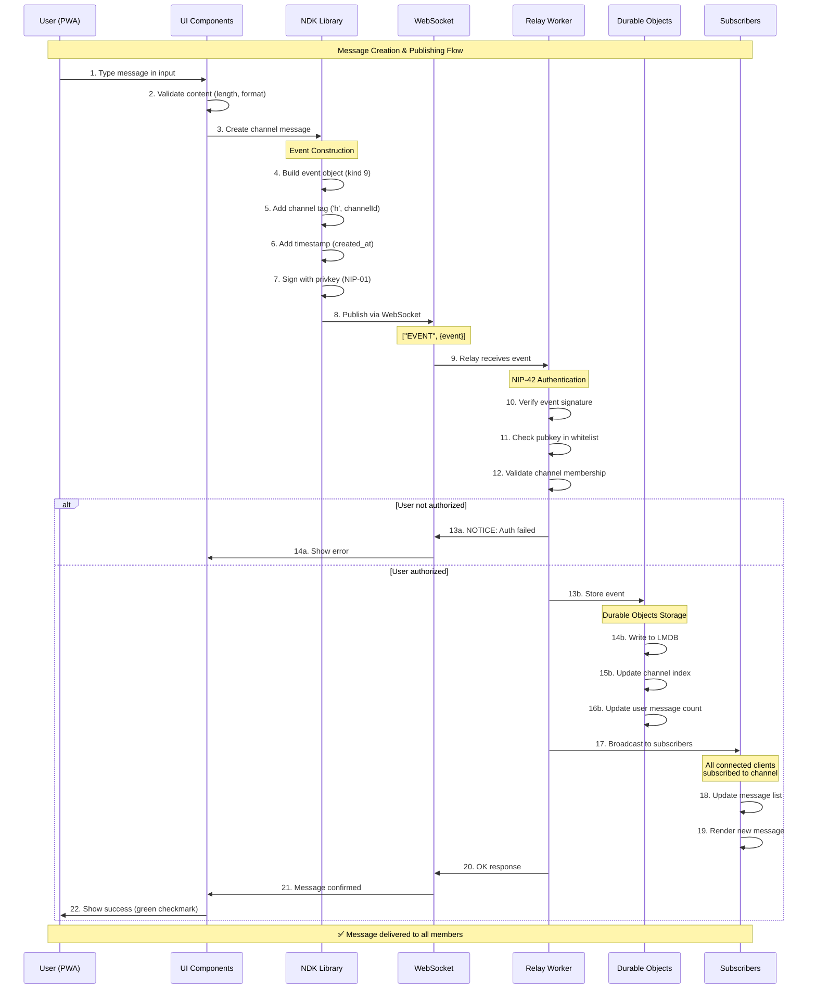

**Key Steps Explained:**

| Step | Layer | Description |
|------|-------|-------------|
| 1-3 | Client | User types message, UI validates, sends to NDK |
| 4-7 | NDK | Event creation: build, tag, timestamp, sign |
| 8-9 | Transport | WebSocket transmission to relay |
| 10-12 | Relay | NIP-42 AUTH: verify signature, whitelist, membership |
| 13-16 | Storage | Durable Objects: persist event, update indexes |
| 17-19 | Distribution | Broadcast to all channel subscribers |
| 20-22 | Confirmation | Relay confirms, UI shows success |

### 2.2 Deletion Flow (NIP-09 + NIP-29)

```mermaid
sequenceDiagram
    participant U as User
    participant UI as UI
    participant NDK as NDK
    participant R as Relay
    participant DO as Durable Objects
    participant SUB as Subscribers

    U->>UI: Click "Delete" on message
    UI->>UI: Confirm deletion

    alt User's own message
        UI->>NDK: Create deletion event (kind 5)
        Note over NDK: NIP-09 deletion
        NDK->>NDK: Add 'e' tag (event ID to delete)
        NDK->>NDK: Sign with user's privkey
    else Admin deletion
        UI->>NDK: Create admin deletion (kind 9005)
        Note over NDK: NIP-29 admin action
        NDK->>NDK: Add 'h' tag (channel ID)
        NDK->>NDK: Add 'e' tag (event ID)
        NDK->>NDK: Sign with admin privkey
    end

    NDK->>R: Publish deletion event
    R->>R: Verify deletion authority
    R->>DO: Mark event as deleted
    DO->>DO: Update deletion index

    R->>SUB: Broadcast deletion
    SUB->>SUB: Remove message from UI

    style NDK fill:#FFB6C1,stroke:#333
    style DO fill:#90EE90,stroke:#333
```

**Text Alternative:** User initiates deletion. For own messages, creates NIP-09 deletion event (kind 5). For admin deletions, creates NIP-29 moderation event (kind 9005). Relay verifies authority, marks event as deleted in Durable Objects, broadcasts deletion to all subscribers who remove the message from their UI.

---

## 3. Component Architecture

### 2.1 Frontend Components

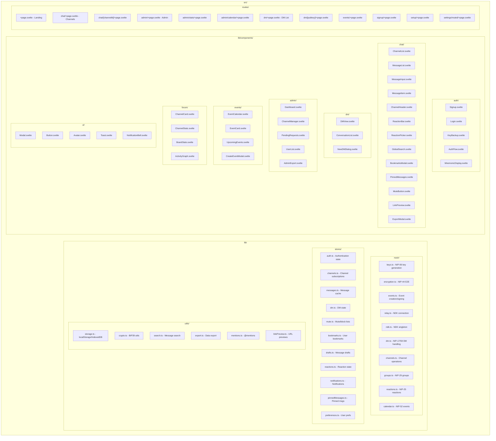

**Key Directories:**

| Directory | Purpose |
|-----------|---------|
| `src/lib/nostr/` | Nostr protocol implementation (NIPs 01, 06, 09, 17, 25, 28, 29, 42, 44, 52, 59) |
| `src/lib/stores/` | Svelte stores for reactive state management |
| `src/lib/utils/` | Helper utilities for storage, crypto, search, export |
| `src/lib/components/` | Reusable Svelte 5 components organized by feature |
| `src/routes/` | SvelteKit file-based routing |
| `static/` | PWA assets (manifest, icons, service worker) |

### 2.2 Relay Configuration (Cloudflare Workers)

```typescript
// relay/workers/config.ts
export const relayConfig = {
  info: {
    name: "Nostr-BBS Private Relay",
    description: "Private relay for Nostr-BBS community",
    supported_nips: [1, 2, 9, 11, 29, 42, 44, 59],
  },

  // NIP-42 Authentication Required
  auth: {
    enabled: true,
    challenge_timeout: 60,
  },

  // Write Policy
  writePolicy: {
    // Only authenticated users can write
    require_auth: true,
    // Whitelist managed by admin
    use_pubkey_whitelist: true,
  },

  // No federation
  upstream: [],

  // Storage via Durable Objects
  storage: {
    use_durable_objects: true,
    max_size: 1073741824,  // 1GB
  },
};
```

---

## 3. Data Models

### 3.1 Nostr Event Kinds Used

| Kind | NIP | Purpose |
|------|-----|---------|
| 0 | 01 | User metadata (profile) |
| 1 | 01 | Short text note (channel messages) |
| 4 | 04 | Encrypted DM (legacy, read-only) |
| 5 | 09 | Deletion request |
| 9 | 29 | Group chat message |
| 10 | 29 | Group metadata |
| 11 | 29 | Group admin list |
| 12 | 29 | Group members |
| 1059 | 59 | Gift-wrapped event (DMs) |
| 9000 | 29 | Group add user |
| 9001 | 29 | Group remove user |
| 9005 | 29 | Group delete event |

### 3.2 Custom Tags

```typescript
// Cohort tag for channel filtering
interface CohortTag {
  tag: "cohort";
  values: ["business" | "moomaa-tribe" | "both"];
}

// Join request status
interface JoinRequestTag {
  tag: "join-request";
  values: [channelId: string, status: "pending" | "approved" | "rejected"];
}

// Channel visibility
interface VisibilityTag {
  tag: "visibility";
  values: ["listed" | "unlisted" | "preview"];
}
```

### 3.3 IndexedDB Schema (Client-side Cache)

```typescript
interface Nostr-BBSDB {
  // Cached messages for offline access
  messages: {
    id: string;           // Event ID
    channelId: string;
    pubkey: string;
    content: string;      // Decrypted content
    created_at: number;
    deleted: boolean;
  };

  // Channel metadata
  channels: {
    id: string;
    name: string;
    description: string;
    cohort: "business" | "moomaa-tribe" | "both";
    visibility: "listed" | "unlisted" | "preview";
    memberCount: number;
    isMember: boolean;
    isEncrypted: boolean;
  };

  // Pending requests
  joinRequests: {
    id: string;
    channelId: string;
    requestedAt: number;
    status: "pending" | "approved" | "rejected";
  };

  // User's key material (encrypted)
  keys: {
    pubkey: string;
    encryptedPrivkey: string;  // Encrypted with PIN/passphrase
  };
}
```

---

## 4. Authentication Flow

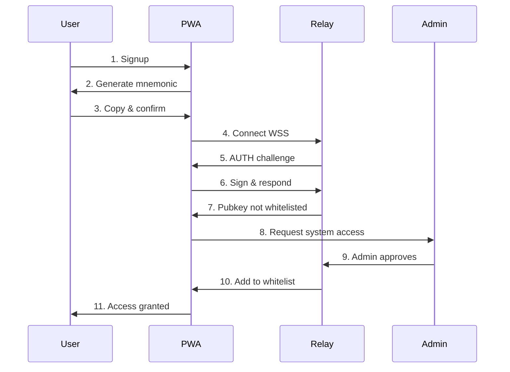

---

## 5. Channel Access Flow

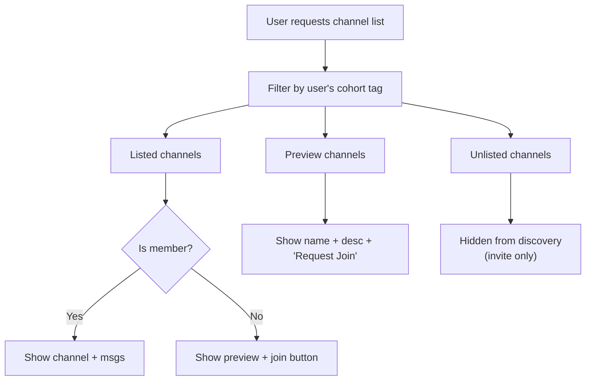

---

## 6. Encryption Architecture

### 6.1 Channel Messages (NIP-29 Groups)

**Non-Encrypted Channels** (Common Rooms, Event Channels)

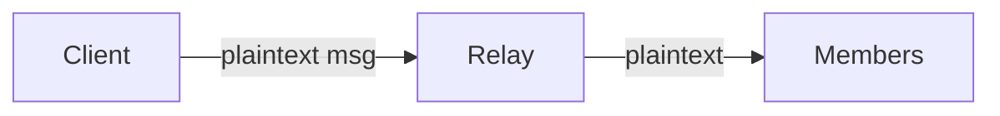

- Relay can read content
- Admin implicitly has access (relay owner)
- Simple, performant
- NIP-29 membership enforcement

**E2E Encrypted Channels** (Private Course Rooms)

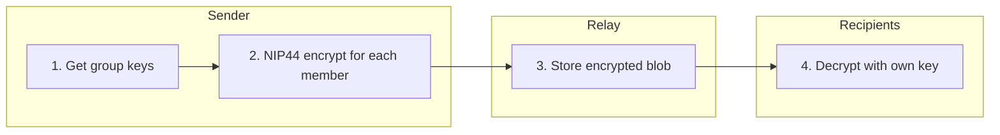

- Relay sees encrypted blob only
- Admin in room = admin has key = can decrypt
- O(n) encryption per message for n members
- Suitable for <100 member groups

### 6.2 Direct Messages (NIP-17 + NIP-59)

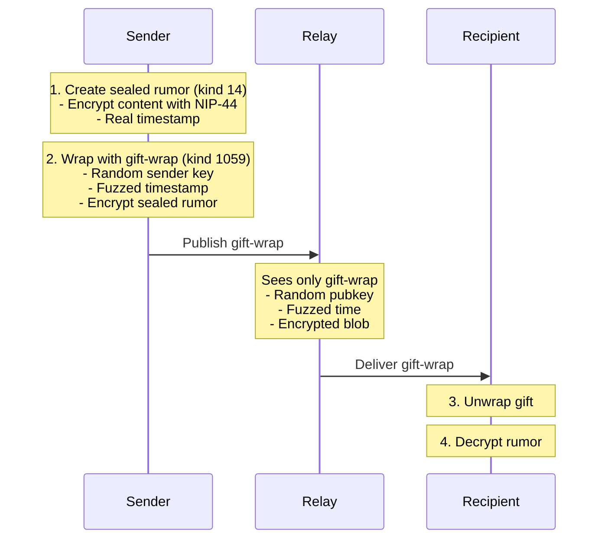

**Admin CANNOT read DMs** (no access to recipient's privkey)

---

## 7. Deletion Strategy

### 7.1 Local Relay Deletion (Supported)

```typescript
// User deletes their own message
async function deleteMessage(eventId: string, privkey: string) {
  // Create NIP-09 deletion event
  const deletionEvent = {
    kind: 5,
    pubkey: getPublicKey(privkey),
    created_at: Math.floor(Date.now() / 1000),
    tags: [
      ["e", eventId],  // Event to delete
    ],
    content: "Deleted by user",
  };

  // Sign and publish
  const signed = await signEvent(deletionEvent, privkey);
  await relay.publish(signed);

  // Local relay WILL honour deletion
  // (configured to respect NIP-09 from event author)
}

// Admin force-delete (NIP-29 kind 9005)
async function adminDeleteMessage(eventId: string, channelId: string) {
  const deletionEvent = {
    kind: 9005,
    tags: [
      ["h", channelId],
      ["e", eventId],
    ],
    content: "Removed by admin",
  };
  // ... sign with admin key
}
```

### 7.2 Why Local-Only Enables True Deletion

**Public Nostr (Federation)**

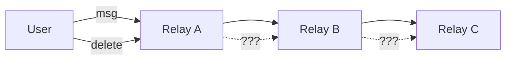

*Problem: No guarantee other relays honour deletion*

**Nostr-BBS (Closed Relay)**

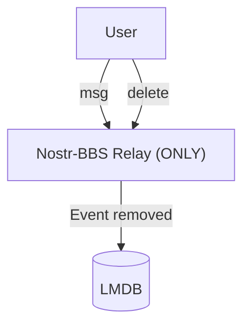

*Guarantee: We control the only relay, deletion is real*

---

## 8. Technology Stack

### 8.1 Frontend

| Layer | Technology | Rationale |
|-------|------------|-----------|
| Framework | SvelteKit | Lightweight, PWA-friendly, good DX |
| Nostr SDK | NDK (@nostr-dev-kit/ndk) | High-level, well-maintained |
| Styling | Tailwind CSS | Rapid UI development |
| Storage | IndexedDB (Dexie) | Offline message cache |
| Build | Vite | Fast HMR, PWA plugin |

### 8.2 Relay

| Component | Technology | Rationale |
|-----------|------------|-----------|
| Core Relay | Cloudflare Workers | Edge deployment, global distribution |
| Storage | Durable Objects | Consistent state, WebSocket support |
| Group Logic | Custom NIP-29 impl | Full control over group features |
| CDN/Proxy | Cloudflare | Auto-HTTPS, WebSocket, DDoS protection |

### 8.3 Infrastructure

| Component | Technology | Rationale |
|-----------|------------|-----------|
| Hosting | Cloudflare Workers + Pages | Serverless, global edge |
| Storage | Durable Objects + R2 | Persistent state, backup storage |
| Monitoring | Cloudflare Analytics | Built-in metrics and logging |

---

## 9. Deployment Architecture

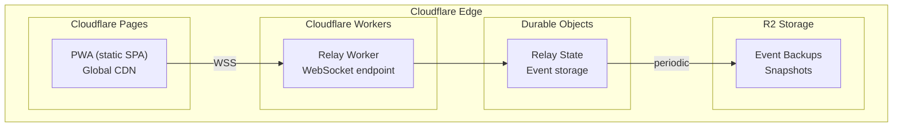

---

*Next Phase: Pseudocode & Data Flow (03-pseudocode.md)*
