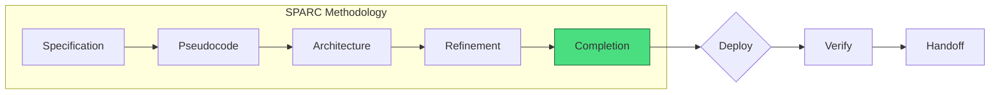
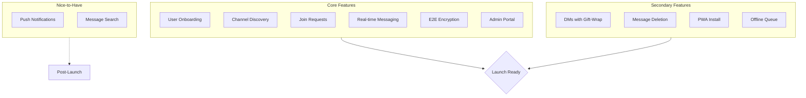
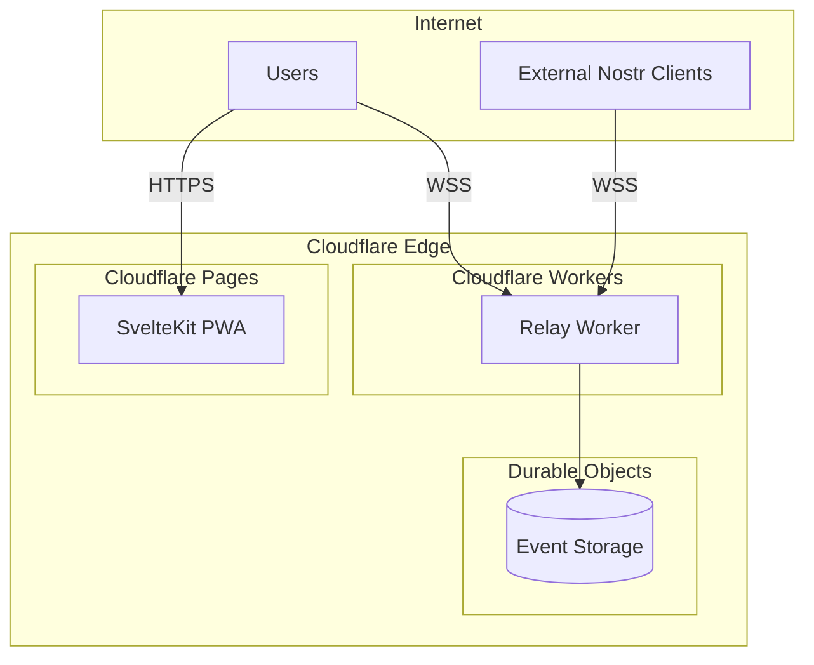
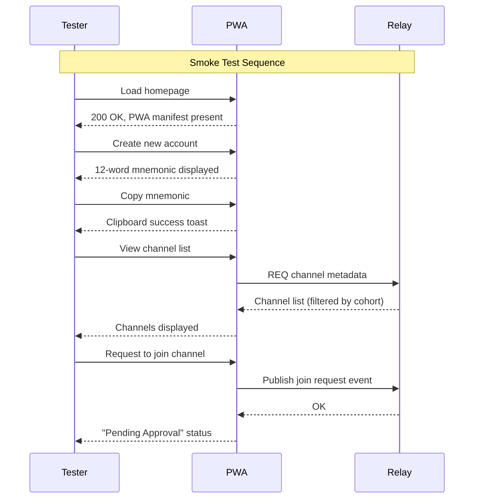
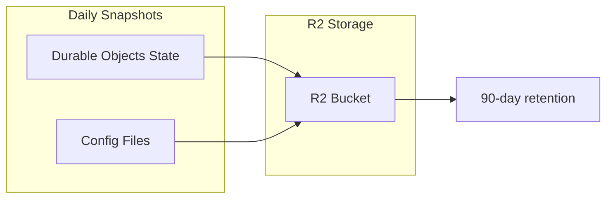
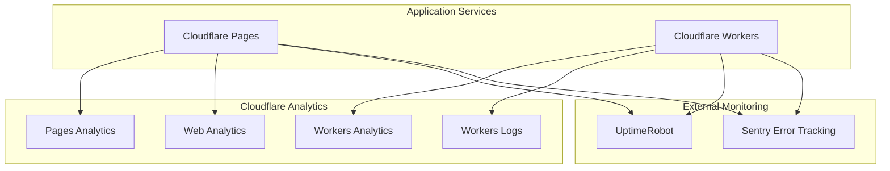
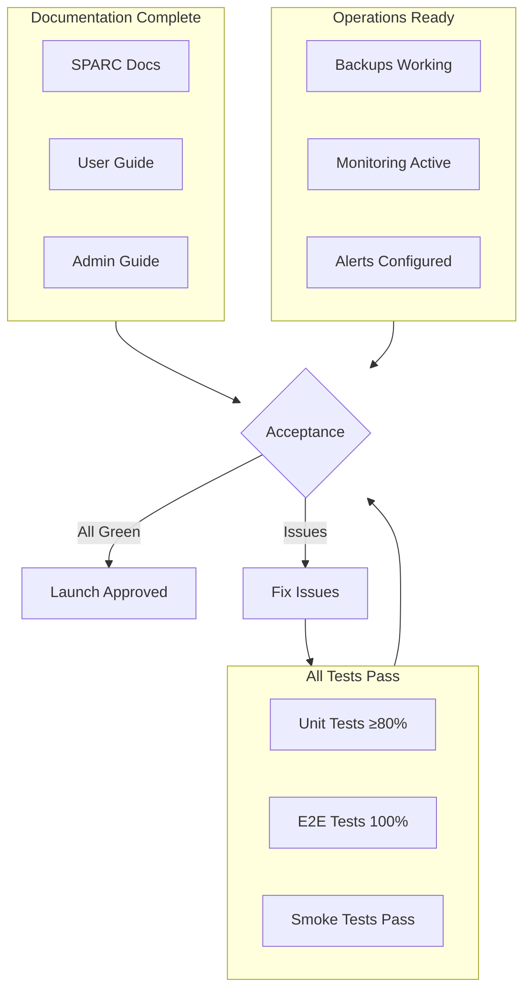
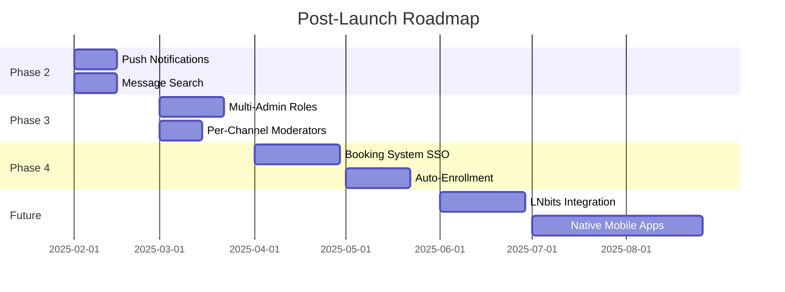

[← Back to Main README](../../README.md)

# Nostr-BBS Nostr - SPARC Completion

> **Project:** Private Chatroom System for Residential Retreat & Course Booking
> **Version:** 0.1.0-draft
> **Date:** 2024-12-11
> **Status:** Pre-Development

---

## 1. Completion Overview

This document defines the deployment, verification, and handoff criteria for Nostr-BBS Nostr. It serves as the final SPARC phase checklist ensuring production readiness.



---

## 2. Pre-Deployment Checklist

### 2.1 Code Quality Gates

| Gate | Tool | Threshold | Status |
|------|------|-----------|--------|
| Unit Test Coverage | Vitest | ≥80% | [ ] |
| E2E Test Pass | Playwright | 100% | [ ] |
| Type Safety | TypeScript | 0 errors | [ ] |
| Linting | ESLint | 0 errors | [ ] |
| Bundle Size | Vite | <100KB gzip | [ ] |
| Lighthouse PWA | Chrome | ≥90 | [ ] |
| Security Audit | npm audit | 0 critical | [ ] |

### 2.2 Feature Completion Matrix



| Feature | Priority | Acceptance Criteria | Status |
|---------|----------|---------------------|--------|
| BIP-39 Key Generation | P0 | 12-word mnemonic generates valid keypair | [ ] |
| Mnemonic Copy-to-Clipboard | P0 | One-click copy with visual feedback | [ ] |
| localStorage Persistence | P0 | Keys survive browser restart | [ ] |
| Cohort Channel Listing | P0 | Business/Moomaa segregation correct | [ ] |
| Request-to-Join Flow | P0 | Request queued, admin notified | [ ] |
| Admin Approval Panel | P0 | Approve/reject with instant effect | [ ] |
| NIP-44 E2E for Private Rooms | P0 | Messages unreadable on relay | [ ] |
| WebSocket Real-time | P0 | Messages appear <500ms | [ ] |
| NIP-09 Message Deletion | P1 | User can delete own messages | [ ] |
| Admin Message Deletion | P1 | Admin can delete any message | [ ] |
| Gift-Wrapped DMs | P1 | NIP-59 metadata protection | [ ] |
| PWA Manifest | P1 | Installable on mobile | [ ] |
| Offline Message Queue | P2 | Messages queued when offline | [ ] |
| Push Notifications | P3 | Optional, if time permits | [ ] |

---

## 3. Infrastructure Deployment

### 3.1 Server Requirements

| Component | Minimum Spec | Recommended |
|-----------|--------------|-------------|
| **Frontend Hosting** | Cloudflare Pages | Static site hosting with CDN |
| **Backend Runtime** | Cloudflare Workers | Serverless relay implementation |
| **Database** | Cloudflare D1 / Durable Objects | Event storage and state |
| **Storage** | Cloudflare R2 | Backups and static assets |
| **Domain** | Required (TLS) | Custom domain or *.pages.dev |

### 3.2 Deployment Architecture



### 3.3 Deployment Commands

```bash
# 1. Clone repository
git clone https://github.com/jjohare/Nostr-BBS-nostr.git
cd Nostr-BBS-nostr

# 2. Configure environment
cp .env.example .env.production
nano .env.production  # Set VITE_ADMIN_PUBKEY, etc.

# 3. Deploy frontend to Cloudflare Pages
npm run build
npx wrangler pages deploy build

# 4. Deploy relay to Cloudflare Workers
cd relay
npx wrangler deploy

# 5. Verify services
curl -I https://chat.Nostr-BBS.pages.dev
curl -I https://relay.Nostr-BBS.workers.dev
```
# 1. Clone repository
git clone https://github.com/jjohare/Nostr-BBS-nostr.git
cd Nostr-BBS-nostr

# 2. Configure environment
cp .env.example .env.production
# Edit .env.production - Set VITE_ADMIN_PUBKEY, VITE_RELAY_URL, etc.

# 3. Build frontend
npm install
npm run build

# 4. Deploy frontend to Cloudflare Pages
npx wrangler pages deploy build --project-name=Nostr-BBS-chat

# 5. Deploy relay to Cloudflare Workers
cd relay
npm install
npx wrangler deploy

# 6. Configure Durable Objects (first time only)
npx wrangler d1 create Nostr-BBS-relay-db
npx wrangler d1 execute Nostr-BBS-relay-db --file=./schema.sql

# 7. Verify deployments
curl -I https://Nostr-BBS-chat.pages.dev
curl https://relay.Nostr-BBS.workers.dev/health
```

### 3.4 Cloudflare Configuration

**Initial Setup:**
```bash
# Install Wrangler CLI globally
npm install -g wrangler

# Authenticate with Cloudflare
wrangler login

# Create Pages project
wrangler pages create Nostr-BBS-chat

# Create Workers project
wrangler init relay

# Create R2 bucket for backups
wrangler r2 bucket create Nostr-BBS-backups

# Configure environment variables
wrangler pages secret put VITE_ADMIN_PUBKEY --project-name=Nostr-BBS-chat
wrangler secret put ADMIN_PUBKEY --name relay
```

**wrangler.toml Configuration:**
```toml
# relay/wrangler.toml
name = "Nostr-BBS-relay"
main = "src/index.ts"
compatibility_date = "2024-12-13"

[durable_objects]
bindings = [
  { name = "RELAY_STATE", class_name = "RelayState" }
]

[[d1_databases]]
binding = "DB"
database_name = "Nostr-BBS-relay-db"
database_id = "<your-d1-database-id>"

[[r2_buckets]]
binding = "BACKUP_BUCKET"
bucket_name = "Nostr-BBS-backups"

[vars]
RELAY_NAME = "Nostr-BBS Private Relay"
RELAY_DESCRIPTION = "Private relay for Nostr-BBS community"
```

---

## 4. Environment Configuration

### 4.1 Required Environment Variables

```bash
# .env file
# ─────────────────────────────────────────────────────────

# Relay Configuration
RELAY_URL=wss://relay.Nostr-BBS.example
RELAY_NAME="Nostr-BBS Private Relay"
RELAY_DESCRIPTION="Private relay for Nostr-BBS community"
RELAY_CONTACT=admin@Nostr-BBS.example

# Admin Configuration
ADMIN_PUBKEY=npub1...  # Hex or npub format
ADMIN_DISPLAY_NAME="Nostr-BBS Admin"

# PWA Configuration
PUBLIC_APP_NAME="Nostr-BBS Chat"
PUBLIC_APP_URL=https://chat.Nostr-BBS.example

# Backup Configuration (optional)
BACKUP_S3_BUCKET=Nostr-BBS-backups
BACKUP_S3_REGION=us-east-1
AWS_ACCESS_KEY_ID=...
AWS_SECRET_ACCESS_KEY=...
```

### 4.2 Relay Configuration (Cloudflare Workers)

```typescript
// relay/workers/config.ts
export const relayConfig = {
  info: {
    name: "Nostr-BBS Private Relay",
    description: "Closed community relay - no federation",
    pubkey: process.env.ADMIN_PUBKEY,
    contact: "admin@Nostr-BBS.example",
  },

  // Restrict to authenticated users only
  filter: {
    accept: ["authenticated"],
  },

  // Enable NIP-09 deletion
  nip09: {
    enabled: true,
  },

  // Disable federation
  federation: {
    enabled: false,
  },
};
```

---

## 5. Verification Tests

### 5.1 Smoke Test Suite



### 5.2 Manual Test Checklist

```markdown
## Smoke Tests (Run Before Each Release)

### Onboarding
- [ ] Fresh browser: Homepage loads in <3s
- [ ] "Create Account" generates 12-word mnemonic
- [ ] Copy button copies mnemonic to clipboard
- [ ] Closing/reopening browser preserves identity
- [ ] "Create New Account" generates different mnemonic

### Channel Discovery
- [ ] Moomaa-tribe user sees only moomaa channels
- [ ] Business user sees only business channels
- [ ] Dual-cohort user sees all channels (single view)
- [ ] Channel shows name + description + member count

### Join Workflow
- [ ] "Request to Join" button visible for non-members
- [ ] Request changes button to "Pending Approval"
- [ ] Admin receives notification of pending request
- [ ] Admin approval grants instant channel access
- [ ] New member sees full message history

### Messaging
- [ ] Message sends and appears in <500ms
- [ ] Messages persist after page refresh
- [ ] E2E encrypted messages unreadable on relay DB
- [ ] User can delete own messages
- [ ] Admin can delete any message

### Admin Panel
- [ ] Admin can view all pending requests
- [ ] Admin can approve/reject requests
- [ ] Admin can kick user from channel
- [ ] Admin can ban user from channel
- [ ] Admin can revoke pubkey from system

### DMs
- [ ] Can send DM to any user
- [ ] DM content E2E encrypted
- [ ] DM metadata gift-wrapped (NIP-59)
- [ ] Admin cannot read DM content

### PWA
- [ ] "Install" prompt appears on mobile
- [ ] Installed PWA works offline (cached assets)
- [ ] Offline message queue sends when online
```

### 5.3 Performance Benchmarks

| Metric | Target | Tool | Command |
|--------|--------|------|---------|
| Time to Interactive | <3s | Lighthouse | `lighthouse --only-categories=performance` |
| Message Latency | <500ms | Custom | `npm run test:latency` |
| Concurrent Connections | 12+ | Artillery | `artillery run load-test.yml` |
| Memory Usage (Relay) | <128MB | Cloudflare Dashboard | Workers Analytics |
| Storage Growth | <1GB/2yr | Durable Objects | DO Storage metrics |

---

## 6. Backup & Recovery

### 6.1 Backup Strategy



### 6.2 Backup Script (Cloudflare Workers)

```typescript
// relay/workers/backup.ts

export async function performBackup(env: Env): Promise<void> {
  const timestamp = new Date().toISOString();

  // Get Durable Object state
  const id = env.RELAY_STATE.idFromName('relay');
  const stub = env.RELAY_STATE.get(id);
  const state = await stub.exportState();

  // Save to R2
  const key = `backups/relay-${timestamp}.json`;
  await env.RELAY_BACKUP.put(key, JSON.stringify(state));

  console.log(`Backup created: ${key}`);

# Cleanup old local backups (keep 7 days)
find "$BACKUP_DIR" -type f -mtime +7 -delete

echo "Backup completed: Nostr-BBS-$DATE.tar.gz"
```

### 6.3 Recovery Procedure

```typescript
// Recovery from backup

export async function restoreBackup(env: Env, backupKey: string): Promise<void> {
  // 1. Fetch backup from R2
  const backup = await env.RELAY_BACKUP.get(backupKey);
  if (!backup) {
    throw new Error(`Backup not found: ${backupKey}`);
  }

  const state = await backup.json();

  // 2. Get Durable Object
  const id = env.RELAY_STATE.idFromName('relay');
  const stub = env.RELAY_STATE.get(id);

  // 3. Restore state
  await stub.importState(state);

  // 4. Verify
  console.log(`Successfully restored from: ${backupKey}`);
}

// List available backups
export async function listBackups(env: Env): Promise<string[]> {
  const list = await env.RELAY_BACKUP.list({ prefix: 'backups/' });
  return list.objects.map(obj => obj.key);
}
```

---

## 7. Monitoring & Alerting

### 7.1 Health Checks (Cloudflare Workers)

```typescript
// relay/workers/health.ts

export async function handleHealthCheck(env: Env): Promise<Response> {
  const checks = {
    relay: await checkRelay(env),
    durableObjects: await checkDurableObjects(env),
    r2: await checkR2(env),
  };

  const allHealthy = Object.values(checks).every(c => c.healthy);

  return new Response(JSON.stringify({
    status: allHealthy ? 'healthy' : 'degraded',
    checks,
    timestamp: new Date().toISOString(),
  }), {
    status: allHealthy ? 200 : 503,
    headers: { 'Content-Type': 'application/json' },
  });
}

async function checkRelay(env: Env): Promise<{ healthy: boolean }> {
  const id = env.RELAY_STATE.idFromName('relay');
  const stub = env.RELAY_STATE.get(id);
  try {
    await stub.fetch(new Request('http://internal/health'));
    return { healthy: true };
  } catch {
    return { healthy: false };
  }
}
```

### 7.2 Monitoring Stack

**Cloudflare Analytics Dashboard:**


**Cloudflare Logpush Configuration:**
```toml
# Add to wrangler.toml
[logpush]
enabled = true

# Configure via Cloudflare Dashboard or API
# - Workers Trace Events
# - HTTP Requests
# - Errors and exceptions
```

### 7.3 Key Metrics to Monitor

| Metric | Alert Threshold | Severity | Monitoring Tool |
|--------|-----------------|----------|-----------------|
| Worker CPU Time | >50ms avg | Warning | Workers Analytics |
| Worker Error Rate | >1% | Critical | Workers Analytics |
| WebSocket Connections | >1000 concurrent | Warning | Workers Analytics |
| D1 Query Time | >100ms avg | Warning | D1 Analytics |
| D1 Storage | >80% quota | Critical | D1 Analytics |
| R2 Storage | >80% quota | Warning | R2 Analytics |
| Pages Build Time | >5 min | Warning | Pages Analytics |
| Frontend Error Rate | >0.5% | Critical | Web Analytics |
| Backup Age | >48 hours | Critical | Custom Script |

**Custom Monitoring Worker:**
```typescript
// monitoring/src/index.ts
export default {
  async scheduled(event: ScheduledEvent, env: Env, ctx: ExecutionContext) {
    // Check backup age
    const backups = await env.BACKUP_BUCKET.list({
      prefix: 'backups/',
      limit: 1
    });

    if (backups.objects.length === 0) {
      await sendAlert('No backups found!', 'critical');
      return;
    }

    const latestBackup = backups.objects[0];
    const backupAge = Date.now() - latestBackup.uploaded.getTime();
    const maxAge = 48 * 60 * 60 * 1000; // 48 hours

    if (backupAge > maxAge) {
      await sendAlert(`Backup is ${Math.round(backupAge / 3600000)} hours old`, 'critical');
    }

    // Check relay health
    const healthCheck = await fetch('https://relay.Nostr-BBS.workers.dev/health');
    if (!healthCheck.ok) {
      await sendAlert('Relay health check failed', 'critical');
    }
  }
};

async function sendAlert(message: string, severity: string) {
  // Send to Slack, Discord, email, etc.
  console.error(`[${severity.toUpperCase()}] ${message}`);
}
```

---

## 8. Security Hardening

### 8.1 Pre-Launch Security Checklist

```markdown
## Server Security
- [ ] SSH key-only authentication (no passwords)
- [ ] UFW firewall: only 80, 443 open
- [ ] Fail2ban installed and configured
- [ ] Automatic security updates enabled

## Application Security
- [ ] All secrets in environment variables (not code)
- [ ] HTTPS enforced (HSTS header)
- [ ] CSP headers configured
- [ ] No sensitive data in logs
- [ ] Rate limiting on relay

## Nostr-Specific Security
- [ ] Relay AUTH required (NIP-42)
- [ ] Federation disabled
- [ ] Admin pubkey cannot be spoofed
- [ ] E2E encryption verified (inspect relay DB)
```

### 8.2 Caddy Security Headers

```caddyfile
# Caddyfile security headers
(security_headers) {
    header {
        Strict-Transport-Security "max-age=31536000; includeSubDomains"
        X-Content-Type-Options "nosniff"
        X-Frame-Options "DENY"
        X-XSS-Protection "1; mode=block"
        Referrer-Policy "strict-origin-when-cross-origin"
        Content-Security-Policy "default-src 'self'; connect-src 'self' wss://relay.Nostr-BBS.example; script-src 'self' 'unsafe-inline'; style-src 'self' 'unsafe-inline'"
    }
}

chat.Nostr-BBS.example {
    import security_headers
    reverse_proxy pwa:3000
}
```

---

## 9. User Documentation

### 9.1 End-User Guide Outline

```markdown
# Nostr-BBS Chat - User Guide

## Getting Started
1. Creating Your Account
2. Saving Your Recovery Phrase
3. Finding Channels

## Using Channels
1. Requesting Access
2. Sending Messages
3. Deleting Your Messages

## Direct Messages
1. Starting a Conversation
2. Privacy Guarantees

## Mobile App
1. Installing the PWA
2. Offline Usage

## Troubleshooting
1. Lost Recovery Phrase
2. Can't See Messages
3. Not Receiving Notifications
```

### 9.2 Admin Guide Outline

```markdown
# Nostr-BBS Chat - Admin Guide

## Daily Operations
1. Reviewing Join Requests
2. Managing Channel Membership

## Moderation
1. Deleting Messages
2. Kicking Users
3. Banning Users
4. Revoking System Access

## Maintenance
1. Checking System Health
2. Reviewing Backups
3. Updating Software

## Emergency Procedures
1. Restoring from Backup
2. Revoking Compromised Keys
```

---

## 10. Handoff Checklist

### 10.1 Documentation Deliverables

| Document | Location | Status |
|----------|----------|--------|
| SPARC Specification | `/docs/sparc/01-specification.md` | [x] |
| Architecture | `/docs/sparc/02-architecture.md` | [x] |
| Pseudocode | `/docs/sparc/03-pseudocode.md` | [x] |
| Refinement | `/docs/sparc/04-refinement.md` | [x] |
| Completion | `/docs/sparc/05-completion.md` | [x] |
| User Guide | `/docs/user-guide.md` | [ ] |
| Admin Guide | `/docs/admin-guide.md` | [ ] |
| API Reference | `/docs/api-reference.md` | [ ] |

### 10.2 Access Credentials to Transfer

```markdown
## Credentials Checklist (for Admin Handoff)

- [ ] Server SSH access (key-based)
- [ ] Domain registrar access
- [ ] Cloudflare/DNS access (if used)
- [ ] S3 backup bucket credentials
- [ ] Monitoring dashboard access
- [ ] Admin Nostr private key (mnemonic)
```

### 10.3 Final Acceptance Criteria



---

## 11. Post-Launch Support

### 11.1 Support Window

| Period | Support Level | Response Time |
|--------|---------------|---------------|
| Week 1-2 | Active monitoring | <1 hour |
| Week 3-4 | On-call support | <4 hours |
| Month 2+ | Maintenance mode | <24 hours |

### 11.2 Known Limitations (v1.0)

1. **No SSO Integration** - Users manage separate credentials
2. **Manual Enrollment** - No automated course registration sync
3. **PWA Only** - No native iOS/Android apps
4. **No Voice/Video** - Text chat only
5. **No File Sharing** - Images only (via external hosting)
6. **Single Admin** - No delegated moderation roles

### 11.3 Future Roadmap



---

## Appendix A: Quick Reference Commands

```bash
# Cloudflare Deployment
wrangler pages deploy build --project-name=Nostr-BBS-chat  # Deploy frontend
wrangler deploy                                               # Deploy relay worker
wrangler tail                                                 # Stream live logs

# Worker Management
wrangler dev                                      # Local development
wrangler publish                                  # Deploy to production
wrangler tail --format=pretty                     # View live logs
wrangler secret put ADMIN_PUBKEY                  # Set secret

# D1 Database Management
wrangler d1 list                                              # List databases
wrangler d1 execute Nostr-BBS-relay-db --command="SELECT COUNT(*) FROM events"
wrangler d1 execute Nostr-BBS-relay-db --file=query.sql     # Execute SQL file
wrangler d1 export Nostr-BBS-relay-db --output=backup.sql   # Export database

# R2 Backup Management
wrangler r2 bucket list                                       # List buckets
wrangler r2 object list Nostr-BBS-backups                   # List backups
wrangler r2 object get Nostr-BBS-backups backups/latest.json --file=backup.json
wrangler r2 object put Nostr-BBS-backups backups/manual.json --file=backup.json

# Pages Management
wrangler pages deployment list --project-name=Nostr-BBS-chat
wrangler pages deployment tail --project-name=Nostr-BBS-chat
wrangler pages secret put VITE_ADMIN_PUBKEY --project-name=Nostr-BBS-chat

# Health Checks
curl https://Nostr-BBS-chat.pages.dev
curl https://relay.Nostr-BBS.workers.dev/health

# Monitoring & Logs
wrangler tail --format=json | jq                  # JSON formatted logs
wrangler pages deployment tail | grep ERROR       # Filter errors
```

---

## Appendix B: Troubleshooting Guide

| Symptom | Likely Cause | Resolution |
|---------|--------------|------------|
| "Connection refused" on WSS | Worker not deployed | `wrangler deploy` to publish worker |
| Messages not appearing | WebSocket disconnected | Refresh page, check `wrangler tail` logs |
| "AUTH required" error | User not authenticated | Re-authenticate, check localStorage |
| Mnemonic not generating | Entropy source issue | Try different browser, check HTTPS |
| PWA not installing | Missing manifest | Check `static/manifest.json` exists |
| Slow message delivery | Cold start latency | Workers warm up after first request |
| Admin can't see requests | Wrong pubkey in config | Verify `ADMIN_PUBKEY` secret in Workers |
| Worker crashes on deploy | Durable Object migration | Check `wrangler.toml` migrations config |
| D1 query errors | Database not created | Run `wrangler d1 create` and update ID |
| CORS errors | Missing headers | Check Workers response headers |
| Build fails | Node version mismatch | Use Node 18+ (`node --version`) |
| Pages deploy timeout | Large bundle size | Optimize bundle with `npm run build` |

**Common Worker Errors:**
```bash
# Error: "Durable Object not found"
# Fix: Ensure migrations are configured in wrangler.toml
[[migrations]]
tag = "v1"
new_classes = ["RelayState"]

# Error: "D1 database binding not found"
# Fix: Create database and update wrangler.toml
wrangler d1 create Nostr-BBS-relay-db
# Copy database_id to wrangler.toml

# Error: "R2 bucket not found"
# Fix: Create bucket
wrangler r2 bucket create Nostr-BBS-backups

# Error: "Exceeded CPU time limit"
# Fix: Optimize queries or split into multiple requests
```

---

*SPARC Methodology Complete - Ready for Implementation*
