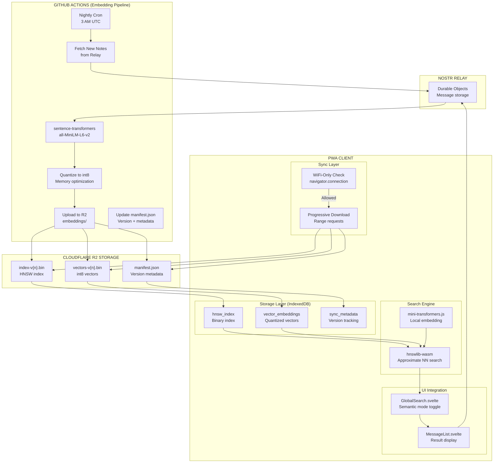
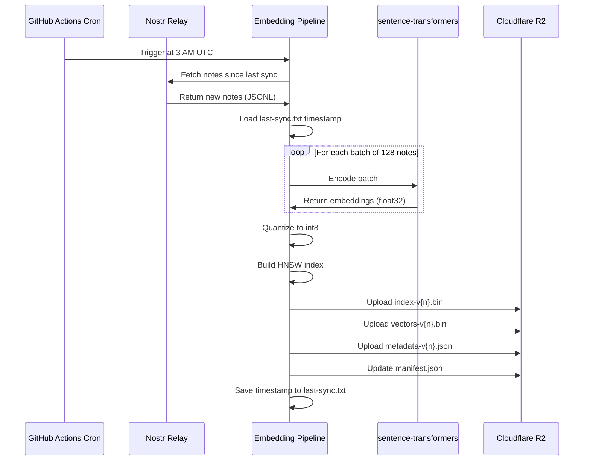
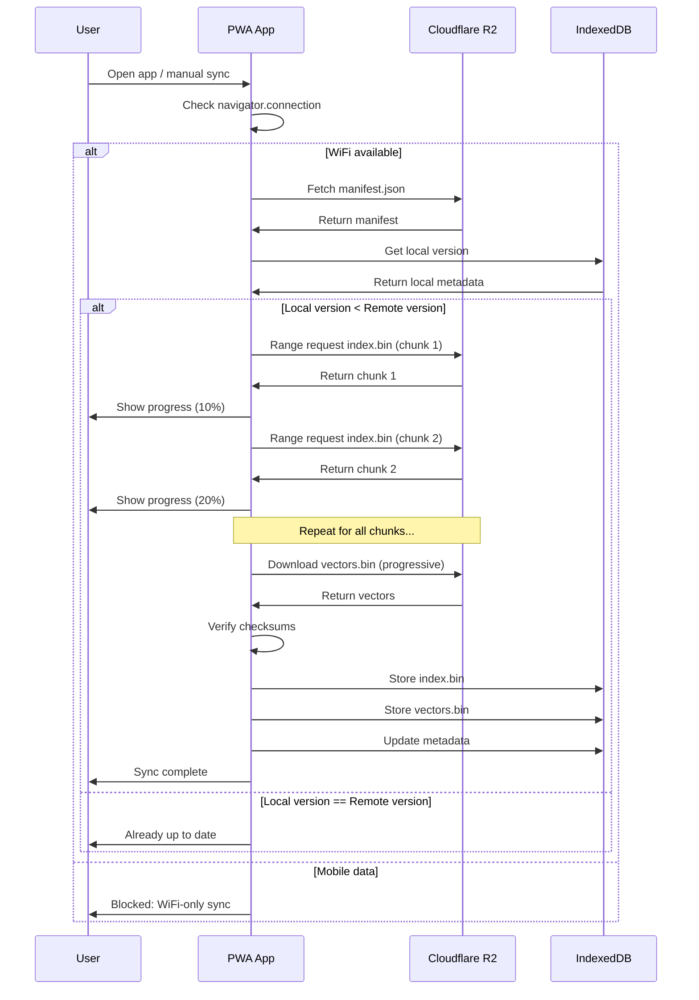
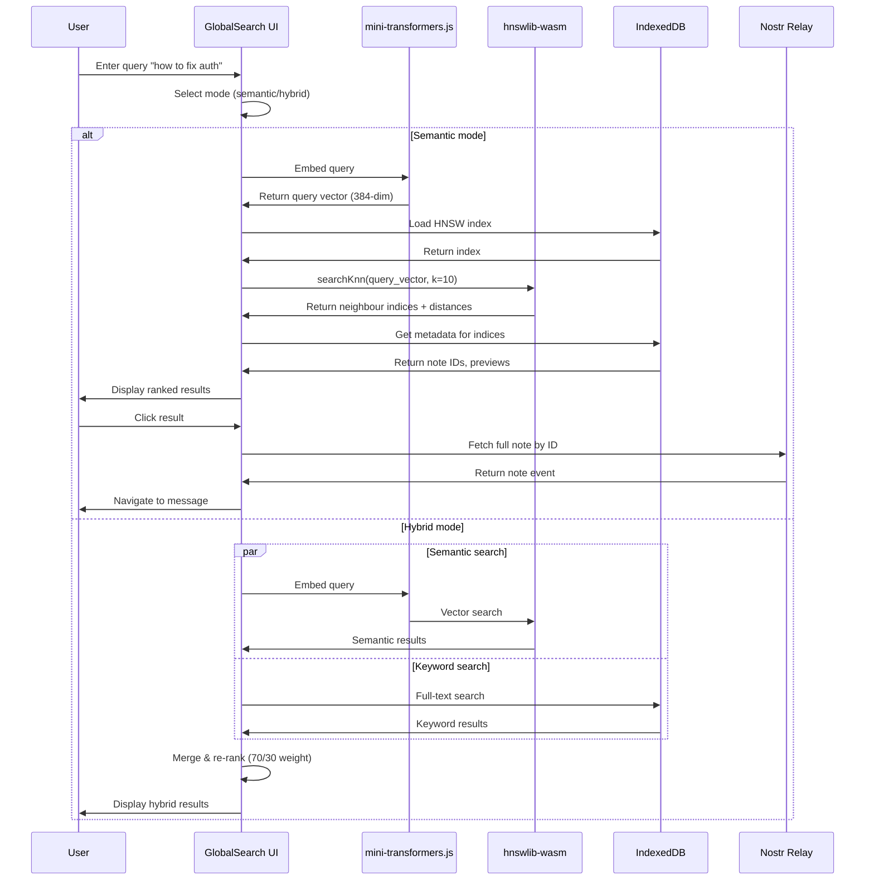

[← Back to Main README](../../README.md)

# Nostr-BBS - Semantic Vector Search Architecture

> **Phase:** Architecture Design - Semantic Search
> **Version:** 0.1.0-draft
> **Date:** 2024-12-14
> **[Back to Main README](../../README.md)**

---

## 1. System Overview



---

## 2. Component Architecture

### 2.1 Embedding Pipeline (GitHub Actions)

```yaml
# .github/workflows/build-embeddings.yml
name: Build Semantic Search Embeddings

on:
  schedule:
    # Run nightly at 3 AM UTC (off-peak hours)
    - cron: '0 3 * * *'
  workflow_dispatch:
    inputs:
      full_rebuild:
        description: 'Force full rebuild (ignore incremental)'
        required: false
        default: 'false'
        type: boolean

env:
  NODE_VERSION: '20'
  PYTHON_VERSION: '3.11'
  MODEL_NAME: 'sentence-transformers/all-MiniLM-L6-v2'
  EMBEDDING_DIM: 384
  R2_BUCKET: 'Nostr-BBS-embeddings'
  R2_PREFIX: 'embeddings'

jobs:
  build-embeddings:
    name: Build and Upload Embeddings
    runs-on: ubuntu-latest

    steps:
      - name: Checkout code
        uses: actions/checkout@v4

      - name: Setup Python
        uses: actions/setup-python@v5
        with:
          python-version: ${{ env.PYTHON_VERSION }}
          cache: 'pip'

      - name: Install Python dependencies
        run: |
          pip install sentence-transformers numpy hnswlib websockets nostr-sdk

      - name: Fetch new notes from relay
        env:
          RELAY_URL: ${{ secrets.RELAY_URL }}
        run: |
          python scripts/fetch-notes.py \
            --relay "$RELAY_URL" \
            --output data/notes.jsonl \
            --since-file data/last-sync.txt

      - name: Generate embeddings
        run: |
          python scripts/generate-embeddings.py \
            --input data/notes.jsonl \
            --output data/embeddings.npy \
            --model "$MODEL_NAME" \
            --batch-size 128

      - name: Quantize embeddings
        run: |
          python scripts/quantize-embeddings.py \
            --input data/embeddings.npy \
            --output data/embeddings-int8.npy \
            --precision int8

      - name: Build HNSW index
        run: |
          python scripts/build-hnsw.py \
            --vectors data/embeddings-int8.npy \
            --output data/index.bin \
            --ef-construction 200 \
            --M 16

      - name: Update manifest
        run: |
          python scripts/update-manifest.py \
            --version $(date +%s) \
            --notes-count $(wc -l < data/notes.jsonl) \
            --output data/manifest.json

      - name: Upload to Cloudflare R2
        env:
          R2_ACCOUNT_ID: ${{ secrets.CLOUDFLARE_ACCOUNT_ID }}
          R2_ACCESS_KEY_ID: ${{ secrets.R2_ACCESS_KEY_ID }}
          R2_SECRET_ACCESS_KEY: ${{ secrets.R2_SECRET_ACCESS_KEY }}
        run: |
          pip install boto3
          python scripts/upload-to-r2.py \
            --bucket "$R2_BUCKET" \
            --prefix "$R2_PREFIX" \
            --index data/index.bin \
            --vectors data/embeddings-int8.npy \
            --manifest data/manifest.json

      - name: Cleanup
        run: |
          rm -rf data/embeddings.npy data/embeddings-int8.npy
          echo $(date +%s) > data/last-sync.txt

      - name: Deployment summary
        run: |
          echo "## Embedding Pipeline Summary" >> $GITHUB_STEP_SUMMARY
          echo "" >> $GITHUB_STEP_SUMMARY
          echo "- **Notes processed**: $(wc -l < data/notes.jsonl)" >> $GITHUB_STEP_SUMMARY
          echo "- **Embedding dimension**: $EMBEDDING_DIM" >> $GITHUB_STEP_SUMMARY
          echo "- **Index version**: $(date +%s)" >> $GITHUB_STEP_SUMMARY
          echo "- **R2 bucket**: $R2_BUCKET/$R2_PREFIX" >> $GITHUB_STEP_SUMMARY
```

**Pipeline Scripts Architecture:**

```typescript
// scripts/fetch-notes.py
interface FetchNotesConfig {
  relay_url: string;           // WSS relay endpoint
  output_path: string;          // Output JSONL file
  since_timestamp?: number;     // Incremental fetch
  max_notes?: number;           // Limit for testing
  event_kinds: number[];        // [1, 9] for messages
}

// scripts/generate-embeddings.py
interface EmbeddingConfig {
  model: string;                // sentence-transformers model
  batch_size: number;           // GPU batch size
  max_length: number;           // Token limit (256)
  normalize: boolean;           // L2 normalization
}

// scripts/build-hnsw.py
interface HNSWConfig {
  ef_construction: number;      // 200 (build quality)
  M: number;                    // 16 (neighbors per node)
  max_elements: number;         // Dynamic based on corpus
  distance: 'cosine' | 'l2';   // cosine for normalized
}
```

### 2.2 Storage Layer (Cloudflare R2)

```typescript
// Storage Schema
interface R2EmbeddingStore {
  // Directory structure
  structure: {
    bucket: "Nostr-BBS-embeddings";
    paths: {
      manifest: "embeddings/manifest.json";
      index: "embeddings/index-v{version}.bin";
      vectors: "embeddings/vectors-v{version}.bin";
      metadata: "embeddings/metadata-v{version}.json";
    };
  };

  // Manifest file
  manifest: {
    version: number;              // Unix timestamp
    last_updated: string;         // ISO 8601
    note_count: number;
    embedding_dim: 384;
    quantization: "int8";
    model: "sentence-transformers/all-MiniLM-L6-v2";
    files: {
      index: {
        url: string;              // Full R2 public URL
        size_bytes: number;
        checksum_sha256: string;
      };
      vectors: {
        url: string;
        size_bytes: number;
        checksum_sha256: string;
      };
      metadata: {
        url: string;
        size_bytes: number;
        checksum_sha256: string;
      };
    };
    hnsw_params: {
      ef_construction: number;
      M: number;
      max_elements: number;
    };
  };

  // Metadata file (note ID to vector index mapping)
  metadata: {
    note_mappings: Array<{
      note_id: string;            // Nostr event ID
      vector_index: number;       // Index in vectors array
      channel_id: string;
      author_pubkey: string;
      created_at: number;
      content_preview: string;    // First 100 chars
    }>;
  };
}

// Versioning Strategy
interface VersionStrategy {
  // Incremental updates
  incremental: {
    frequency: "nightly";
    strategy: "append-only";        // New vectors appended
    rebuild_threshold: 10000;       // Full rebuild after 10k new
  };

  // Full rebuilds
  full_rebuild: {
    frequency: "weekly";            // Sunday 3 AM
    triggers: [
      "manual_workflow_dispatch",
      "note_count > 100000",
      "index_fragmentation > 0.3"
    ];
  };

  // Version retention
  retention: {
    keep_versions: 3;               // Last 3 versions
    cleanup_cron: "0 4 * * 0";     // Sunday 4 AM
  };
}
```

### 2.3 Client Sync Layer (PWA)

```typescript
// src/lib/utils/semantic-sync.ts
import { db } from '$lib/db';

interface SyncConfig {
  wifi_only: boolean;
  auto_sync: boolean;
  chunk_size: number;           // 5MB chunks for progressive
  max_storage: number;          // 100MB IndexedDB limit
}

/**
 * Check if sync is allowed based on network conditions
 */
async function canSync(config: SyncConfig): Promise<boolean> {
  if (!config.wifi_only) return true;

  // Network Information API
  const connection = (navigator as any).connection;
  if (!connection) {
    // Fallback: assume WiFi on desktop
    return !navigator.maxTouchPoints;
  }

  // Check connection type
  const type = connection.effectiveType;
  const isWiFi = type === '4g' || type === 'wifi';
  const isMetered = connection.saveData === true;

  return isWiFi && !isMetered;
}

/**
 * Fetch and cache manifest from R2
 */
async function fetchManifest(): Promise<R2Manifest> {
  const url = 'https://embeddings.Nostr-BBS.com/embeddings/manifest.json';
  const response = await fetch(url, { cache: 'no-store' });

  if (!response.ok) {
    throw new Error(`Manifest fetch failed: ${response.status}`);
  }

  return await response.json();
}

/**
 * Check if local cache is outdated
 */
async function needsUpdate(manifest: R2Manifest): Promise<boolean> {
  const localMeta = await db.vectorMetadata.get('current');

  if (!localMeta) return true;

  return manifest.version > localMeta.version;
}

/**
 * Download file with progress tracking using Range requests
 */
async function downloadWithProgress(
  url: string,
  chunkSize: number,
  onProgress: (loaded: number, total: number) => void
): Promise<ArrayBuffer> {
  // Get file size
  const headResponse = await fetch(url, { method: 'HEAD' });
  const totalSize = parseInt(headResponse.headers.get('content-length') || '0');

  const chunks: Uint8Array[] = [];
  let downloaded = 0;

  while (downloaded < totalSize) {
    const start = downloaded;
    const end = Math.min(downloaded + chunkSize - 1, totalSize - 1);

    const response = await fetch(url, {
      headers: {
        'Range': `bytes=${start}-${end}`
      }
    });

    const chunk = await response.arrayBuffer();
    chunks.push(new Uint8Array(chunk));
    downloaded += chunk.byteLength;

    onProgress(downloaded, totalSize);

    // Yield to UI thread
    await new Promise(resolve => setTimeout(resolve, 0));
  }

  // Concatenate chunks
  const result = new Uint8Array(totalSize);
  let offset = 0;
  for (const chunk of chunks) {
    result.set(chunk, offset);
    offset += chunk.length;
  }

  return result.buffer;
}

/**
 * Main sync function
 */
export async function syncEmbeddings(
  config: SyncConfig,
  onProgress?: (stage: string, progress: number) => void
): Promise<void> {
  // Check network conditions
  if (!await canSync(config)) {
    throw new Error('Sync blocked: not on WiFi');
  }

  // Fetch manifest
  onProgress?.('manifest', 0);
  const manifest = await fetchManifest();

  // Check if update needed
  if (!await needsUpdate(manifest)) {
    onProgress?.('complete', 100);
    return;
  }

  // Download HNSW index
  onProgress?.('index', 0);
  const indexBuffer = await downloadWithProgress(
    manifest.files.index.url,
    config.chunk_size,
    (loaded, total) => onProgress?.('index', (loaded / total) * 100)
  );

  // Download vectors
  onProgress?.('vectors', 0);
  const vectorsBuffer = await downloadWithProgress(
    manifest.files.vectors.url,
    config.chunk_size,
    (loaded, total) => onProgress?.('vectors', (loaded / total) * 100)
  );

  // Download metadata
  onProgress?.('metadata', 0);
  const metadataResponse = await fetch(manifest.files.metadata.url);
  const metadata = await metadataResponse.json();

  // Verify checksums
  onProgress?.('verify', 0);
  await verifyChecksum(indexBuffer, manifest.files.index.checksum_sha256);
  await verifyChecksum(vectorsBuffer, manifest.files.vectors.checksum_sha256);

  // Store in IndexedDB
  onProgress?.('store', 0);
  await db.storeVectorIndex(indexBuffer);
  await db.storeVectors(vectorsBuffer);
  await db.storeVectorMetadata({
    version: manifest.version,
    note_count: manifest.note_count,
    last_updated: manifest.last_updated,
    metadata: metadata
  });

  onProgress?.('complete', 100);
}

/**
 * Verify SHA-256 checksum
 */
async function verifyChecksum(
  buffer: ArrayBuffer,
  expectedHash: string
): Promise<void> {
  const hashBuffer = await crypto.subtle.digest('SHA-256', buffer);
  const hashArray = Array.from(new Uint8Array(hashBuffer));
  const hashHex = hashArray.map(b => b.toString(16).padStart(2, '0')).join('');

  if (hashHex !== expectedHash) {
    throw new Error(`Checksum mismatch: expected ${expectedHash}, got ${hashHex}`);
  }
}
```

### 2.4 Search Engine (Client)

```typescript
// src/lib/utils/semantic-search.ts
import * as hnswlib from 'hnswlib-wasm';
import { AutoModel, AutoTokenizer } from '@xenova/transformers';
import { db } from '$lib/db';

interface SearchEngine {
  index: hnswlib.HierarchicalNSW;
  embedder: any;
  tokenizer: any;
  metadata: VectorMetadata;
}

let searchEngine: SearchEngine | null = null;

/**
 * Initialize search engine
 */
export async function initSearchEngine(): Promise<void> {
  if (searchEngine) return;

  // Load HNSW index from IndexedDB
  const indexBuffer = await db.getVectorIndex();
  const index = hnswlib.HierarchicalNSW.loadIndex(indexBuffer);

  // Load embedding model (cached in browser)
  const modelName = 'Xenova/all-MiniLM-L6-v2';
  const [embedder, tokenizer] = await Promise.all([
    AutoModel.from_pretrained(modelName),
    AutoTokenizer.from_pretrained(modelName)
  ]);

  // Load metadata
  const metadata = await db.getVectorMetadata();

  searchEngine = {
    index,
    embedder,
    tokenizer,
    metadata
  };
}

/**
 * Generate embedding for query
 */
async function embedQuery(query: string): Promise<Float32Array> {
  if (!searchEngine) {
    throw new Error('Search engine not initialized');
  }

  const { embedder, tokenizer } = searchEngine;

  // Tokenize
  const inputs = await tokenizer(query, {
    padding: true,
    truncation: true,
    max_length: 256
  });

  // Generate embedding
  const output = await embedder(inputs);
  const embedding = output.last_hidden_state.mean(1).data;

  // Normalize (cosine similarity)
  const norm = Math.sqrt(embedding.reduce((sum, val) => sum + val * val, 0));
  return embedding.map(val => val / norm);
}

/**
 * Search for similar notes
 */
export async function semanticSearch(
  query: string,
  options: {
    k?: number;              // Number of results (default: 10)
    ef?: number;             // Search quality (default: 50)
    threshold?: number;      // Min similarity (default: 0.5)
    channel_id?: string;     // Filter by channel
    author?: string;         // Filter by author
  } = {}
): Promise<SemanticSearchResult[]> {
  if (!searchEngine) {
    await initSearchEngine();
  }

  const {
    k = 10,
    ef = 50,
    threshold = 0.5,
    channel_id,
    author
  } = options;

  // Generate query embedding
  const queryVector = await embedQuery(query);

  // Search HNSW index
  searchEngine!.index.setEf(ef);
  const { neighbors, distances } = searchEngine!.index.searchKnn(queryVector, k * 2);

  // Convert distances to similarities (cosine)
  const similarities = distances.map(d => 1 - d);

  // Map to note metadata and filter
  const results: SemanticSearchResult[] = [];

  for (let i = 0; i < neighbors.length; i++) {
    const vectorIndex = neighbors[i];
    const similarity = similarities[i];

    if (similarity < threshold) continue;

    const noteMetadata = searchEngine!.metadata.metadata.note_mappings[vectorIndex];

    // Apply filters
    if (channel_id && noteMetadata.channel_id !== channel_id) continue;
    if (author && noteMetadata.author_pubkey !== author) continue;

    results.push({
      note_id: noteMetadata.note_id,
      channel_id: noteMetadata.channel_id,
      author_pubkey: noteMetadata.author_pubkey,
      created_at: noteMetadata.created_at,
      content_preview: noteMetadata.content_preview,
      similarity_score: similarity,
      vector_index: vectorIndex
    });

    if (results.length >= k) break;
  }

  return results;
}

/**
 * Hybrid search: semantic + keyword
 */
export async function hybridSearch(
  query: string,
  options: {
    semantic_weight?: number;    // 0-1 (default: 0.7)
    keyword_weight?: number;     // 0-1 (default: 0.3)
    k?: number;
  } = {}
): Promise<HybridSearchResult[]> {
  const {
    semantic_weight = 0.7,
    keyword_weight = 0.3,
    k = 10
  } = options;

  // Run both searches in parallel
  const [semanticResults, keywordResults] = await Promise.all([
    semanticSearch(query, { k: k * 2 }),
    searchMessages(query, { limit: k * 2 })  // Existing keyword search
  ]);

  // Merge and score
  const scoreMap = new Map<string, number>();

  semanticResults.forEach((result, index) => {
    const score = (1 - index / semanticResults.length) * semantic_weight;
    scoreMap.set(result.note_id, (scoreMap.get(result.note_id) || 0) + score);
  });

  keywordResults.results.forEach((result, index) => {
    const score = (1 - index / keywordResults.results.length) * keyword_weight;
    scoreMap.set(result.messageId, (scoreMap.get(result.messageId) || 0) + score);
  });

  // Sort by combined score
  const combined = Array.from(scoreMap.entries())
    .sort((a, b) => b[1] - a[1])
    .slice(0, k)
    .map(([note_id, score]) => ({
      note_id,
      combined_score: score
    }));

  return combined;
}

/**
 * Search result interface
 */
interface SemanticSearchResult {
  note_id: string;
  channel_id: string;
  author_pubkey: string;
  created_at: number;
  content_preview: string;
  similarity_score: number;
  vector_index: number;
}

interface HybridSearchResult {
  note_id: string;
  combined_score: number;
}
```

### 2.5 UI Integration

```svelte
<!-- src/lib/components/chat/GlobalSearch.svelte (Enhanced) -->
<script lang="ts">
  import { semanticSearch, hybridSearch, initSearchEngine } from '$lib/utils/semantic-search';
  import { searchMessages } from '$lib/utils/searchIndex';
  import type { SemanticSearchResult } from '$lib/utils/semantic-search';

  export let isOpen = false;
  export let onClose: () => void;

  let query = '';
  let searchMode: 'keyword' | 'semantic' | 'hybrid' = 'keyword';
  let semanticResults: SemanticSearchResult[] = [];
  let keywordResults: SearchResult[] = [];
  let hybridResults: HybridSearchResult[] = [];
  let loading = false;
  let semanticEngineReady = false;

  // Initialize semantic search engine on mount
  onMount(async () => {
    try {
      await initSearchEngine();
      semanticEngineReady = true;
    } catch (error) {
      console.warn('Semantic search not available:', error);
      // Graceful degradation to keyword-only
    }
  });

  async function performSearch() {
    if (query.trim().length < 2) return;

    loading = true;
    try {
      switch (searchMode) {
        case 'keyword':
          const response = await searchMessages(query, { limit: 50 });
          keywordResults = response.results;
          break;

        case 'semantic':
          if (!semanticEngineReady) {
            throw new Error('Semantic search not ready');
          }
          semanticResults = await semanticSearch(query, { k: 50 });
          break;

        case 'hybrid':
          if (!semanticEngineReady) {
            // Fallback to keyword
            searchMode = 'keyword';
            await performSearch();
            return;
          }
          hybridResults = await hybridSearch(query, { k: 50 });
          break;
      }
    } catch (error) {
      console.error('Search failed:', error);
    } finally {
      loading = false;
    }
  }
</script>

<Modal {onClose} title="Search Messages" size="large">
  <div class="search-container">
    <div class="search-mode-toggle">
      <button
        class:active={searchMode === 'keyword'}
        on:click={() => searchMode = 'keyword'}
      >
        Keyword
      </button>
      <button
        class:active={searchMode === 'semantic'}
        disabled={!semanticEngineReady}
        on:click={() => searchMode = 'semantic'}
      >
        Semantic {!semanticEngineReady ? '(syncing...)' : ''}
      </button>
      <button
        class:active={searchMode === 'hybrid'}
        disabled={!semanticEngineReady}
        on:click={() => searchMode = 'hybrid'}
      >
        Hybrid {!semanticEngineReady ? '(syncing...)' : ''}
      </button>
    </div>

    <input
      type="text"
      bind:value={query}
      on:input={handleInput}
      placeholder={
        searchMode === 'semantic'
          ? 'Search by meaning (e.g., "how to fix authentication errors")'
          : 'Search messages...'
      }
      class="search-input"
      autofocus
    />

    {#if semanticResults.length > 0}
      <div class="results">
        {#each semanticResults as result}
          <div class="result-item">
            <div class="similarity-badge">
              {(result.similarity_score * 100).toFixed(0)}% match
            </div>
            <div class="content-preview">
              {result.content_preview}
            </div>
            <button on:click={() => navigateToNote(result.note_id)}>
              View Message
            </button>
          </div>
        {/each}
      </div>
    {/if}
  </div>
</Modal>
```

---

## 3. Data Flow Diagrams

### 3.1 Embedding Generation Flow



### 3.2 Client Sync Flow



### 3.3 Search Flow



---

## 4. Technology Stack

### 4.1 Embedding Pipeline (GitHub Actions)

| Layer | Technology | Version | Rationale |
|-------|------------|---------|-----------|
| Runtime | Python | 3.11 | sentence-transformers ecosystem |
| Embedding Model | sentence-transformers/all-MiniLM-L6-v2 | - | 384-dim, 120MB, good speed/quality |
| Vector Index | hnswlib (Python) | 0.8.0 | Fast approximate nearest neighbour |
| Quantization | NumPy | 1.26 | int8 conversion (4x size reduction) |
| Nostr Client | nostr-sdk (Python) | 0.24 | Relay connection for note fetching |
| Storage Client | boto3 | 1.34 | S3-compatible R2 upload |

### 4.2 Storage Layer (Cloudflare R2)

| Component | Technology | Rationale |
|-----------|------------|-----------|
| Object Storage | Cloudflare R2 | S3-compatible, no egress fees |
| CDN | Cloudflare CDN | Fast global distribution |
| Access Control | Public read, API write | Open read, secure upload via GitHub |

### 4.3 Client Layer (PWA)

| Layer | Technology | Version | Rationale |
|-------|------------|---------|-----------|
| Vector Search | hnswlib-wasm | 0.3.0 | WASM port, fast client-side search |
| Embedding | @xenova/transformers | 2.17 | ONNX runtime, browser-compatible |
| Model | Xenova/all-MiniLM-L6-v2 | - | Same as pipeline, 120MB cached |
| Storage | IndexedDB (Dexie) | 3.2 | Large binary storage |
| Network Check | Network Information API | - | WiFi detection |

---

## 5. Storage Schema

### 5.1 IndexedDB Schema Extension

```typescript
// Extension to existing db.ts
interface Nostr-BBSDB {
  // ... existing tables ...

  // Vector embeddings storage
  vector_embeddings: {
    id: 'current';              // Single row
    version: number;            // Manifest version
    vectors: ArrayBuffer;       // vectors-v{n}.bin (int8)
    last_updated: number;       // Unix timestamp
  };

  // HNSW index storage
  hnsw_index: {
    id: 'current';
    version: number;
    index: ArrayBuffer;         // index-v{n}.bin
    params: {
      ef_construction: number;
      M: number;
      max_elements: number;
    };
  };

  // Vector metadata (note ID to index mapping)
  vector_metadata: {
    id: 'current';
    version: number;
    note_count: number;
    last_updated: string;
    metadata: {
      note_mappings: Array<{
        note_id: string;
        vector_index: number;
        channel_id: string;
        author_pubkey: string;
        created_at: number;
        content_preview: string;
      }>;
    };
  };

  // Sync state
  sync_metadata: {
    id: 'current';
    last_sync: number;          // Unix timestamp
    next_check: number;
    sync_enabled: boolean;
    wifi_only: boolean;
  };
}
```

### 5.2 R2 Bucket Structure

```
Nostr-BBS-embeddings/
├── embeddings/
│   ├── manifest.json                  # Current version pointer
│   ├── index-v1702512000.bin         # HNSW index (v1)
│   ├── vectors-v1702512000.bin       # Quantized vectors (v1)
│   ├── metadata-v1702512000.json     # Note mappings (v1)
│   ├── index-v1702598400.bin         # HNSW index (v2)
│   ├── vectors-v1702598400.bin       # Quantized vectors (v2)
│   ├── metadata-v1702598400.json     # Note mappings (v2)
│   └── ...                            # Retain last 3 versions
```

---

## 6. API Contracts

### 6.1 R2 Manifest API

```typescript
// GET https://embeddings.Nostr-BBS.com/embeddings/manifest.json
interface ManifestResponse {
  version: number;                      // 1702512000 (Unix timestamp)
  last_updated: string;                 // "2024-12-14T03:00:00Z"
  note_count: number;                   // 45230
  embedding_dim: 384;
  quantization: "int8";
  model: "sentence-transformers/all-MiniLM-L6-v2";

  files: {
    index: {
      url: string;                      // "https://embeddings.Nostr-BBS.com/embeddings/index-v1702512000.bin"
      size_bytes: number;               // 12845760 (~12MB)
      checksum_sha256: string;          // "a3f2..."
    };
    vectors: {
      url: string;
      size_bytes: number;               // 17368320 (~17MB)
      checksum_sha256: string;
    };
    metadata: {
      url: string;
      size_bytes: number;               // 2456780 (~2.5MB)
      checksum_sha256: string;
    };
  };

  hnsw_params: {
    ef_construction: 200;
    M: 16;
    max_elements: 45230;
  };
}
```

### 6.2 Semantic Search API (Client-side)

```typescript
// src/lib/utils/semantic-search.ts

/**
 * Search for semantically similar notes
 * @param query - Natural language query
 * @param options - Search parameters
 * @returns Array of search results with similarity scores
 */
export async function semanticSearch(
  query: string,
  options?: {
    k?: number;              // Number of results (default: 10)
    ef?: number;             // Search quality 10-500 (default: 50)
    threshold?: number;      // Min similarity 0-1 (default: 0.5)
    channel_id?: string;     // Filter by channel
    author?: string;         // Filter by author
    date_range?: {           // Filter by date
      start: number;
      end: number;
    };
  }
): Promise<SemanticSearchResult[]>;

interface SemanticSearchResult {
  note_id: string;                      // Nostr event ID
  channel_id: string;
  author_pubkey: string;
  created_at: number;                   // Unix timestamp
  content_preview: string;              // First 100 chars
  similarity_score: number;             // 0-1 (cosine similarity)
  vector_index: number;                 // Internal index
}

/**
 * Hybrid search combining semantic and keyword
 * @param query - Search query
 * @param options - Weighting options
 * @returns Ranked results
 */
export async function hybridSearch(
  query: string,
  options?: {
    semantic_weight?: number;           // 0-1 (default: 0.7)
    keyword_weight?: number;            // 0-1 (default: 0.3)
    k?: number;                         // Results (default: 10)
  }
): Promise<HybridSearchResult[]>;

interface HybridSearchResult {
  note_id: string;
  combined_score: number;               // Weighted average
  semantic_score?: number;
  keyword_score?: number;
}
```

---

## 7. Error Handling Strategy

### 7.1 Pipeline Errors (GitHub Actions)

```yaml
# Error scenarios and recovery
pipeline_errors:
  relay_connection_failed:
    action: "Retry with exponential backoff (3 attempts)"
    notification: "GitHub Actions log + Slack alert"
    fallback: "Skip update, keep previous version"

  embedding_generation_failed:
    action: "Retry with smaller batch size"
    notification: "GitHub Actions log"
    fallback: "Process partial batch, mark incomplete"

  r2_upload_failed:
    action: "Retry upload 3 times"
    notification: "GitHub Actions log + Slack alert"
    fallback: "Keep previous version, manual intervention"

  checksum_mismatch:
    action: "Regenerate file"
    notification: "GitHub Actions log"
    fallback: "Abort deployment, keep previous"
```

### 7.2 Client Sync Errors

```typescript
// src/lib/utils/semantic-sync.ts

class SyncError extends Error {
  constructor(
    public code: SyncErrorCode,
    public message: string,
    public recoverable: boolean
  ) {
    super(message);
  }
}

enum SyncErrorCode {
  NETWORK_OFFLINE = 'network_offline',
  NOT_ON_WIFI = 'not_on_wifi',
  MANIFEST_FETCH_FAILED = 'manifest_fetch_failed',
  CHECKSUM_MISMATCH = 'checksum_mismatch',
  STORAGE_QUOTA_EXCEEDED = 'storage_quota_exceeded',
  CORRUPTED_DATA = 'corrupted_data'
}

const errorHandlers: Record<SyncErrorCode, (error: SyncError) => void> = {
  [SyncErrorCode.NETWORK_OFFLINE]: (error) => {
    // User notification: "You're offline. Sync will resume when connected."
    // Action: Queue retry on 'online' event
    scheduleRetryOnOnline();
  },

  [SyncErrorCode.NOT_ON_WIFI]: (error) => {
    // User notification: "Waiting for WiFi connection to sync embeddings"
    // Action: Poll connection type every 30s
    scheduleWiFiCheck();
  },

  [SyncErrorCode.MANIFEST_FETCH_FAILED]: (error) => {
    // User notification: "Sync temporarily unavailable. Using local search."
    // Action: Retry after 5 min, fallback to keyword search
    fallbackToKeywordSearch();
    scheduleRetry(300_000); // 5 min
  },

  [SyncErrorCode.CHECKSUM_MISMATCH]: (error) => {
    // User notification: "Download verification failed. Retrying..."
    // Action: Clear partial download, retry
    clearPartialDownload();
    retryDownload();
  },

  [SyncErrorCode.STORAGE_QUOTA_EXCEEDED]: (error) => {
    // User notification: "Not enough storage. Clear cache or disable semantic search."
    // Action: Show storage management UI
    showStorageManagementUI();
  },

  [SyncErrorCode.CORRUPTED_DATA]: (error) => {
    // User notification: "Local data corrupted. Re-downloading..."
    // Action: Clear all vector data, force re-sync
    clearVectorData();
    forceSyncFromScratch();
  }
};
```

### 7.3 Search Errors

```typescript
// src/lib/utils/semantic-search.ts

class SearchError extends Error {
  constructor(
    public code: SearchErrorCode,
    public message: string
  ) {
    super(message);
  }
}

enum SearchErrorCode {
  ENGINE_NOT_INITIALIZED = 'engine_not_initialized',
  MODEL_LOAD_FAILED = 'model_load_failed',
  QUERY_TOO_LONG = 'query_too_long',
  SEARCH_TIMEOUT = 'search_timeout'
}

export async function semanticSearchWithFallback(
  query: string,
  options?: SemanticSearchOptions
): Promise<SearchResult[]> {
  try {
    return await semanticSearch(query, options);
  } catch (error) {
    if (error instanceof SearchError) {
      switch (error.code) {
        case SearchErrorCode.ENGINE_NOT_INITIALIZED:
          // Fallback to keyword search
          console.warn('Semantic search unavailable, using keyword fallback');
          return await keywordSearchFallback(query);

        case SearchErrorCode.MODEL_LOAD_FAILED:
          // Retry initialization once
          await initSearchEngine();
          return await semanticSearch(query, options);

        case SearchErrorCode.QUERY_TOO_LONG:
          // Truncate query
          const truncated = query.substring(0, 512);
          return await semanticSearch(truncated, options);

        case SearchErrorCode.SEARCH_TIMEOUT:
          // Reduce search quality (lower ef)
          return await semanticSearch(query, { ...options, ef: 10 });
      }
    }

    // Unknown error: fallback to keyword
    console.error('Search error:', error);
    return await keywordSearchFallback(query);
  }
}
```

---

## 8. Scaling Considerations

### 8.1 Corpus Growth

```yaml
scaling_strategy:
  current_assumptions:
    note_count: 50000
    embedding_size: 384 * 1 byte (int8) = 384 bytes
    index_overhead: ~30% of vector size

  projected_storage:
    vectors:
      50k_notes: 18.3 MB        # 50000 * 384
      100k_notes: 36.6 MB
      500k_notes: 183 MB
      1M_notes: 366 MB

    hnsw_index:
      50k_notes: ~24 MB         # 18.3 * 1.3
      100k_notes: ~48 MB
      500k_notes: ~238 MB
      1M_notes: ~476 MB

    total_client_storage:
      50k_notes: ~42 MB
      100k_notes: ~85 MB
      500k_notes: ~421 MB       # Exceeds 100MB mobile budget
      1M_notes: ~842 MB

  mitigation_strategies:
    strategy_1_channel_filtering:
      description: "Only download embeddings for user's joined channels"
      implementation: "Generate per-channel index files"
      storage_reduction: "70-90% (user in 5-10% of channels)"

    strategy_2_lazy_loading:
      description: "Load index incrementally (most recent first)"
      implementation: "Time-based index sharding (monthly)"
      storage_reduction: "Only load last 3 months (60-80% reduction)"

    strategy_3_quantization_upgrade:
      description: "Move from int8 to binary (1-bit) embeddings"
      implementation: "Use SimHash or Product Quantization"
      storage_reduction: "8x reduction (384 bytes → 48 bytes)"

    strategy_4_server_side_search:
      description: "Move semantic search to Cloudflare Worker"
      implementation: "Vectorize beta or custom HNSW worker"
      storage_reduction: "100% (no client storage)"

  trigger_points:
    implement_strategy_1: "corpus > 100k notes"
    implement_strategy_2: "corpus > 500k notes"
    implement_strategy_3: "corpus > 1M notes"
    evaluate_strategy_4: "corpus > 5M notes OR client complaints"
```

### 8.2 Query Performance

```yaml
performance_benchmarks:
  target_latency:
    embedding_generation: "< 100ms (client-side)"
    vector_search: "< 50ms (HNSW)"
    metadata_lookup: "< 20ms (IndexedDB)"
    total_search_time: "< 200ms (p95)"

  optimization_techniques:
    technique_1_model_caching:
      description: "Cache ONNX model in browser storage"
      impact: "First load: 2s → Subsequent: 100ms"

    technique_2_wasm_simd:
      description: "Use WebAssembly SIMD for vector ops"
      impact: "Search: 200ms → 50ms"
      requirement: "Chrome 91+, Firefox 89+"

    technique_3_web_workers:
      description: "Run embedding in background thread"
      impact: "UI blocking: 0ms (async)"

    technique_4_index_warming:
      description: "Preload index on app start"
      impact: "First search: 500ms → 50ms"

  monitoring:
    metrics:
      - "search_latency_p50"
      - "search_latency_p95"
      - "search_latency_p99"
      - "embedding_gen_time"
      - "cache_hit_rate"

    alerts:
      - condition: "p95 > 500ms"
        action: "Investigate slow searches, consider degrading quality"
      - condition: "cache_hit_rate < 80%"
        action: "Increase browser cache size"
```

### 8.3 Infrastructure Costs

```yaml
cost_analysis:
  github_actions:
    compute: "Free tier (2000 min/month)"
    expected_usage: "~15 min/day = 450 min/month"
    cost: "$0"

  cloudflare_r2:
    storage:
      50k_notes: "~50 MB"
      100k_notes: "~100 MB"
      cost_per_gb: "$0.015/month"
      expected_cost: "$0.01/month"

    requests:
      class_a_writes: "1/day = 30/month"
      class_b_reads: "1000 users * 2/month = 2000/month"
      cost: "$0 (within free tier)"

    egress:
      data_transfer: "1000 users * 50 MB = 50 GB/month"
      r2_egress_cost: "$0 (no egress fees)"

    total_r2: "< $1/month"

  cloudflare_pages:
    cost: "$0 (within free tier)"

  total_monthly_cost: "< $1"

  cost_scaling:
    at_10k_users:
      r2_storage: "$5"
      r2_requests: "$2"
      total: "$7/month"

    at_100k_users:
      r2_storage: "$15"
      r2_requests: "$20"
      total: "$35/month"

    mitigation:
      - "Enable Cloudflare Cache for R2 endpoints (reduce requests)"
      - "Use CDN caching for manifest (reduce reads by 90%)"
      - "Incremental sync (reduce re-downloads)"
```

---

## 9. Integration Points

### 9.1 GlobalSearch Component

```typescript
// src/lib/components/chat/GlobalSearch.svelte
// Integration changes:

// 1. Add mode toggle
let searchMode: 'keyword' | 'semantic' | 'hybrid' = 'keyword';

// 2. Check semantic availability
let semanticAvailable = false;
onMount(async () => {
  const meta = await db.vectorMetadata.get('current');
  semanticAvailable = !!meta;
});

// 3. Unified search interface
async function performSearch() {
  switch (searchMode) {
    case 'keyword':
      return await searchMessages(query, { limit: 50 });
    case 'semantic':
      return await semanticSearch(query, { k: 50 });
    case 'hybrid':
      return await hybridSearch(query, { k: 50 });
  }
}
```

### 9.2 MessageList Component

```typescript
// src/lib/components/chat/MessageList.svelte
// Integration changes:

// 1. Handle note IDs from semantic search
export let highlightNoteId: string | null = null;

// 2. Fetch notes by ID if not in cache
onMount(async () => {
  if (highlightNoteId) {
    const cached = await db.messages.get(highlightNoteId);
    if (!cached) {
      // Fetch from relay
      const event = await fetchEventById(highlightNoteId);
      // Scroll to message
      scrollToMessage(highlightNoteId);
    }
  }
});
```

### 9.3 Settings Panel

```svelte
<!-- src/lib/components/settings/PreferencesPanel.svelte -->
<script lang="ts">
  import { syncEmbeddings } from '$lib/utils/semantic-sync';

  let syncEnabled = true;
  let wifiOnly = true;
  let lastSync: Date | null = null;
  let syncProgress = 0;
  let syncing = false;

  async function handleSync() {
    syncing = true;
    try {
      await syncEmbeddings(
        { wifi_only: wifiOnly, auto_sync: syncEnabled, chunk_size: 5242880, max_storage: 104857600 },
        (stage, progress) => {
          syncProgress = progress;
          console.log(`Sync ${stage}: ${progress}%`);
        }
      );
      lastSync = new Date();
    } catch (error) {
      console.error('Sync failed:', error);
      alert(error.message);
    } finally {
      syncing = false;
    }
  }
</script>

<div class="semantic-search-settings">
  <h3>Semantic Search</h3>

  <label>
    <input type="checkbox" bind:checked={syncEnabled} />
    Enable semantic search
  </label>

  <label>
    <input type="checkbox" bind:checked={wifiOnly} disabled={!syncEnabled} />
    WiFi-only sync (recommended)
  </label>

  {#if lastSync}
    <p>Last synced: {lastSync.toLocaleString()}</p>
  {/if}

  <button on:click={handleSync} disabled={syncing || !syncEnabled}>
    {#if syncing}
      Syncing... {syncProgress.toFixed(0)}%
    {:else}
      Sync Now
    {/if}
  </button>

  <div class="storage-info">
    Storage used: {storageUsed.toFixed(1)} MB / 100 MB
    <button on:click={clearVectorCache}>Clear Cache</button>
  </div>
</div>
```

---

## 10. Future Enhancements

### 10.1 Phase 2: Advanced Features

```yaml
phase_2_features:
  feature_1_query_expansion:
    description: "Automatically expand queries with synonyms"
    implementation: "Use WordNet or GPT-3.5 for query rewriting"
    benefit: "Improved recall for vague queries"

  feature_2_personalized_ranking:
    description: "Learn user preferences for result ranking"
    implementation: "Click-through rate tracking + lightweight ML"
    benefit: "Better relevance for individual users"

  feature_3_multimodal_search:
    description: "Search images, links, reactions"
    implementation: "CLIP embeddings for images, URL text extraction"
    benefit: "Unified search across all content types"

  feature_4_temporal_search:
    description: "Natural language date filters (last week, yesterday)"
    implementation: "NLP date parsing + filter integration"
    benefit: "Easier time-based queries"
```

### 10.2 Phase 3: Cloudflare Vectorize Integration

```yaml
vectorize_migration:
  motivation:
    - "Offload client storage (no 100MB limit)"
    - "Faster search (dedicated vector infrastructure)"
    - "No model download (server-side embedding)"

  architecture:
    client:
      action: "Send query to Cloudflare Worker"

    worker:
      actions:
        - "Embed query with sentence-transformers (server)"
        - "Query Vectorize index"
        - "Return note IDs + scores"

    benefits:
      - "Zero client storage"
      - "Faster cold start (no model download)"
      - "Supports larger corpus (>1M notes)"

  timeline: "Evaluate when Vectorize exits beta (Q2 2025)"
```

---

*Next Phase: Implementation & Testing (08-implementation.md)*
