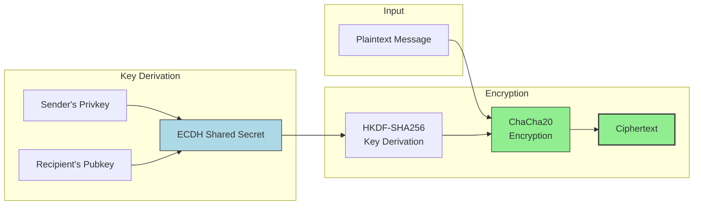
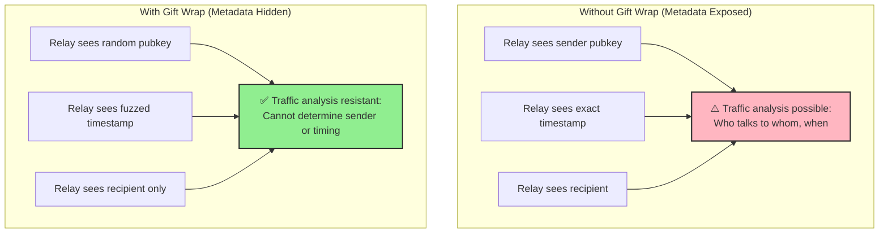
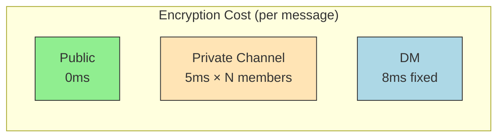
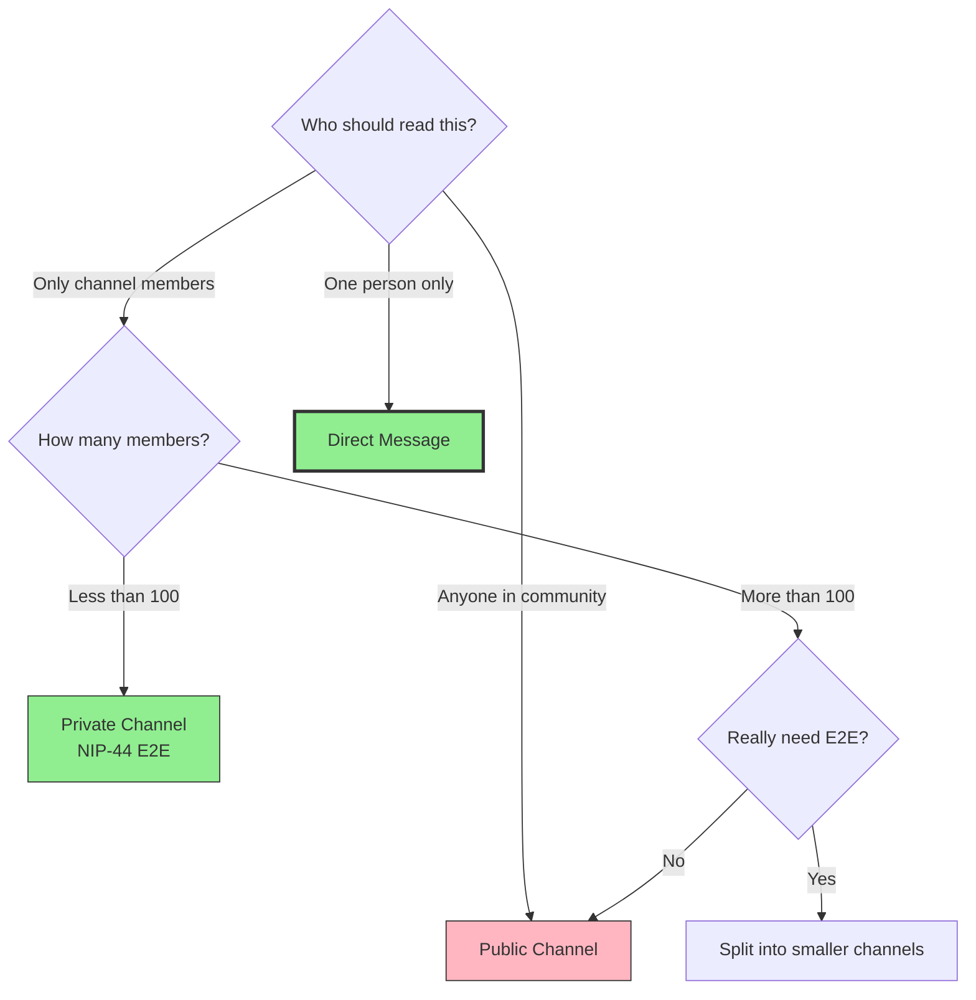

# Encryption Flows - Nostr-BBS Security Architecture

[← Back to Architecture](02-architecture.md) | [← Back to Documentation Hub](../INDEX.md)

**Version:** 1.0.0
**Date:** 2025-12-20
**Status:** Production

---

## Overview

This document provides detailed visual comparisons of encryption strategies used in Nostr-BBS. Understanding when and how to use each encryption method is critical for maintaining privacy and security while optimizing performance.

---

## 1. Encryption Strategy Comparison

### 1.1 Three Encryption Levels

Nostr-BBS implements three distinct encryption strategies depending on the use case:

```mermaid
flowchart TB
    subgraph Public["1️⃣ Public Channels (No E2E)"]
        P1[User writes message]
        P2[Sign with privkey]
        P3[Send plaintext over WSS]
        P4[Relay stores plaintext]
        P5[Recipients read plaintext]
    end

    subgraph E2E["2️⃣ Private Channels (NIP-44 E2E)"]
        E1[User writes message]
        E2[Encrypt with NIP-44]
        E3[Send encrypted blob over WSS]
        E4[Relay stores encrypted blob]
        E5[Recipients decrypt individually]
    end

    subgraph DM["3️⃣ Direct Messages (NIP-17 + NIP-59)"]
        D1[User writes DM]
        D2[Create sealed rumor]
        D3[Gift-wrap with random key]
        D4[Relay sees only wrapper]
        D5[Recipient unwraps and decrypts]
    end

    P1 --> P2 --> P3 --> P4 --> P5
    E1 --> E2 --> E3 --> E4 --> E5
    D1 --> D2 --> D3 --> D4 --> D5

    style P4 fill:#FFB6C1,stroke:#333
    style E4 fill:#90EE90,stroke:#333
    style D4 fill:#90EE90,stroke:#333,stroke-width:3px
```



**Legend:**
- **Red (Public):** Relay can read content (lowest privacy)
- **Green (E2E):** Relay sees encrypted blob (high privacy)
- **Bold Green (DM):** Relay sees encrypted blob + hidden metadata (highest privacy)

### 1.2 Security Comparison Table

| Feature | Public Channel | Private Channel (E2E) | Direct Message (NIP-17) |
|---------|---------------|----------------------|------------------------|
| **Encryption** | ❌ None (signed only) | ✅ NIP-44 E2E | ✅ NIP-44 E2E + NIP-59 wrapper |
| **Relay Can Read** | ✅ Yes | ❌ No | ❌ No |
| **Admin Can Read** | ✅ Yes | ⚠️ If member | ❌ Never |
| **Metadata Hidden** | ❌ All visible | ❌ Sender/time visible | ✅ Sender/time fuzzed |
| **Performance** | ⚡ Fast | ⚡ Fast | ⏱️ Moderate |
| **Use Case** | Public forums | Private courses | 1-on-1 messages |

---

## 2. Public Channel Flow (No E2E Encryption)

### 2.1 Architecture Diagram

```mermaid
sequenceDiagram
    participant U1 as User 1
    participant NDK1 as NDK (User 1)
    participant R as Relay
    participant NDK2 as NDK (User 2)
    participant U2 as User 2

    Note over U1,U2: Public Channel Message Flow

    U1->>NDK1: "Hello everyone!"
    NDK1->>NDK1: Build event (kind 9)
    NDK1->>NDK1: Add channel tag ('h')
    NDK1->>NDK1: Sign with privkey

    NDK1->>R: Publish plaintext event
    Note over R: Relay can read:<br/>"Hello everyone!"

    R->>R: Verify signature (NIP-01)
    R->>R: Check membership (NIP-29)
    R->>R: Store plaintext

    R->>NDK2: Broadcast to subscribers
    NDK2->>U2: Display "Hello everyone!"

    style R fill:#FFB6C1,stroke:#333,stroke-width:2px
```

**Text Alternative:** User 1 creates a message, NDK signs it but does not encrypt it. The relay receives plaintext, can read the content, verifies the signature, checks membership, and broadcasts to all subscribers. User 2 receives and displays the plaintext message.

### 2.2 Event Structure

```json
{
  "id": "a1b2c3d4...",
  "kind": 9,
  "pubkey": "user1_pubkey",
  "created_at": 1703001234,
  "tags": [
    ["h", "channel_id_abc"],
    ["p", "user2_pubkey"]
  ],
  "content": "Hello everyone!",  // ⚠️ PLAINTEXT - Relay can read
  "sig": "signature..."
}
```

**Security Properties:**
- ✅ **Integrity:** Signature ensures message not tampered
- ✅ **Authentication:** Signature proves sender identity
- ❌ **Confidentiality:** Relay and network can read content
- ❌ **Privacy:** Metadata fully visible (sender, time, channel)

**When to Use:**
- Public announcements
- Community forums
- Event channels
- General discussion rooms

---

## 3. Private Channel Flow (NIP-44 E2E Encryption)

### 3.1 Architecture Diagram

```mermaid
sequenceDiagram
    participant U1 as User 1
    participant NDK1 as NDK (User 1)
    participant R as Relay
    participant NDK2 as NDK (User 2)
    participant U2 as User 2

    Note over U1,U2: Private Channel E2E Encryption

    U1->>NDK1: "Secret course info"
    NDK1->>NDK1: Get channel member list
    NDK1->>NDK1: Derive shared secrets (NIP-44)

    loop For each member
        NDK1->>NDK1: Encrypt with member's pubkey
    end

    NDK1->>R: Publish encrypted event
    Note over R: Relay sees:<br/>"7gHj9K2l...encrypted_blob"

    R->>R: Verify signature
    R->>R: Check membership
    R->>R: Store encrypted blob

    R->>NDK2: Broadcast encrypted event
    NDK2->>NDK2: Decrypt with own privkey
    NDK2->>U2: Display "Secret course info"

    style R fill:#90EE90,stroke:#333,stroke-width:2px
    style NDK1 fill:#FFE4B5,stroke:#333
    style NDK2 fill:#FFE4B5,stroke:#333
```

**Text Alternative:** User 1 writes a message. NDK fetches the channel member list and derives a shared secret with each member using NIP-44. The message is encrypted for each recipient. The relay receives an encrypted blob, cannot read the content, but can verify the signature and membership. The relay broadcasts the encrypted event. User 2's NDK decrypts the blob using their private key and displays the plaintext.

### 3.2 Event Structure

```json
{
  "id": "x9y8z7w6...",
  "kind": 9,
  "pubkey": "user1_pubkey",
  "created_at": 1703001234,
  "tags": [
    ["h", "private_channel_xyz"],
    ["encrypted"]
  ],
  "content": "7gHj9K2lP3mN...encrypted_blob",  // ✅ ENCRYPTED - Relay cannot read
  "sig": "signature..."
}
```

**Security Properties:**
- ✅ **Integrity:** Signature + encryption
- ✅ **Authentication:** Signature proves sender
- ✅ **Confidentiality:** Relay cannot read content
- ⚠️ **Privacy:** Metadata visible (sender, time, channel)
- ⚠️ **Admin Access:** Admin in channel = admin has key

**When to Use:**
- Private courses
- Paid content channels
- Confidential team discussions
- Member-only communities

### 3.3 NIP-44 Encryption Process



**Algorithm Details:**
1. **Shared Secret:** ECDH(sender_privkey, recipient_pubkey)
2. **Key Derivation:** HKDF-SHA256(shared_secret, salt, info)
3. **Encryption:** ChaCha20(plaintext, key, nonce)
4. **Output:** Base64(nonce || ciphertext)

---

## 4. Direct Message Flow (NIP-17 + NIP-59)

### 4.1 Architecture Diagram (Maximum Privacy)

```mermaid
sequenceDiagram
    participant S as Sender
    participant NDK_S as NDK (Sender)
    participant R as Relay
    participant NDK_R as NDK (Recipient)
    participant REC as Recipient

    Note over S,REC: Gift-Wrapped Direct Message

    S->>NDK_S: "Private message to you"

    Note over NDK_S: Step 1: Create Sealed Rumor (NIP-17)
    NDK_S->>NDK_S: Build kind 14 event
    NDK_S->>NDK_S: Encrypt with NIP-44
    NDK_S->>NDK_S: Real timestamp
    NDK_S->>NDK_S: Real sender pubkey

    Note over NDK_S: Step 2: Gift Wrap (NIP-59)
    NDK_S->>NDK_S: Generate random sender key
    NDK_S->>NDK_S: Fuzz timestamp (±2 days)
    NDK_S->>NDK_S: Wrap in kind 1059

    NDK_S->>R: Publish gift-wrapped event
    Note over R: Relay sees:<br/>- Random pubkey (not real sender)<br/>- Fuzzed time (±2 days)<br/>- Encrypted blob

    R->>R: Store encrypted wrapper
    R->>NDK_R: Deliver to recipient

    Note over NDK_R: Unwrap Gift
    NDK_R->>NDK_R: Decrypt wrapper
    NDK_R->>NDK_R: Extract sealed rumor
    NDK_R->>NDK_R: Decrypt rumor
    NDK_R->>REC: Display "Private message to you"

    style R fill:#90EE90,stroke:#333,stroke-width:3px
    style NDK_S fill:#ADD8E6,stroke:#333
    style NDK_R fill:#ADD8E6,stroke:#333
```

**Text Alternative:** Sender creates a private message. NDK creates a sealed rumor (kind 14) with the real message, encrypts it with NIP-44, and includes the real timestamp and sender. NDK then wraps this in a gift-wrap (kind 1059) using a random sender key and a fuzzed timestamp (±2 days). The relay receives an encrypted blob with a random sender and fuzzed time, making it impossible to determine who sent the message or when. The recipient's NDK unwraps the gift, extracts the sealed rumor, decrypts it, and displays the original message.

### 4.2 Event Structure (Gift Wrap)

**Outer Layer (Gift Wrap - kind 1059):**
```json
{
  "id": "random_id",
  "kind": 1059,
  "pubkey": "random_ephemeral_key",  // ⚠️ NOT real sender
  "created_at": 1703001234,          // ⚠️ Fuzzed ±2 days
  "tags": [
    ["p", "recipient_pubkey"]
  ],
  "content": "9Ks7Lm3n...encrypted_wrapper",  // ✅ Encrypted sealed rumor
  "sig": "signature_from_random_key"
}
```

**Inner Layer (Sealed Rumor - kind 14, encrypted):**
```json
{
  "kind": 14,
  "pubkey": "real_sender_pubkey",    // ✅ Real sender (encrypted)
  "created_at": 1703001234,          // ✅ Real timestamp (encrypted)
  "tags": [
    ["p", "recipient_pubkey"]
  ],
  "content": "encrypted_message"     // ✅ Double-encrypted content
}
```

**Security Properties:**
- ✅ **Integrity:** Nested signatures
- ✅ **Authentication:** Inner rumor proves sender
- ✅ **Confidentiality:** Relay cannot read
- ✅ **Privacy:** Metadata hidden (sender, time)
- ✅ **Deniability:** Random outer key prevents attribution
- ✅ **Admin Blind:** Even relay admin cannot read

**When to Use:**
- All direct messages (1-on-1)
- Sensitive communications
- Anonymous tips/reports
- Any private conversation

### 4.3 Why Gift Wrapping Matters



---

## 5. Performance Comparison

### 5.1 Latency Benchmarks

| Operation | Public Channel | Private Channel | Direct Message |
|-----------|---------------|----------------|---------------|
| **Event Creation** | ~2ms | ~5ms (encrypt) | ~8ms (double encrypt) |
| **Relay Processing** | ~1ms | ~1ms | ~1ms |
| **Event Delivery** | ~2ms | ~2ms | ~2ms |
| **Decryption** | N/A | ~3ms | ~6ms (double decrypt) |
| **Total Latency** | ~5ms | ~11ms | ~17ms |

### 5.2 Scaling Considerations

**Public Channels:**
- ✅ O(1) encryption (none)
- ✅ Supports thousands of members
- ✅ Minimal battery impact

**Private Channels (E2E):**
- ⚠️ O(n) encryption (per member)
- ⚠️ Recommended max: 100 members
- ⚠️ Higher battery usage

**Direct Messages:**
- ✅ O(1) encryption (1 recipient)
- ✅ Supports any number of DM conversations
- ⚠️ Moderate battery usage



---

## 6. Security Trade-offs

### 6.1 Public vs Private vs DM Decision Tree



### 6.2 Threat Model Matrix

| Threat | Public Channel | Private Channel | Direct Message |
|--------|---------------|----------------|---------------|
| **Relay admin reads content** | ❌ Vulnerable | ⚠️ If admin in channel | ✅ Protected |
| **Network eavesdropping** | ❌ Vulnerable (use WSS) | ✅ Protected | ✅ Protected |
| **Traffic analysis** | ❌ Metadata exposed | ❌ Metadata exposed | ✅ Metadata hidden |
| **Message tampering** | ✅ Signature protects | ✅ Signature + encryption | ✅ Nested signatures |
| **Replay attacks** | ⚠️ Timestamp helps | ⚠️ Timestamp helps | ✅ Gift wrap prevents |
| **Identity spoofing** | ✅ Signature prevents | ✅ Signature prevents | ✅ Nested signatures |

---

## 7. Implementation Guidelines

### 7.1 When to Use Each Encryption Level

**Use Public Channels When:**
- Content is meant for community-wide visibility
- Speed and scalability are critical
- No sensitive information is shared
- Members expect transparency

**Use Private Channels (E2E) When:**
- Content should only be visible to members
- Member count is reasonable (<100)
- Admin is trusted to be a member
- Moderate performance impact acceptable

**Use Direct Messages When:**
- Communication is 1-on-1
- Maximum privacy is required
- Metadata should be hidden
- Admin should NOT have access

### 7.2 Code Examples

**Creating a Public Message:**
```typescript
// No encryption needed
const event = await ndk.createEvent({
  kind: 9,
  content: 'Hello public channel!',
  tags: [['h', channelId]]
});
await event.publish();
```

**Creating a Private Channel Message:**
```typescript
// E2E encryption with NIP-44
const members = await getChannelMembers(channelId);
const encrypted = await encryptForMembers(content, members);

const event = await ndk.createEvent({
  kind: 9,
  content: encrypted,
  tags: [['h', channelId], ['encrypted']]
});
await event.publish();
```

**Creating a Direct Message:**
```typescript
// Gift-wrapped DM with NIP-17 + NIP-59
const dm = await createGiftWrappedDM({
  recipient: recipientPubkey,
  content: 'Private message',
  senderPrivkey: myPrivkey
});
await dm.publish();
```

---

## 8. Common Pitfalls

### 8.1 Anti-Patterns

❌ **DON'T: Use E2E encryption for public channels**
```typescript
// Bad: Encrypting public content wastes resources
const encrypted = await nip44.encrypt(publicMessage);
```

❌ **DON'T: Use NIP-04 for new DMs**
```typescript
// Bad: NIP-04 is deprecated
const dm = await nip04.encrypt(message, recipientPubkey);
```

❌ **DON'T: Skip gift-wrapping for DMs**
```typescript
// Bad: Exposes metadata
const dm = { kind: 14, content: encrypted };  // Missing NIP-59 wrapper
```

❌ **DON'T: Trust relay for E2E verification**
```typescript
// Bad: Relay could lie about encryption status
if (relay.says.encrypted) { ... }
```

### 8.2 Best Practices

✅ **DO: Verify encryption client-side**
```typescript
// Good: Client verifies encryption before sending
if (channel.isEncrypted && !isEncrypted(event.content)) {
  throw new Error('Channel requires encryption');
}
```

✅ **DO: Use appropriate encryption for context**
```typescript
// Good: Decision logic for encryption
function createMessage(content, destination) {
  if (destination.type === 'dm') {
    return createGiftWrappedDM(content, destination.recipient);
  } else if (destination.encrypted) {
    return createE2EMessage(content, destination.members);
  } else {
    return createPublicMessage(content);
  }
}
```

✅ **DO: Handle decryption errors gracefully**
```typescript
// Good: Fallback for failed decryption
try {
  const plaintext = await decrypt(event.content);
  return plaintext;
} catch (error) {
  return '[Encrypted message - cannot decrypt]';
}
```

---

## 9. Testing Encryption Flows

### 9.1 Unit Tests

```typescript
describe('Encryption Flows', () => {
  describe('Public Channels', () => {
    it('should NOT encrypt content', async () => {
      const event = await createPublicMessage('Hello');
      expect(event.content).toBe('Hello');  // Plaintext
    });
  });

  describe('Private Channels', () => {
    it('should encrypt with NIP-44', async () => {
      const event = await createE2EMessage('Secret', members);
      expect(event.content).toMatch(/^[A-Za-z0-9+/]+=*$/);  // Base64
      expect(event.tags).toContainEqual(['encrypted']);
    });

    it('should decrypt for all members', async () => {
      const encrypted = await createE2EMessage('Secret', [alice, bob]);
      const aliceDecrypted = await decrypt(encrypted, alice.privkey);
      const bobDecrypted = await decrypt(encrypted, bob.privkey);

      expect(aliceDecrypted).toBe('Secret');
      expect(bobDecrypted).toBe('Secret');
    });
  });

  describe('Direct Messages', () => {
    it('should use gift wrap', async () => {
      const dm = await createGiftWrappedDM('Private', recipientPubkey);
      expect(dm.kind).toBe(1059);  // Gift wrap
      expect(dm.pubkey).not.toBe(senderPubkey);  // Random key
    });

    it('should fuzz timestamp', async () => {
      const dm = await createGiftWrappedDM('Private', recipientPubkey);
      const realTime = Math.floor(Date.now() / 1000);
      const timeDiff = Math.abs(dm.created_at - realTime);
      expect(timeDiff).toBeGreaterThan(0);
      expect(timeDiff).toBeLessThanOrEqual(172800);  // ±2 days
    });
  });
});
```

---

## 10. Related Documentation

- [NIP Interactions](nip-interactions.md) - How NIPs work together
- [Architecture Overview](02-architecture.md) - System design
- [DM Implementation](../features/dm-implementation.md) - NIP-17/59 details
- [Admin Workflows](../features/admin-workflows.md) - Moderation features

---

## 11. References

**Nostr NIPs:**
- [NIP-01: Basic Protocol](https://github.com/nostr-protocol/nips/blob/master/01.md)
- [NIP-17: Private DMs](https://github.com/nostr-protocol/nips/blob/master/17.md)
- [NIP-29: Groups](https://github.com/nostr-protocol/nips/blob/master/29.md)
- [NIP-44: Encryption](https://github.com/nostr-protocol/nips/blob/master/44.md)
- [NIP-59: Gift Wrap](https://github.com/nostr-protocol/nips/blob/master/59.md)

**Cryptography:**
- [ChaCha20 Specification](https://tools.ietf.org/html/rfc7539)
- [ECDH Key Exchange](https://en.wikipedia.org/wiki/Elliptic-curve_Diffie%E2%80%93Hellman)
- [HKDF Key Derivation](https://tools.ietf.org/html/rfc5869)

---

**Document Version:** 1.0.0
**Last Updated:** 2025-12-20
**Maintained by:** Security Team
