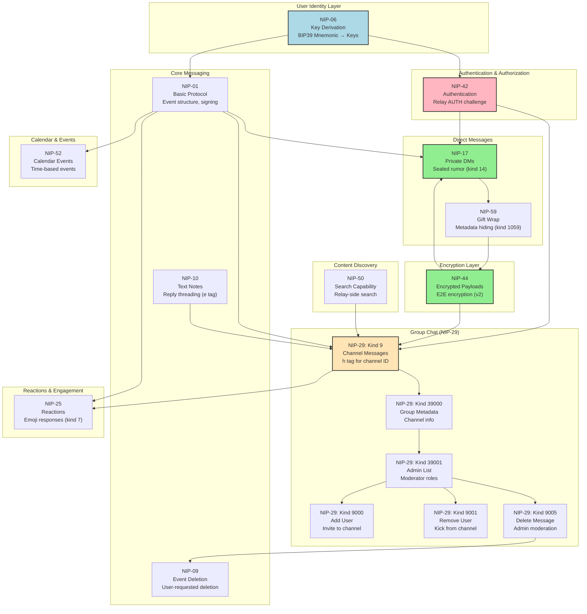
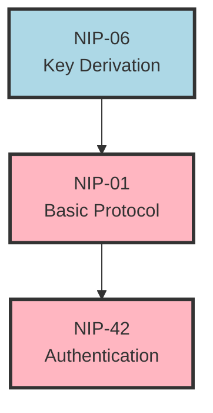
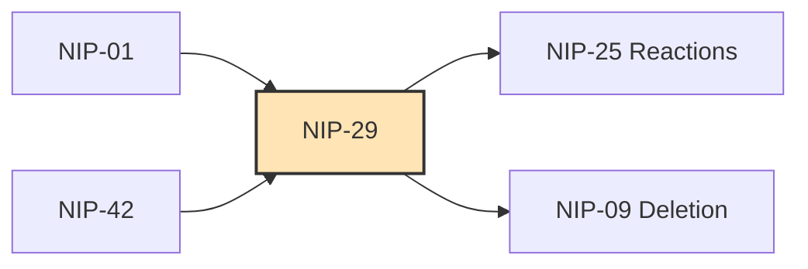
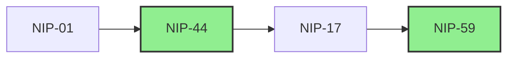
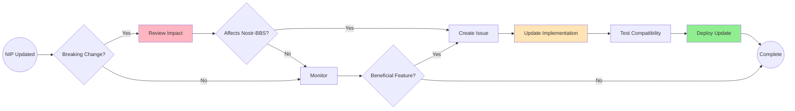

# Nostr Improvement Proposal (NIP) Interactions

[← Back to Architecture](02-architecture.md) | [← Back to Documentation Hub](../INDEX.md)

**Version:** 1.0.0
**Date:** 2025-12-20
**Status:** Production

---

## Overview

This document visualizes how different Nostr Improvement Proposals (NIPs) interact within the Nostr-BBS system. Understanding these relationships is critical for developers implementing features or debugging protocol-level issues.

---

## 1. Complete NIP Interaction Map

The following diagram shows all NIPs implemented in Nostr-BBS and how they interconnect.



**Legend:**
- **Blue (NIP-06):** Identity/key generation (foundation)
- **Pink (NIP-42):** Security critical (authentication)
- **Green (NIP-44, NIP-17):** Privacy/encryption features
- **Yellow (NIP-29 messages):** Core messaging functionality

---

## 2. Message Flow by NIP Type

### 2.1 Public Channel Message (NIP-29)

```mermaid
sequenceDiagram
    participant User
    participant NIP06 as NIP-06<br/>Keys
    participant NIP01 as NIP-01<br/>Event
    participant NIP42 as NIP-42<br/>AUTH
    participant NIP29 as NIP-29<br/>Group
    participant Relay

    User->>NIP06: Generate/restore keys
    NIP06->>User: Provide keypair

    User->>NIP01: Create event (kind 9)
    NIP01->>NIP01: Add signature

    NIP01->>NIP29: Add channel tag (h)
    NIP29->>NIP29: Validate membership

    NIP29->>NIP42: Authenticate
    NIP42->>Relay: Send AUTH challenge
    Relay->>NIP42: Sign challenge
    NIP42->>Relay: Verify signature

    NIP29->>Relay: Publish event
    Relay->>Relay: Store & broadcast

    style NIP42 fill:#FFB6C1
    style NIP29 fill:#FFE4B5
```

### 2.2 Encrypted Channel Message (NIP-29 + NIP-44)

```mermaid
sequenceDiagram
    participant User
    participant NIP44 as NIP-44<br/>Encryption
    participant NIP29 as NIP-29<br/>Group
    participant Relay
    participant Members

    User->>NIP44: Encrypt content
    Note over NIP44: For each member:<br/>encrypt with shared secret

    NIP44->>NIP29: Create group event
    NIP29->>Relay: Publish (kind 9)
    Note over Relay: Stores encrypted blob<br/>Cannot read content

    Relay->>Members: Broadcast event
    Members->>NIP44: Decrypt content
    NIP44->>Members: Display plaintext

    style NIP44 fill:#90EE90,stroke:#333,stroke-width:2px
    style Relay fill:#D3D3D3
```

### 2.3 Private Direct Message (NIP-17 + NIP-59)

```mermaid
sequenceDiagram
    participant Sender
    participant NIP44 as NIP-44<br/>Encryption
    participant NIP17 as NIP-17<br/>Sealed
    participant NIP59 as NIP-59<br/>Gift Wrap
    participant Relay
    participant Recipient

    Sender->>NIP44: Encrypt message content
    NIP44->>NIP17: Create sealed rumor (kind 14)
    Note over NIP17: Real timestamp<br/>Real sender

    NIP17->>NIP59: Wrap with gift-wrap
    Note over NIP59: Random sender key<br/>Fuzzed timestamp

    NIP59->>Relay: Publish (kind 1059)
    Note over Relay: Sees only:<br/>- Random pubkey<br/>- Fuzzed time<br/>- Encrypted blob

    Relay->>Recipient: Deliver event
    Recipient->>NIP59: Unwrap gift
    NIP59->>NIP17: Extract sealed rumor
    NIP17->>NIP44: Decrypt content
    NIP44->>Recipient: Display message

    style NIP44 fill:#90EE90
    style NIP59 fill:#90EE90
    style Relay fill:#FFB6C1
```

---

## 3. NIP Implementation Status

### 3.1 Fully Implemented

| NIP | Title | Usage in Nostr-BBS |
|-----|-------|-------------------|
| **NIP-01** | Basic Protocol | Event creation, signing, verification |
| **NIP-06** | Key Derivation | BIP39 mnemonic → keypair (m/44'/1237'/0'/0/0) |
| **NIP-09** | Event Deletion | User-requested message deletion |
| **NIP-10** | Text Notes | Reply threading with 'e' tags |
| **NIP-17** | Private DMs | Sealed rumor structure for DMs |
| **NIP-25** | Reactions | Emoji reactions (kind 7) |
| **NIP-29** | Groups | Channel messages, metadata, admin actions |
| **NIP-42** | Authentication | Relay AUTH for pubkey whitelist |
| **NIP-44** | Encryption | E2E encryption for private channels & DMs |
| **NIP-50** | Search | Relay-side message search |
| **NIP-52** | Calendar | Time-based event scheduling |
| **NIP-59** | Gift Wrap | Metadata hiding for DMs |

### 3.2 Partially Implemented

| NIP | Title | Status | Notes |
|-----|-------|--------|-------|
| **NIP-04** | Encrypted DMs (legacy) | Read-only | Deprecated, replaced by NIP-17 |
| **NIP-11** | Relay Info | Supported | NIP-11 document at relay root |

### 3.3 Planned (Future)

| NIP | Title | Priority | Use Case |
|-----|-------|----------|----------|
| **NIP-23** | Long-form Content | Medium | Forum-style posts |
| **NIP-56** | Reporting | Low | Spam/abuse reporting |
| **NIP-58** | Badges | Low | User achievements |

---

## 4. Critical NIP Dependencies

### 4.1 Foundational NIPs (Required for All Features)



**Critical Path:** Without these 3 NIPs, no features work.

### 4.2 Feature-Specific Dependencies

#### Channel Chat Dependencies



#### Private DM Dependencies



---

## 5. NIP Interaction Anti-Patterns

### 5.1 What NOT to Do

❌ **Don't mix NIP-04 and NIP-17 for DMs**
- NIP-04 is deprecated
- Use NIP-17 + NIP-59 for all new DMs
- Only read NIP-04 for backwards compatibility

❌ **Don't use NIP-29 group events without NIP-42 AUTH**
- Group membership enforcement requires authentication
- Unauthenticated relays cannot enforce member-only access

❌ **Don't apply NIP-44 encryption to public channels**
- Use transport-only encryption (TLS/WSS)
- E2E encryption degrades performance (O(n) per message)

❌ **Don't confuse NIP-09 (user deletion) with NIP-29 kind 9005 (admin deletion)**
- Users can only delete their own messages (NIP-09)
- Admins can delete any message (NIP-29 kind 9005)

### 5.2 Best Practices

✅ **Always validate NIP compliance**
```typescript
// Good: Check NIP support before using features
const relay = await ndk.connect(relayUrl);
if (!relay.nips.includes(29)) {
  throw new Error('Relay does not support NIP-29 groups');
}
```

✅ **Use appropriate encryption for context**
```typescript
// Public channel: No E2E encryption
const publicEvent = createEvent({ kind: 9, content: plaintext });

// Private channel: NIP-44 E2E encryption
const privateEvent = await encryptGroupMessage(plaintext, memberKeys);

// Direct message: NIP-17 + NIP-59
const dmEvent = await createGiftWrappedDM(plaintext, recipientPubkey);
```

✅ **Respect NIP-42 AUTH challenges**
```typescript
// Always respond to AUTH challenges
ndk.on('auth', async (challenge) => {
  const signed = await signAuthEvent(challenge);
  await ndk.publish(signed);
});
```

---

## 6. Testing NIP Interactions

### 6.1 Unit Tests for NIP Compliance

```typescript
// tests/nips/nip-29.test.ts
describe('NIP-29 Group Messaging', () => {
  it('should include h tag for channel ID', async () => {
    const event = await createChannelMessage(channelId, 'Hello');
    expect(event.tags).toContainEqual(['h', channelId]);
  });

  it('should validate member before publishing', async () => {
    const isMember = await checkChannelMembership(userId, channelId);
    expect(isMember).toBe(true);
  });
});
```

### 6.2 Integration Tests for NIP Chains

```typescript
// tests/integration/dm-flow.test.ts
describe('NIP-17 + NIP-59 DM Flow', () => {
  it('should create gift-wrapped DM', async () => {
    const plaintext = 'Test message';
    const dm = await createGiftWrappedDM(plaintext, recipientPubkey);

    expect(dm.kind).toBe(1059); // NIP-59 gift wrap
    expect(dm.pubkey).not.toBe(senderPubkey); // Random sender
  });

  it('should unwrap and decrypt DM', async () => {
    const received = await receiveGiftWrappedDM(encryptedEvent);
    expect(received.content).toBe('Test message');
  });
});
```

---

## 7. Troubleshooting NIP Issues

### 7.1 Common Problems

**Problem:** Messages not appearing in channel

**Possible NIP Issues:**
- ❌ NIP-42 AUTH failed (check relay whitelist)
- ❌ NIP-29 'h' tag missing (channel ID not specified)
- ❌ NIP-01 signature invalid (check key derivation)

**Debug Steps:**
1. Check relay connection: `ndk.pool.stats()`
2. Verify AUTH status: `relay.auth?.authenticated`
3. Inspect event structure: `console.log(JSON.stringify(event))`

---

**Problem:** DMs visible to relay admin

**Possible NIP Issues:**
- ❌ NIP-17 not used (sending kind 4 instead of kind 14)
- ❌ NIP-59 gift wrap missing (metadata exposed)
- ❌ NIP-44 encryption skipped (content plaintext)

**Debug Steps:**
1. Check event kind: Should be 1059 (gift wrap)
2. Verify random sender: `event.pubkey !== senderPubkey`
3. Confirm encryption: `event.content` should be unreadable ciphertext

---

## 8. NIP Update Strategy

### 8.1 Monitoring NIP Changes

Nostr NIPs are evolving specifications. We track changes via:

1. **GitHub Repository:** https://github.com/nostr-protocol/nips
2. **Version Tags:** Each NIP has version/date in header
3. **Breaking Changes:** Highlighted in NIP changelog

### 8.2 Update Workflow



---

## 9. Related Documentation

- [Architecture Overview](02-architecture.md) - System design
- [Encryption Flows](encryption-flows.md) - Detailed encryption patterns
- [Admin Workflows](../features/admin-workflows.md) - NIP-29 moderation
- [DM Implementation](../features/dm-implementation.md) - NIP-17/59 details

---

## 10. References

**Official NIP Repository:**
- https://github.com/nostr-protocol/nips

**Key NIPs:**
- [NIP-01: Basic Protocol](https://github.com/nostr-protocol/nips/blob/master/01.md)
- [NIP-06: Key Derivation](https://github.com/nostr-protocol/nips/blob/master/06.md)
- [NIP-17: Private DMs](https://github.com/nostr-protocol/nips/blob/master/17.md)
- [NIP-29: Groups](https://github.com/nostr-protocol/nips/blob/master/29.md)
- [NIP-42: Authentication](https://github.com/nostr-protocol/nips/blob/master/42.md)
- [NIP-44: Encryption](https://github.com/nostr-protocol/nips/blob/master/44.md)
- [NIP-59: Gift Wrap](https://github.com/nostr-protocol/nips/blob/master/59.md)

---

**Document Version:** 1.0.0
**Last Updated:** 2025-12-20
**Maintained by:** Architecture Team
