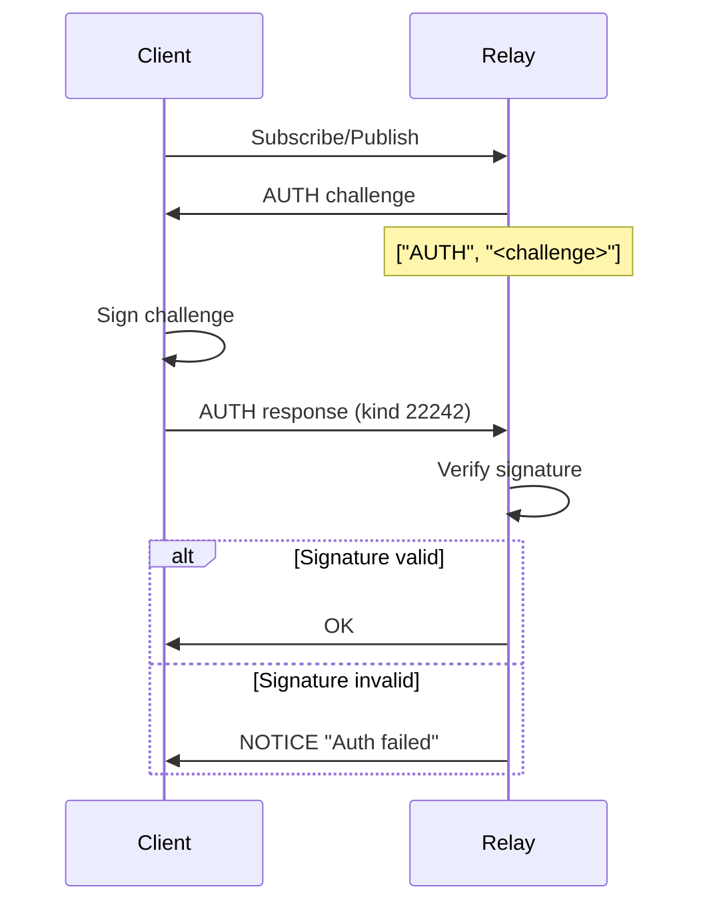
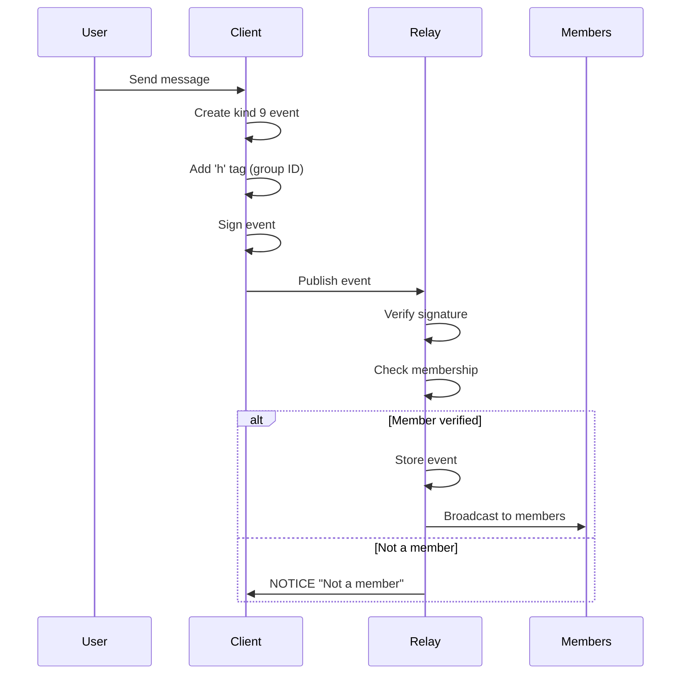
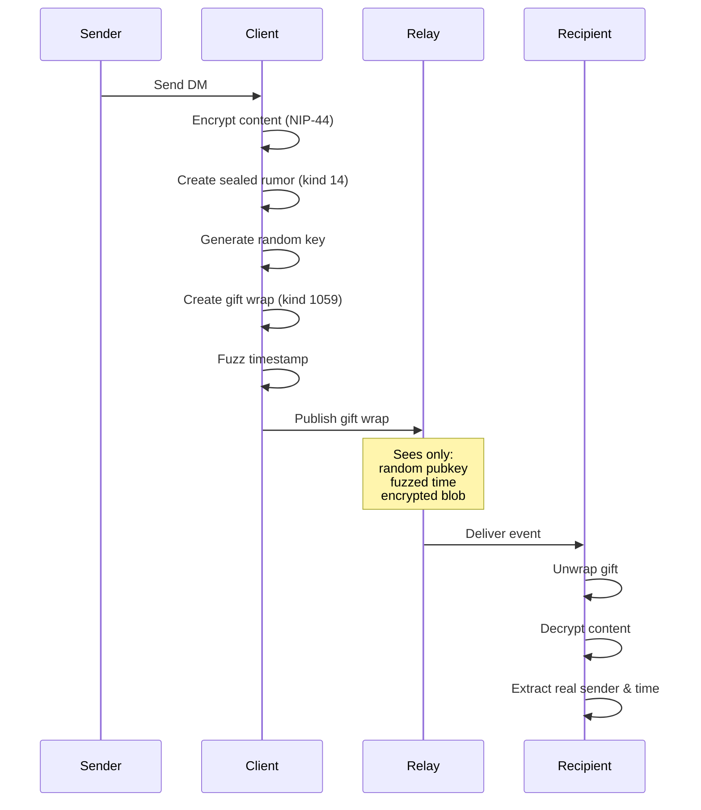

# NIP Protocol Reference

**Version:** 1.0.0
**Date:** 2025-12-20
**Status:** Production

[← Back to Documentation Hub](../INDEX.md) | [← Back to API Reference](api-reference.md)

---

## Overview

This document consolidates all Nostr Improvement Proposal (NIP) implementations in Nostr-BBS. It serves as the definitive reference for protocol specifications, event structures, and implementation details.

---

## Table of Contents

1. [NIP-01: Basic Protocol](#nip-01-basic-protocol)
2. [NIP-04: Encrypted DMs (Legacy)](#nip-04-encrypted-dms-legacy)
3. [NIP-06: Key Derivation](#nip-06-key-derivation)
4. [NIP-09: Event Deletion](#nip-09-event-deletion)
5. [NIP-10: Text Notes & Replies](#nip-10-text-notes--replies)
6. [NIP-17: Private DMs](#nip-17-private-dms)
7. [NIP-25: Reactions](#nip-25-reactions)
8. [NIP-28: Public Chat (Deprecated)](#nip-28-public-chat-deprecated)
9. [NIP-29: Relay-Based Groups](#nip-29-relay-based-groups)
10. [NIP-42: Authentication](#nip-42-authentication)
11. [NIP-44: Encrypted Payloads](#nip-44-encrypted-payloads)
12. [NIP-50: Search Capability](#nip-50-search-capability)
13. [NIP-52: Calendar Events](#nip-52-calendar-events)
14. [NIP-59: Gift Wrap](#nip-59-gift-wrap)

---

## NIP-01: Basic Protocol

**Status:** ✅ Fully Implemented
**Official Spec:** https://github.com/nostr-protocol/nips/blob/master/01.md

### Overview

Foundation of all Nostr events. Defines event structure, signing, and verification.

### Event Structure

```typescript
interface NostrEvent {
  id: string;        // SHA-256 hash of serialized event
  pubkey: string;    // Hex-encoded public key
  created_at: number; // Unix timestamp (seconds)
  kind: number;      // Event type identifier
  tags: string[][];  // Array of tag arrays
  content: string;   // Event content (arbitrary string)
  sig: string;       // Schnorr signature
}
```

### Event Kinds

| Kind | Name | Description | Implementation |
|------|------|-------------|----------------|
| 0 | Metadata | User profile (name, about, picture) | ✅ `createUserMetadata()` |
| 1 | Text Note | Short-form text post | ✅ `createTextNote()` |
| 3 | Contacts | Contact list | ❌ Not used |
| 4 | Encrypted DM | Legacy encrypted messages | 🟡 Read-only (deprecated) |
| 5 | Deletion | Event deletion request | ✅ `createDeletionEvent()` |
| 7 | Reaction | Event reaction (like, emoji) | ✅ `createReaction()` |
| 9 | Group Message | NIP-29 channel message | ✅ Primary chat mechanism |

### Event ID Calculation

```typescript
// Serialization format for ID hash
const serialized = JSON.stringify([
  0,                  // Reserved for future use
  event.pubkey,
  event.created_at,
  event.kind,
  event.tags,
  event.content
]);

// Hash with SHA-256
const id = sha256(serialized);
```

### Signature Verification

```typescript
// Verify steps:
// 1. Compute event ID from serialized content
const computedId = sha256(serializeEvent(event));

// 2. Verify ID matches event.id
if (computedId !== event.id) return false;

// 3. Verify schnorr signature
return schnorr.verify(event.sig, event.id, event.pubkey);
```

**Implementation:** `verifyEventSignature()` in `/src/lib/nostr/events.ts`

### Tag Format

Tags are arrays where:
- First element: tag name (single letter or string)
- Subsequent elements: tag values
- Last element (optional): relay hint

```typescript
// Event reference tag
['e', eventId, relayUrl?, marker?]

// Pubkey reference tag
['p', pubkey, relayUrl?, petName?]

// Generic tag
['customTag', 'value1', 'value2']
```

### Common Tag Types

| Tag | Name | Purpose | Example |
|-----|------|---------|---------|
| e | Event | Reference another event | `['e', '123abc...', '', 'root']` |
| p | Pubkey | Reference a user | `['p', '456def...']` |
| t | Topic | Hashtag/topic | `['t', 'nostr']` |
| r | Reference | URL reference | `['r', 'https://example.com']` |
| h | Group | NIP-29 group identifier | `['h', 'channel-id']` |

---

## NIP-04: Encrypted DMs (Legacy)

**Status:** 🟡 Read-Only (Deprecated)
**Official Spec:** https://github.com/nostr-protocol/nips/blob/master/04.md

### ⚠️ Deprecation Notice

NIP-04 is **deprecated** in favor of NIP-17 (Private DMs) + NIP-59 (Gift Wrap). Nostr-BBS:
- **Reads** NIP-04 messages for backwards compatibility
- **Never creates** new NIP-04 messages
- **Migrates** existing conversations to NIP-17 when possible

### Event Structure

```typescript
{
  kind: 4,
  content: encryptedContent, // AES-256-CBC encrypted
  tags: [
    ['p', recipientPubkey] // Single recipient
  ]
}
```

### Security Issues

1. **Metadata Leakage:** Recipient visible to relay
2. **Weak Encryption:** CBC mode vulnerable to padding oracle attacks
3. **No Forward Secrecy:** Compromised key exposes all messages
4. **No Sender Hiding:** Sender pubkey exposed

**Migration Path:** Use NIP-17 for all new DMs.

---

## NIP-06: Key Derivation

**Status:** ✅ Fully Implemented
**Official Spec:** https://github.com/nostr-protocol/nips/blob/master/06.md

### Overview

Deterministic key generation from BIP39 mnemonic phrases.

### Derivation Path

```
m / 44' / 1237' / account' / change / index
```

**Standard Path:** `m/44'/1237'/0'/0/0`

- `44'` - BIP44 purpose
- `1237'` - Nostr coin type
- `0'` - Account 0 (hardened)
- `0` - External chain
- `0` - Key index

### Implementation

```typescript
import { generateMnemonic, mnemonicToSeed } from 'bip39';
import { HDKey } from '@scure/bip32';

// Generate 24-word mnemonic
const mnemonic = generateMnemonic(256);

// Derive seed
const seed = await mnemonicToSeed(mnemonic);

// Derive key at standard path
const hdkey = HDKey.fromMasterSeed(seed);
const path = "m/44'/1237'/0'/0/0";
const derived = hdkey.derive(path);

const privateKey = derived.privateKey; // 32 bytes
const publicKey = derived.publicKey;   // 33 bytes (compressed)
```

**Security:**
- Mnemonic must be stored securely (encrypted)
- Never transmit mnemonic over network
- Validate mnemonic checksum before use

**Related:** Key storage in `/src/lib/utils/storage.ts`

---

## NIP-09: Event Deletion

**Status:** ✅ Fully Implemented
**Official Spec:** https://github.com/nostr-protocol/nips/blob/master/09.md

### Overview

User-requested deletion of their own events.

### Event Structure

```typescript
{
  kind: 5,
  content: reason, // Optional deletion reason
  tags: [
    ['e', eventId1],
    ['e', eventId2],
    // ... multiple events can be deleted
  ]
}
```

### Deletion Rules

1. **Authorization:** Only event author can request deletion
2. **Relay Discretion:** Relays MAY honor deletion (not guaranteed)
3. **Propagation:** Deletion events should be broadcast to all relays
4. **UI Handling:** Clients SHOULD hide deleted events

### Implementation

```typescript
// Create deletion event
const deletionEvent = createDeletionEvent(
  [eventId1, eventId2],
  privateKey,
  'Accidental post' // Optional reason
);

// Publish to relay
await ndk.publish(deletionEvent);
```

**Code:** `createDeletionEvent()` in `/src/lib/nostr/events.ts`

### NIP-29 Admin Deletion

For channel messages, admins can delete any message using:
- **Kind 9005** (NIP-29 admin deletion)
- Different from NIP-09 (user can only delete own)

---

## NIP-10: Text Notes & Replies

**Status:** ✅ Fully Implemented
**Official Spec:** https://github.com/nostr-protocol/nips/blob/master/10.md

### Overview

Threading model for text notes using 'e' tags with positional markers.

### Tag Markers

```typescript
// Root event (top of thread)
['e', rootEventId, relayUrl, 'root']

// Direct reply target
['e', replyEventId, relayUrl, 'reply']

// Additional mentions (context)
['e', mentionEventId, relayUrl, 'mention']
```

### Threading Example

```
Post A (root)
├─ Reply B ['e', A, '', 'root']
│  └─ Reply C ['e', A, '', 'root'], ['e', B, '', 'reply']
└─ Reply D ['e', A, '', 'root']
```

### Implementation

```typescript
// Create root post
const rootPost = createTextNote(
  'This is a root post',
  privateKey
);

// Create reply
const reply = createTextNote(
  'This is a reply',
  privateKey,
  rootPost.id // replyTo parameter
);

// Tags added automatically:
// ['e', rootPost.id, '', 'root']
// ['e', rootPost.id, '', 'reply']
```

### Best Practices

1. **Always include root tag** in nested replies
2. **Use reply marker** for direct parent
3. **Limit mention tags** to avoid spam
4. **Include 'p' tags** for mentioned users

**Code:** Threading logic in `/src/lib/nostr/events.ts`

---

## NIP-17: Private DMs

**Status:** ✅ Fully Implemented
**Official Spec:** https://github.com/nostr-protocol/nips/blob/master/17.md

### Overview

Private direct messages with sealed rumor structure. Replaces NIP-04.

### Sealed Rumor Structure

```typescript
// Inner event (kind 14) - NOT signed or published directly
{
  kind: 14,
  content: encryptedContent, // NIP-44 encrypted
  created_at: actualTimestamp,
  tags: [
    ['p', recipientPubkey]
  ]
  // No id, sig, or pubkey fields
}
```

### Gift Wrap (NIP-59)

The sealed rumor is wrapped in a gift wrap event (kind 1059):

```typescript
{
  kind: 1059,
  pubkey: randomPubkey,     // Random, not sender's
  created_at: fuzzedTime,   // ±2 days from actual
  content: encryptedRumor,  // Sealed rumor encrypted
  tags: [
    ['p', recipientPubkey]
  ]
}
```

### Privacy Features

1. **Sender Hiding:** Random pubkey in wrapper
2. **Timestamp Fuzzing:** ±2 days from real time
3. **Relay Blinding:** Relay cannot identify sender
4. **Forward Secrecy:** Each message uses unique encryption

### Implementation Flow

```typescript
// 1. Create sealed rumor
const rumor = {
  kind: 14,
  content: await encryptNIP44(plaintext, recipientPubkey),
  created_at: Date.now() / 1000,
  tags: [['p', recipientPubkey]]
};

// 2. Generate random wrapper key
const randomKey = generateRandomKey();

// 3. Create gift wrap
const wrapper = {
  kind: 1059,
  pubkey: getPublicKey(randomKey),
  created_at: fuzzTimestamp(Date.now() / 1000),
  content: await encryptNIP44(JSON.stringify(rumor), recipientPubkey),
  tags: [['p', recipientPubkey]]
};

// 4. Sign and publish wrapper
await signAndPublish(wrapper, randomKey);
```

**Code:** `sendDM()` in `/src/lib/nostr/dm.ts`

---

## NIP-25: Reactions

**Status:** ✅ Fully Implemented
**Official Spec:** https://github.com/nostr-protocol/nips/blob/master/25.md

### Overview

Emoji reactions to events (likes, custom emojis).

### Event Structure

```typescript
{
  kind: 7,
  content: reaction, // '+' for like, or emoji
  tags: [
    ['e', targetEventId],
    ['p', targetAuthorPubkey]
  ]
}
```

### Reaction Content

| Content | Meaning |
|---------|---------|
| `+` | Like / upvote |
| `-` | Dislike / downvote |
| `❤️` | Heart |
| `😂` | Laugh |
| Custom emoji | Any Unicode emoji |

### Implementation

```typescript
// React with like
const reaction = createReaction(
  eventId,
  authorPubkey,
  privateKey,
  '+' // or any emoji
);

await ndk.publish(reaction);
```

### Aggregation

```typescript
// Count reactions by content
const reactions = await fetchReactions(eventId);
const counts = reactions.reduce((acc, r) => {
  acc[r.content] = (acc[r.content] || 0) + 1;
  return acc;
}, {});

// Result: { '+': 42, '❤️': 15, '😂': 8 }
```

**Code:** Reactions in `/src/lib/stores/reactions.ts`

---

## NIP-28: Public Chat (Deprecated)

**Status:** 🟡 Deprecated (Use NIP-29)
**Official Spec:** https://github.com/nostr-protocol/nips/blob/master/28.md

### ⚠️ Migration Notice

NIP-28 is **deprecated** in Nostr-BBS. Use **NIP-29** for all channel operations.

NIP-28 had limitations:
- No admin controls
- No member management
- No private channels
- Limited moderation

### Event Kinds (Legacy)

| Kind | Name | Description |
|------|------|-------------|
| 40 | Channel Create | Create public channel |
| 41 | Channel Metadata | Update channel info |
| 42 | Channel Message | Send message |
| 43 | Hide Message | Hide message in client |
| 44 | Mute User | Mute user in channel |

**Migration:** All NIP-28 channels converted to NIP-29.

---

## NIP-29: Relay-Based Groups

**Status:** ✅ Fully Implemented
**Official Spec:** https://github.com/nostr-protocol/nips/blob/master/29.md

### Overview

Relay-based group chat with admin controls, membership management, and moderation.

### Event Kinds

| Kind | Name | Description | Access |
|------|------|-------------|--------|
| 9 | Group Message | Channel message | Members |
| 11 | Group Thread | Threaded reply | Members |
| 12 | Group Reply | Quick reply | Members |
| 39000 | Group Metadata | Channel info | Admins |
| 39001 | Group Admins | Admin list | Admins |
| 39002 | Group Members | Member list | Admins |
| 9000 | Add User | Invite to group | Admins |
| 9001 | Remove User | Kick from group | Admins |
| 9002 | Edit Metadata | Update info | Admins |
| 9005 | Delete Message | Remove message | Admins |
| 9006 | Create Invite | Generate invite | Admins |
| 9007 | Join Request | Request membership | Anyone |

### Group Message (Kind 9)

```typescript
{
  kind: 9,
  content: messageText,
  tags: [
    ['h', groupId],        // REQUIRED: group identifier
    ['e', replyToId, '', 'reply'], // Optional: threading
    ['p', mentionedPubkey] // Optional: mentions
  ]
}
```

**Key Difference from NIP-28:**
- Uses 'h' tag for group ID (not 'e')
- Kind 9 instead of kind 42

### Group Metadata (Kind 39000)

```typescript
{
  kind: 39000,
  content: '', // Empty or JSON
  tags: [
    ['d', groupId],      // Replaceable event identifier
    ['name', 'Group Name'],
    ['about', 'Description'],
    ['picture', 'https://...'],
    ['public'], // or ['private']
  ]
}
```

### Join Request (Kind 9007)

```typescript
{
  kind: 9007,
  content: 'Please add me',
  tags: [
    ['h', groupId]
  ]
}
```

**Relay Processing:**
1. Relay receives join request
2. Notifies group admins
3. Admin approves with kind 9000 (Add User)
4. Relay adds user to member list
5. User can now post kind 9 messages

### Admin Operations

#### Add User (Kind 9000)

```typescript
{
  kind: 9000,
  tags: [
    ['h', groupId],
    ['p', userPubkey]
  ]
}
```

#### Remove User (Kind 9001)

```typescript
{
  kind: 9001,
  tags: [
    ['h', groupId],
    ['p', userPubkey]
  ]
}
```

#### Delete Message (Kind 9005)

```typescript
{
  kind: 9005,
  tags: [
    ['h', groupId],
    ['e', messageEventId]
  ]
}
```

### Relay Enforcement

NIP-29 relays MUST:
1. **Verify membership** before accepting kind 9 messages
2. **Enforce admin permissions** for moderation actions
3. **Maintain member lists** (kind 39002)
4. **Notify admins** of join requests

### Implementation

**Code Locations:**
- Channel operations: `/src/lib/nostr/groups.ts`
- Admin actions: `/src/lib/stores/admin.ts`
- Join requests: `/src/routes/admin/+page.svelte`

---

## NIP-42: Authentication

**Status:** ✅ Fully Implemented
**Official Spec:** https://github.com/nostr-protocol/nips/blob/master/42.md

### Overview

Relay authentication using cryptographic challenge-response.

### AUTH Challenge Flow



### AUTH Event (Kind 22242)

```typescript
{
  kind: 22242,
  content: '',
  tags: [
    ['relay', relayUrl],
    ['challenge', challengeString]
  ],
  created_at: timestamp,
  // ... standard event fields
}
```

### Implementation

```typescript
// Listen for AUTH challenges
ndk.pool.on('auth', async (relay, challenge) => {
  // Create AUTH event
  const authEvent = new NDKEvent(ndk);
  authEvent.kind = 22242;
  authEvent.tags = [
    ['relay', relay.url],
    ['challenge', challenge]
  ];

  // Sign and send
  await authEvent.sign();
  await relay.send(['AUTH', authEvent.rawEvent()]);
});
```

**Relay Usage:**
- **Whitelist enforcement:** Only authenticated users can publish
- **Private groups:** Verify membership before message delivery
- **Rate limiting:** Per-user instead of per-IP

**Code:** NDK integration in `/src/lib/nostr/ndk.ts`

---

## NIP-44: Encrypted Payloads

**Status:** ✅ Fully Implemented
**Official Spec:** https://github.com/nostr-protocol/nips/blob/master/44.md

### Overview

Modern encryption standard for Nostr. Replaces NIP-04 with better security.

### Encryption Algorithm

**Version 2 (Current):**
- **Key Agreement:** ECDH (secp256k1)
- **KDF:** HMAC-SHA256
- **Cipher:** ChaCha20-Poly1305
- **Nonce:** Random 12 bytes
- **Authentication:** Poly1305 MAC

### Encryption Process

```typescript
// 1. Compute shared secret
const sharedSecret = ecdh(senderPrivkey, recipientPubkey);

// 2. Derive encryption key
const key = hmacSha256(sharedSecret, 'nip44-v2-key');

// 3. Generate random nonce
const nonce = randomBytes(12);

// 4. Encrypt with ChaCha20-Poly1305
const ciphertext = chacha20poly1305.encrypt(
  plaintext,
  key,
  nonce
);

// 5. Format: version || nonce || ciphertext || tag
const payload = Buffer.concat([
  Buffer.from([0x02]), // Version 2
  nonce,
  ciphertext,
  authTag
]);

// 6. Base64 encode
const encrypted = payload.toString('base64');
```

### Decryption Process

```typescript
// 1. Base64 decode
const payload = Buffer.from(encrypted, 'base64');

// 2. Parse components
const version = payload[0];     // Must be 0x02
const nonce = payload.slice(1, 13);
const ciphertext = payload.slice(13, -16);
const authTag = payload.slice(-16);

// 3. Compute shared secret
const sharedSecret = ecdh(recipientPrivkey, senderPubkey);

// 4. Derive decryption key
const key = hmacSha256(sharedSecret, 'nip44-v2-key');

// 5. Decrypt with ChaCha20-Poly1305
const plaintext = chacha20poly1305.decrypt(
  ciphertext,
  authTag,
  key,
  nonce
);
```

### Security Properties

✅ **Authenticated Encryption:** Poly1305 MAC prevents tampering
✅ **Random Nonces:** Each message has unique nonce
✅ **Forward Secrecy:** Unique nonce provides session-like properties
✅ **Malleability Protection:** AEAD prevents ciphertext modification

### Use Cases in Nostr-BBS

1. **Private DMs (NIP-17):** Encrypt DM content
2. **Private Channels:** Encrypt group messages
3. **Gift Wrapping (NIP-59):** Encrypt sealed rumors

**Code:** Encryption in `/src/lib/nostr/encryption.ts`

---

## NIP-50: Search Capability

**Status:** ✅ Partially Implemented
**Official Spec:** https://github.com/nostr-protocol/nips/blob/master/50.md

### Overview

Relay-side search capability with optional filters.

### Filter Extension

```typescript
interface SearchFilter extends Filter {
  search?: string; // Search query
}

// Example
const filter = {
  kinds: [1, 9],
  search: 'nostr protocol',
  limit: 20
};
```

### Relay Support

Relays advertise NIP-50 support in NIP-11 document:

```json
{
  "name": "My Relay",
  "supported_nips": [1, 9, 29, 50],
  "search": {
    "enabled": true,
    "operators": ["AND", "OR", "NOT"],
    "case_sensitive": false
  }
}
```

### Implementation

**Client-Side (Nostr-BBS):**
- Semantic search using HNSW index
- Embedding-based similarity search
- Fallback to keyword search if relay doesn't support NIP-50

**Relay-Side:**
- Full-text search with PostgreSQL `ts_vector`
- Ranked results by relevance
- Support for boolean operators

**Code:** Search in `/src/lib/semantic/hnsw-search.ts`

---

## NIP-52: Calendar Events

**Status:** ✅ Fully Implemented
**Official Spec:** https://github.com/nostr-protocol/nips/blob/master/52.md

### Overview

Time-based calendar events and RSVPs.

### Calendar Event (Kind 31923)

```typescript
{
  kind: 31923,
  content: '', // Optional description
  tags: [
    ['d', uniqueId],          // Replaceable event ID
    ['title', 'Event Title'],
    ['start', unixTimestamp.toString()],
    ['end', unixTimestamp.toString()], // Optional
    ['location', 'Place or URL'],      // Optional
    ['h', groupId]                     // Optional: channel association
  ]
}
```

### RSVP Event (Kind 31925)

```typescript
{
  kind: 31925,
  content: '', // Optional comment
  tags: [
    ['d', uniqueId],        // Per-user replaceable
    ['a', '31923:pubkey:eventId'], // Event reference
    ['status', status]      // 'accepted' | 'declined' | 'tentative'
  ]
}
```

### Status Values

| Status | Meaning |
|--------|---------|
| `accepted` | Attending |
| `declined` | Not attending |
| `tentative` | Maybe attending |

### Implementation

```typescript
// Create calendar event
const event = await createCalendarEvent({
  title: 'Weekly Meeting',
  description: 'Team sync',
  start: Date.now() / 1000,
  end: Date.now() / 1000 + 3600,
  location: 'https://meet.example.com',
  channelId: 'channel-id'
});

// RSVP to event
await rsvpToEvent(event.id, 'accepted');
```

**Features:**
- Replaceable events (update by overwriting)
- Per-user RSVP tracking
- Channel association for group events
- Recurring events (via multiple event creation)

**Code:** Calendar in `/src/lib/nostr/calendar.ts`

---

## NIP-59: Gift Wrap

**Status:** ✅ Fully Implemented
**Official Spec:** https://github.com/nostr-protocol/nips/blob/master/59.md

### Overview

Metadata hiding for private messages using sealed rumor wrapper.

### Gift Wrap Structure (Kind 1059)

```typescript
{
  kind: 1059,
  pubkey: randomKey,      // Random ephemeral key
  created_at: fuzzedTime, // Actual time ± random offset
  content: sealedRumor,   // NIP-44 encrypted rumor
  tags: [
    ['p', recipientPubkey]
  ],
  // Standard id and sig fields
}
```

### Timestamp Fuzzing

```typescript
// Fuzz timestamp by ±2 days
const fuzzTimestamp = (actualTime: number): number => {
  const twoDays = 2 * 24 * 60 * 60;
  const offset = (Math.random() * 2 - 1) * twoDays;
  return Math.floor(actualTime + offset);
};
```

### Privacy Guarantees

1. **Sender Anonymity:** Random pubkey hides real sender
2. **Timing Anonymity:** Fuzzing hides message time
3. **Content Privacy:** NIP-44 encryption
4. **Recipient Privacy:** Only recipient can decrypt

### Relay View

Relay sees:
```typescript
{
  kind: 1059,
  pubkey: '7f8e...', // Random (different each time)
  created_at: 1704672123, // Fuzzed (±2 days)
  content: 'AgE7HpA...', // Encrypted blob
  tags: [['p', 'abc123...']] // Only recipient known
}
```

Relay **cannot determine:**
- Who sent the message
- When it was actually sent
- What the content is
- If the recipient is the real target

### Implementation

Used automatically with NIP-17 DMs:

```typescript
// Send DM (automatically gift-wrapped)
await sendDM(recipientPubkey, 'Secret message');

// Receive DM (automatically unwraps)
receiveDM(myPubkey, (dm) => {
  console.log('From:', dm.sender); // Real sender
  console.log('At:', dm.timestamp); // Real timestamp
  console.log('Content:', dm.content); // Decrypted
});
```

**Code:** Gift wrap in `/src/lib/nostr/dm.ts`

---

## NIP Compatibility Matrix

### Fully Implemented ✅

| NIP | Title | Version | Notes |
|-----|-------|---------|-------|
| 01 | Basic Protocol | 1.0 | Foundation |
| 06 | Key Derivation | 1.0 | BIP39 mnemonic |
| 09 | Event Deletion | 1.0 | User deletions |
| 10 | Text Notes | 1.0 | Threading |
| 17 | Private DMs | 1.0 | Sealed rumors |
| 25 | Reactions | 1.0 | Emoji reactions |
| 29 | Groups | 1.0 | Primary chat |
| 42 | Authentication | 1.0 | Relay AUTH |
| 44 | Encryption | 2.0 | ChaCha20-Poly1305 |
| 52 | Calendar | 1.0 | Events & RSVPs |
| 59 | Gift Wrap | 1.0 | Metadata hiding |

### Partially Implemented 🟡

| NIP | Title | Status | Notes |
|-----|-------|--------|-------|
| 04 | Encrypted DMs (Legacy) | Read-only | Use NIP-17 instead |
| 11 | Relay Info | Supported | NIP-11 document |
| 28 | Public Chat | Deprecated | Use NIP-29 instead |
| 50 | Search | Client-side | Semantic search |

### Not Implemented ❌

| NIP | Title | Priority | Use Case |
|-----|-------|----------|----------|
| 23 | Long-form | Low | Forum posts |
| 56 | Reporting | Low | Spam reports |
| 58 | Badges | Low | Achievements |

---

## Protocol Flow Diagrams

### Channel Message Flow (NIP-29)



### Private DM Flow (NIP-17 + NIP-59)



---

## Best Practices

### 1. Event Creation

✅ **Always verify before publishing:**
```typescript
// Validate content
if (!validateContent(content).valid) {
  throw new Error('Invalid content');
}

// Check rate limits
const rateLimit = checkRateLimit('message');
if (!rateLimit.allowed) {
  throw new RateLimitError(rateLimit.retryAfter);
}

// Verify signature before sending
if (!verifyEventSignature(event)) {
  throw new Error('Invalid signature');
}
```

---

### 2. Tag Usage

✅ **Use correct markers:**
```typescript
// NIP-29 channel message
['h', channelId] // NOT ['e', channelId]

// NIP-10 threading
['e', rootId, '', 'root']
['e', parentId, '', 'reply']

// NIP-25 reactions
['e', targetEventId]
['p', targetAuthorPubkey]
```

---

### 3. Encryption

✅ **Always use NIP-44 for new content:**
```typescript
// Modern (NIP-44)
const encrypted = await encryptNIP44(plaintext, recipientPubkey);

// Legacy (NIP-04) - only for reading old messages
const decrypted = await decryptNIP04Legacy(ciphertext, senderPubkey);
```

---

### 4. Authentication

✅ **Handle AUTH challenges:**
```typescript
ndk.pool.on('auth', async (relay, challenge) => {
  const authEvent = createAuthEvent(relay.url, challenge);
  await authEvent.sign();
  await relay.send(['AUTH', authEvent.rawEvent()]);
});
```

---

## Related Documentation

- [API Reference](api-reference.md) - Function documentation
- [NIP Interactions](../architecture/nip-interactions.md) - NIP dependency diagrams
- [Encryption Flows](../architecture/encryption-flows.md) - Detailed encryption patterns

---

## External References

**Official NIP Repository:**
- https://github.com/nostr-protocol/nips

**Specifications:**
- [NIP-01](https://github.com/nostr-protocol/nips/blob/master/01.md) - Basic Protocol
- [NIP-17](https://github.com/nostr-protocol/nips/blob/master/17.md) - Private DMs
- [NIP-29](https://github.com/nostr-protocol/nips/blob/master/29.md) - Groups
- [NIP-44](https://github.com/nostr-protocol/nips/blob/master/44.md) - Encryption
- [NIP-59](https://github.com/nostr-protocol/nips/blob/master/59.md) - Gift Wrap

---

**Document Version:** 1.0.0
**Last Updated:** 2025-12-20
**Maintained by:** Protocol Team
