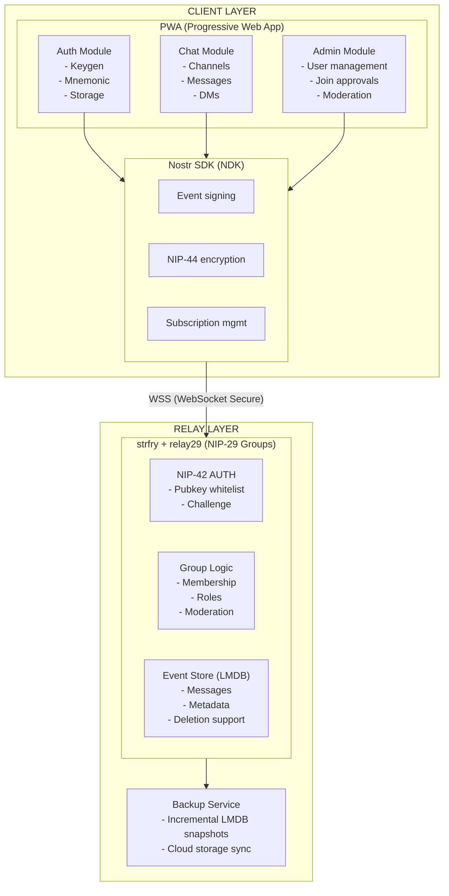
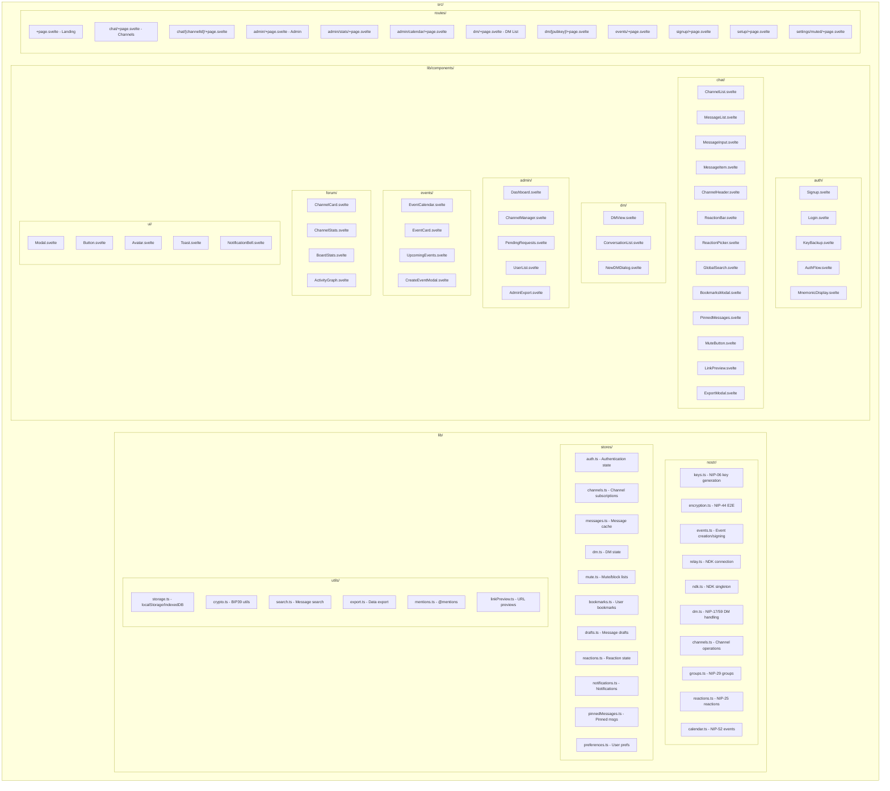
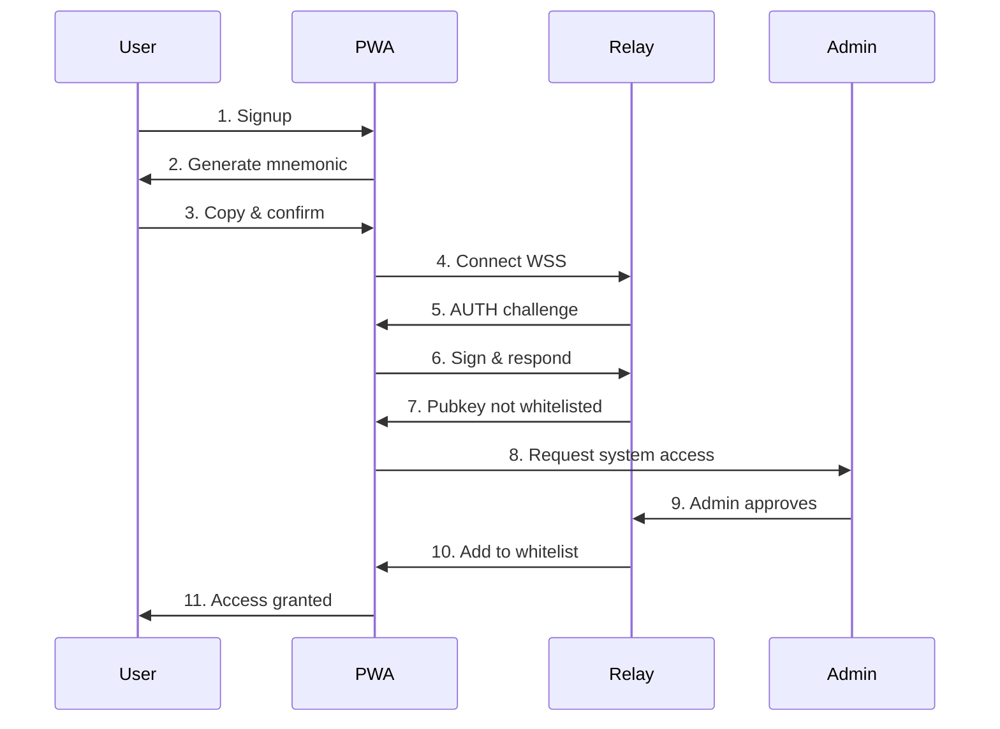
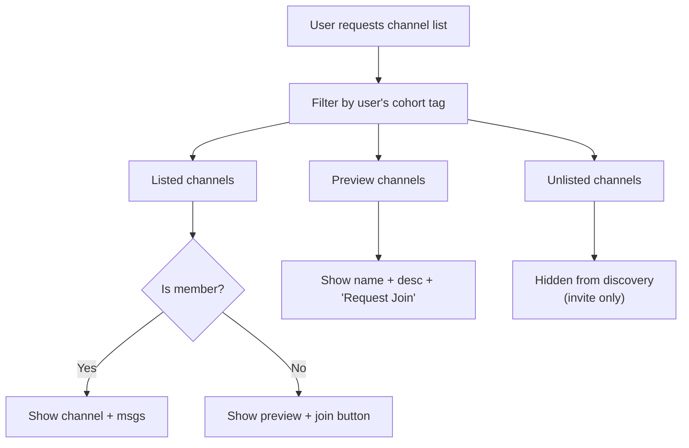
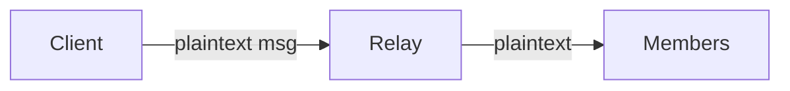
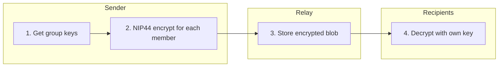
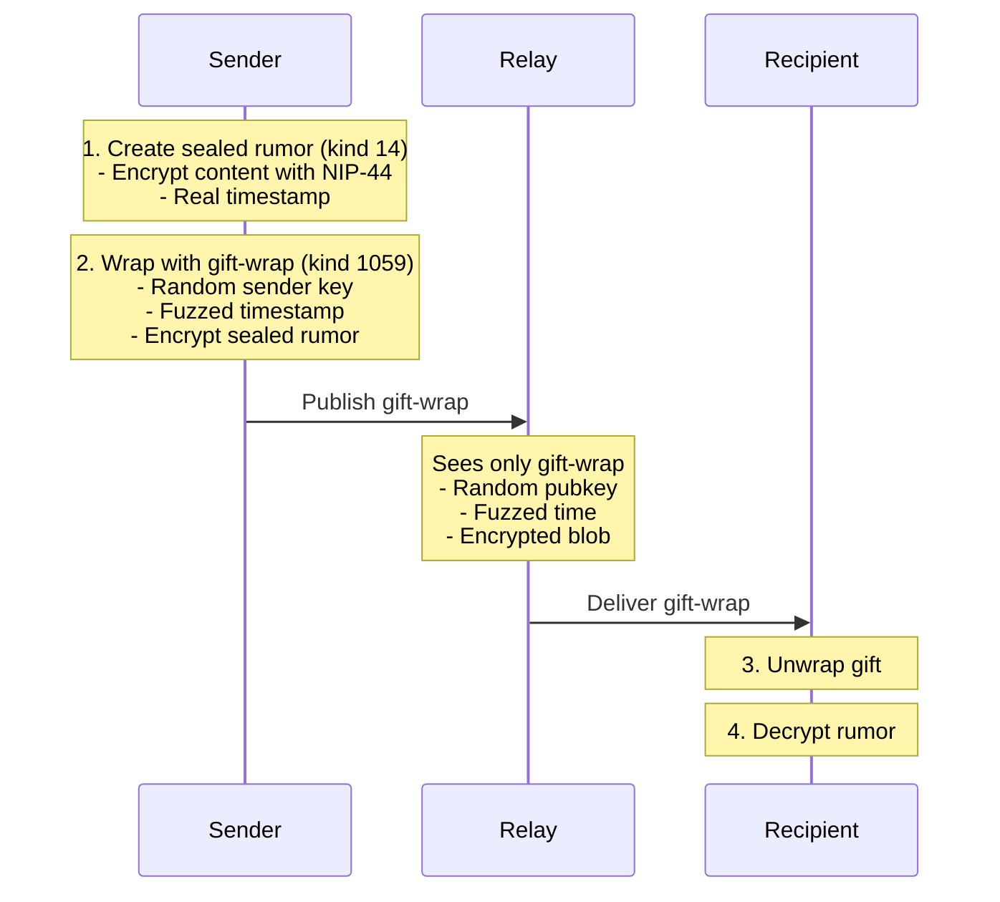
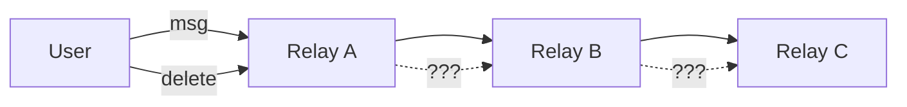
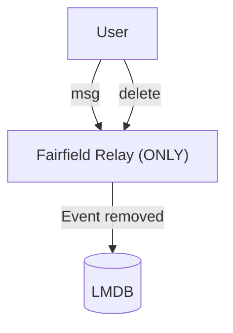
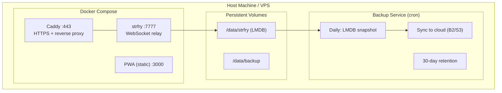

# Fairfield Nostr - SPARC Architecture

> **Phase:** Architecture Design
> **Version:** 0.1.0-draft
> **Date:** 2024-12-11

---

## 1. System Overview



---

## 2. Component Architecture

### 2.1 Frontend Components



**Key Directories:**

| Directory | Purpose |
|-----------|---------|
| `src/lib/nostr/` | Nostr protocol implementation (NIPs 01, 06, 09, 17, 25, 28, 29, 42, 44, 52, 59) |
| `src/lib/stores/` | Svelte stores for reactive state management |
| `src/lib/utils/` | Helper utilities for storage, crypto, search, export |
| `src/lib/components/` | Reusable Svelte 5 components organized by feature |
| `src/routes/` | SvelteKit file-based routing |
| `static/` | PWA assets (manifest, icons, service worker) |

### 2.2 Relay Configuration

```yaml
# strfry.conf
relay:
  info:
    name: "Fairfield Private Relay"
    description: "Closed relay for Fairfield community"
    supported_nips: [1, 2, 9, 11, 29, 42, 44, 59]

  # NIP-42 Authentication Required
  auth:
    enabled: true
    challenge_timeout: 60

  # Write Policy
  writePolicy:
    # Only authenticated users can write
    require_auth: true
    # Whitelist managed by admin
    pubkey_whitelist: "/etc/strfry/whitelist.json"

  # No federation
  upstream: []

  # Local storage
  storage:
    path: "/var/lib/strfry/data"
    max_size: 1073741824  # 1GB
```

---

## 3. Data Models

### 3.1 Nostr Event Kinds Used

| Kind | NIP | Purpose |
|------|-----|---------|
| 0 | 01 | User metadata (profile) |
| 1 | 01 | Short text note (channel messages) |
| 4 | 04 | Encrypted DM (legacy, read-only) |
| 5 | 09 | Deletion request |
| 9 | 29 | Group chat message |
| 10 | 29 | Group metadata |
| 11 | 29 | Group admin list |
| 12 | 29 | Group members |
| 1059 | 59 | Gift-wrapped event (DMs) |
| 9000 | 29 | Group add user |
| 9001 | 29 | Group remove user |
| 9005 | 29 | Group delete event |

### 3.2 Custom Tags

```typescript
// Cohort tag for channel filtering
interface CohortTag {
  tag: "cohort";
  values: ["business" | "moomaa-tribe" | "both"];
}

// Join request status
interface JoinRequestTag {
  tag: "join-request";
  values: [channelId: string, status: "pending" | "approved" | "rejected"];
}

// Channel visibility
interface VisibilityTag {
  tag: "visibility";
  values: ["listed" | "unlisted" | "preview"];
}
```

### 3.3 IndexedDB Schema (Client-side Cache)

```typescript
interface FairfieldDB {
  // Cached messages for offline access
  messages: {
    id: string;           // Event ID
    channelId: string;
    pubkey: string;
    content: string;      // Decrypted content
    created_at: number;
    deleted: boolean;
  };

  // Channel metadata
  channels: {
    id: string;
    name: string;
    description: string;
    cohort: "business" | "moomaa-tribe" | "both";
    visibility: "listed" | "unlisted" | "preview";
    memberCount: number;
    isMember: boolean;
    isEncrypted: boolean;
  };

  // Pending requests
  joinRequests: {
    id: string;
    channelId: string;
    requestedAt: number;
    status: "pending" | "approved" | "rejected";
  };

  // User's key material (encrypted)
  keys: {
    pubkey: string;
    encryptedPrivkey: string;  // Encrypted with PIN/passphrase
  };
}
```

---

## 4. Authentication Flow



---

## 5. Channel Access Flow



---

## 6. Encryption Architecture

### 6.1 Channel Messages (NIP-29 Groups)

**Non-Encrypted Channels** (Common Rooms, Event Channels)



- Relay can read content
- Admin implicitly has access (relay owner)
- Simple, performant
- NIP-29 membership enforcement

**E2E Encrypted Channels** (Private Course Rooms)



- Relay sees encrypted blob only
- Admin in room = admin has key = can decrypt
- O(n) encryption per message for n members
- Suitable for <100 member groups

### 6.2 Direct Messages (NIP-17 + NIP-59)



**Admin CANNOT read DMs** (no access to recipient's privkey)

---

## 7. Deletion Strategy

### 7.1 Local Relay Deletion (Supported)

```typescript
// User deletes their own message
async function deleteMessage(eventId: string, privkey: string) {
  // Create NIP-09 deletion event
  const deletionEvent = {
    kind: 5,
    pubkey: getPublicKey(privkey),
    created_at: Math.floor(Date.now() / 1000),
    tags: [
      ["e", eventId],  // Event to delete
    ],
    content: "Deleted by user",
  };

  // Sign and publish
  const signed = await signEvent(deletionEvent, privkey);
  await relay.publish(signed);

  // Local relay WILL honor deletion
  // (configured to respect NIP-09 from event author)
}

// Admin force-delete (NIP-29 kind 9005)
async function adminDeleteMessage(eventId: string, channelId: string) {
  const deletionEvent = {
    kind: 9005,
    tags: [
      ["h", channelId],
      ["e", eventId],
    ],
    content: "Removed by admin",
  };
  // ... sign with admin key
}
```

### 7.2 Why Local-Only Enables True Deletion

**Public Nostr (Federation)**



*Problem: No guarantee other relays honor deletion*

**Fairfield (Closed Relay)**



*Guarantee: We control the only relay, deletion is real*

---

## 8. Technology Stack

### 8.1 Frontend

| Layer | Technology | Rationale |
|-------|------------|-----------|
| Framework | SvelteKit | Lightweight, PWA-friendly, good DX |
| Nostr SDK | NDK (@nostr-dev-kit/ndk) | High-level, well-maintained |
| Styling | Tailwind CSS | Rapid UI development |
| Storage | IndexedDB (Dexie) | Offline message cache |
| Build | Vite | Fast HMR, PWA plugin |

### 8.2 Relay

| Component | Technology | Rationale |
|-----------|------------|-----------|
| Core Relay | strfry | High-performance, LMDB storage |
| Group Logic | relay29 | NIP-29 implementation |
| Container | Docker | Easy deployment, backup |
| Reverse Proxy | Caddy | Auto-HTTPS, WebSocket |

### 8.3 Infrastructure

| Component | Technology | Rationale |
|-----------|------------|-----------|
| Hosting | Self-hosted (VPS/local) | Data sovereignty |
| Backup | Restic + B2/S3 | Incremental, encrypted |
| Monitoring | Prometheus + Grafana | Relay metrics |

---

## 9. Deployment Architecture



---

*Next Phase: Pseudocode & Data Flow (03-pseudocode.md)*
