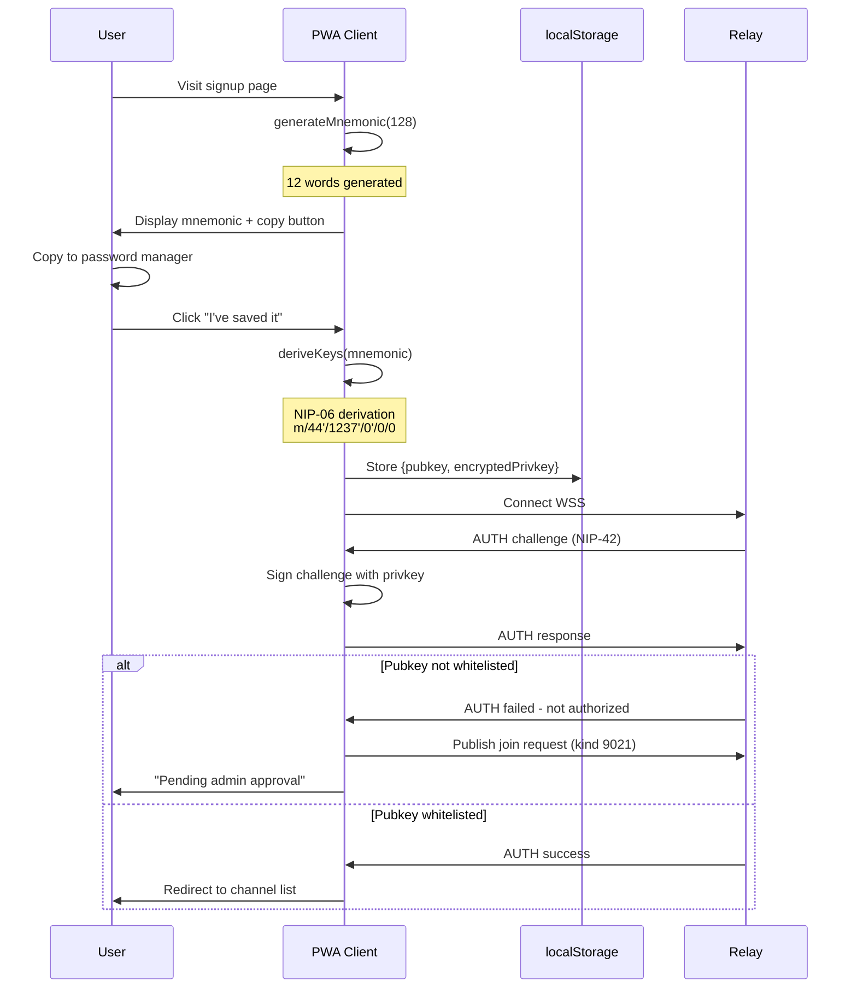
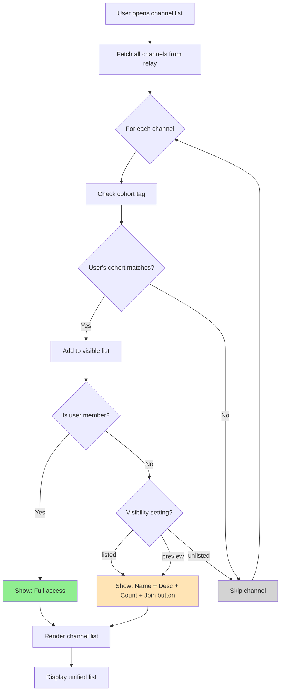
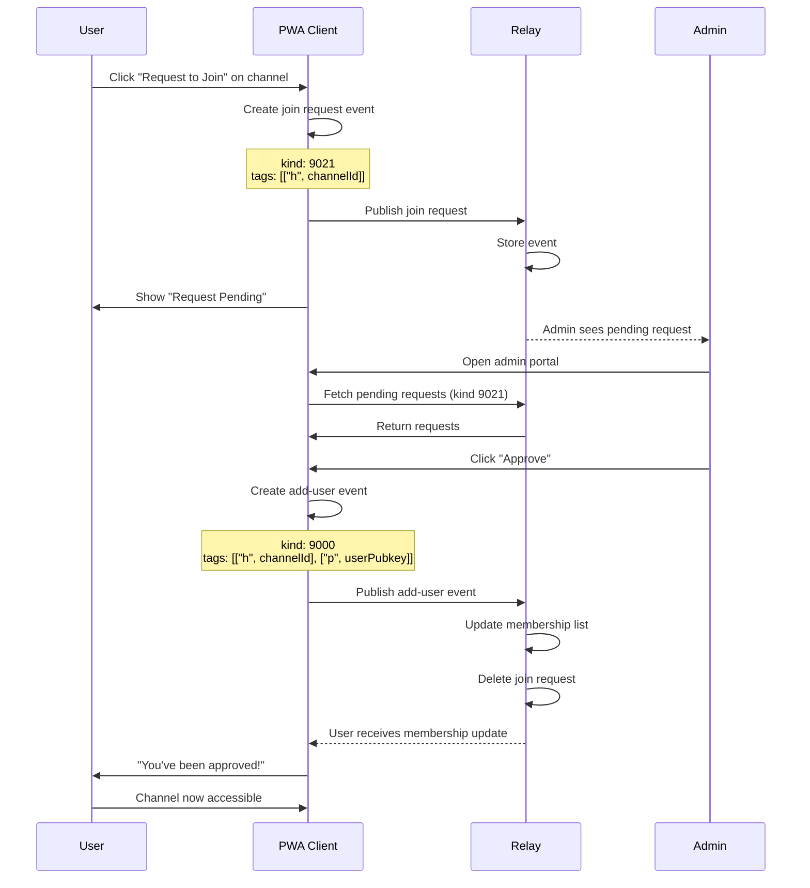
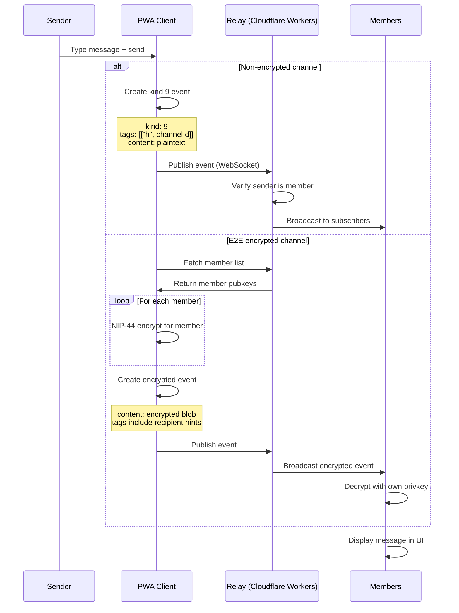
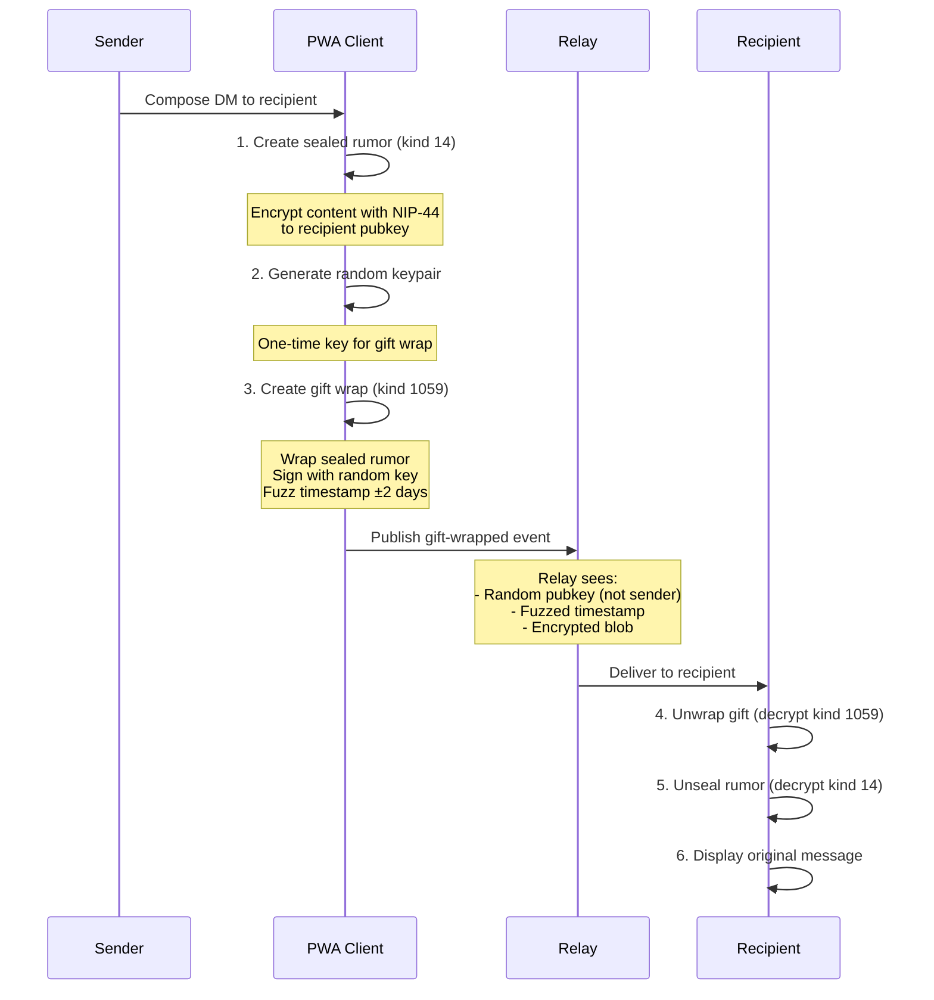
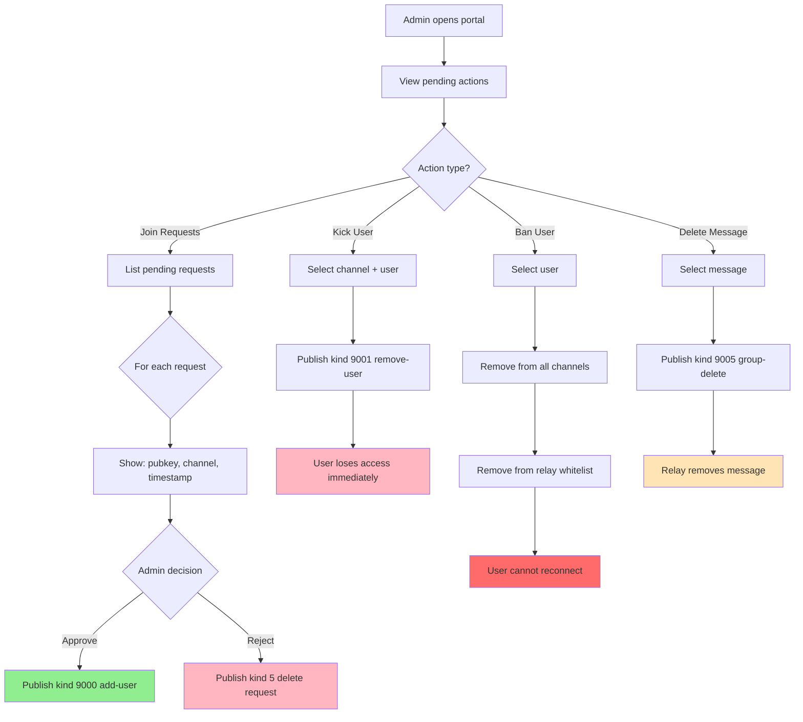
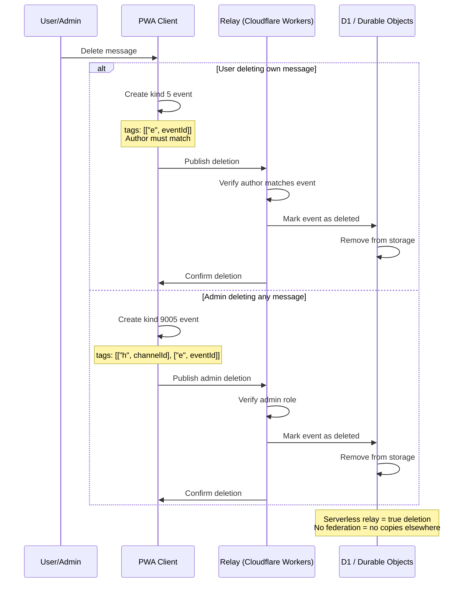
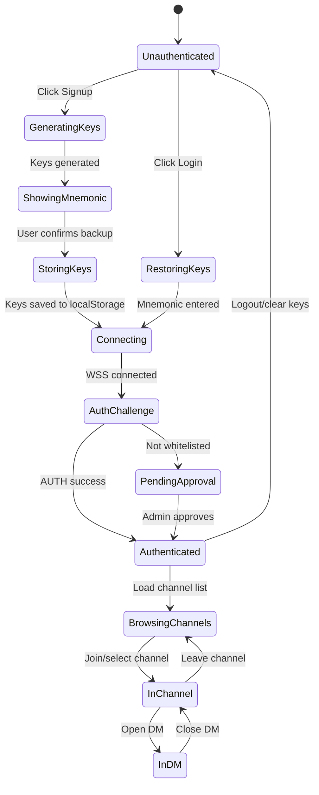

[← Back to Main README](../../README.md)

# Minimoonoir Nostr - SPARC Pseudocode & Flows

> **Phase:** Pseudocode Design
> **Version:** 0.1.0-draft
> **Date:** 2024-12-11

---

## 1. Key Decisions Summary

| Area | Decision |
|------|----------|
| DM Routing | External Nostr clients connect to Minimoonoir relay only |
| Cohort UX | Single unified interface - all cohort channels visible together |
| Admin Model | Single super-admin user |
| Channel Discovery | Name + description + member count shown |

---

## 2. User Onboarding Flow



---

## 3. Key Generation Pseudocode

```typescript
// lib/nostr/keys.ts

import { generateMnemonic, mnemonicToSeedSync } from 'bip39'
import { HDKey } from '@scure/bip32'
import { bytesToHex } from '@noble/hashes/utils'

const NIP06_PATH = "m/44'/1237'/0'/0/0"

interface KeyPair {
  mnemonic: string
  privateKey: string  // hex
  publicKey: string   // hex
}

function generateNewIdentity(): KeyPair {
  // 1. Generate 12-word mnemonic (128 bits entropy)
  const mnemonic = generateMnemonic(128)

  // 2. Derive seed from mnemonic (no passphrase)
  const seed = mnemonicToSeedSync(mnemonic, '')

  // 3. Derive HD key at NIP-06 path
  const hdKey = HDKey.fromMasterSeed(seed)
  const derived = hdKey.derive(NIP06_PATH)

  // 4. Extract keys
  const privateKey = bytesToHex(derived.privateKey!)
  const publicKey = bytesToHex(derived.publicKey!.slice(1)) // Remove prefix byte

  return { mnemonic, privateKey, publicKey }
}

function restoreFromMnemonic(mnemonic: string): Omit<KeyPair, 'mnemonic'> {
  const seed = mnemonicToSeedSync(mnemonic, '')
  const hdKey = HDKey.fromMasterSeed(seed)
  const derived = hdKey.derive(NIP06_PATH)

  return {
    privateKey: bytesToHex(derived.privateKey!),
    publicKey: bytesToHex(derived.publicKey!.slice(1))
  }
}
```

---

## 4. Channel Discovery Flow



---

## 5. Channel Data Structure

```typescript
// lib/stores/channels.ts

interface Channel {
  id: string                          // h tag value (group ID)
  name: string                        // From kind 39000 metadata
  description: string
  picture?: string                    // Avatar URL
  cohorts: ('business' | 'moomaa-tribe')[]
  visibility: 'listed' | 'unlisted' | 'preview'
  isEncrypted: boolean                // E2E vs transport only
  memberCount: number
  createdAt: number

  // User-specific state
  isMember: boolean
  hasRequestPending: boolean
}

interface ChannelListState {
  channels: Channel[]
  loading: boolean
  error: string | null
}

// Fetch channels from relay
async function fetchChannels(relay: Relay, userPubkey: string): Promise<Channel[]> {
  // 1. Get all group metadata (kind 39000)
  const metadataEvents = await relay.list([
    { kinds: [39000] }
  ])

  // 2. Get membership lists (kind 39002)
  const memberEvents = await relay.list([
    { kinds: [39002] }
  ])

  // 3. Check user's pending requests (kind 9021)
  const pendingRequests = await relay.list([
    { kinds: [9021], authors: [userPubkey] }
  ])

  // 4. Build channel objects
  return metadataEvents.map(event => {
    const groupId = event.tags.find(t => t[0] === 'd')?.[1]
    const members = memberEvents.find(m =>
      m.tags.find(t => t[0] === 'd')?.[1] === groupId
    )

    return {
      id: groupId,
      name: JSON.parse(event.content).name,
      description: JSON.parse(event.content).about,
      cohorts: event.tags
        .filter(t => t[0] === 'cohort')
        .map(t => t[1]),
      visibility: event.tags.find(t => t[0] === 'visibility')?.[1] || 'listed',
      isEncrypted: event.tags.some(t => t[0] === 'encrypted'),
      memberCount: members?.tags.filter(t => t[0] === 'p').length || 0,
      isMember: members?.tags.some(t => t[0] === 'p' && t[1] === userPubkey),
      hasRequestPending: pendingRequests.some(r =>
        r.tags.find(t => t[0] === 'h')?.[1] === groupId
      )
    }
  })
}
```

---

## 6. Join Request Flow



---

## 7. Join Request Pseudocode

```typescript
// lib/nostr/groups.ts

import { type Event } from 'nostr-tools'

const KIND_JOIN_REQUEST = 9021  // Custom kind for join requests
const KIND_ADD_USER = 9000      // NIP-29 add user
const KIND_REMOVE_USER = 9001   // NIP-29 remove user

interface JoinRequest {
  id: string
  pubkey: string
  channelId: string
  createdAt: number
  status: 'pending' | 'approved' | 'rejected'
}

// User: Request to join a channel
async function requestJoin(
  channelId: string,
  privateKey: string,
  relay: Relay
): Promise<void> {
  const event: Event = {
    kind: KIND_JOIN_REQUEST,
    pubkey: getPublicKey(privateKey),
    created_at: Math.floor(Date.now() / 1000),
    tags: [
      ['h', channelId],
    ],
    content: '',  // Optional: user message to admin
  }

  const signed = finalizeEvent(event, privateKey)
  await relay.publish(signed)
}

// Admin: Approve join request
async function approveJoin(
  request: JoinRequest,
  adminPrivateKey: string,
  relay: Relay
): Promise<void> {
  // 1. Create add-user event (NIP-29)
  const addEvent: Event = {
    kind: KIND_ADD_USER,
    pubkey: getPublicKey(adminPrivateKey),
    created_at: Math.floor(Date.now() / 1000),
    tags: [
      ['h', request.channelId],
      ['p', request.pubkey],
    ],
    content: '',
  }

  const signed = finalizeEvent(addEvent, adminPrivateKey)
  await relay.publish(signed)

  // 2. Delete the join request (NIP-09)
  const deleteEvent: Event = {
    kind: 5,
    pubkey: getPublicKey(adminPrivateKey),
    created_at: Math.floor(Date.now() / 1000),
    tags: [
      ['e', request.id],
    ],
    content: 'Approved',
  }

  await relay.publish(finalizeEvent(deleteEvent, adminPrivateKey))
}

// Admin: Reject join request
async function rejectJoin(
  request: JoinRequest,
  adminPrivateKey: string,
  relay: Relay
): Promise<void> {
  // Just delete the request with rejection note
  const deleteEvent: Event = {
    kind: 5,
    pubkey: getPublicKey(adminPrivateKey),
    created_at: Math.floor(Date.now() / 1000),
    tags: [
      ['e', request.id],
    ],
    content: 'Rejected',
  }

  await relay.publish(finalizeEvent(deleteEvent, adminPrivateKey))
}
```

---

## 8. Messaging Flow



---

## 9. Message Encryption Pseudocode

```typescript
// lib/nostr/encryption.ts

import { nip44 } from 'nostr-tools'

interface EncryptedMessage {
  event: Event
  decryptedContent?: string  // Only populated for recipient
}

// Encrypt message for E2E channel
async function encryptChannelMessage(
  content: string,
  channelId: string,
  senderPrivkey: string,
  memberPubkeys: string[]
): Promise<Event> {
  const senderPubkey = getPublicKey(senderPrivkey)

  // Create encryption payload for each member
  const encryptedPayloads: Record<string, string> = {}

  for (const memberPubkey of memberPubkeys) {
    // NIP-44 conversation key
    const conversationKey = nip44.v2.utils.getConversationKey(
      senderPrivkey,
      memberPubkey
    )

    // Encrypt content
    encryptedPayloads[memberPubkey] = nip44.v2.encrypt(
      content,
      conversationKey
    )
  }

  // Create event with encrypted content
  const event: Event = {
    kind: 9,
    pubkey: senderPubkey,
    created_at: Math.floor(Date.now() / 1000),
    tags: [
      ['h', channelId],
      ['encrypted', 'nip44'],
      // Add recipient hints for efficient decryption
      ...memberPubkeys.map(pk => ['p', pk])
    ],
    content: JSON.stringify(encryptedPayloads),
  }

  return finalizeEvent(event, senderPrivkey)
}

// Decrypt message as recipient
function decryptChannelMessage(
  event: Event,
  recipientPrivkey: string
): string | null {
  const recipientPubkey = getPublicKey(recipientPrivkey)

  try {
    const payloads = JSON.parse(event.content)
    const myPayload = payloads[recipientPubkey]

    if (!myPayload) return null

    const conversationKey = nip44.v2.utils.getConversationKey(
      recipientPrivkey,
      event.pubkey
    )

    return nip44.v2.decrypt(myPayload, conversationKey)
  } catch {
    return null
  }
}
```

---

## 10. Direct Message Flow (NIP-17 + NIP-59)



---

## 11. Gift-Wrapped DM Pseudocode

```typescript
// lib/nostr/dm.ts

import { nip44, nip59 } from 'nostr-tools'

const KIND_SEALED_RUMOR = 14
const KIND_GIFT_WRAP = 1059

// Send a gift-wrapped DM
async function sendDM(
  content: string,
  recipientPubkey: string,
  senderPrivkey: string,
  relay: Relay
): Promise<void> {
  const senderPubkey = getPublicKey(senderPrivkey)

  // 1. Create the rumor (unsigned inner event)
  const rumor = {
    kind: KIND_SEALED_RUMOR,
    pubkey: senderPubkey,
    created_at: Math.floor(Date.now() / 1000),
    tags: [['p', recipientPubkey]],
    content: content,
  }

  // 2. Seal the rumor (encrypt to recipient)
  const conversationKey = nip44.v2.utils.getConversationKey(
    senderPrivkey,
    recipientPubkey
  )
  const sealedContent = nip44.v2.encrypt(
    JSON.stringify(rumor),
    conversationKey
  )

  const seal = {
    kind: 13,  // Sealed event
    pubkey: senderPubkey,
    created_at: Math.floor(Date.now() / 1000),
    tags: [],
    content: sealedContent,
  }
  const signedSeal = finalizeEvent(seal, senderPrivkey)

  // 3. Gift wrap with random key
  const randomPrivkey = generateSecretKey()
  const randomPubkey = getPublicKey(randomPrivkey)

  // Fuzz timestamp ±2 days
  const fuzzedTimestamp = Math.floor(Date.now() / 1000) +
    Math.floor(Math.random() * 4 * 24 * 60 * 60) - 2 * 24 * 60 * 60

  const wrapConversationKey = nip44.v2.utils.getConversationKey(
    randomPrivkey,
    recipientPubkey
  )

  const giftWrap = {
    kind: KIND_GIFT_WRAP,
    pubkey: randomPubkey,  // Random, not sender!
    created_at: fuzzedTimestamp,
    tags: [['p', recipientPubkey]],
    content: nip44.v2.encrypt(
      JSON.stringify(signedSeal),
      wrapConversationKey
    ),
  }

  const signedGiftWrap = finalizeEvent(giftWrap, randomPrivkey)

  // 4. Publish to relay
  await relay.publish(signedGiftWrap)
}

// Receive and unwrap a DM
function receiveDM(
  giftWrapEvent: Event,
  recipientPrivkey: string
): { content: string; senderPubkey: string; timestamp: number } | null {
  try {
    // 1. Unwrap gift
    const wrapConversationKey = nip44.v2.utils.getConversationKey(
      recipientPrivkey,
      giftWrapEvent.pubkey
    )
    const sealJson = nip44.v2.decrypt(
      giftWrapEvent.content,
      wrapConversationKey
    )
    const seal = JSON.parse(sealJson)

    // 2. Unseal
    const sealConversationKey = nip44.v2.utils.getConversationKey(
      recipientPrivkey,
      seal.pubkey
    )
    const rumorJson = nip44.v2.decrypt(seal.content, sealConversationKey)
    const rumor = JSON.parse(rumorJson)

    return {
      content: rumor.content,
      senderPubkey: rumor.pubkey,
      timestamp: rumor.created_at,
    }
  } catch {
    return null
  }
}
```

---

## 12. Admin Moderation Flow



---

## 13. Admin Actions Pseudocode

```typescript
// lib/nostr/admin.ts

const KIND_ADD_USER = 9000
const KIND_REMOVE_USER = 9001
const KIND_DELETE_EVENT = 9005

interface AdminActions {
  // Kick user from specific channel
  kickFromChannel(
    userPubkey: string,
    channelId: string,
    adminPrivkey: string,
    relay: Relay
  ): Promise<void>

  // Ban user from entire system
  banUser(
    userPubkey: string,
    adminPrivkey: string,
    relay: Relay
  ): Promise<void>

  // Delete a message
  deleteMessage(
    eventId: string,
    channelId: string,
    adminPrivkey: string,
    relay: Relay
  ): Promise<void>
}

const adminActions: AdminActions = {
  async kickFromChannel(userPubkey, channelId, adminPrivkey, relay) {
    const event: Event = {
      kind: KIND_REMOVE_USER,
      pubkey: getPublicKey(adminPrivkey),
      created_at: Math.floor(Date.now() / 1000),
      tags: [
        ['h', channelId],
        ['p', userPubkey],
      ],
      content: 'Removed by admin',
    }

    await relay.publish(finalizeEvent(event, adminPrivkey))
  },

  async banUser(userPubkey, adminPrivkey, relay) {
    // 1. Get all channels
    const channels = await fetchAllChannels(relay)

    // 2. Remove from each channel
    for (const channel of channels) {
      if (channel.members.includes(userPubkey)) {
        await this.kickFromChannel(userPubkey, channel.id, adminPrivkey, relay)
      }
    }

    // 3. Update relay whitelist (requires relay admin API)
    await updateRelayWhitelist('remove', userPubkey)
  },

  async deleteMessage(eventId, channelId, adminPrivkey, relay) {
    const event: Event = {
      kind: KIND_DELETE_EVENT,
      pubkey: getPublicKey(adminPrivkey),
      created_at: Math.floor(Date.now() / 1000),
      tags: [
        ['h', channelId],
        ['e', eventId],
      ],
      content: 'Deleted by admin',
    }

    await relay.publish(finalizeEvent(event, adminPrivkey))
  },
}
```

---

## 14. Message Deletion Flow



---

## 15. State Management Overview



---

## 16. Component State Interfaces

```typescript
// lib/stores/types.ts

type AppState =
  | { status: 'unauthenticated' }
  | { status: 'generating-keys' }
  | { status: 'showing-mnemonic'; mnemonic: string; keys: KeyPair }
  | { status: 'connecting'; keys: KeyPair }
  | { status: 'pending-approval'; keys: KeyPair }
  | { status: 'authenticated'; keys: KeyPair; user: UserProfile }

interface UserProfile {
  pubkey: string
  name?: string
  avatar?: string
  cohorts: ('business' | 'moomaa-tribe')[]
  isAdmin: boolean
}

interface ChannelState {
  channels: Channel[]
  currentChannel: Channel | null
  messages: Message[]
  loading: boolean
}

interface DMState {
  conversations: Conversation[]
  currentConversation: Conversation | null
  messages: Message[]
}

interface AdminState {
  pendingRequests: JoinRequest[]
  users: UserProfile[]
  loading: boolean
}
```

---

*Next Phase: Refinement & TDD (04-refinement.md)*
