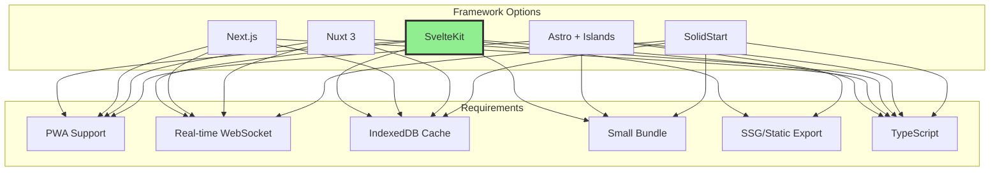
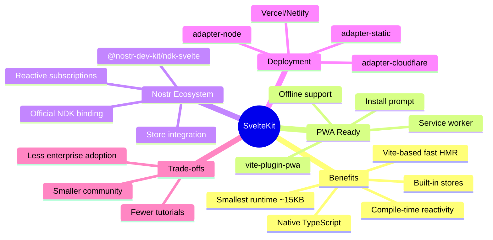
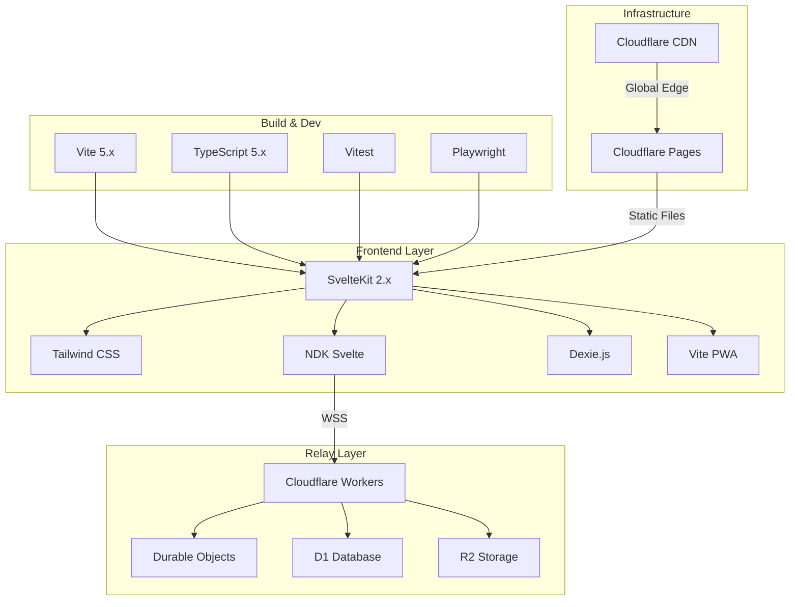
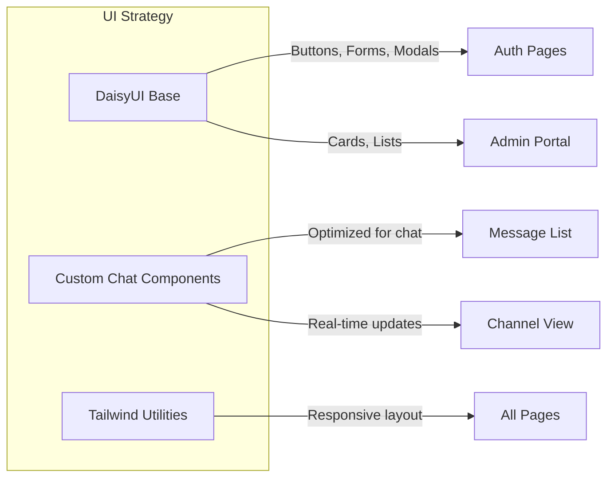
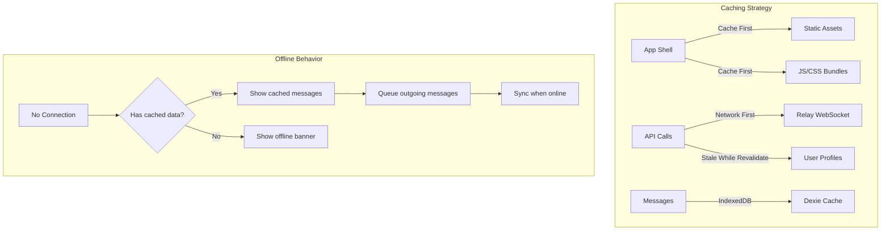
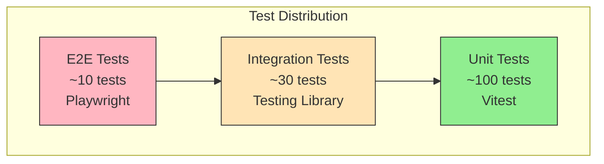
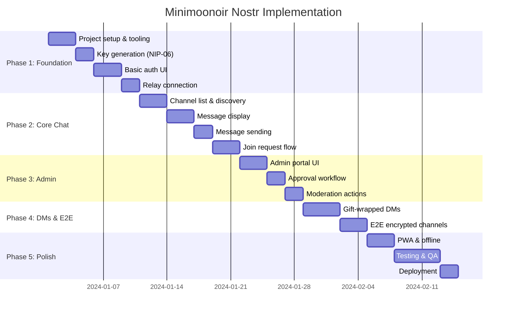
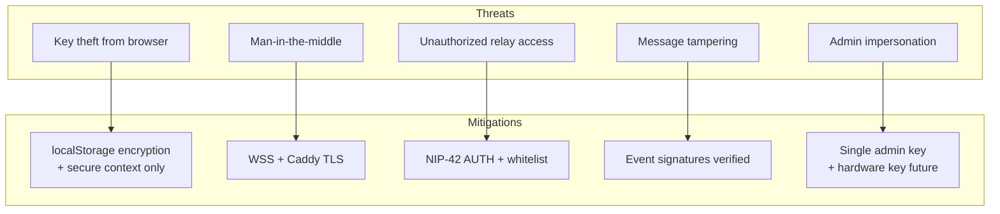

[← Back to Main README](../../README.md)

# Minimoonoir Nostr - SPARC Refinement & Technology Selection

> **Phase:** Refinement (Technology Decisions + TDD Planning)
> **Version:** 0.1.0-draft
> **Date:** 2024-12-11

---

## 1. Web Framework Selection

### 1.1 Candidates Evaluated



### 1.2 Framework Comparison

| Criteria | SvelteKit | Next.js | Nuxt 3 | Astro | SolidStart |
|----------|-----------|---------|--------|-------|------------|
| **Bundle Size** | ~15KB | ~80KB | ~60KB | ~10KB | ~7KB |
| **PWA Plugin** | ✅ vite-pwa | ✅ next-pwa | ✅ @vite-pwa | ✅ @vite-pwa | ⚠️ Manual |
| **WebSocket DX** | ✅ Native | ✅ Native | ✅ Native | ⚠️ Islands | ✅ Native |
| **Static Export** | ✅ adapter-static | ✅ output: export | ✅ ssr: false | ✅ Default | ⚠️ Beta |
| **Learning Curve** | Low | Medium | Medium | Low | Medium |
| **Nostr SDK Support** | ✅ NDK Svelte | ✅ Generic | ✅ Generic | ⚠️ Manual | ⚠️ Manual |
| **Community Size** | Medium | Large | Large | Growing | Small |
| **Reactivity Model** | Compile-time | Runtime (React) | Runtime (Vue) | Islands | Fine-grained |

### 1.3 Recommendation: **SvelteKit**



**Rationale:**
1. **@nostr-dev-kit/ndk-svelte** - Official NDK binding with Svelte stores
2. **Smallest bundle** - Critical for PWA on mobile
3. **Compile-time reactivity** - No virtual DOM overhead for real-time chat
4. **Built-in stores** - Perfect for WebSocket subscriptions
5. **Static export** - Deploy anywhere, no server required

---

## 2. Full Technology Stack

### 2.1 Stack Overview



### 2.2 Package Manifest

```json
{
  "name": "minimoonoir-nostr",
  "version": "0.1.0",
  "type": "module",
  "scripts": {
    "dev": "vite dev",
    "build": "vite build",
    "preview": "vite preview",
    "test": "vitest",
    "test:e2e": "playwright test",
    "check": "svelte-kit sync && svelte-check --tsconfig ./tsconfig.json",
    "lint": "eslint ."
  },
  "dependencies": {
    "@nostr-dev-kit/ndk": "^2.x",
    "@nostr-dev-kit/ndk-svelte": "^2.x",
    "@nostr-dev-kit/ndk-cache-dexie": "^2.x",
    "nostr-tools": "^2.x",
    "bip39": "^3.x",
    "@scure/bip32": "^1.x",
    "dexie": "^4.x"
  },
  "devDependencies": {
    "@sveltejs/adapter-static": "^3.x",
    "@sveltejs/kit": "^2.x",
    "@sveltejs/vite-plugin-svelte": "^3.x",
    "svelte": "^4.x",
    "svelte-check": "^3.x",
    "tailwindcss": "^3.x",
    "typescript": "^5.x",
    "vite": "^5.x",
    "vite-plugin-pwa": "^0.x",
    "vitest": "^1.x",
    "playwright": "^1.x",
    "@testing-library/svelte": "^4.x"
  }
}
```

---

## 3. Project Structure

```
minimoonoir-nostr/
├── docs/
│   └── sparc/                    # SPARC documentation
│
├── src/
│   ├── lib/
│   │   ├── nostr/
│   │   │   ├── keys.ts           # NIP-06 key generation
│   │   │   ├── encryption.ts     # NIP-44 encryption
│   │   │   ├── events.ts         # Event helpers
│   │   │   ├── dm.ts             # NIP-17/59 gift-wrap DMs
│   │   │   ├── groups.ts         # NIP-29 group operations
│   │   │   └── relay.ts          # NDK setup & connection
│   │   │
│   │   ├── stores/
│   │   │   ├── auth.ts           # Authentication state
│   │   │   ├── channels.ts       # Channel subscriptions
│   │   │   ├── messages.ts       # Message store
│   │   │   ├── dm.ts             # DM conversations
│   │   │   └── admin.ts          # Admin state
│   │   │
│   │   ├── components/
│   │   │   ├── auth/
│   │   │   │   ├── Signup.svelte
│   │   │   │   ├── Login.svelte
│   │   │   │   └── MnemonicDisplay.svelte
│   │   │   │
│   │   │   ├── chat/
│   │   │   │   ├── ChannelList.svelte
│   │   │   │   ├── ChannelHeader.svelte
│   │   │   │   ├── MessageList.svelte
│   │   │   │   ├── MessageItem.svelte
│   │   │   │   ├── MessageInput.svelte
│   │   │   │   └── JoinRequestButton.svelte
│   │   │   │
│   │   │   ├── dm/
│   │   │   │   ├── ConversationList.svelte
│   │   │   │   ├── DMView.svelte
│   │   │   │   └── NewDMDialog.svelte
│   │   │   │
│   │   │   ├── admin/
│   │   │   │   ├── Dashboard.svelte
│   │   │   │   ├── PendingRequests.svelte
│   │   │   │   ├── UserList.svelte
│   │   │   │   └── ChannelManager.svelte
│   │   │   │
│   │   │   └── ui/
│   │   │       ├── Button.svelte
│   │   │       ├── Input.svelte
│   │   │       ├── Modal.svelte
│   │   │       ├── Avatar.svelte
│   │   │       └── Loading.svelte
│   │   │
│   │   └── utils/
│   │       ├── storage.ts        # localStorage/IndexedDB
│   │       ├── time.ts           # Date formatting
│   │       └── validation.ts     # Input validation
│   │
│   ├── routes/
│   │   ├── +layout.svelte        # Root layout
│   │   ├── +page.svelte          # Landing/login
│   │   ├── signup/+page.svelte   # Signup flow
│   │   ├── chat/
│   │   │   ├── +page.svelte      # Channel list
│   │   │   └── [channelId]/+page.svelte
│   │   ├── dm/
│   │   │   ├── +page.svelte      # DM list
│   │   │   └── [pubkey]/+page.svelte
│   │   └── admin/
│   │       └── +page.svelte      # Admin portal
│   │
│   ├── app.html                  # HTML template
│   ├── app.css                   # Global styles
│   └── service-worker.ts         # PWA service worker
│
├── static/
│   ├── manifest.json             # PWA manifest
│   ├── icons/                    # App icons
│   └── favicon.ico
│
├── tests/
│   ├── unit/
│   │   ├── keys.test.ts
│   │   ├── encryption.test.ts
│   │   └── events.test.ts
│   └── e2e/
│       ├── signup.spec.ts
│       ├── channels.spec.ts
│       └── messaging.spec.ts
│
├── relay/
│   ├── workers/
│   │   ├── handler.ts            # Cloudflare Workers relay
│   │   ├── durable-objects.ts    # Event storage
│   │   └── config.ts             # Relay configuration
│   └── whitelist.json            # Pubkey whitelist
│
├── svelte.config.js
├── vite.config.ts
├── tailwind.config.js
├── tsconfig.json
└── package.json
```

---

## 4. UI Component Library Decision

### 4.1 Options

| Library | Pros | Cons |
|---------|------|------|
| **Shadcn-svelte** | Radix-based, accessible, copy-paste | Heavy, complex |
| **Skeleton UI** | Svelte-native, theming | Opinionated |
| **DaisyUI** | Tailwind plugin, simple | Less customizable |
| **Custom** | Full control, minimal | More work |

### 4.2 Recommendation: **DaisyUI + Custom**



**Rationale:**
- DaisyUI provides ready-made components for forms, modals, buttons
- Custom components for chat (performance-critical, specific UX)
- Minimal CSS overhead with Tailwind purging

---

## 5. PWA Configuration

### 5.1 Service Worker Strategy



### 5.2 PWA Manifest

```json
{
  "name": "Minimoonoir Chat",
  "short_name": "Minimoonoir",
  "description": "Private community chat for Minimoonoir retreat",
  "start_url": "/",
  "display": "standalone",
  "background_color": "#1a1a2e",
  "theme_color": "#16213e",
  "icons": [
    {
      "src": "/icons/icon-192.png",
      "sizes": "192x192",
      "type": "image/png"
    },
    {
      "src": "/icons/icon-512.png",
      "sizes": "512x512",
      "type": "image/png"
    }
  ]
}
```

### 5.3 Vite PWA Config

```typescript
// vite.config.ts
import { sveltekit } from '@sveltejs/kit/vite'
import { SvelteKitPWA } from '@vite-pwa/sveltekit'

export default {
  plugins: [
    sveltekit(),
    SvelteKitPWA({
      strategies: 'generateSW',
      registerType: 'autoUpdate',
      manifest: {
        name: 'Minimoonoir Chat',
        short_name: 'Minimoonoir',
        theme_color: '#16213e',
      },
      workbox: {
        globPatterns: ['**/*.{js,css,html,ico,png,svg,woff2}'],
        runtimeCaching: [
          {
            urlPattern: /^https:\/\/.*\.(?:png|jpg|jpeg|svg|gif)$/,
            handler: 'CacheFirst',
            options: {
              cacheName: 'images',
              expiration: { maxEntries: 100, maxAgeSeconds: 60 * 60 * 24 * 30 }
            }
          }
        ]
      }
    })
  ]
}
```

---

## 6. Testing Strategy

### 6.1 Test Pyramid



### 6.2 Test Coverage Goals

| Layer | Coverage | Focus |
|-------|----------|-------|
| **Unit** | 90%+ | Crypto, key derivation, encryption |
| **Integration** | 70%+ | Store logic, NDK interaction |
| **E2E** | Critical paths | Signup, join channel, send message |

### 6.3 Example Unit Test

```typescript
// tests/unit/keys.test.ts
import { describe, it, expect } from 'vitest'
import { generateNewIdentity, restoreFromMnemonic } from '$lib/nostr/keys'

describe('Key Generation (NIP-06)', () => {
  it('generates valid 12-word mnemonic', () => {
    const { mnemonic } = generateNewIdentity()
    expect(mnemonic.split(' ')).toHaveLength(12)
  })

  it('derives deterministic keys from mnemonic', () => {
    const mnemonic = 'abandon abandon abandon abandon abandon abandon abandon abandon abandon abandon abandon about'

    const keys1 = restoreFromMnemonic(mnemonic)
    const keys2 = restoreFromMnemonic(mnemonic)

    expect(keys1.publicKey).toBe(keys2.publicKey)
    expect(keys1.privateKey).toBe(keys2.privateKey)
  })

  it('produces valid secp256k1 keys', () => {
    const { publicKey, privateKey } = generateNewIdentity()

    expect(publicKey).toMatch(/^[0-9a-f]{64}$/)
    expect(privateKey).toMatch(/^[0-9a-f]{64}$/)
  })
})
```

### 6.4 Example E2E Test

```typescript
// tests/e2e/signup.spec.ts
import { test, expect } from '@playwright/test'

test.describe('User Signup', () => {
  test('completes signup flow and shows mnemonic', async ({ page }) => {
    await page.goto('/signup')

    // Click generate keys
    await page.click('[data-testid="generate-keys"]')

    // Verify mnemonic displayed
    const mnemonic = await page.locator('[data-testid="mnemonic"]')
    await expect(mnemonic).toBeVisible()

    const words = await mnemonic.textContent()
    expect(words?.split(' ')).toHaveLength(12)

    // Copy mnemonic
    await page.click('[data-testid="copy-mnemonic"]')

    // Confirm backup
    await page.click('[data-testid="confirm-backup"]')

    // Should redirect to pending approval
    await expect(page).toHaveURL(/pending/)
  })
})
```

---

## 7. Implementation Phases

### 7.1 Phase Roadmap



### 7.2 Phase Details

| Phase | Duration | Deliverables |
|-------|----------|--------------|
| **1. Foundation** | ~10 days | Project scaffolding, key gen, basic auth, relay connect |
| **2. Core Chat** | ~11 days | Channel list, messaging, join requests |
| **3. Admin** | ~7 days | Admin portal, approvals, kick/ban |
| **4. DMs & E2E** | ~7 days | Gift-wrap DMs, encrypted channels |
| **5. Polish** | ~10 days | PWA, offline, testing, deployment |

**Total Estimated:** ~45 days (single developer)

---

## 8. Relay Deployment

### 8.1 Cloudflare Workers Configuration

```typescript
// relay/workers/handler.ts
export default {
  async fetch(request: Request, env: Env): Promise<Response> {
    const upgradeHeader = request.headers.get('Upgrade');
    if (upgradeHeader === 'websocket') {
      return handleWebSocket(request, env);
    }
    return new Response('Relay endpoint requires WebSocket', { status: 400 });
  }
};

async function handleWebSocket(request: Request, env: Env): Promise<Response> {
  const pair = new WebSocketPair();
  const [client, server] = Object.values(pair);

  // Get Durable Object instance
  const id = env.RELAY_STATE.idFromName('relay');
  const stub = env.RELAY_STATE.get(id);

  // Pass WebSocket to Durable Object
  await stub.fetch(request, {
    headers: { Upgrade: 'websocket' },
  });

  return new Response(null, {
    status: 101,
    webSocket: client,
  });
}
```

### 8.2 Durable Objects Setup

```typescript
// relay/workers/durable-objects.ts
export class RelayState {
  private storage: DurableObjectStorage;
  private sessions: Set<WebSocket>;

  constructor(state: DurableObjectState) {
    this.storage = state.storage;
    this.sessions = new Set();
  }

  async fetch(request: Request): Promise<Response> {
    const upgradeHeader = request.headers.get('Upgrade');
    if (upgradeHeader !== 'websocket') {
      return new Response('Expected WebSocket', { status: 400 });
    }

    const pair = new WebSocketPair();
    const [client, server] = Object.values(pair);

    server.accept();
    this.sessions.add(server);

    server.addEventListener('message', async (msg) => {
      await this.handleNostrMessage(JSON.parse(msg.data), server);
    });

    return new Response(null, {
      status: 101,
      webSocket: client,
    });
  }

  async handleNostrMessage(msg: any, socket: WebSocket) {
    // Handle Nostr protocol messages
    // Store events, handle subscriptions, etc.
  }
}
```

### 8.3 Wrangler Configuration

```toml
# wrangler.toml
name = "minimoonoir-relay"
main = "relay/workers/handler.ts"
compatibility_date = "2024-12-13"

[durable_objects]
bindings = [
  { name = "RELAY_STATE", class_name = "RelayState" }
]

[[migrations]]
tag = "v1"
new_classes = ["RelayState"]

[[r2_buckets]]
binding = "RELAY_BACKUP"
bucket_name = "minimoonoir-backups"
```

---

## 9. Security Considerations

### 9.1 Threat Model



### 9.2 Security Checklist

- [ ] All relay connections via WSS (TLS)
- [ ] NIP-42 AUTH enforced on relay
- [ ] Pubkey whitelist managed by admin
- [ ] Private keys never leave browser
- [ ] E2E encryption for private channels
- [ ] Gift-wrap for DM metadata protection
- [ ] Content Security Policy headers
- [ ] HSTS enabled on Caddy

---

## 10. Open Items for Future

| Item | Priority | Notes |
|------|----------|-------|
| Push notifications | Medium | Web Push API, requires backend |
| LNbits integration | Low | Future: payments, tipping |
| RGB stablecoins | Low | Future: course payments |
| Multiple admins | Low | When team grows |
| Voice/video | Low | Not in v1 scope |
| File sharing | Medium | Images via NIP-94 |

---

*Next Phase: Completion & Deployment (05-completion.md)*
