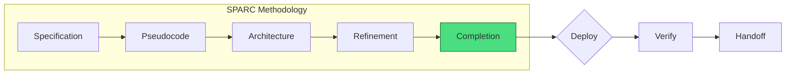
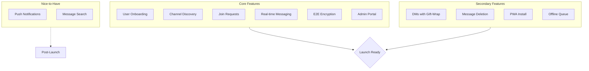
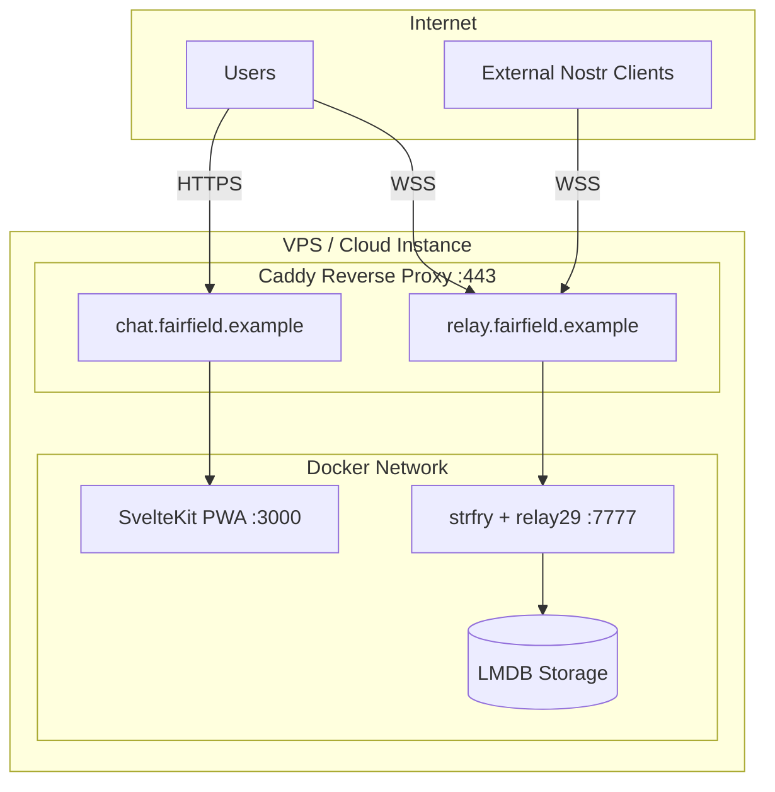
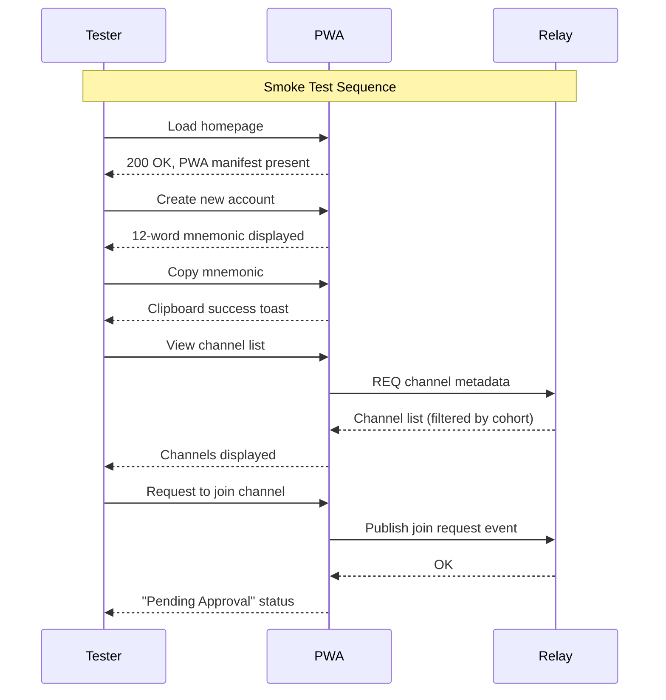
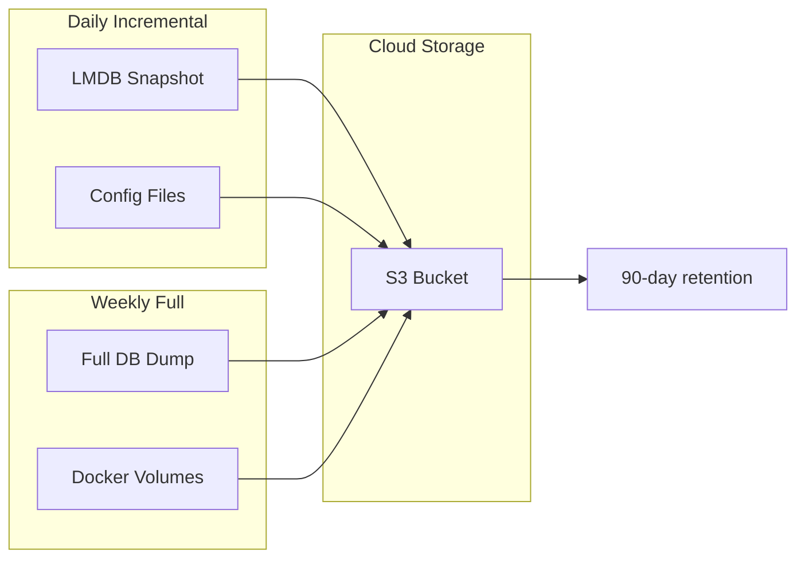
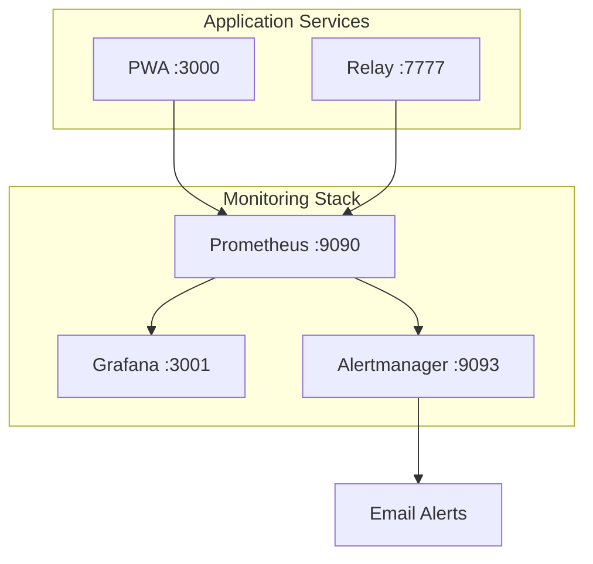
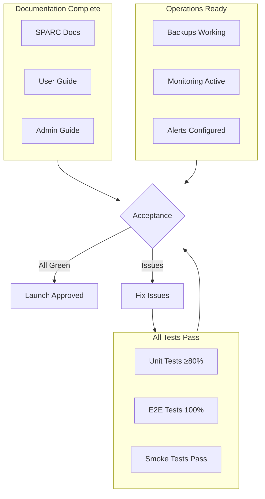
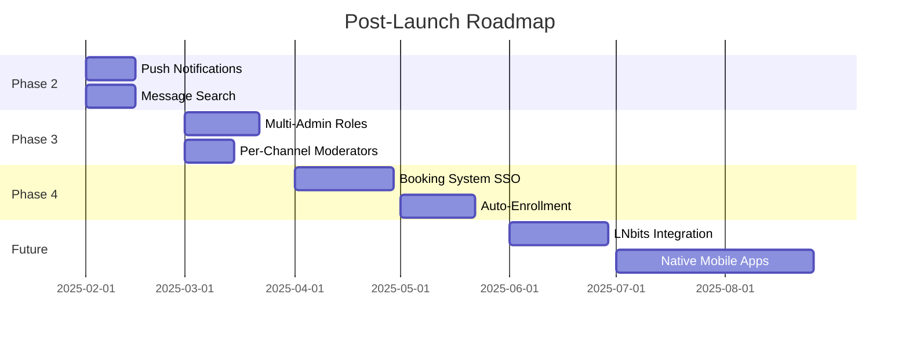

# Fairfield Nostr - SPARC Completion

> **Project:** Private Chatroom System for Residential Retreat & Course Booking
> **Version:** 0.1.0-draft
> **Date:** 2024-12-11
> **Status:** Pre-Development

---

## 1. Completion Overview

This document defines the deployment, verification, and handoff criteria for Fairfield Nostr. It serves as the final SPARC phase checklist ensuring production readiness.



---

## 2. Pre-Deployment Checklist

### 2.1 Code Quality Gates

| Gate | Tool | Threshold | Status |
|------|------|-----------|--------|
| Unit Test Coverage | Vitest | ≥80% | [ ] |
| E2E Test Pass | Playwright | 100% | [ ] |
| Type Safety | TypeScript | 0 errors | [ ] |
| Linting | ESLint | 0 errors | [ ] |
| Bundle Size | Vite | <100KB gzip | [ ] |
| Lighthouse PWA | Chrome | ≥90 | [ ] |
| Security Audit | npm audit | 0 critical | [ ] |

### 2.2 Feature Completion Matrix



| Feature | Priority | Acceptance Criteria | Status |
|---------|----------|---------------------|--------|
| BIP-39 Key Generation | P0 | 12-word mnemonic generates valid keypair | [ ] |
| Mnemonic Copy-to-Clipboard | P0 | One-click copy with visual feedback | [ ] |
| localStorage Persistence | P0 | Keys survive browser restart | [ ] |
| Cohort Channel Listing | P0 | Business/Moomaa segregation correct | [ ] |
| Request-to-Join Flow | P0 | Request queued, admin notified | [ ] |
| Admin Approval Panel | P0 | Approve/reject with instant effect | [ ] |
| NIP-44 E2E for Private Rooms | P0 | Messages unreadable on relay | [ ] |
| WebSocket Real-time | P0 | Messages appear <500ms | [ ] |
| NIP-09 Message Deletion | P1 | User can delete own messages | [ ] |
| Admin Message Deletion | P1 | Admin can delete any message | [ ] |
| Gift-Wrapped DMs | P1 | NIP-59 metadata protection | [ ] |
| PWA Manifest | P1 | Installable on mobile | [ ] |
| Offline Message Queue | P2 | Messages queued when offline | [ ] |
| Push Notifications | P3 | Optional, if time permits | [ ] |

---

## 3. Infrastructure Deployment

### 3.1 Server Requirements

| Component | Minimum Spec | Recommended |
|-----------|--------------|-------------|
| **VPS/Cloud** | 1 vCPU, 1GB RAM | 2 vCPU, 2GB RAM |
| **Storage** | 10GB SSD | 20GB SSD |
| **OS** | Ubuntu 22.04 LTS | Ubuntu 24.04 LTS |
| **Docker** | 24.x | Latest stable |
| **Domain** | Required (TLS) | Subdomain for relay |

### 3.2 Deployment Architecture



### 3.3 Deployment Commands

```bash
# 1. Clone repository
git clone https://github.com/jjohare/fairfield-nostr.git
cd fairfield-nostr

# 2. Configure environment
cp .env.example .env
nano .env  # Set RELAY_URL, ADMIN_PUBKEY, etc.

# 3. Build and deploy
docker compose build
docker compose up -d

# 4. Verify services
docker compose ps
curl -I https://chat.fairfield.example
curl -I https://relay.fairfield.example
```

### 3.4 DNS Configuration

```
# DNS Records Required
chat.fairfield.example    A     <server-ip>
relay.fairfield.example   A     <server-ip>
```

---

## 4. Environment Configuration

### 4.1 Required Environment Variables

```bash
# .env file
# ─────────────────────────────────────────────────────────

# Relay Configuration
RELAY_URL=wss://relay.fairfield.example
RELAY_NAME="Fairfield Private Relay"
RELAY_DESCRIPTION="Private relay for Fairfield community"
RELAY_CONTACT=admin@fairfield.example

# Admin Configuration
ADMIN_PUBKEY=npub1...  # Hex or npub format
ADMIN_DISPLAY_NAME="Fairfield Admin"

# PWA Configuration
PUBLIC_APP_NAME="Fairfield Chat"
PUBLIC_APP_URL=https://chat.fairfield.example

# Backup Configuration (optional)
BACKUP_S3_BUCKET=fairfield-backups
BACKUP_S3_REGION=us-east-1
AWS_ACCESS_KEY_ID=...
AWS_SECRET_ACCESS_KEY=...
```

### 4.2 Relay Configuration (strfry.conf)

```toml
# strfry configuration for Fairfield
relay {
    name = "Fairfield Private Relay"
    description = "Closed community relay - no federation"
    pubkey = "<admin-hex-pubkey>"
    contact = "admin@fairfield.example"
}

# Restrict to authenticated users only
[filter]
accept = ["authenticated"]

# Enable NIP-09 deletion
[nip09]
enabled = true

# Disable federation
[federation]
enabled = false
```

---

## 5. Verification Tests

### 5.1 Smoke Test Suite



### 5.2 Manual Test Checklist

```markdown
## Smoke Tests (Run Before Each Release)

### Onboarding
- [ ] Fresh browser: Homepage loads in <3s
- [ ] "Create Account" generates 12-word mnemonic
- [ ] Copy button copies mnemonic to clipboard
- [ ] Closing/reopening browser preserves identity
- [ ] "Create New Account" generates different mnemonic

### Channel Discovery
- [ ] Moomaa-tribe user sees only moomaa channels
- [ ] Business user sees only business channels
- [ ] Dual-cohort user sees all channels (single view)
- [ ] Channel shows name + description + member count

### Join Workflow
- [ ] "Request to Join" button visible for non-members
- [ ] Request changes button to "Pending Approval"
- [ ] Admin receives notification of pending request
- [ ] Admin approval grants instant channel access
- [ ] New member sees full message history

### Messaging
- [ ] Message sends and appears in <500ms
- [ ] Messages persist after page refresh
- [ ] E2E encrypted messages unreadable on relay DB
- [ ] User can delete own messages
- [ ] Admin can delete any message

### Admin Panel
- [ ] Admin can view all pending requests
- [ ] Admin can approve/reject requests
- [ ] Admin can kick user from channel
- [ ] Admin can ban user from channel
- [ ] Admin can revoke pubkey from system

### DMs
- [ ] Can send DM to any user
- [ ] DM content E2E encrypted
- [ ] DM metadata gift-wrapped (NIP-59)
- [ ] Admin cannot read DM content

### PWA
- [ ] "Install" prompt appears on mobile
- [ ] Installed PWA works offline (cached assets)
- [ ] Offline message queue sends when online
```

### 5.3 Performance Benchmarks

| Metric | Target | Tool | Command |
|--------|--------|------|---------|
| Time to Interactive | <3s | Lighthouse | `lighthouse --only-categories=performance` |
| Message Latency | <500ms | Custom | `npm run test:latency` |
| Concurrent Connections | 12+ | Artillery | `artillery run load-test.yml` |
| Memory Usage (Relay) | <256MB | Docker stats | `docker stats strfry` |
| Storage Growth | <1GB/2yr | du | `du -sh /var/lib/strfry` |

---

## 6. Backup & Recovery

### 6.1 Backup Strategy



### 6.2 Backup Script

```bash
#!/bin/bash
# /opt/fairfield/backup.sh

set -euo pipefail

BACKUP_DIR="/var/backups/fairfield"
S3_BUCKET="${BACKUP_S3_BUCKET}"
DATE=$(date +%Y%m%d_%H%M%S)

# Stop relay for consistent snapshot
docker compose stop relay

# Create backup
mkdir -p "$BACKUP_DIR"
tar -czf "$BACKUP_DIR/fairfield-$DATE.tar.gz" \
    /var/lib/docker/volumes/fairfield_relay-data \
    /opt/fairfield/.env \
    /opt/fairfield/strfry.conf

# Restart relay
docker compose start relay

# Upload to S3
aws s3 cp "$BACKUP_DIR/fairfield-$DATE.tar.gz" \
    "s3://$S3_BUCKET/backups/"

# Cleanup old local backups (keep 7 days)
find "$BACKUP_DIR" -type f -mtime +7 -delete

echo "Backup completed: fairfield-$DATE.tar.gz"
```

### 6.3 Recovery Procedure

```bash
#!/bin/bash
# Recovery from backup

BACKUP_FILE="$1"

# 1. Stop services
docker compose down

# 2. Extract backup
tar -xzf "$BACKUP_FILE" -C /

# 3. Restore permissions
chown -R 1000:1000 /var/lib/docker/volumes/fairfield_relay-data

# 4. Start services
docker compose up -d

# 5. Verify
docker compose ps
curl -I https://relay.fairfield.example
```

---

## 7. Monitoring & Alerting

### 7.1 Health Checks

```yaml
# docker-compose.yml health checks
services:
  relay:
    healthcheck:
      test: ["CMD", "curl", "-f", "http://localhost:7777/health"]
      interval: 30s
      timeout: 10s
      retries: 3
      start_period: 10s

  pwa:
    healthcheck:
      test: ["CMD", "curl", "-f", "http://localhost:3000/health"]
      interval: 30s
      timeout: 10s
      retries: 3
```

### 7.2 Monitoring Stack (Optional)



### 7.3 Key Metrics to Monitor

| Metric | Alert Threshold | Severity |
|--------|-----------------|----------|
| Relay WebSocket connections | >20 | Warning |
| Relay memory usage | >512MB | Warning |
| Relay disk usage | >80% | Critical |
| PWA response time | >2s | Warning |
| SSL certificate expiry | <14 days | Critical |
| Backup age | >48 hours | Critical |

---

## 8. Security Hardening

### 8.1 Pre-Launch Security Checklist

```markdown
## Server Security
- [ ] SSH key-only authentication (no passwords)
- [ ] UFW firewall: only 80, 443 open
- [ ] Fail2ban installed and configured
- [ ] Automatic security updates enabled

## Application Security
- [ ] All secrets in environment variables (not code)
- [ ] HTTPS enforced (HSTS header)
- [ ] CSP headers configured
- [ ] No sensitive data in logs
- [ ] Rate limiting on relay

## Nostr-Specific Security
- [ ] Relay AUTH required (NIP-42)
- [ ] Federation disabled
- [ ] Admin pubkey cannot be spoofed
- [ ] E2E encryption verified (inspect relay DB)
```

### 8.2 Caddy Security Headers

```caddyfile
# Caddyfile security headers
(security_headers) {
    header {
        Strict-Transport-Security "max-age=31536000; includeSubDomains"
        X-Content-Type-Options "nosniff"
        X-Frame-Options "DENY"
        X-XSS-Protection "1; mode=block"
        Referrer-Policy "strict-origin-when-cross-origin"
        Content-Security-Policy "default-src 'self'; connect-src 'self' wss://relay.fairfield.example; script-src 'self' 'unsafe-inline'; style-src 'self' 'unsafe-inline'"
    }
}

chat.fairfield.example {
    import security_headers
    reverse_proxy pwa:3000
}
```

---

## 9. User Documentation

### 9.1 End-User Guide Outline

```markdown
# Fairfield Chat - User Guide

## Getting Started
1. Creating Your Account
2. Saving Your Recovery Phrase
3. Finding Channels

## Using Channels
1. Requesting Access
2. Sending Messages
3. Deleting Your Messages

## Direct Messages
1. Starting a Conversation
2. Privacy Guarantees

## Mobile App
1. Installing the PWA
2. Offline Usage

## Troubleshooting
1. Lost Recovery Phrase
2. Can't See Messages
3. Not Receiving Notifications
```

### 9.2 Admin Guide Outline

```markdown
# Fairfield Chat - Admin Guide

## Daily Operations
1. Reviewing Join Requests
2. Managing Channel Membership

## Moderation
1. Deleting Messages
2. Kicking Users
3. Banning Users
4. Revoking System Access

## Maintenance
1. Checking System Health
2. Reviewing Backups
3. Updating Software

## Emergency Procedures
1. Restoring from Backup
2. Revoking Compromised Keys
```

---

## 10. Handoff Checklist

### 10.1 Documentation Deliverables

| Document | Location | Status |
|----------|----------|--------|
| SPARC Specification | `/docs/sparc/01-specification.md` | [x] |
| Architecture | `/docs/sparc/02-architecture.md` | [x] |
| Pseudocode | `/docs/sparc/03-pseudocode.md` | [x] |
| Refinement | `/docs/sparc/04-refinement.md` | [x] |
| Completion | `/docs/sparc/05-completion.md` | [x] |
| User Guide | `/docs/user-guide.md` | [ ] |
| Admin Guide | `/docs/admin-guide.md` | [ ] |
| API Reference | `/docs/api-reference.md` | [ ] |

### 10.2 Access Credentials to Transfer

```markdown
## Credentials Checklist (for Admin Handoff)

- [ ] Server SSH access (key-based)
- [ ] Domain registrar access
- [ ] Cloudflare/DNS access (if used)
- [ ] S3 backup bucket credentials
- [ ] Monitoring dashboard access
- [ ] Admin Nostr private key (mnemonic)
```

### 10.3 Final Acceptance Criteria



---

## 11. Post-Launch Support

### 11.1 Support Window

| Period | Support Level | Response Time |
|--------|---------------|---------------|
| Week 1-2 | Active monitoring | <1 hour |
| Week 3-4 | On-call support | <4 hours |
| Month 2+ | Maintenance mode | <24 hours |

### 11.2 Known Limitations (v1.0)

1. **No SSO Integration** - Users manage separate credentials
2. **Manual Enrollment** - No automated course registration sync
3. **PWA Only** - No native iOS/Android apps
4. **No Voice/Video** - Text chat only
5. **No File Sharing** - Images only (via external hosting)
6. **Single Admin** - No delegated moderation roles

### 11.3 Future Roadmap



---

## Appendix A: Quick Reference Commands

```bash
# Service Management
docker compose up -d          # Start all services
docker compose down           # Stop all services
docker compose logs -f relay  # View relay logs
docker compose restart pwa    # Restart PWA only

# Backup & Restore
/opt/fairfield/backup.sh                    # Run backup
/opt/fairfield/restore.sh backup-file.tar.gz # Restore

# Health Checks
curl https://chat.fairfield.example/health
curl https://relay.fairfield.example

# Database Inspection (debugging only)
docker exec -it fairfield-relay strfry scan

# SSL Certificate Renewal (Caddy auto-handles)
docker exec -it fairfield-caddy caddy reload
```

---

## Appendix B: Troubleshooting Guide

| Symptom | Likely Cause | Resolution |
|---------|--------------|------------|
| "Connection refused" on WSS | Relay not running | `docker compose up -d relay` |
| Messages not appearing | WebSocket disconnected | Refresh page, check relay logs |
| "AUTH required" error | User not authenticated | Re-authenticate, check localStorage |
| Mnemonic not generating | Entropy source issue | Try different browser |
| PWA not installing | Missing manifest | Check `/manifest.webmanifest` exists |
| Slow message delivery | Network latency | Check server location, use CDN |
| Admin can't see requests | Wrong pubkey in config | Verify `ADMIN_PUBKEY` in .env |

---

*SPARC Methodology Complete - Ready for Implementation*
