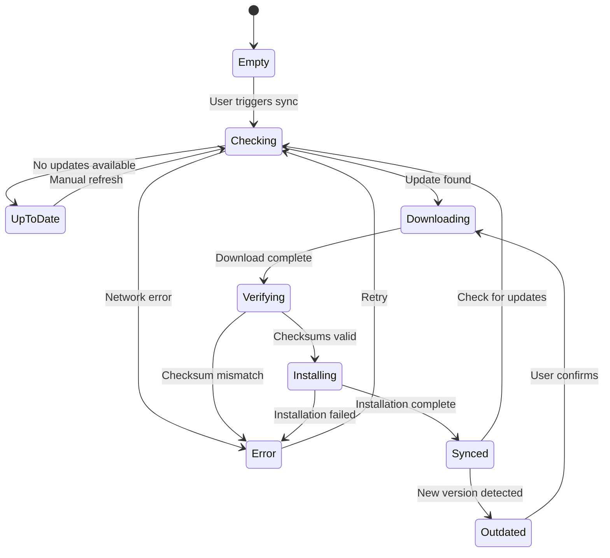
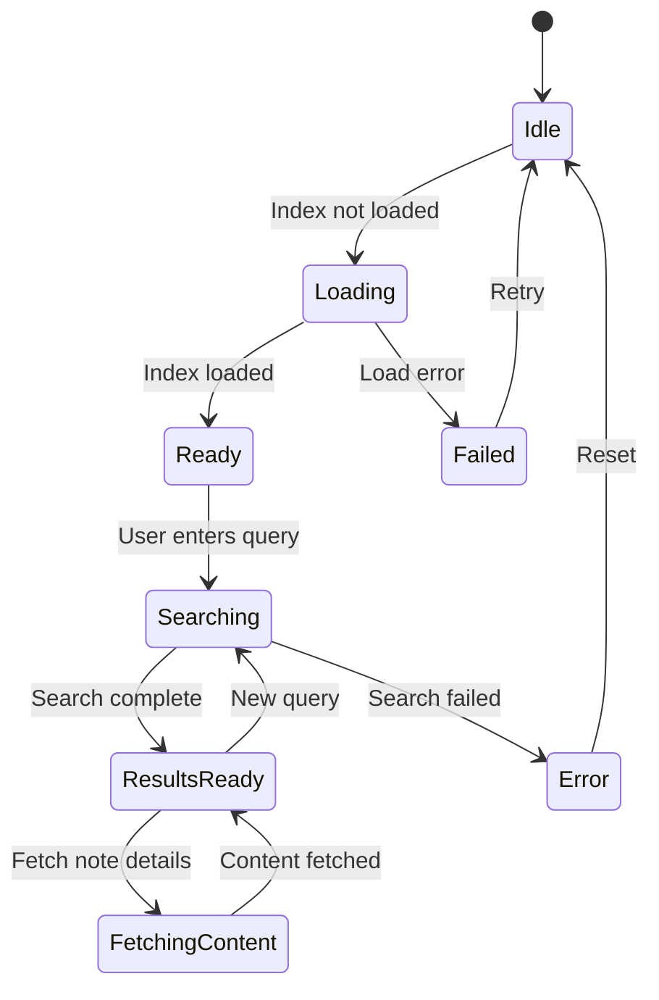

[← Back to Main README](../../README.md)

# Semantic Vector Search - SPARC Pseudocode

> **Phase:** Pseudocode Design
> **Feature:** Semantic Vector Search with R2 CDN Distribution
> **Date:** 2025-12-14

---

## 1. Overview

This document specifies the algorithms and data flows for implementing semantic vector search using:
- **all-MiniLM-L6-v2** (384-dimensional embeddings)
- **HNSW** (Hierarchical Navigable Small World) index for efficient nearest-neighbor search
- **Cloudflare R2** for CDN-distributed index storage
- **IndexedDB** for client-side caching
- **int8 quantization** for bandwidth optimization

---

## 2. Data Structure Definitions

### 2.1 Core Data Types

```typescript
// Vector representations
type Vector384 = Float32Array  // 384-dimensional embedding vector
type QuantizedVector = Int8Array  // int8 quantized version (75% smaller)

// HNSW index structure
interface HNSWIndex {
  dimensions: number           // 384
  efConstruction: number       // Build-time search depth (200)
  efSearch: number            // Query-time search depth (50)
  maxLayers: number           // Typically ceil(log2(n))
  layers: HNSWLayer[]         // Hierarchical layers
  entryPoint: NodeId          // Top layer entry node
}

interface HNSWLayer {
  level: number
  nodes: Map<NodeId, HNSWNode>
  connections: Map<NodeId, NodeId[]>
}

interface HNSWNode {
  id: NodeId                  // Note event ID
  vector: QuantizedVector     // int8 quantized embedding
  metadata: NodeMetadata
}

interface NodeMetadata {
  noteId: string              // Nostr event ID
  channelId: string
  authorPubkey: string
  timestamp: number
  contentHash: string         // SHA-256 of original text
}

// Serialized index format
interface SerializedIndex {
  version: string             // e.g., "1.0.0"
  createdAt: number           // Unix timestamp
  totalVectors: number
  layers: SerializedLayer[]
  metadata: IndexMetadata
}

interface IndexMetadata {
  relayUrl: string
  lastProcessedTimestamp: number
  indexChecksum: string       // SHA-256 of entire index
  compressionAlgorithm: 'brotli' | 'gzip'
}

// R2 manifest structure
interface R2Manifest {
  currentVersion: string
  versions: VersionEntry[]
}

interface VersionEntry {
  version: string
  timestamp: number
  totalVectors: number
  files: {
    index: string           // "embeddings-v1.0.0.idx"
    vectors: string         // "embeddings-v1.0.0.bin"
    manifest: string        // "embeddings-v1.0.0.json"
  }
  checksums: {
    index: string
    vectors: string
  }
  sizeBytes: {
    index: number
    vectors: number
  }
}

// Client sync state
interface ClientSyncState {
  currentVersion: string | null
  lastSyncTimestamp: number
  indexStatus: 'empty' | 'partial' | 'synced' | 'outdated'
  vectorCount: number
  indexedDBUsageMB: number
}

// Search query
interface SemanticQuery {
  text: string                // Natural language query
  k: number                   // Number of results (default: 10)
  filters?: {
    channelId?: string
    authorPubkey?: string
    dateRange?: {
      start: number
      end: number
    }
  }
  rerank?: boolean           // Apply reranking (default: false)
}

// Search result
interface SemanticResult {
  noteId: string
  channelId: string
  content: string
  authorPubkey: string
  timestamp: number
  similarity: number          // Cosine similarity [-1, 1]
  rank: number               // Position in results [1, k]
}
```

---

## 3. Algorithm: Embedding Generation Pipeline

### 3.1 High-Level Flow

```
ALGORITHM generate_embeddings_pipeline
INPUT: relay_url, last_processed_timestamp, batch_size
OUTPUT: serialized_index, vectors_binary, manifest

BEGIN
  // Phase 1: Fetch new notes
  notes ← fetch_notes_since(relay_url, last_processed_timestamp)

  IF notes.length == 0 THEN
    RETURN {status: "no_new_notes"}
  END IF

  // Phase 2: Generate embeddings
  embeddings ← []
  FOR EACH note IN notes DO
    text ← extract_text(note)
    vector ← generate_embedding(text)  // 384d Float32
    quantized ← quantize_int8(vector)
    embeddings.append({
      noteId: note.id,
      vector: quantized,
      metadata: extract_metadata(note)
    })
  END FOR

  // Phase 3: Build/update HNSW index
  IF existing_index EXISTS THEN
    index ← load_index_from_r2()
    index ← incremental_update(index, embeddings)
  ELSE
    index ← build_hnsw_index(embeddings)
  END IF

  // Phase 4: Serialize and upload
  index_binary ← serialize_index(index)
  vectors_binary ← serialize_vectors(embeddings)

  upload_to_r2(index_binary, "embeddings-v{version}.idx")
  upload_to_r2(vectors_binary, "embeddings-v{version}.bin")

  // Phase 5: Update manifest
  manifest ← update_manifest(version, checksums, sizes)
  upload_to_r2(manifest, "manifest.json")

  RETURN {
    version: version,
    totalVectors: index.totalVectors,
    uploadedBytes: size(index_binary) + size(vectors_binary)
  }
END
```

### 3.2 Text Extraction

```
ALGORITHM extract_text
INPUT: note (Nostr event)
OUTPUT: plain_text

BEGIN
  content ← note.content

  // Handle encrypted notes (NIP-44)
  IF is_encrypted(note) THEN
    IF has_decryption_key(note.channelId) THEN
      content ← decrypt_nip44(content, decryption_key)
    ELSE
      RETURN ""  // Cannot index encrypted content without key
    END IF
  END IF

  // Remove markdown formatting
  content ← remove_markdown(content)

  // Remove URLs (they're noise for semantic search)
  content ← remove_urls(content)

  // Remove nostr: links
  content ← remove_nostr_links(content)

  // Normalize whitespace
  content ← normalize_whitespace(content)

  // Truncate to max length (512 tokens ≈ 2000 chars)
  IF length(content) > 2000 THEN
    content ← truncate(content, 2000)
  END IF

  RETURN content
END

SUBROUTINE remove_markdown(text)
  text ← replace_pattern(text, r'\*\*(.+?)\*\*', '$1')  // Bold
  text ← replace_pattern(text, r'\*(.+?)\*', '$1')      // Italic
  text ← replace_pattern(text, r'`(.+?)`', '$1')        // Code
  text ← replace_pattern(text, r'\[(.+?)\]\(.+?\)', '$1')  // Links
  RETURN text
END
```

### 3.3 Embedding Generation

```
ALGORITHM generate_embedding
INPUT: text (string)
OUTPUT: vector (Float32Array[384])

CONSTANTS:
  MODEL_NAME = "all-MiniLM-L6-v2"
  MAX_TOKENS = 512
  EMBEDDING_DIM = 384

BEGIN
  // Load model (cached after first load)
  model ← load_model(MODEL_NAME)

  // Tokenize input
  tokens ← tokenize(text, MAX_TOKENS)

  // Generate embedding
  vector ← model.encode(tokens)  // Returns Float32Array[384]

  // Normalize to unit length (for cosine similarity)
  vector ← normalize_l2(vector)

  RETURN vector
END

SUBROUTINE normalize_l2(vector)
  magnitude ← sqrt(sum(vector[i]^2 for i in 0..DIM))
  FOR i ← 0 TO DIM-1 DO
    vector[i] ← vector[i] / magnitude
  END FOR
  RETURN vector
END
```

### 3.4 int8 Quantization

```
ALGORITHM quantize_int8
INPUT: vector (Float32Array[384])
OUTPUT: quantized (Int8Array[384])

BEGIN
  // Find min/max for dynamic range
  min_val ← min(vector)
  max_val ← max(vector)

  // Calculate scale and offset
  scale ← 127.0 / max(abs(min_val), abs(max_val))

  // Quantize each dimension
  quantized ← new Int8Array(384)
  FOR i ← 0 TO 383 DO
    quantized[i] ← round(vector[i] * scale)
    // Clamp to [-127, 127]
    IF quantized[i] > 127 THEN quantized[i] ← 127
    IF quantized[i] < -127 THEN quantized[i] ← -127
  END FOR

  // Store scale for dequantization
  metadata.scale ← scale

  RETURN quantized
END

ALGORITHM dequantize_int8
INPUT: quantized (Int8Array[384]), scale (float)
OUTPUT: vector (Float32Array[384])

BEGIN
  vector ← new Float32Array(384)
  FOR i ← 0 TO 383 DO
    vector[i] ← quantized[i] / scale
  END FOR
  RETURN vector
END
```

---

## 4. Algorithm: HNSW Index Construction

### 4.1 Build from Scratch

```
ALGORITHM build_hnsw_index
INPUT: embeddings[] (array of {noteId, vector, metadata})
OUTPUT: index (HNSWIndex)

CONSTANTS:
  M = 16              // Max connections per node
  M_MAX = 32          // Max connections for layer 0
  EF_CONSTRUCTION = 200  // Search depth during construction

BEGIN
  index ← {
    dimensions: 384,
    efConstruction: EF_CONSTRUCTION,
    efSearch: 50,
    maxLayers: 0,
    layers: [],
    entryPoint: null
  }

  // Determine max layer level
  n ← length(embeddings)
  max_level ← ceil(log2(n))
  index.maxLayers ← max_level

  // Initialize layers
  FOR level ← 0 TO max_level DO
    index.layers[level] ← {
      level: level,
      nodes: new Map(),
      connections: new Map()
    }
  END FOR

  // Insert embeddings
  FOR EACH embedding IN embeddings DO
    node_level ← random_level(max_level)
    insert_node(index, embedding, node_level)
  END FOR

  RETURN index
END

SUBROUTINE random_level(max_level)
  // Exponentially decreasing probability
  level ← 0
  WHILE random() < 0.5 AND level < max_level DO
    level ← level + 1
  END WHILE
  RETURN level
END

SUBROUTINE insert_node(index, embedding, target_level)
  node ← {
    id: embedding.noteId,
    vector: embedding.vector,
    metadata: embedding.metadata
  }

  // Insert at all layers from 0 to target_level
  FOR level ← 0 TO target_level DO
    layer ← index.layers[level]
    layer.nodes.set(node.id, node)

    // Find nearest neighbors at this layer
    IF layer.nodes.size == 1 THEN
      // First node in layer
      layer.connections.set(node.id, [])
      IF index.entryPoint == null THEN
        index.entryPoint ← node.id
      END IF
    ELSE
      // Search for nearest neighbors
      neighbors ← search_layer(
        index,
        level,
        embedding.vector,
        index.efConstruction
      )

      // Select M best neighbors
      m ← (level == 0) ? M_MAX : M
      selected ← select_neighbors(neighbors, m)

      // Create bidirectional connections
      layer.connections.set(node.id, selected)
      FOR EACH neighbor_id IN selected DO
        neighbor_connections ← layer.connections.get(neighbor_id)
        neighbor_connections.append(node.id)

        // Prune if exceeds M
        IF length(neighbor_connections) > m THEN
          neighbor_connections ← prune_connections(
            neighbor_connections,
            layer.nodes,
            m
          )
        END IF
      END FOR
    END IF
  END FOR
END
```

### 4.2 HNSW Search (Core Algorithm)

```
ALGORITHM search_layer
INPUT: index, layer_level, query_vector, ef (search depth)
OUTPUT: candidates[] (sorted by distance)

BEGIN
  layer ← index.layers[layer_level]
  visited ← new Set()
  candidates ← new MinHeap()  // Min-heap by distance
  results ← new MaxHeap()     // Max-heap by distance (keep top ef)

  // Start from entry point
  entry ← index.entryPoint
  entry_dist ← cosine_distance(
    query_vector,
    layer.nodes.get(entry).vector
  )

  candidates.push({id: entry, distance: entry_dist})
  results.push({id: entry, distance: entry_dist})
  visited.add(entry)

  // Greedy search
  WHILE NOT candidates.isEmpty() DO
    current ← candidates.pop()

    // Stop if current is worse than worst result
    IF current.distance > results.peek().distance THEN
      BREAK
    END IF

    // Explore neighbors
    connections ← layer.connections.get(current.id)
    FOR EACH neighbor_id IN connections DO
      IF neighbor_id NOT IN visited THEN
        visited.add(neighbor_id)

        neighbor_vector ← layer.nodes.get(neighbor_id).vector
        neighbor_dist ← cosine_distance(query_vector, neighbor_vector)

        // Add to candidates if closer than worst result
        IF neighbor_dist < results.peek().distance OR results.size < ef THEN
          candidates.push({id: neighbor_id, distance: neighbor_dist})
          results.push({id: neighbor_id, distance: neighbor_dist})

          // Keep only top ef results
          IF results.size > ef THEN
            results.pop()  // Remove worst
          END IF
        END IF
      END IF
    END FOR
  END WHILE

  // Return results sorted by distance (ascending)
  RETURN results.toSortedArray()
END

SUBROUTINE cosine_distance(v1, v2)
  // Assumes vectors are normalized to unit length
  // Distance = 1 - cosine_similarity
  dot_product ← sum(v1[i] * v2[i] for i in 0..DIM-1)
  similarity ← dot_product  // Already normalized
  distance ← 1.0 - similarity
  RETURN distance
END
```

### 4.3 Incremental Update

```
ALGORITHM incremental_update
INPUT: existing_index, new_embeddings[]
OUTPUT: updated_index

BEGIN
  index ← existing_index

  FOR EACH embedding IN new_embeddings DO
    // Check if note already indexed
    IF note_exists_in_index(index, embedding.noteId) THEN
      // Update existing node (content changed)
      update_node(index, embedding)
    ELSE
      // Insert new node
      node_level ← random_level(index.maxLayers)
      insert_node(index, embedding, node_level)
    END IF
  END FOR

  // Update metadata
  index.totalVectors ← count_unique_nodes(index)
  index.lastModified ← current_timestamp()

  RETURN index
END

SUBROUTINE update_node(index, embedding)
  node_id ← embedding.noteId

  // Update vector at all layers where node exists
  FOR EACH layer IN index.layers DO
    IF layer.nodes.has(node_id) THEN
      node ← layer.nodes.get(node_id)
      node.vector ← embedding.vector
      node.metadata ← embedding.metadata

      // Rebuild connections for this node
      rebuild_node_connections(index, layer, node_id)
    END IF
  END FOR
END
```

---

## 5. Algorithm: Client Sync

### 5.1 Check for Updates

```
ALGORITHM check_for_updates
INPUT: current_version
OUTPUT: {hasUpdate: boolean, newVersion: VersionEntry | null}

BEGIN
  // Fetch manifest from R2
  manifest ← fetch_json("https://r2.example.com/embeddings/manifest.json")

  IF manifest.currentVersion == current_version THEN
    RETURN {hasUpdate: false, newVersion: null}
  END IF

  // Find new version details
  new_version_entry ← manifest.versions.find(
    v => v.version == manifest.currentVersion
  )

  RETURN {
    hasUpdate: true,
    newVersion: new_version_entry
  }
END
```

### 5.2 Download and Install Index

```
ALGORITHM sync_embeddings
INPUT: network_type ('wifi' | 'cellular' | 'unknown')
OUTPUT: {success: boolean, version: string, error?: string}

CONSTANTS:
  MAX_DOWNLOAD_SIZE_MB_CELLULAR = 10
  MAX_DOWNLOAD_SIZE_MB_WIFI = 100

BEGIN
  // Check network conditions
  IF network_type == 'cellular' THEN
    RETURN {success: false, error: "WiFi required for sync"}
  END IF

  // Get current state
  current_version ← get_local_version()

  // Check for updates
  update_check ← check_for_updates(current_version)
  IF NOT update_check.hasUpdate THEN
    RETURN {success: true, version: current_version, error: "Already up to date"}
  END IF

  version_entry ← update_check.newVersion
  total_size_mb ← (version_entry.sizeBytes.index + version_entry.sizeBytes.vectors) / (1024 * 1024)

  // Check size limits
  max_size ← (network_type == 'wifi') ? MAX_DOWNLOAD_SIZE_MB_WIFI : MAX_DOWNLOAD_SIZE_MB_CELLULAR
  IF total_size_mb > max_size THEN
    RETURN {success: false, error: "Download too large: {total_size_mb}MB"}
  END IF

  // Download files with progress tracking
  index_url ← "https://r2.example.com/embeddings/" + version_entry.files.index
  vectors_url ← "https://r2.example.com/embeddings/" + version_entry.files.vectors

  TRY
    // Streaming download to IndexedDB
    index_binary ← await download_streaming(index_url, on_index_progress)
    vectors_binary ← await download_streaming(vectors_url, on_vectors_progress)

    // Verify checksums
    IF sha256(index_binary) != version_entry.checksums.index THEN
      THROW "Index checksum mismatch"
    END IF
    IF sha256(vectors_binary) != version_entry.checksums.vectors THEN
      THROW "Vectors checksum mismatch"
    END IF

    // Store in IndexedDB
    await store_in_indexeddb("search_index", index_binary)
    await store_in_indexeddb("search_vectors", vectors_binary)

    // Update local version
    await set_local_version(version_entry.version)

    // Initialize in-memory index
    await initialize_hnsw_from_indexeddb()

    RETURN {
      success: true,
      version: version_entry.version
    }

  CATCH error
    // Cleanup partial download
    await clear_indexeddb("search_index")
    await clear_indexeddb("search_vectors")

    RETURN {
      success: false,
      error: error.message
    }
  END TRY
END

SUBROUTINE download_streaming(url, on_progress)
  response ← await fetch(url)
  reader ← response.body.getReader()

  chunks ← []
  received_bytes ← 0
  total_bytes ← parseInt(response.headers.get('Content-Length'))

  WHILE true DO
    {done, value} ← await reader.read()

    IF done THEN
      BREAK
    END IF

    chunks.append(value)
    received_bytes ← received_bytes + value.length

    // Report progress
    on_progress(received_bytes, total_bytes)

    // Allow UI to update
    await yield()
  END WHILE

  // Concatenate chunks
  binary ← new Uint8Array(received_bytes)
  offset ← 0
  FOR EACH chunk IN chunks DO
    binary.set(chunk, offset)
    offset ← offset + chunk.length
  END FOR

  RETURN binary
END
```

---

## 6. Algorithm: Semantic Search

### 6.1 Query Processing

```
ALGORITHM semantic_search
INPUT: query (SemanticQuery)
OUTPUT: results[] (SemanticResult[])

BEGIN
  // Validate index is loaded
  IF NOT is_index_loaded() THEN
    THROW "Search index not loaded. Please sync first."
  END IF

  // Generate query embedding
  query_vector ← generate_embedding(query.text)

  // Search HNSW index (multi-layer)
  candidates ← search_hnsw(index, query_vector, query.k * 2)

  // Apply filters
  filtered ← apply_filters(candidates, query.filters)

  // Convert to results with metadata
  results ← []
  FOR EACH candidate IN filtered.slice(0, query.k) DO
    // Fetch note content from local cache or relay
    note ← get_note(candidate.noteId)

    // Calculate similarity (1 - distance)
    similarity ← 1.0 - candidate.distance

    results.append({
      noteId: candidate.noteId,
      channelId: candidate.metadata.channelId,
      content: note.content,
      authorPubkey: candidate.metadata.authorPubkey,
      timestamp: candidate.metadata.timestamp,
      similarity: similarity,
      rank: results.length + 1
    })
  END FOR

  // Optional: Rerank using cross-encoder
  IF query.rerank == true THEN
    results ← rerank_results(query.text, results)
  END IF

  RETURN results
END

SUBROUTINE search_hnsw(index, query_vector, k)
  // Search from top layer down to layer 0
  entry_points ← [index.entryPoint]

  // Greedy search in upper layers
  FOR level ← index.maxLayers DOWN TO 1 DO
    entry_points ← search_layer(index, level, query_vector, 1)
  END FOR

  // Exhaustive search in layer 0
  candidates ← search_layer(index, 0, query_vector, k)

  RETURN candidates
END

SUBROUTINE apply_filters(candidates, filters)
  IF filters == null THEN
    RETURN candidates
  END IF

  filtered ← []
  FOR EACH candidate IN candidates DO
    metadata ← candidate.metadata

    // Channel filter
    IF filters.channelId AND metadata.channelId != filters.channelId THEN
      CONTINUE
    END IF

    // Author filter
    IF filters.authorPubkey AND metadata.authorPubkey != filters.authorPubkey THEN
      CONTINUE
    END IF

    // Date range filter
    IF filters.dateRange THEN
      IF metadata.timestamp < filters.dateRange.start THEN
        CONTINUE
      END IF
      IF metadata.timestamp > filters.dateRange.end THEN
        CONTINUE
      END IF
    END IF

    filtered.append(candidate)
  END FOR

  RETURN filtered
END
```

### 6.2 Hybrid Search (Combine with Keyword)

```
ALGORITHM hybrid_search
INPUT: query_text, k, semantic_weight (default: 0.7)
OUTPUT: results[]

BEGIN
  // Run semantic search
  semantic_results ← semantic_search({
    text: query_text,
    k: k * 2
  })

  // Run keyword search (existing implementation)
  keyword_results ← keyword_search(query_text, k * 2)

  // Merge and rerank
  merged ← merge_results(
    semantic_results,
    keyword_results,
    semantic_weight
  )

  // Return top k
  RETURN merged.slice(0, k)
END

SUBROUTINE merge_results(semantic, keyword, semantic_weight)
  keyword_weight ← 1.0 - semantic_weight

  // Build combined score map
  scores ← new Map()

  // Add semantic scores
  FOR EACH result IN semantic DO
    scores.set(result.noteId, {
      noteId: result.noteId,
      semantic_score: result.similarity,
      keyword_score: 0,
      combined_score: 0
    })
  END FOR

  // Add keyword scores
  FOR EACH result IN keyword DO
    IF scores.has(result.noteId) THEN
      entry ← scores.get(result.noteId)
      entry.keyword_score ← result.score
    ELSE
      scores.set(result.noteId, {
        noteId: result.noteId,
        semantic_score: 0,
        keyword_score: result.score,
        combined_score: 0
      })
    END IF
  END FOR

  // Calculate combined scores
  FOR EACH [noteId, entry] IN scores DO
    entry.combined_score ←
      (entry.semantic_score * semantic_weight) +
      (entry.keyword_score * keyword_weight)
  END FOR

  // Sort by combined score
  sorted ← Array.from(scores.values())
    .sort((a, b) => b.combined_score - a.combined_score)

  RETURN sorted
END
```

---

## 7. Complexity Analysis

### 7.1 Time Complexity

| Algorithm | Time Complexity | Notes |
|-----------|----------------|-------|
| **Embedding Generation** | O(n * d) | n = text length, d = model depth |
| **Quantization** | O(k) | k = 384 dimensions (constant) |
| **HNSW Insert** | O(log n * M * d) | n = index size, M = 16 connections |
| **HNSW Search** | O(log n * M * d) | Typically ~10-50 distance calculations |
| **Keyword Search** | O(m * log m) | m = matching documents |
| **Hybrid Merge** | O(k * log k) | k = result count |
| **Client Sync** | O(n * k) | n = vectors, k = 384 (linear download) |

### 7.2 Space Complexity

| Component | Space Complexity | Example (10k notes) |
|-----------|------------------|---------------------|
| **Original Embeddings** | O(n * 384 * 4 bytes) | 15.36 MB |
| **Quantized Embeddings** | O(n * 384 * 1 byte) | 3.84 MB |
| **HNSW Index** | O(n * M * log n) | ~5-10 MB |
| **IndexedDB Storage** | O(n * k) | ~8-14 MB total |
| **In-Memory Index** | O(n * M * 2) | ~2 MB (layer 0 only) |

**Bandwidth Savings:**
- Float32: 15.36 MB → int8: 3.84 MB = **75% reduction**
- With brotli compression: ~2-3 MB = **80-85% reduction**

---

## 8. State Machines

### 8.1 Index Sync State



### 8.2 Search State



---

## 9. Edge Cases and Error Handling

### 9.1 Embedding Generation

| Edge Case | Handling |
|-----------|----------|
| Empty content | Skip, do not generate embedding |
| Content > 2000 chars | Truncate to 2000 chars |
| Non-English text | Model handles multilingual (100+ languages) |
| Encrypted note without key | Skip, log warning |
| Emoji-only content | Generate embedding (model handles Unicode) |
| Code snippets | Include as-is (semantic meaning preserved) |

### 9.2 Index Sync

| Edge Case | Handling |
|-----------|----------|
| Download interrupted | Resume from last chunk or restart |
| Checksum mismatch | Delete partial download, retry |
| IndexedDB quota exceeded | Prompt user to clear cache or increase quota |
| Network switch (WiFi → cellular) | Pause download, prompt user |
| Concurrent sync requests | Debounce, allow only one sync at a time |
| Corrupted IndexedDB | Clear and re-download |

### 9.3 Search

| Edge Case | Handling |
|-----------|----------|
| Query too short (< 3 chars) | Fallback to keyword search |
| No results found | Return empty array, suggest keyword search |
| Index not loaded | Prompt user to sync first |
| Filtered results < k | Return all matching results |
| Query embedding fails | Fallback to keyword search |
| Note not found in cache | Fetch from relay asynchronously |

---

## 10. Performance Optimizations

### 10.1 Batching

```
OPTIMIZATION batch_embedding_generation
  // Instead of: generate one embedding at a time
  // Do: batch embeddings (up to 32 notes)

  BATCH_SIZE ← 32
  FOR i ← 0 TO length(notes) STEP BATCH_SIZE DO
    batch ← notes.slice(i, i + BATCH_SIZE)
    texts ← batch.map(note => extract_text(note))

    // Single model inference call
    vectors ← model.encode_batch(texts)

    FOR j ← 0 TO length(batch) DO
      embeddings[i + j] ← {
        noteId: batch[j].id,
        vector: quantize_int8(vectors[j])
      }
    END FOR
  END FOR
```

### 10.2 Caching

```
OPTIMIZATION cache_query_embeddings
  // Cache query embeddings for repeated searches

  query_cache ← new LRUCache(maxSize: 100)

  FUNCTION cached_generate_embedding(text)
    cache_key ← sha256(text).slice(0, 16)

    IF query_cache.has(cache_key) THEN
      RETURN query_cache.get(cache_key)
    END IF

    vector ← generate_embedding(text)
    query_cache.set(cache_key, vector)

    RETURN vector
  END
```

### 10.3 Lazy Loading

```
OPTIMIZATION lazy_load_index
  // Load only layer 0 initially (most searches only use layer 0)

  FUNCTION initialize_hnsw_from_indexeddb()
    // Load metadata and layer 0
    layer0 ← await load_layer(0)
    index.layers[0] ← layer0

    // Lazily load upper layers on first search
    index.lazyLoadLayers ← async () => {
      FOR level ← 1 TO index.maxLayers DO
        IF NOT index.layers[level] THEN
          index.layers[level] ← await load_layer(level)
        END IF
      END FOR
    }
  END
```

---

## 11. Testing Strategies

### 11.1 Unit Tests

```
TEST quantization_preserves_similarity
  v1 ← generate_random_vector(384)
  v2 ← generate_random_vector(384)

  original_sim ← cosine_similarity(v1, v2)

  q1 ← quantize_int8(v1)
  q2 ← quantize_int8(v2)

  dq1 ← dequantize_int8(q1, scale1)
  dq2 ← dequantize_int8(q2, scale2)

  quantized_sim ← cosine_similarity(dq1, dq2)

  // Allow 5% error from quantization
  ASSERT abs(original_sim - quantized_sim) < 0.05
END

TEST hnsw_recall_rate
  // Build index with known vectors
  vectors ← generate_test_vectors(1000)
  index ← build_hnsw_index(vectors)

  // For each vector, ensure it finds itself as top result
  FOR EACH v IN vectors DO
    results ← search_hnsw(index, v.vector, 1)
    ASSERT results[0].id == v.id
  END FOR

  // Test k-NN recall
  query ← generate_random_vector(384)
  ground_truth ← brute_force_knn(vectors, query, 10)
  hnsw_results ← search_hnsw(index, query, 10)

  // At least 90% overlap
  overlap ← count_overlap(ground_truth, hnsw_results)
  ASSERT overlap >= 9
END
```

### 11.2 Integration Tests

```
TEST end_to_end_search_flow
  // 1. Generate embeddings
  notes ← fetch_notes_from_relay(100)
  embeddings ← generate_embeddings(notes)

  // 2. Build index
  index ← build_hnsw_index(embeddings)

  // 3. Serialize and save
  index_binary ← serialize_index(index)
  store_in_indexeddb("test_index", index_binary)

  // 4. Load from storage
  loaded_index ← load_hnsw_from_indexeddb("test_index")

  // 5. Search
  results ← semantic_search({
    text: "How do I use Nostr?",
    k: 10
  })

  // 6. Verify results
  ASSERT results.length > 0
  ASSERT results[0].similarity > 0.5
  ASSERT results[0].content CONTAINS "Nostr"
END
```

---

## 12. Deployment Pipeline

### 12.1 Server-Side Generation

```
WORKFLOW generate_and_deploy_embeddings

BEGIN
  // 1. Scheduled job (daily at 2 AM UTC)
  notes ← fetch_all_notes_from_relay()

  // 2. Generate embeddings
  embeddings ← batch_generate_embeddings(notes)

  // 3. Build index
  index ← build_hnsw_index(embeddings)

  // 4. Serialize
  index_binary ← serialize_index(index)
  vectors_binary ← serialize_vectors(embeddings)

  // 5. Compress
  index_compressed ← brotli_compress(index_binary, level: 9)
  vectors_compressed ← brotli_compress(vectors_binary, level: 9)

  // 6. Upload to R2
  version ← generate_version_string()  // e.g., "1.0.123"

  upload_to_r2(index_compressed, "embeddings-{version}.idx.br")
  upload_to_r2(vectors_compressed, "embeddings-{version}.bin.br")

  // 7. Update manifest
  manifest ← update_manifest({
    version: version,
    timestamp: now(),
    totalVectors: embeddings.length,
    checksums: {
      index: sha256(index_compressed),
      vectors: sha256(vectors_compressed)
    },
    sizeBytes: {
      index: size(index_compressed),
      vectors: size(vectors_compressed)
    }
  })

  upload_to_r2(manifest, "manifest.json")

  // 8. Log metrics
  log_metrics({
    version: version,
    vectorCount: embeddings.length,
    indexSizeMB: size(index_compressed) / (1024 * 1024),
    buildTimeSeconds: elapsed_time
  })
END
```

---

*Next Steps: Implementation (09-semantic-search-implementation.md)*
