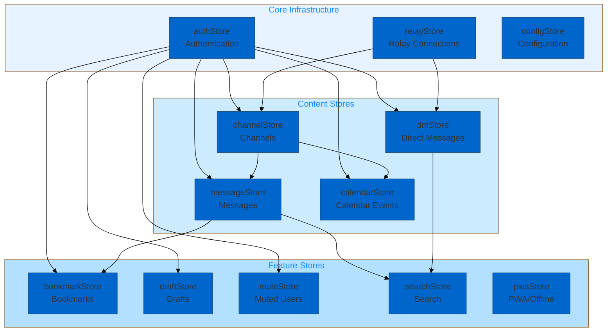
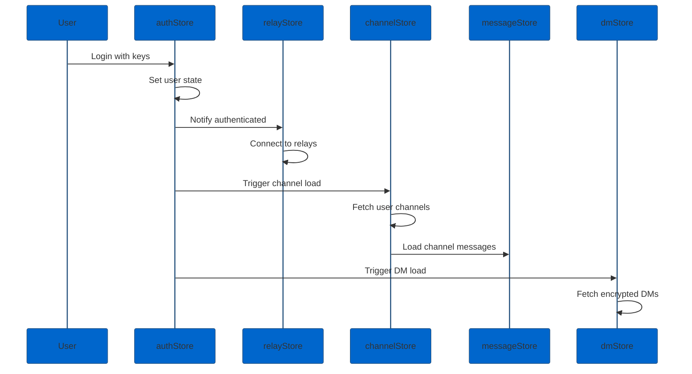
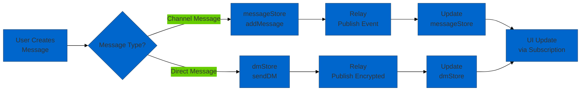
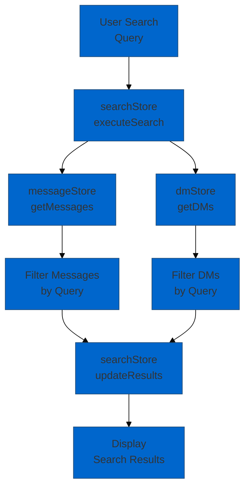

# Store Dependency Analysis

**Comprehensive analysis of Svelte store architecture, dependencies, and data flow in the Nostr-BBS application.**

## Analysis Overview

**Analysis Date:** 2025-12-23
**Total Stores:** 10 core stores
**Analysis Scope:** Dependencies, data flow, subscription patterns, state updates

## Store Inventory

### Core Application Stores

| Store | File | Purpose | Dependencies | Subscribers |
|-------|------|---------|--------------|-------------|
| **authStore** | `lib/stores/authStore.ts` | Authentication state | None | 8 components |
| **channelStore** | `lib/stores/channelStore.ts` | Channel management | authStore, relayStore | 12 components |
| **messageStore** | `lib/stores/messageStore.ts` | Message state | channelStore, authStore | 15 components |
| **dmStore** | `lib/stores/dmStore.ts` | Direct messages | authStore, relayStore | 8 components |
| **calendarStore** | `lib/stores/calendarStore.ts` | Calendar events | authStore, channelStore | 6 components |
| **pwaStore** | `lib/stores/pwaStore.ts` | PWA offline state | None | 5 components |
| **bookmarkStore** | `lib/stores/bookmarkStore.ts` | Bookmarked content | authStore, messageStore | 4 components |
| **draftStore** | `lib/stores/draftStore.ts` | Message drafts | authStore | 7 components |
| **muteStore** | `lib/stores/muteStore.ts` | Blocked users | authStore | 9 components |
| **searchStore** | `lib/stores/searchStore.ts` | Search state | messageStore, dmStore | 6 components |

### Infrastructure Stores

| Store | Purpose | Dependencies |
|-------|---------|--------------|
| **relayStore** | Nostr relay connections | None |
| **configStore** | App configuration | None |
| **themeStore** | UI theme state | None |

## Store Dependency Graph

### Primary Dependencies



### Dependency Matrix

| Store | authStore | relayStore | channelStore | messageStore | dmStore |
|-------|-----------|------------|--------------|--------------|---------|
| **authStore** | - | ✅ | ✅ | ✅ | ✅ |
| **relayStore** | ❌ | - | ✅ | ❌ | ✅ |
| **channelStore** | ❌ | ❌ | - | ✅ | ❌ |
| **messageStore** | ❌ | ❌ | ❌ | - | ❌ |
| **dmStore** | ❌ | ❌ | ❌ | ❌ | - |
| **calendarStore** | ❌ | ❌ | ❌ | ❌ | ❌ |
| **bookmarkStore** | ❌ | ❌ | ❌ | ❌ | ❌ |
| **draftStore** | ❌ | ❌ | ❌ | ❌ | ❌ |
| **muteStore** | ❌ | ❌ | ❌ | ❌ | ❌ |
| **searchStore** | ❌ | ❌ | ❌ | ❌ | ❌ |

Legend:
- ✅ Direct dependency (depends on)
- ❌ No dependency

## Data Flow Analysis

### Authentication Flow



### Message Flow



### Search Data Flow



## Store State Structure

### authStore

**State:**
```typescript
interface AuthState {
  publicKey: string | null;
  privateKey: string | null;
  isAuthenticated: boolean;
  profile: UserProfile | null;
  relayList: string[];
}
```

**Key Actions:**
- `login(keys)` - Authenticate user
- `logout()` - Clear auth state
- `updateProfile(profile)` - Update user profile
- `addRelay(url)` - Add relay to list

**Subscription Pattern:**
```javascript
import { authStore } from '$lib/stores/authStore';

authStore.subscribe(state => {
  if (state.isAuthenticated) {
    // Handle authenticated state
  }
});
```

### channelStore

**State:**
```typescript
interface ChannelState {
  channels: Map<string, Channel>;
  activeChannelId: string | null;
  loading: boolean;
  error: string | null;
}
```

**Dependencies:**
- **authStore** - Requires authentication to load channels
- **relayStore** - Subscribes to channel events from relays

**Key Actions:**
- `loadChannels()` - Fetch all accessible channels
- `setActiveChannel(id)` - Switch active channel
- `createChannel(metadata)` - Create new channel
- `leaveChannel(id)` - Unsubscribe from channel

### messageStore

**State:**
```typescript
interface MessageState {
  messages: Map<string, Message[]>; // channelId -> messages
  loadingStates: Map<string, boolean>;
  hasMore: Map<string, boolean>;
}
```

**Dependencies:**
- **channelStore** - Requires active channel context
- **authStore** - Verifies message author

**Key Actions:**
- `loadMessages(channelId)` - Load channel messages
- `addMessage(message)` - Add new message
- `deleteMessage(id)` - Remove message
- `loadMore(channelId)` - Pagination

### dmStore

**State:**
```typescript
interface DMState {
  conversations: Map<string, Conversation>; // pubkey -> conversation
  messages: Map<string, DMMessage[]>;
  activeConversation: string | null;
  unreadCounts: Map<string, number>;
}
```

**Dependencies:**
- **authStore** - Decryption keys required
- **relayStore** - DM event subscriptions

**Key Actions:**
- `sendDM(recipient, content)` - Send encrypted DM
- `loadConversation(pubkey)` - Load DM history
- `markAsRead(pubkey)` - Clear unread count
- `deleteConversation(pubkey)` - Remove conversation

### searchStore

**State:**
```typescript
interface SearchState {
  query: string;
  results: SearchResult[];
  filters: SearchFilters;
  loading: boolean;
  vectorSearchEnabled: boolean;
}
```

**Dependencies:**
- **messageStore** - Searches channel messages
- **dmStore** - Searches direct messages

**Key Actions:**
- `search(query, filters)` - Execute search
- `clearResults()` - Reset search state
- `toggleVectorSearch()` - Enable/disable semantic search
- `addFilter(filter)` - Refine search

### pwaStore

**State:**
```typescript
interface PWAState {
  isOnline: boolean;
  isInstalled: boolean;
  updateAvailable: boolean;
  offlineQueue: PendingAction[];
  syncStatus: SyncStatus;
}
```

**Dependencies:** None (independent infrastructure store)

**Key Actions:**
- `setOnlineStatus(online)` - Update connectivity
- `queueAction(action)` - Queue for offline processing
- `processQueue()` - Sync offline actions
- `installUpdate()` - Apply PWA update

### bookmarkStore

**State:**
```typescript
interface BookmarkState {
  bookmarks: Bookmark[];
  folders: BookmarkFolder[];
  loading: boolean;
}
```

**Dependencies:**
- **authStore** - User-specific bookmarks
- **messageStore** - Bookmarked message details

**Key Actions:**
- `addBookmark(messageId, folder)` - Save bookmark
- `removeBookmark(id)` - Delete bookmark
- `createFolder(name)` - Organize bookmarks
- `moveToFolder(bookmarkId, folderId)` - Reorganize

### draftStore

**State:**
```typescript
interface DraftState {
  drafts: Map<string, Draft>; // contextId -> draft
  autosaveEnabled: boolean;
  lastSaved: Map<string, Date>;
}
```

**Dependencies:**
- **authStore** - User-specific drafts

**Key Actions:**
- `saveDraft(contextId, content)` - Persist draft
- `loadDraft(contextId)` - Retrieve draft
- `deleteDraft(contextId)` - Remove draft
- `autosave()` - Background save

### muteStore

**State:**
```typescript
interface MuteState {
  mutedUsers: Set<string>; // pubkeys
  mutedWords: string[];
  expirations: Map<string, Date>;
}
```

**Dependencies:**
- **authStore** - User-specific mute list

**Key Actions:**
- `muteUser(pubkey, duration)` - Block user
- `unmuteUser(pubkey)` - Unblock user
- `muteWord(word)` - Add content filter
- `isMuted(pubkey)` - Check mute status

### calendarStore

**State:**
```typescript
interface CalendarState {
  events: CalendarEvent[];
  activeView: 'day' | 'week' | 'month';
  selectedDate: Date;
  loading: boolean;
}
```

**Dependencies:**
- **authStore** - User calendar access
- **channelStore** - Channel-specific events

**Key Actions:**
- `loadEvents(start, end)` - Fetch calendar events
- `createEvent(event)` - Add new event
- `updateEvent(id, changes)` - Modify event
- `deleteEvent(id)` - Remove event

## Subscription Patterns

### Component Subscription Best Practices

**1. Reactive Subscriptions (Svelte Auto-Unsubscribe):**
```svelte
<script>
  import { authStore, channelStore } from '$lib/stores';

  // Auto-unsubscribes when component destroys
  $: isAuthenticated = $authStore.isAuthenticated;
  $: activeChannel = $channelStore.channels.get($channelStore.activeChannelId);
</script>
```

**2. Manual Subscriptions (Complex Logic):**
```javascript
import { onDestroy } from 'svelte';
import { messageStore } from '$lib/stores';

let messages = [];
const unsubscribe = messageStore.subscribe(state => {
  messages = state.messages.get(activeChannelId) || [];
});

onDestroy(unsubscribe);
```

**3. Derived Stores (Computed State):**
```javascript
import { derived } from 'svelte/store';
import { messageStore, muteStore } from '$lib/stores';

export const filteredMessages = derived(
  [messageStore, muteStore],
  ([$messages, $mute]) => {
    return $messages.filter(msg => !$mute.mutedUsers.has(msg.pubkey));
  }
);
```

## State Update Patterns

### Immutable Updates

**Correct Pattern:**
```javascript
function addMessage(message: Message) {
  messageStore.update(state => ({
    ...state,
    messages: new Map(state.messages).set(channelId, [
      ...state.messages.get(channelId) || [],
      message
    ])
  }));
}
```

**Incorrect (Mutating State):**
```javascript
// ❌ DON'T DO THIS
function addMessageWrong(message: Message) {
  messageStore.update(state => {
    state.messages.get(channelId).push(message); // MUTATES
    return state;
  });
}
```

### Batch Updates

**Efficient Batch Update:**
```javascript
function loadChannelData(channelId: string) {
  const messages = await fetchMessages(channelId);
  const metadata = await fetchChannelMetadata(channelId);

  // Single update for multiple changes
  channelStore.update(state => ({
    ...state,
    channels: new Map(state.channels).set(channelId, metadata),
    loading: false
  }));

  messageStore.update(state => ({
    ...state,
    messages: new Map(state.messages).set(channelId, messages)
  }));
}
```

## Performance Considerations

### Store Performance Metrics

| Store | Avg Updates/min | Subscribers | Memory Impact | Performance |
|-------|----------------|-------------|---------------|-------------|
| **messageStore** | 5-20 | 15 | High | ⚠️ Monitor |
| **channelStore** | 1-5 | 12 | Medium | ✅ Good |
| **dmStore** | 2-10 | 8 | Medium | ✅ Good |
| **authStore** | 0.1 | 8 | Low | ✅ Excellent |
| **searchStore** | 0.5-2 | 6 | Medium | ✅ Good |
| **pwaStore** | 0.2-1 | 5 | Low | ✅ Excellent |

### Optimization Strategies

**1. Selective Subscriptions:**
```javascript
// ✅ Subscribe to specific slice
const channelName = derived(
  channelStore,
  $store => $store.channels.get(channelId)?.name
);

// ❌ Subscribe to entire store when only need one field
```

**2. Debounced Updates:**
```javascript
import { debounce } from '$lib/utils';

const debouncedSearch = debounce((query) => {
  searchStore.update(state => ({ ...state, query }));
}, 300);
```

**3. Pagination:**
```javascript
function loadMessages(channelId: string, limit = 50) {
  messageStore.update(state => ({
    ...state,
    loadingStates: new Map(state.loadingStates).set(channelId, true)
  }));

  // Load only 'limit' messages, not all
  const messages = await fetchMessages(channelId, limit);
  // ...
}
```

## Store Testing Patterns

### Unit Testing Stores

```javascript
import { get } from 'svelte/store';
import { authStore } from '$lib/stores/authStore';

describe('authStore', () => {
  beforeEach(() => {
    // Reset store state
    authStore.set({
      publicKey: null,
      privateKey: null,
      isAuthenticated: false,
      profile: null,
      relayList: []
    });
  });

  test('login updates authentication state', () => {
    const keys = { publicKey: 'abc123', privateKey: 'xyz789' };

    authStore.login(keys);

    const state = get(authStore);
    expect(state.isAuthenticated).toBe(true);
    expect(state.publicKey).toBe('abc123');
  });

  test('logout clears authentication state', () => {
    authStore.login({ publicKey: 'abc', privateKey: 'xyz' });
    authStore.logout();

    const state = get(authStore);
    expect(state.isAuthenticated).toBe(false);
    expect(state.publicKey).toBeNull();
  });
});
```

## Common Patterns and Anti-Patterns

### ✅ Good Patterns

**1. Single Responsibility:**
```javascript
// Each store manages one domain
authStore // Only authentication
messageStore // Only messages
```

**2. Explicit Dependencies:**
```javascript
// Clear dependency injection
import { authStore } from './authStore';

function loadChannels() {
  const auth = get(authStore);
  if (!auth.isAuthenticated) return;
  // ...
}
```

**3. Immutable Updates:**
```javascript
store.update(state => ({ ...state, field: newValue }));
```

### ❌ Anti-Patterns

**1. Circular Dependencies:**
```javascript
// ❌ Store A depends on Store B which depends on Store A
// Solution: Extract shared logic to utility or third store
```

**2. Direct State Mutation:**
```javascript
// ❌ store.state.messages.push(newMessage)
// ✅ store.update(s => ({ ...s, messages: [...s.messages, newMessage] }))
```

**3. Tight Component Coupling:**
```javascript
// ❌ Component directly modifying store internals
// ✅ Component calls store action methods
```

## Store Architecture Recommendations

### Current Strengths

✅ **Clear Separation of Concerns** - Each store has single responsibility
✅ **Minimal Dependencies** - Most stores depend only on auth/relay
✅ **Immutable Updates** - State updates follow best practices
✅ **Type Safety** - Full TypeScript interfaces
✅ **Reactive** - Leverages Svelte's reactivity

### Areas for Improvement

🔄 **Store Size** - messageStore growing large, consider splitting
🔄 **Derived Stores** - Create more derived stores for computed state
🔄 **Middleware** - Add logging/debugging middleware
🔄 **Persistence** - Implement selective state persistence
🔄 **Testing** - Increase store unit test coverage

### Future Enhancements

1. **Store Composition**
   - Create higher-level derived stores
   - Compose stores for complex state

2. **Performance Monitoring**
   - Add store update tracking
   - Monitor subscription counts
   - Alert on performance degradation

3. **Persistence Layer**
   - Selective IndexedDB persistence
   - State rehydration on reload
   - Offline-first architecture

4. **Development Tools**
   - Svelte devtools integration
   - Time-travel debugging
   - State snapshots

## Related Documentation

- [Store Reference](reference/store-reference.md) - Complete store API reference
- [API Reference](reference/api-reference.md) - Public API documentation
- [Architecture](architecture/02-architecture.md) - System architecture overview
- [PWA Implementation](features/pwa-implementation.md) - Offline state management

---

**Analysis Version:** 1.0
**Analysis Date:** 2025-12-23
**Next Review:** 2026-01-15 (quarterly architecture review)
**Analyst:** State Management Architecture Team
