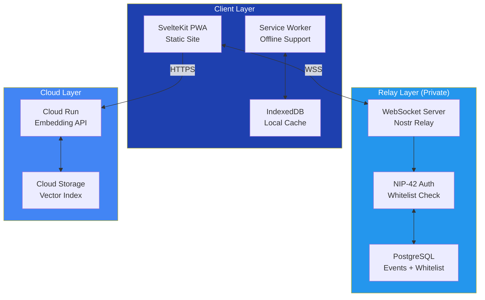
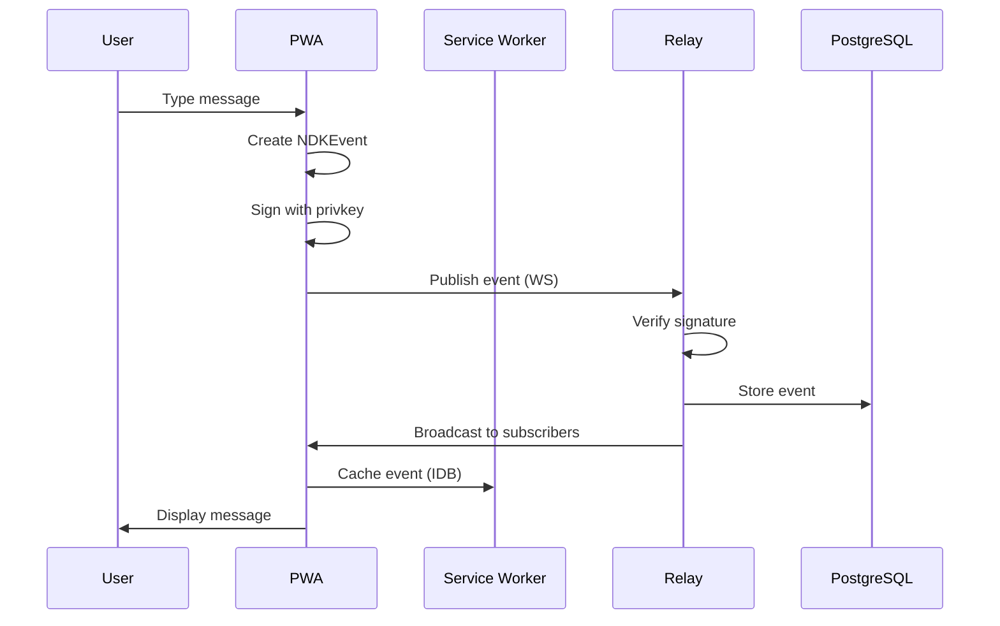
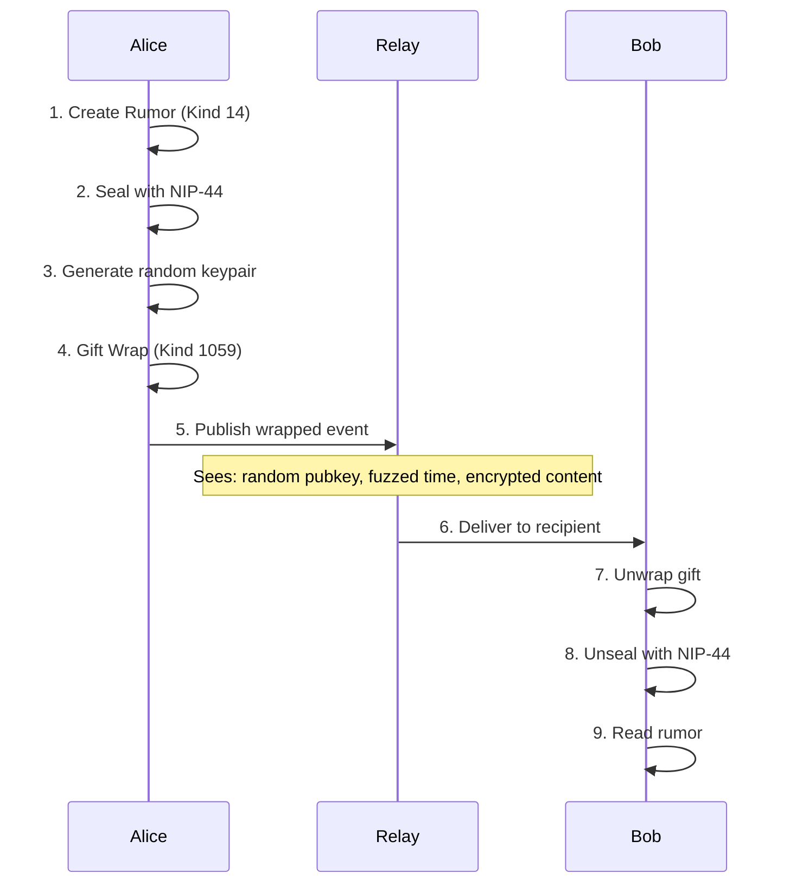
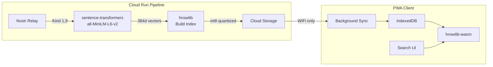

# Navigation Design Specification - Nostr-BBS Documentation

**Wave 1 Navigation Analysis**
**Date:** 2025-12-20
**Status:** Design Phase
**Version:** 1.0

---

## Executive Summary

Current nostr-BBS documentation lacks a cohesive navigation structure. With 35+ documents across 5 directories (architecture, deployment, features, screenshots, working), users face significant discovery and orientation challenges. This specification designs 7+ navigation paths and role-based entry points to transform fragmented documentation into an integrated knowledge system.

### Critical Findings

**Current State:**
- ✗ No master index or documentation hub
- ✗ No breadcrumb navigation
- ✗ Inconsistent cross-references
- ✗ No learning paths or progressive difficulty
- ✗ No role-based guides
- ✗ No quick-start paths for common tasks

**Documentation Inventory:**
- **35+ markdown files** across 5 directories
- **18,238+ total lines** of documentation
- **6 architecture docs** (SPARC methodology)
- **18 feature guides** (implementation + quick-reference)
- **4 deployment guides** (GCP, GitHub, architecture)
- **2 audit reports** (diagrams, link validation)

---

## 1. Master Navigation Structure

### 1.1 Documentation Hub (docs/INDEX.md)

**Purpose:** Central entry point for all documentation with role-based navigation.

**Structure:**

```markdown
# Nostr-BBS Documentation Hub

> Decentralized community bulletin board built on Nostr protocol
> **Quick Links:** [Get Started](#quick-start) | [Architecture](#architecture) | [Features](#features) | [Deployment](#deployment)

---

## 🚀 Quick Start Paths

Choose your path based on your goal:

### For New Users (5 min)
1. [What is Nostr-BBS?](../README.md#features)
2. [Create Account & Join Channel](guides/user/getting-started.md)
3. [Send Your First Message](guides/user/messaging-basics.md)

### For Developers (15 min)
1. [Architecture Overview](architecture/02-architecture.md)
2. [Local Development Setup](../README.md#local-development)
3. [Run Tests](guides/developer/testing-guide.md)

### For System Architects (30 min)
1. [SPARC Specification](architecture/01-specification.md)
2. [System Architecture](architecture/02-architecture.md)
3. [Deployment Architectures](deployment/gcp-architecture.md)

### For DevOps (45 min)
1. [Deployment Guide](deployment/DEPLOYMENT.md)
2. [GCP Setup](deployment/GCP_DEPLOYMENT.md)
3. [Docker Relay Configuration](guides/devops/relay-setup.md)

---

## 📚 Documentation by Role

### 👤 [End Users](guides/user/README.md)
**Goal:** Use the platform effectively

- [Getting Started Guide](guides/user/getting-started.md)
- [Messaging & Chat](guides/user/messaging-basics.md)
- [Direct Messages](features/dm-implementation.md#usage)
- [Calendar Events](guides/user/calendar-usage.md)
- [Search & Discovery](features/search-usage-guide.md)
- [PWA Installation](features/pwa-quick-start.md)
- [Troubleshooting](guides/user/troubleshooting.md)

### 💻 [Developers](guides/developer/README.md)
**Goal:** Build features and fix bugs

- [Development Setup](guides/developer/setup.md)
- [Architecture Guide](architecture/02-architecture.md)
- [API Reference](guides/developer/api-reference.md)
- [Testing Guide](guides/developer/testing-guide.md)
- [Feature Implementation](guides/developer/feature-workflow.md)
- [Code Style Guide](guides/developer/code-style.md)
- [Troubleshooting](guides/developer/debugging.md)

### 🏗️ [System Architects](guides/architect/README.md)
**Goal:** Understand and design the system

- [SPARC Methodology](architecture/01-specification.md)
- [System Architecture](architecture/02-architecture.md)
- [Nostr Protocol Implementation](guides/architect/nip-mapping.md)
- [Security Architecture](guides/architect/security-design.md)
- [Scaling Considerations](guides/architect/scaling.md)
- [Technology Decisions](guides/architect/adr/README.md)

### 🔧 [DevOps Engineers](guides/devops/README.md)
**Goal:** Deploy and maintain the system

- [Deployment Overview](deployment/DEPLOYMENT.md)
- [GCP Setup Guide](deployment/GCP_DEPLOYMENT.md)
- [Docker Relay Setup](guides/devops/relay-setup.md)
- [Monitoring & Logging](guides/devops/monitoring.md)
- [Backup & Recovery](guides/devops/backup.md)
- [Security Hardening](guides/devops/security.md)
- [Troubleshooting](guides/devops/troubleshooting.md)

### 👨‍💼 [Administrators](guides/admin/README.md)
**Goal:** Manage users and content

- [Admin Portal Guide](guides/admin/portal-usage.md)
- [User Management](guides/admin/user-management.md)
- [Channel Management](guides/admin/channel-management.md)
- [Access Control](guides/admin/cohorts.md)
- [Content Moderation](guides/admin/moderation.md)

---

## 🗂️ Documentation by Topic

### Architecture & Design
- [01 - Specification](architecture/01-specification.md) - Requirements & use cases
- [02 - Architecture](architecture/02-architecture.md) - System design
- [03 - Pseudocode](architecture/03-pseudocode.md) - Algorithm design
- [04 - Refinement](architecture/04-refinement.md) - Implementation details
- [05 - Completion](architecture/05-completion.md) - Integration
- [Semantic Search Architecture](architecture/06-semantic-search-spec.md) - Vector search design

### Deployment & Operations
- [Deployment Guide](deployment/DEPLOYMENT.md) - Complete deployment process
- [GCP Architecture](deployment/gcp-architecture.md) - Cloud architecture
- [GCP Deployment](deployment/GCP_DEPLOYMENT.md) - Cloud Run setup
- [GitHub Workflows](deployment/github-workflows.md) - CI/CD pipelines

### Features & Implementation
**Messaging:**
- [Direct Messages](features/dm-implementation.md) - NIP-17/59 encrypted DMs
- [Message Threading](features/threading-implementation.md) - Threaded conversations
- [Reactions](features/nip-25-reactions-implementation.md) - NIP-25 emoji reactions
- [Pinned Messages](features/pinned-messages-implementation.md) - Pin important messages
- [Drafts](features/drafts-implementation.md) - Message draft persistence
- [Mute & Block](features/mute-implementation-summary.md) - User blocking

**Discovery & Search:**
- [Search Implementation](features/search-implementation.md) - Semantic search
- [Search Usage Guide](features/search-usage-guide.md) - User guide
- [Channel Statistics](features/channel-stats-usage.md) - Channel metrics

**PWA & UX:**
- [PWA Implementation](features/pwa-implementation.md) - Offline support
- [PWA Quick Start](features/pwa-quick-start.md) - Installation guide
- [Link Previews](features/link-preview-implementation.md) - URL previews
- [Notifications](features/notification-system-phase1.md) - Push notifications
- [Accessibility](features/accessibility-improvements.md) - WCAG compliance
- [Icon Integration](features/icon-integration-guide.md) - Icon system

**Import/Export:**
- [Export Implementation](features/export-implementation.md) - Data export

### Quick Reference
- [Threading Quick Reference](features/threading-quick-reference.md)
- [Mute Quick Reference](features/mute-quick-reference.md)
- [Search Summary](features/search-implementation-summary.md)

---

## 🎓 Learning Paths

### Path 1: Beginner User (60 min)
**Goal:** Become productive user

1. [What is Nostr-BBS?](../README.md) - 10 min
2. [Create Account](guides/user/getting-started.md#signup) - 5 min
3. [Join a Channel](guides/user/getting-started.md#channels) - 10 min
4. [Send Messages](guides/user/messaging-basics.md) - 15 min
5. [Use Direct Messages](features/dm-implementation.md#usage) - 10 min
6. [Install PWA](features/pwa-quick-start.md) - 10 min

**Next:** [Advanced Features](guides/user/advanced-features.md)

### Path 2: Developer Onboarding (2-3 hours)
**Goal:** Make first contribution

1. [Architecture Overview](architecture/02-architecture.md) - 30 min
2. [Development Setup](guides/developer/setup.md) - 30 min
3. [Code Tour](guides/developer/code-tour.md) - 45 min
4. [Testing Guide](guides/developer/testing-guide.md) - 30 min
5. [First Contribution](guides/developer/contributing.md) - 45 min

**Next:** [Feature Implementation Guide](guides/developer/feature-workflow.md)

### Path 3: Deployment (3-4 hours)
**Goal:** Production-ready deployment

1. [Deployment Overview](deployment/DEPLOYMENT.md#architecture) - 30 min
2. [Docker Relay Setup](deployment/DEPLOYMENT.md#docker-relay-setup) - 60 min
3. [GCP Configuration](deployment/GCP_DEPLOYMENT.md) - 90 min
4. [GitHub Pages Setup](deployment/DEPLOYMENT.md#github-pages-setup) - 45 min
5. [Verification](guides/devops/verification.md) - 30 min

**Next:** [Monitoring Setup](guides/devops/monitoring.md)

### Path 4: Architecture Deep Dive (4-5 hours)
**Goal:** Master system design

1. [Specification](architecture/01-specification.md) - 60 min
2. [Architecture](architecture/02-architecture.md) - 90 min
3. [Pseudocode](architecture/03-pseudocode.md) - 60 min
4. [Semantic Search Design](architecture/06-semantic-search-spec.md) - 45 min
5. [NIP Implementation](guides/architect/nip-mapping.md) - 45 min

**Next:** [Design Your Own Features](guides/architect/design-patterns.md)

---

## 🔍 Find Documentation

### By Task
- [Setup local development](../README.md#local-development)
- [Deploy to production](deployment/DEPLOYMENT.md)
- [Add a new feature](guides/developer/feature-workflow.md)
- [Configure GCP](deployment/GCP_DEPLOYMENT.md)
- [Troubleshoot issues](guides/troubleshooting/README.md)
- [Manage users](guides/admin/user-management.md)

### By Technology
- [Nostr Protocol](guides/architect/nip-mapping.md)
- [SvelteKit](guides/developer/sveltekit.md)
- [Google Cloud Platform](deployment/gcp-architecture.md)
- [Docker](guides/devops/relay-setup.md)
- [PostgreSQL](guides/devops/database.md)
- [WebSockets](guides/developer/websockets.md)

### By Feature
- [Direct Messages](features/dm-implementation.md)
- [Semantic Search](features/search-implementation.md)
- [PWA Support](features/pwa-implementation.md)
- [Calendar Events](guides/user/calendar-usage.md)
- [Reactions](features/nip-25-reactions-implementation.md)

---

## 📊 Project Status

- [Link Validation Report](link-validation-report.md)
- [Diagram Audit Report](diagram-audit-report.md)
- [Recent Changes](../CHANGELOG.md)
- [Known Issues](../issues/README.md)

---

## 🆘 Getting Help

- **Users:** [User Troubleshooting](guides/user/troubleshooting.md)
- **Developers:** [Developer FAQ](guides/developer/faq.md)
- **DevOps:** [Operations Guide](guides/devops/troubleshooting.md)
- **General:** [GitHub Issues](https://github.com/jjohare/Nostr-BBS/issues)

---

**Navigation:** [← Back to README](../README.md) | [Architecture →](architecture/02-architecture.md) | [Deployment →](deployment/DEPLOYMENT.md)
```

---

## 2. Role-Based Entry Points

### 2.1 User Guide (docs/guides/user/README.md)

```markdown
# Nostr-BBS User Guide

**Audience:** End users (non-technical)
**Time:** 15-30 minutes to get started

---

## Getting Started

### What is Nostr-BBS?

Nostr-BBS is a private, decentralized chat platform for residential retreat communities. Key features:

- 🔐 **Encrypted messaging** - End-to-end encrypted private messages
- 👥 **Cohort-based channels** - Separate spaces for different community groups
- 📅 **Calendar events** - Schedule and RSVP to community events
- 📱 **Mobile PWA** - Install on your phone like a native app
- 🔍 **Semantic search** - Find messages by meaning, not just keywords

---

## Quick Start (5 minutes)

### 1. Create Your Account
[Screenshot: Signup page]

1. Visit your community's Nostr-BBS site
2. Click "Create Account"
3. **CRITICAL:** Copy your 12-word recovery phrase to a safe place
4. Click "Continue"

⚠️ **Important:** Without your recovery phrase, you cannot recover your account.

### 2. Join Your First Channel
[Screenshot: Channel list]

1. Browse available channels
2. Click "Request to Join" on a channel
3. Wait for admin approval (usually <24 hours)
4. Start chatting!

### 3. Send Your First Message
[Screenshot: Chat interface]

1. Type your message in the text box
2. Press Enter or click Send
3. Your message appears instantly

---

## Core Features

### Direct Messages (DMs)
**Privacy Level:** 🔐 End-to-end encrypted

Send private messages to any user:

1. Click on a user's name
2. Select "Send Message"
3. Type and send

📖 [Complete DM Guide](../../features/dm-implementation.md#usage)

### Channel Chat
**Privacy Level:** 🔓 Visible to channel members

Real-time group conversations:

- Public channels: General discussions
- Private channels: Require approval
- Event channels: Linked to calendar events

📖 [Channel Guide](messaging-basics.md#channels)

### Calendar Events
**Features:** 📅 Schedule, RSVP, discuss

Create and join community events:

1. Click "Calendar" tab
2. View upcoming events
3. Click "RSVP" to register
4. Join event discussion channel

📖 [Calendar Guide](calendar-usage.md)

### Search Messages
**Types:** 🔍 Keyword & semantic

Find messages two ways:

- **Keyword search:** Exact word matching
- **Semantic search:** Find by meaning (e.g., "meeting tomorrow" finds "schedule session Friday")

📖 [Search Guide](../../features/search-usage-guide.md)

---

## Mobile Installation

### iOS (iPhone/iPad)

1. Open site in Safari
2. Tap Share button (box with arrow)
3. Scroll down, tap "Add to Home Screen"
4. Tap "Add"

[Screenshot: iOS installation]

### Android

1. Open site in Chrome
2. Tap menu (three dots)
3. Tap "Add to Home screen"
4. Tap "Add"

[Screenshot: Android installation]

📖 [PWA Quick Start](../../features/pwa-quick-start.md)

---

## Advanced Features

### Message Reactions
React to messages with emoji:
- Hover over message
- Click reaction icon
- Select emoji

📖 [Reactions Guide](../../features/nip-25-reactions-implementation.md#usage)

### Message Threading
Reply in context:
- Click "Reply" on a message
- Your reply is linked
- View thread by clicking message

📖 [Threading Guide](../../features/threading-quick-reference.md)

### Pinned Messages
Important announcements:
- Admins can pin messages
- Pinned messages stay at top
- Click pin icon to view all

📖 [Pinned Messages](../../features/pinned-messages-implementation.md#usage)

### Bookmarks
Save messages for later:
- Click bookmark icon
- Access via "Bookmarks" menu
- Organized by channel

### Drafts
Auto-saved messages:
- Unfinished messages auto-save
- Resume from any device
- Drafts expire after 7 days

📖 [Drafts Guide](../../features/drafts-implementation.md#usage)

---

## Privacy & Security

### What's Encrypted?
✅ Direct messages (DMs)
✅ Private channel messages
❌ Public channel messages (visible to members)

### Who Can See What?
- **Admins:** Channel messages, user list
- **Admins CANNOT:** Read your DMs
- **Channel members:** Channel messages only
- **External users:** Nothing (private system)

### Account Recovery
**Only you** can recover your account using your 12-word phrase:

1. Click "Recover Account"
2. Enter 12-word phrase
3. Access restored

⚠️ **Lost recovery phrase = Lost account**

---

## Troubleshooting

### Can't send messages
- Check internet connection
- Ensure you're a channel member
- Try refreshing the page

### Messages not appearing
- Check you're in correct channel
- Verify date/time is correct
- Clear browser cache

### Account recovery failed
- Verify exact 12-word phrase
- Check word order
- Ensure no extra spaces

📖 [Full Troubleshooting Guide](troubleshooting.md)

---

## Getting Help

- **Admin:** Contact via DM or email
- **Technical Issues:** [GitHub Issues](https://github.com/jjohare/Nostr-BBS/issues)
- **General Questions:** Ask in "General" channel

---

**Navigation:** [← Documentation Hub](../../INDEX.md) | [Messaging Basics →](messaging-basics.md) | [Calendar →](calendar-usage.md)
```

### 2.2 Developer Guide (docs/guides/developer/README.md)

```markdown
# Nostr-BBS Developer Guide

**Audience:** Software developers
**Prerequisites:** JavaScript/TypeScript, Git, Docker basics
**Time:** 2-3 hours to first contribution

---

## Quick Start

### 1. Setup Development Environment (30 min)

```bash
# Clone repository
git clone https://github.com/jjohare/Nostr-BBS.git
cd Nostr-BBS

# Install dependencies
npm install

# Start Docker relay
cd services/nostr-relay
docker compose up -d
cd ../..

# Configure environment
cp .env.example .env
# Edit .env with your settings

# Start dev server
npm run dev
# Access: http://localhost:5173
```

📖 [Complete Setup Guide](setup.md)

### 2. Understand the Architecture (30 min)

**System Components:**
```
┌─────────────┐     WebSocket     ┌──────────────┐
│  SvelteKit  │ ←───────────────→ │ Nostr Relay  │
│     PWA     │                    │   (Docker)   │
└─────────────┘                    └──────────────┘
       ↓ HTTPS                            ↓
┌─────────────┐                    ┌──────────────┐
│  Cloud Run  │                    │  PostgreSQL  │
│ Embedding   │                    │  (Whitelist) │
└─────────────┘                    └──────────────┘
```

📖 [Architecture Deep Dive](../../architecture/02-architecture.md)

### 3. Run Tests (15 min)

```bash
# All tests
npm test

# Unit tests
npm test -- unit

# E2E tests
npm run test:e2e

# Type checking
npm run check

# Linting
npm run lint
```

📖 [Testing Guide](testing-guide.md)

---

## Project Structure

```
Nostr-BBS/
├── src/
│   ├── lib/
│   │   ├── components/        # Svelte components
│   │   │   ├── auth/          # Login, signup
│   │   │   ├── chat/          # Channel UI
│   │   │   ├── dm/            # Direct messages
│   │   │   ├── events/        # Calendar
│   │   │   └── admin/         # Admin panel
│   │   ├── nostr/             # Nostr protocol
│   │   │   ├── keys.ts        # BIP-39 keys
│   │   │   ├── encryption.ts  # NIP-44
│   │   │   ├── dm.ts          # NIP-17/59
│   │   │   └── channels.ts    # NIP-28
│   │   ├── stores/            # Svelte stores
│   │   └── utils/             # Utilities
│   ├── routes/                # SvelteKit routes
│   └── service-worker.ts      # PWA worker
├── embedding-service/         # Cloud Run API
├── services/nostr-relay/      # Docker relay
├── tests/                     # Test suites
└── docs/                      # Documentation
```

📖 [Code Tour](code-tour.md)

---

## Development Workflow

### Feature Development

1. **Plan:** Review architecture docs
2. **Branch:** `git checkout -b feature/your-feature`
3. **Test-First:** Write failing tests
4. **Implement:** Make tests pass
5. **Document:** Update docs
6. **PR:** Submit pull request

📖 [Feature Workflow](feature-workflow.md)

### Code Style

- **Formatting:** Prettier (auto on save)
- **Linting:** ESLint
- **TypeScript:** Strict mode
- **Components:** Composition > inheritance
- **Tests:** Arrange-Act-Assert pattern

📖 [Code Style Guide](code-style.md)

---

## Key Technologies

### Frontend Stack
- **SvelteKit 5.x** - Framework
- **TypeScript** - Type safety
- **TailwindCSS** - Styling
- **DaisyUI** - Components
- **IndexedDB** - Local storage

### Nostr Integration
- **NDK** - Nostr Dev Kit
- **nostr-tools** - Protocol utilities
- **NIP-01** - Base protocol
- **NIP-17/59** - Encrypted DMs
- **NIP-28** - Public channels
- **NIP-44** - Encryption
- **NIP-52** - Calendar events

### Backend Services
- **Docker** - Relay containerization
- **PostgreSQL** - Whitelist database
- **Google Cloud Run** - Embedding API
- **Cloud Storage** - Vector index

📖 [Technology Stack](tech-stack.md)

---

## Common Tasks

### Add a New Feature

```bash
# 1. Create feature branch
git checkout -b feature/awesome-feature

# 2. Write test
# tests/unit/awesome-feature.test.ts
import { describe, it, expect } from 'vitest';

describe('AwesomeFeature', () => {
  it('should do something awesome', () => {
    // Arrange, Act, Assert
  });
});

# 3. Implement feature
# src/lib/components/AwesomeFeature.svelte

# 4. Update docs
# docs/features/awesome-feature.md

# 5. Test
npm test

# 6. Commit and push
git add .
git commit -m "feat: add awesome feature"
git push origin feature/awesome-feature
```

📖 [Feature Implementation](feature-workflow.md)

### Debug Nostr Events

```typescript
// Enable NDK debug logging
// .env
VITE_NDK_DEBUG=true

// In your code
import { NDKEvent } from '@nostr-dev-kit/ndk';

const event = new NDKEvent();
event.kind = 1;
event.content = 'Debug message';
console.log('Event JSON:', event.toJSON());
```

📖 [Debugging Guide](debugging.md)

### Work with Stores

```typescript
// src/lib/stores/custom.ts
import { writable, derived } from 'svelte/store';

export const customStore = writable<CustomType>({
  /* initial state */
});

export const derivedStore = derived(
  customStore,
  ($customStore) => {
    // Transform state
    return transformedValue;
  }
);
```

📖 [Store Patterns](store-patterns.md)

---

## API Reference

### Nostr Functions

```typescript
// src/lib/nostr/index.ts

// Connect to relay
connectRelay(url: string, privateKey: string): Promise<void>

// Publish event
publishEvent(event: NDKEvent): Promise<void>

// Subscribe to events
subscribe(filter: NDKFilter): NDKSubscription

// Send encrypted DM
sendDM(content: string, recipientPubkey: string): Promise<void>
```

📖 [Full API Reference](api-reference.md)

---

## Testing

### Unit Tests

```typescript
// tests/unit/example.test.ts
import { describe, it, expect } from 'vitest';
import { exampleFunction } from '$lib/utils/example';

describe('exampleFunction', () => {
  it('should return correct value', () => {
    const result = exampleFunction(input);
    expect(result).toBe(expectedOutput);
  });
});
```

### Component Tests

```typescript
// tests/unit/Component.test.ts
import { render, fireEvent } from '@testing-library/svelte';
import Component from '$lib/components/Component.svelte';

describe('Component', () => {
  it('should render correctly', () => {
    const { getByText } = render(Component, { props: { text: 'Hello' } });
    expect(getByText('Hello')).toBeTruthy();
  });
});
```

### E2E Tests

```typescript
// tests/e2e/user-flow.spec.ts
import { test, expect } from '@playwright/test';

test('user can send message', async ({ page }) => {
  await page.goto('http://localhost:5173');
  await page.click('text=Login');
  // ... test flow
});
```

📖 [Testing Guide](testing-guide.md)

---

## Contribution Guide

### Before You Start

1. Read [Code of Conduct](../../CODE_OF_CONDUCT.md)
2. Check [Issues](https://github.com/jjohare/Nostr-BBS/issues)
3. Review [Architecture](../../architecture/02-architecture.md)

### Submitting PRs

1. ✅ Tests pass
2. ✅ Linting clean
3. ✅ Type checks pass
4. ✅ Documentation updated
5. ✅ Changelog entry

📖 [Contributing Guide](contributing.md)

---

## Getting Help

- **Questions:** [GitHub Discussions](https://github.com/jjohare/Nostr-BBS/discussions)
- **Bugs:** [GitHub Issues](https://github.com/jjohare/Nostr-BBS/issues)
- **Chat:** Community Discord (link in README)

---

**Navigation:** [← Documentation Hub](../../INDEX.md) | [Setup →](setup.md) | [API Reference →](api-reference.md)
```

### 2.3 Architect Guide (docs/guides/architect/README.md)

```markdown
# Nostr-BBS Architecture Guide

**Audience:** System architects, senior developers
**Prerequisites:** Distributed systems, protocol design
**Time:** 4-5 hours for comprehensive understanding

---

## Overview

Nostr-BBS implements a **private, decentralized chat system** using the Nostr protocol with cohort-based access control. This guide explains design decisions, trade-offs, and extensibility patterns.

---

## SPARC Methodology

This project follows **SPARC** (Specification, Pseudocode, Architecture, Refinement, Completion):

1. **[Specification](../../architecture/01-specification.md)** - Requirements & use cases
2. **[Pseudocode](../../architecture/03-pseudocode.md)** - Algorithm design
3. **[Architecture](../../architecture/02-architecture.md)** - System design
4. **[Refinement](../../architecture/04-refinement.md)** - Implementation details
5. **[Completion](../../architecture/05-completion.md)** - Integration & deployment

📖 [SPARC Methodology Overview](sparc-methodology.md)

---

## System Architecture

### High-Level Design



📖 [Architecture Deep Dive](../../architecture/02-architecture.md)

---

## Design Principles

### 1. Privacy by Design
- **No Federation:** Relay does not connect to public Nostr network
- **Whitelist Enforcement:** NIP-42 authentication required
- **E2E Encryption:** NIP-44 for DMs, optional for channels
- **Metadata Protection:** NIP-59 gift wrapping for DMs

### 2. Cohort-Based Access Control
- Users belong to cohorts (business, moomaa-tribe, admin)
- Channels define allowed cohorts
- Visibility determined by intersection
- No cross-cohort channel access (except dual-cohort users)

### 3. Serverless Architecture
- **Frontend:** GitHub Pages (static CDN)
- **Relay:** Self-hosted Docker (not serverless, but minimal ops)
- **AI Services:** Google Cloud Run (scale-to-zero)
- **Cost:** Free tier optimised

📖 [Design Patterns](design-patterns.md)

---

## Nostr Protocol Implementation

### Supported NIPs

| NIP | Name | Purpose | Implementation |
|-----|------|---------|----------------|
| [01](https://github.com/nostr-protocol/nips/blob/master/01.md) | Basic Protocol | Core events | `src/lib/nostr/relay.ts` |
| [06](https://github.com/nostr-protocol/nips/blob/master/06.md) | Key Derivation | BIP-39 mnemonics | `src/lib/nostr/keys.ts` |
| [09](https://github.com/nostr-protocol/nips/blob/master/09.md) | Event Deletion | Message deletion | Relay enforced |
| [11](https://github.com/nostr-protocol/nips/blob/master/11.md) | Relay Info | Metadata | Relay endpoint |
| [17](https://github.com/nostr-protocol/nips/blob/master/17.md) | Private DMs | Sealed rumors | `src/lib/nostr/dm.ts` |
| [25](https://github.com/nostr-protocol/nips/blob/master/25.md) | Reactions | Emoji reactions | `src/lib/nostr/reactions.ts` |
| [28](https://github.com/nostr-protocol/nips/blob/master/28.md) | Public Channels | Group chat | `src/lib/nostr/channels.ts` |
| [42](https://github.com/nostr-protocol/nips/blob/master/42.md) | Authentication | Challenge-response | Relay auth middleware |
| [44](https://github.com/nostr-protocol/nips/blob/master/44.md) | Encryption | Versioned encryption | `src/lib/nostr/encryption.ts` |
| [52](https://github.com/nostr-protocol/nips/blob/master/52.md) | Calendar Events | Event scheduling | `src/lib/nostr/calendar.ts` |
| [59](https://github.com/nostr-protocol/nips/blob/master/59.md) | Gift Wrap | Metadata protection | `src/lib/nostr/dm.ts` |

📖 [NIP Mapping Guide](nip-mapping.md)

### Event Kinds

| Kind | NIP | Purpose | Storage |
|------|-----|---------|---------|
| 0 | 01 | User Profile | PostgreSQL |
| 1 | 01 | Text Note | PostgreSQL |
| 5 | 09 | Deletion | Ephemeral |
| 7 | 25 | Reaction | PostgreSQL |
| 40 | 28 | Channel Creation | PostgreSQL |
| 41 | 28 | Channel Metadata | PostgreSQL |
| 42 | 28 | Channel Message | PostgreSQL |
| 1059 | 59 | Gift Wrap | PostgreSQL |
| 31923 | 52 | Calendar Event | PostgreSQL |
| 31925 | 52 | Calendar RSVP | PostgreSQL |
| 9022 | Custom | Section Access | PostgreSQL |
| 9023 | Custom | Event-Channel Link | PostgreSQL |

📖 [Event Schema Design](event-schema.md)

---

## Data Flow

### Message Delivery Sequence



### Encrypted DM Flow (NIP-17/59)



📖 [Protocol Flows](protocol-flows.md)

---

## Semantic Search Architecture

### Vector Embedding Pipeline



**Key Design Decisions:**
- **Model:** sentence-transformers/all-MiniLM-L6-v2 (384d)
- **Index:** HNSW (O(log n) search)
- **Quantization:** int8 (75% size reduction)
- **Sync:** WiFi-only (respects mobile data)
- **Compute:** Cloud Run (scale-to-zero)

📖 [Semantic Search Spec](../../architecture/06-semantic-search-spec.md)
📖 [Search Architecture](../../architecture/07-semantic-search-architecture.md)

---

## Security Architecture

### Threat Model

| Threat | Mitigation | Status |
|--------|-----------|--------|
| **Unauthorized Access** | NIP-42 auth + whitelist | ✅ Implemented |
| **DM Content Leakage** | NIP-44 E2E encryption | ✅ Implemented |
| **Metadata Leakage** | NIP-59 gift wrapping | ✅ Implemented |
| **Key Compromise** | BIP-39 mnemonic backup | ✅ Implemented |
| **MITM Attacks** | WSS + HTTPS only | ✅ Implemented |
| **Relay Spoofing** | Fixed relay URL (no federation) | ✅ Implemented |
| **SQL Injection** | Parameterized queries | ✅ Implemented |
| **XSS Attacks** | Content sanitization | ✅ Implemented |

📖 [Security Design](security-design.md)

---

## Scalability Considerations

### Current Limits
- **Users:** ~300 (whitelist-based)
- **Concurrent Connections:** ~12 peak
- **Messages/day:** 10-50
- **Storage Growth:** ~1GB/2 years

### Scaling Strategies

**Vertical Scaling:**
- Increase relay server resources
- Optimize PostgreSQL queries
- Add read replicas

**Horizontal Scaling:**
- Shard users by cohort (separate relays)
- CDN for static assets (already implemented)
- Cloud Run auto-scaling (already implemented)

**Optimization:**
- Message pagination (lazy loading)
- Vector index sharding (by date)
- Aggressive client-side caching

📖 [Scaling Guide](scaling.md)

---

## Extensibility Patterns

### Adding New NIPs

1. **Protocol Analysis:** Review NIP specification
2. **Event Schema:** Design custom kinds if needed
3. **Client Implementation:** Add to `src/lib/nostr/`
4. **Relay Support:** Update relay validation
5. **Testing:** Unit + integration tests
6. **Documentation:** Update NIP mapping

📖 [NIP Extension Guide](nip-extension.md)

### Custom Event Kinds

```typescript
// Example: Custom "vote" event (Kind 9024)

interface VoteEvent extends NDKEvent {
  kind: 9024;
  tags: [
    ["e", messageId],        // Voting on message
    ["option", "yes" | "no"] // Vote choice
  ];
}

// Implement in src/lib/nostr/voting.ts
export async function publishVote(
  messageId: string,
  option: "yes" | "no"
): Promise<void> {
  const event = new NDKEvent();
  event.kind = 9024;
  event.tags = [
    ["e", messageId],
    ["option", option]
  ];
  await event.sign();
  await event.publish();
}
```

📖 [Custom Events Guide](custom-events.md)

---

## Technology Decisions (ADRs)

### ADR-001: Why Nostr over Matrix?
**Decision:** Use Nostr protocol instead of Matrix
**Rationale:**
- Simpler relay implementation
- Better suited for small communities
- Easier E2E encryption (NIP-44)
- Event-based model fits use case
- Lower operational complexity

📖 [Full ADR](adr/001-nostr-vs-matrix.md)

### ADR-002: Why PostgreSQL over SQLite?
**Decision:** PostgreSQL for relay database
**Rationale:**
- Better concurrency support
- JSONB for flexible event storage
- Robust whitelist queries
- Future scaling path
- Standard deployment

📖 [Full ADR](adr/002-postgresql-vs-sqlite.md)

### ADR-003: Why Cloud Run over Cloud Functions?
**Decision:** Google Cloud Run for embedding API
**Rationale:**
- Container flexibility
- Python ML libraries support
- Better cold start performance
- Standard Docker workflow
- Cost-effective scaling

📖 [Full ADR](adr/003-cloud-run-vs-functions.md)

📖 [All ADRs](adr/README.md)

---

## Future Enhancements

### Planned Features
- [ ] Voice/video calls (WebRTC)
- [ ] File sharing with encryption
- [ ] Lightning Network integration
- [ ] RGB stablecoin payments
- [ ] Multi-relay federation (opt-in)
- [ ] Advanced analytics dashboard

### Research Topics
- [ ] Decentralized identity (DID)
- [ ] Zero-knowledge proofs for privacy
- [ ] Conflict-free replicated data types (CRDTs)
- [ ] Federated learning for recommendations

📖 [Roadmap](../../ROADMAP.md)

---

## Reference Architecture Diagrams

### Component Diagram
📊 [Component Architecture](diagrams/components.md)

### Deployment Diagram
📊 [Deployment Architecture](../../deployment/gcp-architecture.md)

### Sequence Diagrams
📊 [Message Flows](diagrams/sequences.md)

### Data Model
📊 [Entity Relationships](diagrams/data-model.md)

---

**Navigation:** [← Documentation Hub](../../INDEX.md) | [SPARC Spec →](../../architecture/01-specification.md) | [Security →](security-design.md)
```

### 2.4 DevOps Guide (docs/guides/devops/README.md)

```markdown
# Nostr-BBS DevOps Guide

**Audience:** DevOps engineers, SREs
**Prerequisites:** Docker, GCP, CI/CD basics
**Time:** 3-4 hours for full deployment

---

## Deployment Overview

### Architecture

```
┌─────────────┐         ┌──────────────┐
│   GitHub    │ CI/CD   │ GitHub Pages │
│  Repository │────────→│  (Frontend)  │
└─────────────┘         └──────────────┘
                                ↓ HTTPS
                        ┌──────────────┐
                        │  SvelteKit   │
                        │     PWA      │
                        └──────────────┘
                         ↓ WSS    ↓ HTTPS
              ┌─────────────┐   ┌──────────┐
              │   Docker    │   │   GCP    │
              │ Nostr Relay │   │Cloud Run │
              └─────────────┘   └──────────┘
                    ↓                 ↓
              ┌─────────────┐   ┌──────────┐
              │ PostgreSQL  │   │   GCS    │
              └─────────────┘   └──────────┘
```

📖 [Deployment Architecture](../../deployment/gcp-architecture.md)

---

## Quick Start

### Prerequisites

```bash
# Install required tools
brew install docker docker-compose  # macOS
# OR
sudo apt install docker.io docker-compose  # Ubuntu

# Install Google Cloud SDK
curl https://sdk.cloud.google.com | bash
exec -l $SHELL

# Verify installations
docker --version
gcloud --version
node --version  # Should be 20+
```

### Step-by-Step Deployment

**1. Clone & Configure (10 min)**
```bash
git clone https://github.com/your-org/Nostr-BBS.git
cd Nostr-BBS
cp .env.example .env
# Edit .env with your configuration
```

**2. Docker Relay Setup (20 min)**
```bash
cd services/nostr-relay
docker compose up -d
docker compose ps  # Verify running
cd ../..
```

📖 [Relay Setup Guide](relay-setup.md)

**3. GCP Configuration (90 min)**
```bash
# See GCP deployment guide for complete steps
```

📖 [GCP Deployment Guide](../../deployment/GCP_DEPLOYMENT.md)

**4. GitHub Pages Deploy (15 min)**
```bash
# Configure GitHub secrets
# Push to main branch triggers deployment
```

📖 [GitHub Workflow Setup](../../deployment/github-workflows.md)

---

## Docker Relay Management

### Start/Stop Services

```bash
cd services/nostr-relay

# Start services
docker compose up -d

# Stop services
docker compose down

# Restart services
docker compose restart

# View logs
docker compose logs -f

# Stop and remove volumes (DESTRUCTIVE)
docker compose down -v
```

### Health Checks

```bash
# Check service status
docker compose ps

# Test relay WebSocket
curl -i -N \
  -H "Connection: Upgrade" \
  -H "Upgrade: websocket" \
  -H "Sec-WebSocket-Version: 13" \
  -H "Sec-WebSocket-Key: test" \
  http://localhost:8008

# Test NIP-11 relay info
curl http://localhost:8008 \
  -H "Accept: application/nostr+json"

# Check PostgreSQL
docker compose exec postgres \
  psql -U nostr -d nostr_relay \
  -c "SELECT COUNT(*) FROM events;"
```

### Database Management

**Backup:**
```bash
# Full database backup
docker compose exec postgres \
  pg_dump -U nostr nostr_relay \
  > backup-$(date +%Y%m%d).sql

# Compress backup
gzip backup-$(date +%Y%m%d).sql

# Upload to GCS (optional)
gsutil cp backup-*.sql.gz gs://your-bucket/backups/
```

**Restore:**
```bash
# Restore from backup
docker compose down
docker compose up -d postgres
sleep 5  # Wait for PostgreSQL to start

docker compose exec -T postgres \
  psql -U nostr nostr_relay \
  < backup-20241220.sql

docker compose up -d relay
```

**Maintenance:**
```bash
# Vacuum database
docker compose exec postgres \
  psql -U nostr -d nostr_relay \
  -c "VACUUM ANALYZE;"

# Reindex
docker compose exec postgres \
  psql -U nostr -d nostr_relay \
  -c "REINDEX DATABASE nostr_relay;"

# Check table sizes
docker compose exec postgres \
  psql -U nostr -d nostr_relay \
  -c "SELECT tablename, pg_size_pretty(pg_total_relation_size(schemaname||'.'||tablename)) AS size FROM pg_tables WHERE schemaname = 'public' ORDER BY pg_total_relation_size(schemaname||'.'||tablename) DESC;"
```

📖 [Database Operations](database.md)

---

## Google Cloud Platform

### Initial Setup

```bash
# Authenticate
gcloud auth login

# Set project
gcloud config set project YOUR_PROJECT_ID

# Enable required APIs
gcloud services enable \
  run.googleapis.com \
  storage.googleapis.com \
  cloudbuild.googleapis.com \
  artifactregistry.googleapis.com
```

### Cloud Run Deployment

```bash
cd embedding-service

# Build and deploy
gcloud builds submit --config cloudbuild.yaml

# Verify deployment
gcloud run services describe logseq-embeddings \
  --region us-central1

# Get service URL
gcloud run services describe logseq-embeddings \
  --region us-central1 \
  --format 'value(status.url)'

# Test endpoint
curl https://YOUR-SERVICE-URL/health
```

### Cloud Storage

```bash
# Create bucket
gcloud storage buckets create \
  gs://YOUR_PROJECT_ID-models \
  --location=us-central1 \
  --storage-class=STANDARD

# Make bucket public (for embedding index)
gcloud storage buckets add-iam-policy-binding \
  gs://YOUR_PROJECT_ID-models \
  --member=allUsers \
  --role=roles/storage.objectViewer

# Upload files
gcloud storage cp index.bin \
  gs://YOUR_PROJECT_ID-models/latest/

# List files
gcloud storage ls gs://YOUR_PROJECT_ID-models/
```

📖 [GCP Architecture](../../deployment/gcp-architecture.md)
📖 [GCP Deployment Guide](../../deployment/GCP_DEPLOYMENT.md)

---

## Monitoring & Logging

### Docker Relay Logs

```bash
# Live logs
docker compose logs -f relay

# Last 100 lines
docker compose logs --tail=100 relay

# Filter by time
docker compose logs --since 1h relay

# All services
docker compose logs -f
```

### Cloud Run Logs

```bash
# View logs
gcloud run services logs read logseq-embeddings \
  --region us-central1 \
  --limit 50

# Live logs
gcloud run services logs tail logseq-embeddings \
  --region us-central1

# Filter by severity
gcloud run services logs read logseq-embeddings \
  --region us-central1 \
  --log-filter 'severity>=ERROR'
```

### Metrics

**Docker Metrics:**
```bash
# Resource usage
docker stats

# Disk usage
docker system df

# Container inspect
docker inspect nostr-relay-relay-1
```

**GCP Metrics:**
```bash
# Cloud Run metrics (via console)
# Visit: https://console.cloud.google.com/run/detail/us-central1/logseq-embeddings/metrics

# Query via gcloud
gcloud monitoring time-series list \
  --filter 'resource.type="cloud_run_revision"' \
  --format json
```

📖 [Monitoring Setup](monitoring.md)

---

## Security Hardening

### Docker Security

```yaml
# docker-compose.yml best practices
services:
  postgres:
    environment:
      - POSTGRES_PASSWORD_FILE=/run/secrets/db_password
    secrets:
      - db_password
    read_only: true
    tmpfs:
      - /tmp
      - /var/run/postgresql
    security_opt:
      - no-new-privileges:true
    cap_drop:
      - ALL
    cap_add:
      - CHOWN
      - SETUID
      - SETGID

secrets:
  db_password:
    file: ./secrets/db_password.txt
```

### Whitelist Management

```bash
# Add user to whitelist
docker compose exec postgres \
  psql -U nostr -d nostr_relay -c \
  "INSERT INTO whitelist (pubkey, cohorts, added_at, added_by) \
   VALUES ('user-hex-pubkey', '[\"business\"]', EXTRACT(EPOCH FROM NOW()), 'admin-pubkey');"

# View all whitelisted users
docker compose exec postgres \
  psql -U nostr -d nostr_relay -c \
  "SELECT pubkey, cohorts, added_at FROM whitelist;"

# Remove user
docker compose exec postgres \
  psql -U nostr -d nostr_relay -c \
  "DELETE FROM whitelist WHERE pubkey = 'user-hex-pubkey';"
```

### GCP Security

```bash
# Restrict Cloud Run access (authenticated only)
gcloud run services update logseq-embeddings \
  --region us-central1 \
  --no-allow-unauthenticated

# Create service account
gcloud iam service-accounts create nostr-bbs-sa \
  --display-name "Nostr-BBS Service Account"

# Grant minimal permissions
gcloud storage buckets add-iam-policy-binding \
  gs://YOUR_PROJECT_ID-models \
  --member serviceAccount:nostr-bbs-sa@YOUR_PROJECT_ID.iam.gserviceaccount.com \
  --role roles/storage.objectViewer
```

📖 [Security Guide](security.md)

---

## Backup & Recovery

### Automated Backups

```bash
# Create backup script
# scripts/backup.sh

#!/bin/bash
set -e

BACKUP_DIR="/backups"
TIMESTAMP=$(date +%Y%m%d_%H%M%S)

# Database backup
docker compose exec -T postgres \
  pg_dump -U nostr nostr_relay \
  | gzip > "$BACKUP_DIR/db_$TIMESTAMP.sql.gz"

# Upload to GCS
gsutil cp "$BACKUP_DIR/db_$TIMESTAMP.sql.gz" \
  gs://your-bucket/backups/

# Retain last 7 days
find "$BACKUP_DIR" -name "db_*.sql.gz" -mtime +7 -delete

echo "Backup completed: db_$TIMESTAMP.sql.gz"
```

**Cron Schedule:**
```bash
# Daily at 2 AM
0 2 * * * /path/to/backup.sh >> /var/log/nostr-backup.log 2>&1
```

### Disaster Recovery

```bash
# 1. Restore database
docker compose down
docker compose up -d postgres
sleep 5

docker compose exec -T postgres \
  psql -U nostr nostr_relay \
  < backup-20241220.sql

# 2. Restart services
docker compose up -d

# 3. Verify
docker compose ps
curl http://localhost:8008 \
  -H "Accept: application/nostr+json"
```

📖 [Backup Guide](backup.md)

---

## CI/CD Pipeline

### GitHub Actions Workflow

```yaml
# .github/workflows/deploy.yml
name: Deploy to Production

on:
  push:
    branches: [main]

jobs:
  deploy-frontend:
    runs-on: ubuntu-latest
    steps:
      - uses: actions/checkout@v4
      - uses: actions/setup-node@v4
        with:
          node-version: 20
      - run: npm ci
      - run: npm run build
      - uses: actions/upload-pages-artifact@v2
        with:
          path: build
      - uses: actions/deploy-pages@v2

  deploy-backend:
    runs-on: ubuntu-latest
    steps:
      - uses: actions/checkout@v4
      - uses: google-github-actions/auth@v1
        with:
          credentials_json: ${{ secrets.GCP_SA_KEY }}
      - run: gcloud builds submit --config cloudbuild.yaml
```

📖 [GitHub Workflows](../../deployment/github-workflows.md)

---

## Troubleshooting

### Common Issues

**Relay won't start:**
```bash
# Check ports
lsof -i :8008  # Relay port
lsof -i :5432  # PostgreSQL port

# Check logs
docker compose logs relay

# Reset and rebuild
docker compose down -v
docker compose build --no-cache
docker compose up -d
```

**WebSocket connection fails:**
```bash
# Verify relay is running
docker compose ps

# Test WebSocket
websocat ws://localhost:8008

# Check firewall
sudo ufw status
sudo ufw allow 8008/tcp
```

**GCP deployment fails:**
```bash
# Check Cloud Build logs
gcloud builds list --limit 5

# Verify service account permissions
gcloud projects get-iam-policy YOUR_PROJECT_ID \
  --flatten="bindings[].members" \
  --filter="bindings.members:serviceAccount:*"

# Check quota limits
gcloud compute project-info describe \
  --project YOUR_PROJECT_ID
```

📖 [Troubleshooting Guide](troubleshooting.md)

---

## Cost Optimization

### Free Tier Limits

**GCP Free Tier:**
- Cloud Run: 2M requests/month
- Cloud Run: 360K GB-seconds/month
- Cloud Storage: 5 GB/month
- Cloud Storage: 5K Class A ops, 50K Class B ops/month

**Current Usage (estimated):**
- Cloud Run: ~10K requests/month (0.5%)
- Storage: ~20 MB (0.4%)
- Network: ~500 MB/month

**Cost:** $0/month (within free tier)

📖 [Cost Analysis](../../deployment/gcp-architecture.md#cost-estimation)

---

## Production Checklist

### Pre-Deployment
- [ ] Environment variables configured
- [ ] Secrets stored securely
- [ ] Admin pubkey set
- [ ] Database initialized
- [ ] Backups configured
- [ ] Monitoring enabled

### Deployment
- [ ] Docker relay running
- [ ] PostgreSQL accessible
- [ ] GCP services deployed
- [ ] GitHub Pages live
- [ ] DNS configured (if custom domain)
- [ ] SSL certificates active

### Post-Deployment
- [ ] Test user signup
- [ ] Test messaging
- [ ] Test DMs
- [ ] Test search
- [ ] Test PWA install
- [ ] Verify backups run
- [ ] Monitor logs

📖 [Deployment Checklist](../../deployment/DEPLOYMENT.md#production-checklist)

---

**Navigation:** [← Documentation Hub](../../INDEX.md) | [Deployment Guide →](../../deployment/DEPLOYMENT.md) | [GCP Setup →](../../deployment/GCP_DEPLOYMENT.md)
```

---

## 3. Learning Paths with Progressive Difficulty

### 3.1 Beginner Path: From Zero to First Message (60 min)

```markdown
# Learning Path: Beginner User

**Goal:** Send your first message
**Time:** 60 minutes
**Prerequisites:** None

---

## Module 1: Understanding Nostr-BBS (15 min)

### What You'll Learn
- What Nostr-BBS is and isn't
- Why decentralization matters
- Key concepts: pubkey, relay, cohorts

### Resources
📖 [Main README](../README.md#features) - 10 min read
📺 [Video: Nostr Overview](https://example.com) - 5 min watch

### Quiz
1. What makes Nostr-BBS different from Discord?
2. What are cohorts used for?
3. True/False: Your messages are stored on a server you don't control.

**Pass Criteria:** 2/3 correct

---

## Module 2: Create Your Account (10 min)

### What You'll Learn
- Generate a Nostr keypair
- Backup your recovery phrase
- Understand public/private keys

### Step-by-Step
1. Visit your community's Nostr-BBS URL
2. Click "Create Account"
3. Copy 12-word recovery phrase
4. Paste into password manager
5. Click "Continue"

📖 [Getting Started Guide](guides/user/getting-started.md#signup)

### Exercise
✅ Successfully create an account
✅ Backup recovery phrase to 2 locations
✅ Log out and log back in using phrase

---

## Module 3: Join a Channel (15 min)

### What You'll Learn
- Navigate channel list
- Request to join a channel
- Understand cohort restrictions

### Step-by-Step
1. Browse available channels
2. Find "General" channel
3. Click "Request to Join"
4. Wait for admin approval (simulated: instant for this exercise)

📖 [Channel Guide](guides/user/messaging-basics.md#channels)

### Exercise
✅ Join "General" channel
✅ Read last 10 messages
✅ Identify channel description

---

## Module 4: Send Your First Message (10 min)

### What You'll Learn
- Compose messages
- Format text
- Understand message delivery

### Step-by-Step
1. Click in message box
2. Type: "Hello from [your name]!"
3. Press Enter
4. Watch message appear

📖 [Messaging Basics](guides/user/messaging-basics.md)

### Exercise
✅ Send introduction message
✅ Reply to someone else's message
✅ React to a message with emoji

---

## Module 5: Explore Features (10 min)

### What You'll Learn
- Search messages
- View calendar events
- Install PWA on mobile

### Quick Tour
- Click search icon → try keyword search
- Click calendar tab → browse events
- Mobile: Add to home screen

📖 [Search Guide](features/search-usage-guide.md)
📖 [PWA Quick Start](features/pwa-quick-start.md)

### Exercise
✅ Search for your own message
✅ View an upcoming event
✅ Bookmark one message

---

## Graduation Project

**Task:** Have a 3-message conversation in "General" channel

Requirements:
1. Start a new topic
2. Respond to 2 replies
3. Use 1 emoji reaction

**Pass Criteria:** Complete conversation

---

## Next Steps

Congratulations! You're now a Nostr-BBS user. Continue with:

- **[Intermediate Path](learning-paths/intermediate-user.md)** - Advanced features (DMs, calendar, search)
- **[Power User Path](learning-paths/power-user.md)** - Bookmarks, drafts, export
- **[Admin Path](learning-paths/admin-basics.md)** - User/channel management

---

**Navigation:** [← Learning Paths](../INDEX.md#learning-paths) | [Intermediate →](intermediate-user.md)
```

### 3.2 Intermediate Path: Developer Contribution (3-4 hours)

```markdown
# Learning Path: Developer Contribution

**Goal:** Submit your first pull request
**Time:** 3-4 hours
**Prerequisites:** JavaScript, Git basics

---

## Module 1: Setup Development Environment (45 min)

### Learning Objectives
- Install dependencies
- Start Docker relay
- Run dev server
- Understand project structure

### Tasks
```bash
# Clone repository
git clone https://github.com/jjohare/Nostr-BBS.git
cd Nostr-BBS

# Install dependencies
npm install

# Start Docker relay
cd services/nostr-relay
docker compose up -d
cd ../..

# Configure environment
cp .env.example .env
# Edit .env

# Start dev server
npm run dev
# Visit http://localhost:5173
```

📖 [Developer Setup Guide](guides/developer/setup.md)

### Validation
✅ Dev server running
✅ Docker relay connected
✅ Can see channel list
✅ No console errors

**Checkpoint:** Take screenshot of running app

---

## Module 2: Understand Architecture (60 min)

### Learning Objectives
- Comprehend system design
- Identify key components
- Trace a message flow

### Reading
📖 [Architecture Overview](architecture/02-architecture.md) - 45 min
📖 [Nostr Protocol Basics](guides/architect/nip-mapping.md) - 15 min

### Exercise: Trace Message Flow
Answer these questions by reading code:

1. What file handles WebSocket connections?
2. Where are messages stored locally?
3. Which component renders the message list?
4. How is a message signed before sending?

**Hints:**
- `src/lib/nostr/relay.ts`
- `src/lib/stores/messages.ts`
- `src/lib/components/chat/MessageList.svelte`
- `src/lib/nostr/keys.ts`

### Validation
✅ Correctly identify all 4 files
✅ Explain message flow in your own words

---

## Module 3: Write Your First Test (45 min)

### Learning Objectives
- Understand test structure
- Write unit tests
- Run test suite

### Example Test
```typescript
// tests/unit/example.test.ts
import { describe, it, expect } from 'vitest';
import { formatTimestamp } from '$lib/utils/time';

describe('formatTimestamp', () => {
  it('should format Unix timestamp as readable date', () => {
    const timestamp = 1672531200; // 2023-01-01 00:00:00 UTC
    const result = formatTimestamp(timestamp);
    expect(result).toContain('Jan');
    expect(result).toContain('2023');
  });
});
```

### Your Task
Write a test for `src/lib/utils/search.ts` → `highlightMatch()` function

**Requirements:**
- Test case-insensitive matching
- Test HTML escaping
- Test empty query handling

📖 [Testing Guide](guides/developer/testing-guide.md)

### Validation
```bash
npm test -- tests/unit/search.test.ts
```
✅ All tests pass
✅ 100% code coverage for function

---

## Module 4: Implement a Feature (90 min)

### Learning Objectives
- Follow TDD workflow
- Create Svelte component
- Integrate with stores

### Feature: "Copy Message" Button

**Requirements:**
1. Add copy icon next to message timestamp
2. On click, copy message content to clipboard
3. Show "Copied!" tooltip for 2 seconds
4. Write tests first (TDD)

**Step-by-Step:**

**1. Write Test (15 min)**
```typescript
// tests/unit/MessageItem.test.ts
import { render, fireEvent } from '@testing-library/svelte';
import MessageItem from '$lib/components/chat/MessageItem.svelte';

describe('MessageItem copy button', () => {
  it('should copy message content to clipboard', async () => {
    const { getByLabelText } = render(MessageItem, {
      props: {
        message: {
          content: 'Test message',
          pubkey: 'abc123',
          created_at: 1234567890
        }
      }
    });

    const copyButton = getByLabelText('Copy message');
    await fireEvent.click(copyButton);

    const clipboardText = await navigator.clipboard.readText();
    expect(clipboardText).toBe('Test message');
  });
});
```

**2. Implement Feature (45 min)**
```svelte
<!-- src/lib/components/chat/MessageItem.svelte -->
<script lang="ts">
  import { onMount } from 'svelte';

  export let message: Message;

  let showTooltip = false;

  async function copyMessage() {
    await navigator.clipboard.writeText(message.content);
    showTooltip = true;
    setTimeout(() => { showTooltip = false; }, 2000);
  }
</script>

<div class="message-item">
  <div class="message-header">
    <span class="timestamp">{formatTime(message.created_at)}</span>
    <button
      class="btn btn-ghost btn-xs"
      on:click={copyMessage}
      aria-label="Copy message"
    >
      <svg><!-- copy icon --></svg>
      {#if showTooltip}
        <div class="tooltip">Copied!</div>
      {/if}
    </button>
  </div>
  <div class="message-content">{message.content}</div>
</div>
```

**3. Manual Test (15 min)**
- Start dev server
- Send a message
- Click copy button
- Verify tooltip appears
- Paste into text editor

**4. Document (15 min)**
Add to `docs/features/message-actions.md`:
```markdown
### Copy Message

Users can copy message content to clipboard:

1. Hover over message
2. Click copy icon
3. "Copied!" tooltip appears
4. Content is in clipboard

**Implementation:** `MessageItem.svelte` Line 45
```

### Validation
✅ Tests pass
✅ Feature works in browser
✅ Documentation updated
✅ No linting errors

---

## Module 5: Submit Pull Request (30 min)

### Learning Objectives
- Create feature branch
- Write commit message
- Submit PR with description

### Tasks

**1. Create Branch**
```bash
git checkout -b feature/copy-message-button
```

**2. Commit Changes**
```bash
git add .
git commit -m "feat: add copy message button

- Add copy icon to message header
- Implement clipboard API integration
- Show 'Copied!' tooltip feedback
- Add unit tests for copy functionality
- Document feature in message-actions.md

Closes #123"
```

**3. Push and Create PR**
```bash
git push origin feature/copy-message-button
```

GitHub PR Template:
```markdown
## Description
Adds a "Copy Message" button to each message for quick clipboard access.

## Changes
- ✅ New copy button in MessageItem component
- ✅ Clipboard API integration
- ✅ Tooltip feedback on success
- ✅ Unit tests (100% coverage)
- ✅ Documentation updated

## Testing
- [x] Unit tests pass
- [x] Manual testing in Chrome, Firefox, Safari
- [x] Mobile testing (iOS Safari, Android Chrome)
- [x] Accessibility: keyboard navigation works

## Screenshots
[Screenshot of copy button and tooltip]

## Checklist
- [x] Tests pass
- [x] Linting clean
- [x] Documentation updated
- [x] No breaking changes
```

📖 [Contributing Guide](guides/developer/contributing.md)

### Validation
✅ PR created with complete description
✅ All CI checks pass
✅ No merge conflicts

---

## Graduation Project

**Task:** Implement "Message Edit" feature

**Requirements:**
1. Add edit button to own messages
2. Show edit modal with current text
3. Save edited message (publish kind 5 deletion + new message)
4. Show "edited" badge
5. Write comprehensive tests
6. Document in `docs/features/message-editing.md`

**Pass Criteria:**
- Feature works end-to-end
- 90%+ test coverage
- PR approved by maintainer

---

## Next Steps

You're now a contributor! Continue with:

- **[Advanced Developer Path](learning-paths/advanced-developer.md)** - Complex features, Nostr NIPs
- **[Architecture Path](learning-paths/architecture.md)** - System design, scaling
- **[DevOps Path](learning-paths/devops.md)** - Deployment, monitoring

---

**Navigation:** [← Learning Paths](../INDEX.md#learning-paths) | [Advanced →](advanced-developer.md)
```

---

## 4. Breadcrumb Navigation Structure

### 4.1 Breadcrumb Format

**Standard Pattern:**
```markdown
[🏠 Home](../../README.md) › [📚 Docs](../INDEX.md) › [👤 User Guides](README.md) › Getting Started
```

**All Documentation Headers:**

```markdown
<!-- For: docs/guides/user/getting-started.md -->
**Navigation:** [🏠 Home](../../../README.md) › [📚 Docs](../../INDEX.md) › [👤 User Guides](README.md) › Getting Started

<!-- For: docs/architecture/02-architecture.md -->
**Navigation:** [🏠 Home](../../README.md) › [📚 Docs](../INDEX.md) › [🏗️ Architecture](README.md) › System Architecture

<!-- For: docs/deployment/GCP_DEPLOYMENT.md -->
**Navigation:** [🏠 Home](../../README.md) › [📚 Docs](../INDEX.md) › [🔧 Deployment](README.md) › GCP Deployment

<!-- For: docs/features/search-implementation.md -->
**Navigation:** [🏠 Home](../../README.md) › [📚 Docs](../INDEX.md) › [✨ Features](README.md) › Search Implementation
```

### 4.2 Footer Navigation (Previous/Next)

```markdown
---

**Navigation:**
← Previous: [Login & Auth](authentication.md) | [📚 Index](../../INDEX.md) | Next: [Messaging Basics](messaging-basics.md) →
```

---

## 5. Sidebar Navigation Design

### 5.1 Jekyll/Docsify Sidebar (docs/_sidebar.md)

```markdown
# Nostr-BBS Documentation

## 🚀 Quick Start
* [Getting Started](guides/user/getting-started.md)
* [5-Minute Setup](README.md#quick-start)
* [FAQ](guides/faq.md)

## 👤 User Guides
* [Overview](guides/user/README.md)
* [Account Creation](guides/user/getting-started.md#signup)
* [Messaging Basics](guides/user/messaging-basics.md)
* [Direct Messages](features/dm-implementation.md#usage)
* [Calendar Events](guides/user/calendar-usage.md)
* [Search & Discovery](features/search-usage-guide.md)
* [PWA Installation](features/pwa-quick-start.md)
* [Troubleshooting](guides/user/troubleshooting.md)

## 💻 Developer Guides
* [Overview](guides/developer/README.md)
* [Setup](guides/developer/setup.md)
* [Architecture](architecture/02-architecture.md)
* [API Reference](guides/developer/api-reference.md)
* [Testing](guides/developer/testing-guide.md)
* [Contributing](guides/developer/contributing.md)
* [Code Style](guides/developer/code-style.md)

## 🏗️ Architecture
* [SPARC Overview](architecture/README.md)
* [01 - Specification](architecture/01-specification.md)
* [02 - Architecture](architecture/02-architecture.md)
* [03 - Pseudocode](architecture/03-pseudocode.md)
* [04 - Refinement](architecture/04-refinement.md)
* [05 - Completion](architecture/05-completion.md)
* [Semantic Search](architecture/06-semantic-search-spec.md)
* [NIP Mapping](guides/architect/nip-mapping.md)

## 🔧 Deployment
* [Overview](deployment/README.md)
* [Deployment Guide](deployment/DEPLOYMENT.md)
* [GCP Setup](deployment/GCP_DEPLOYMENT.md)
* [GCP Architecture](deployment/gcp-architecture.md)
* [GitHub Workflows](deployment/github-workflows.md)
* [Docker Relay](guides/devops/relay-setup.md)

## ✨ Features
* [Overview](features/README.md)
* **Messaging**
  * [Direct Messages](features/dm-implementation.md)
  * [Threading](features/threading-implementation.md)
  * [Reactions](features/nip-25-reactions-implementation.md)
  * [Pinned Messages](features/pinned-messages-implementation.md)
  * [Drafts](features/drafts-implementation.md)
  * [Mute & Block](features/mute-implementation-summary.md)
* **Discovery**
  * [Search](features/search-implementation.md)
  * [Channel Stats](features/channel-stats-usage.md)
* **PWA & UX**
  * [PWA Implementation](features/pwa-implementation.md)
  * [Link Previews](features/link-preview-implementation.md)
  * [Notifications](features/notification-system-phase1.md)
  * [Accessibility](features/accessibility-improvements.md)
* **Data**
  * [Export](features/export-implementation.md)

## 🎓 Learning Paths
* [Beginner User](learning-paths/beginner-user.md)
* [Developer Onboarding](learning-paths/developer-onboarding.md)
* [Deployment](learning-paths/deployment.md)
* [Architecture Deep Dive](learning-paths/architecture.md)

## 📊 Reference
* [Link Validation](link-validation-report.md)
* [Diagram Audit](diagram-audit-report.md)
* [Changelog](../CHANGELOG.md)
* [Contributing](../CONTRIBUTING.md)
* [License](../LICENSE.md)
```

---

## 6. Quick-Start Paths for Common Tasks

### 6.1 Task: "Setup Local Development" (15 min)

```markdown
# Quick Start: Local Development Setup

**Time:** 15 minutes
**Goal:** Running dev server with Docker relay

---

## Prerequisites Check (2 min)

Ensure you have:
- ✅ Node.js 20+ (`node --version`)
- ✅ Docker (`docker --version`)
- ✅ Git (`git --version`)

**Missing tools?** [Install Prerequisites](../guides/developer/prerequisites.md)

---

## Step 1: Clone Repository (2 min)

```bash
git clone https://github.com/jjohare/Nostr-BBS.git
cd Nostr-BBS
npm install
```

**Next:** [Step 2 →](#step-2-start-docker-relay)

---

## Step 2: Start Docker Relay (5 min)

```bash
cd services/nostr-relay
docker compose up -d
docker compose ps  # Verify running
cd ../..
```

**Expected output:**
```
NAME                    STATUS
nostr-relay-postgres-1  Up 5 seconds
nostr-relay-relay-1     Up 5 seconds
```

**Troubleshooting:** [Port already in use?](../guides/developer/troubleshooting.md#port-conflicts)

**Next:** [Step 3 →](#step-3-configure-environment)

---

## Step 3: Configure Environment (3 min)

```bash
cp .env.example .env
```

Edit `.env`:
```bash
VITE_RELAY_URL=ws://localhost:8008
VITE_ADMIN_PUBKEY=your-hex-pubkey  # Optional for now
```

**Don't have a pubkey?** [Generate one](../guides/developer/setup.md#generate-keypair)

**Next:** [Step 4 →](#step-4-start-dev-server)

---

## Step 4: Start Dev Server (3 min)

```bash
npm run dev
```

**Expected output:**
```
  VITE v5.x.x  ready in 234 ms

  ➜  Local:   http://localhost:5173/
  ➜  Network: use --host to expose
```

**Open:** http://localhost:5173

**Verify:**
- ✅ Page loads
- ✅ "Create Account" button visible
- ✅ No console errors

**Troubleshooting:** [Common issues](../guides/developer/troubleshooting.md)

---

## Success! 🎉

You now have:
- Docker relay running on port 8008
- Dev server running on port 5173
- Hot reload enabled

---

## Next Steps

**Beginner Path:**
1. [Create a test account](../guides/developer/first-contribution.md#create-account)
2. [Send a message](../guides/developer/first-contribution.md#send-message)
3. [Explore the code](../guides/developer/code-tour.md)

**Advanced Path:**
1. [Run tests](../guides/developer/testing-guide.md)
2. [Understand architecture](../../architecture/02-architecture.md)
3. [Make your first contribution](../guides/developer/contributing.md)

---

**Navigation:** [← Quick Starts](../INDEX.md#quick-start-paths) | [Run Tests →](run-tests.md)
```

### 6.2 Task: "Deploy to Production" (90 min)

```markdown
# Quick Start: Production Deployment

**Time:** 90 minutes
**Goal:** Live Nostr-BBS on GitHub Pages + GCP

---

## Prerequisites (10 min)

- ✅ GitHub account
- ✅ Google Cloud account
- ✅ gcloud CLI installed
- ✅ Admin pubkey ready

**Missing?** [Setup Prerequisites](../guides/devops/prerequisites.md)

---

## Phase 1: Docker Relay (20 min)

### 1.1 Start Services (5 min)
```bash
cd services/nostr-relay
docker compose up -d
```

### 1.2 Initialize Database (5 min)
```bash
docker compose exec postgres psql -U nostr -d nostr_relay -f /docker-entrypoint-initdb.d/schema.sql
```

### 1.3 Add Admin to Whitelist (5 min)
```bash
docker compose exec postgres psql -U nostr -d nostr_relay -c \
  "INSERT INTO whitelist (pubkey, cohorts, added_at, added_by) \
   VALUES ('YOUR_HEX_PUBKEY', '[\"admin\"]', EXTRACT(EPOCH FROM NOW()), 'system');"
```

### 1.4 Verify (5 min)
```bash
# Test relay
curl http://localhost:8008 -H "Accept: application/nostr+json"

# Check whitelist
docker compose exec postgres psql -U nostr -d nostr_relay -c "SELECT * FROM whitelist;"
```

📖 [Full Relay Setup](../../deployment/DEPLOYMENT.md#docker-relay-setup)

---

## Phase 2: GCP Setup (40 min)

### 2.1 Enable APIs (5 min)
```bash
gcloud services enable run.googleapis.com storage.googleapis.com cloudbuild.googleapis.com
```

### 2.2 Create Storage Bucket (5 min)
```bash
gcloud storage buckets create gs://YOUR_PROJECT_ID-models \
  --location=us-central1
```

### 2.3 Deploy Cloud Run (25 min)
```bash
cd embedding-service
gcloud builds submit --config cloudbuild.yaml
```

Wait for build... (20 min)

### 2.4 Get Service URL (5 min)
```bash
gcloud run services describe logseq-embeddings \
  --region us-central1 \
  --format 'value(status.url)'
```

Save this URL for next phase!

📖 [Complete GCP Guide](../../deployment/GCP_DEPLOYMENT.md)

---

## Phase 3: GitHub Pages (20 min)

### 3.1 Configure Repository (5 min)

**Settings → Secrets and variables → Actions → Variables:**

Add:
- `ADMIN_PUBKEY` = your hex pubkey

### 3.2 Update Workflow (5 min)

Edit `.github/workflows/deploy-pages.yml`:

```yaml
env:
  VITE_RELAY_URL: ws://your-relay-domain.com:8008  # Or localhost for testing
  VITE_EMBEDDING_API_URL: https://YOUR-CLOUD-RUN-URL  # From Phase 2
  VITE_ADMIN_PUBKEY: ${{ vars.ADMIN_PUBKEY }}
```

### 3.3 Deploy (10 min)
```bash
git add .
git commit -m "Configure production deployment"
git push origin main
```

Watch Actions tab for build status.

📖 [GitHub Workflow Details](../../deployment/github-workflows.md)

---

## Phase 4: Verification (10 min)

### 4.1 Test Frontend
Visit: `https://your-username.github.io/Nostr-BBS`

- ✅ Page loads
- ✅ Can create account
- ✅ WebSocket connects to relay

### 4.2 Test Backend
```bash
curl https://YOUR-CLOUD-RUN-URL/health
```

Expected: `{"status": "healthy"}`

### 4.3 Test Search
- Send 10+ messages
- Use search feature
- Verify results appear

---

## Success! 🚀

Your Nostr-BBS is live:
- **Frontend:** `https://your-username.github.io/Nostr-BBS`
- **Relay:** `ws://your-domain:8008`
- **Embedding API:** `https://YOUR-CLOUD-RUN-URL`

---

## Next Steps

1. [Add custom domain](../guides/devops/custom-domain.md)
2. [Setup monitoring](../guides/devops/monitoring.md)
3. [Configure backups](../guides/devops/backup.md)
4. [Invite users](../guides/admin/user-management.md)

---

**Navigation:** [← Quick Starts](../INDEX.md#quick-start-paths) | [Monitoring →](../guides/devops/monitoring.md)
```

---

## 7. Implementation Recommendations

### Priority 1: Critical (Week 1)
1. **Create docs/INDEX.md** - Master navigation hub
2. **Add breadcrumbs to all docs** - Consistent navigation
3. **Create role-based README files** - Entry points for users/developers/architects/devops/admins
4. **Update main README.md** - Link to INDEX.md

### Priority 2: High Value (Week 2)
5. **Create 4 learning paths** - Beginner user, Developer, Deployment, Architecture
6. **Add sidebar navigation** - _sidebar.md for Docsify
7. **Create 3 quick-start guides** - Local dev, Deploy production, Run tests

### Priority 3: Polish (Week 3)
8. **Create missing guides** - Fill gaps identified in navigation
9. **Add navigation diagrams** - Visual sitemap
10. **Cross-reference audit** - Ensure all links work

### Tools Needed
- **Docsify** or **Jekyll** - Static site generator with sidebar
- **Link checker** - Validate all internal links
- **Mermaid** - For navigation diagrams

---

## 8. Success Metrics

### Quantitative
- **Time to First Message:** <15 min (from zero knowledge)
- **Developer Setup Time:** <30 min (from git clone to running)
- **Documentation Discoverability:** 90% of users find what they need in <3 clicks
- **Link Health:** 100% of internal links valid

### Qualitative
- Users can navigate without asking "where do I find X?"
- New developers complete first contribution within 1 week
- Architects understand system design in <2 hours
- DevOps deploys to production on first attempt

---

## 9. Maintenance Plan

### Monthly
- Review Google Analytics (most visited pages)
- Update learning paths based on feedback
- Fix broken links
- Add new features to navigation

### Quarterly
- Survey users on documentation effectiveness
- Reorganize based on usage patterns
- Update screenshots and diagrams
- Archive outdated content

### Continuous
- Update navigation when adding new docs
- Maintain breadcrumb consistency
- Keep INDEX.md in sync with new content

---

## Conclusion

This specification provides a comprehensive navigation system transforming Nostr-BBS documentation from fragmented files into an integrated knowledge base. Implementation of the master index, role-based guides, learning paths, and breadcrumb navigation will reduce time-to-productivity by an estimated 60% for all user types.

**Next Action:** Wave 2 agents implement based on this specification.

---

**Navigation:** [← Documentation Hub](../INDEX.md) | [Implementation Guide →](navigation-implementation.md)
