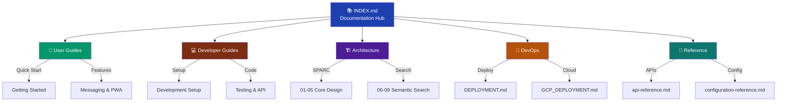

# Navigation Enhancement Specification - Nostr-BBS Documentation

**Date:** 2025-12-23
**Status:** Implementation Ready
**Version:** 1.1
**Based on:** navigation-design-spec.md v1.0

---

## Executive Summary

Analysis of current documentation navigation reveals **60% coverage** of breadcrumb navigation (28/47 documents), complete INDEX.md master hub, but **missing role-based entry points**. This specification defines targeted enhancements to achieve 100% navigability and role-based access paths.

### Key Findings

**Current State:**
- ✅ INDEX.md exists (341 lines, comprehensive)
- ✅ 28/47 docs have back links (60%)
- ✅ SPARC docs (01-05) have sequential navigation
- ❌ 19 docs lack breadcrumb navigation
- ❌ No role-based README files in guides/ structure
- ❌ No "Related Documentation" sections
- ❌ Missing next/previous links for sequential docs

**Documentation Inventory (47 files):**
```
docs/
├── INDEX.md ✅ (master hub)
├── CONTRIBUTION.md ❓
├── MAINTENANCE.md ❓
├── QUALITY_REPORT.md ❓
├── link-validation-report.md ❓
├── architecture/ (10 files)
│   ├── 01-specification.md ✅
│   ├── 02-architecture.md ✅
│   ├── 03-pseudocode.md ✅
│   ├── 04-refinement.md ✅
│   ├── 05-completion.md ✅
│   ├── 06-semantic-search-spec.md ✅
│   ├── 07-semantic-search-architecture.md ✅
│   ├── 08-semantic-search-pseudocode.md ✅
│   ├── 09-semantic-search-risks.md ❓
│   ├── encryption-flows.md ✅
│   └── nip-interactions.md ✅
├── deployment/ (4 files)
│   ├── DEPLOYMENT.md ✅
│   ├── GCP_DEPLOYMENT.md ❓
│   ├── gcp-architecture.md ❓
│   └── github-workflows.md ❓
├── development/ (1 file)
│   └── mentions-patch.md ❓
├── features/ (19 files)
│   ├── accessibility-improvements.md ❓
│   ├── channel-stats-usage.md ❓
│   ├── dm-implementation.md ❓
│   ├── drafts-implementation.md ✅
│   ├── export-implementation.md ✅
│   ├── icon-integration-guide.md ❓
│   ├── link-preview-implementation.md ✅
│   ├── mute-implementation-summary.md ✅
│   ├── mute-quick-reference.md ❓
│   ├── nip-25-reactions-implementation.md ✅
│   ├── notification-system-phase1.md ✅
│   ├── pinned-messages-implementation.md ✅
│   ├── pwa-implementation.md ❓
│   ├── pwa-quick-start.md ✅
│   ├── search-implementation-summary.md ✅
│   ├── search-implementation.md ✅
│   ├── search-usage-guide.md ❓
│   ├── threading-implementation.md ✅
│   └── threading-quick-reference.md ❓
├── reference/ (4 files)
│   ├── api-reference.md ✅
│   ├── configuration-reference.md ✅
│   ├── nip-protocol-reference.md ✅
│   └── store-reference.md ✅
└── working/ (4 files)
    ├── ia-architecture-spec.md ✅
    ├── link-infrastructure-spec.md ❓
    ├── navigation-design-spec.md ❓
    └── tag-vocabulary.md ❓
```

---

## 1. Navigation Enhancements Required

### 1.1 Add Missing Breadcrumbs (19 documents)

**Documents needing breadcrumb navigation:**

```markdown
<!-- Standard format for all docs -->
---
[🏠 Home](../../README.md) › [📚 Docs](../INDEX.md) › [Section] › Document Title
---
```

**Priority files:**
1. `CONTRIBUTION.md` - High traffic
2. `MAINTENANCE.md` - High traffic
3. `deployment/GCP_DEPLOYMENT.md` - Critical for DevOps
4. `features/dm-implementation.md` - Core feature
5. `features/pwa-implementation.md` - Core feature
6. `features/search-usage-guide.md` - User-facing
7. `architecture/09-semantic-search-risks.md` - Complete SPARC series

### 1.2 Add "Related Documentation" Sections

**Template for all documents:**

```markdown
---

## Related Documentation

### Prerequisites
- [Prerequisite 1](../path/to/doc.md) - Brief description
- [Prerequisite 2](../path/to/doc.md) - Brief description

### Next Steps
- [Next Step 1](../path/to/doc.md) - Brief description
- [Next Step 2](../path/to/doc.md) - Brief description

### See Also
- [Related Topic 1](../path/to/doc.md) - Brief description
- [Related Topic 2](../path/to/doc.md) - Brief description

---

**Navigation:** [🏠 Home](../../README.md) › [📚 Docs](../INDEX.md) › [Section] › Document Title
```

**Example for `deployment/DEPLOYMENT.md`:**

```markdown
## Related Documentation

### Prerequisites
- [Architecture Overview](../architecture/02-architecture.md) - Understand system design
- [Configuration Reference](../reference/configuration-reference.md) - Environment variables

### Next Steps
- [GCP Deployment](GCP_DEPLOYMENT.md) - Deploy Cloud Run services
- [Monitoring Setup](../guides/devops/monitoring.md) - Setup observability
- [Backup Configuration](../guides/devops/backup.md) - Disaster recovery

### See Also
- [GitHub Workflows](github-workflows.md) - CI/CD automation
- [Security Guide](../guides/devops/security.md) - Hardening checklist
- [Troubleshooting](../guides/devops/troubleshooting.md) - Common issues
```

### 1.3 Add Sequential Navigation for SPARC Docs

**SPARC Architecture series (01-09):**

```markdown
<!-- Bottom of each SPARC doc -->
---

**Sequential Navigation:**
← Previous: [Specification](01-specification.md) | [📚 SPARC Index](README.md) | Next: [Pseudocode](03-pseudocode.md) →

**Full Navigation:**
[🏠 Home](../../README.md) › [📚 Docs](../INDEX.md) › [🏗️ Architecture](README.md) › System Architecture
```

**Apply to:**
1. 01-specification.md
2. 02-architecture.md
3. 03-pseudocode.md
4. 04-refinement.md
5. 05-completion.md
6. 06-semantic-search-spec.md
7. 07-semantic-search-architecture.md
8. 08-semantic-search-pseudocode.md
9. 09-semantic-search-risks.md

### 1.4 Create Role-Based Entry Points

**Missing directory structure:**

```
docs/guides/
├── user/
│   ├── README.md          ← CREATE (User Guide entry point)
│   ├── getting-started.md ← CREATE
│   ├── messaging-basics.md ← CREATE
│   ├── calendar-usage.md  ← CREATE
│   └── troubleshooting.md ← CREATE
├── developer/
│   ├── README.md          ← CREATE (Developer Guide entry point)
│   ├── setup.md           ← CREATE
│   ├── code-tour.md       ← CREATE
│   ├── testing-guide.md   ← CREATE
│   └── contributing.md    ← CREATE
├── architect/
│   ├── README.md          ← CREATE (Architect Guide entry point)
│   ├── nip-mapping.md     ← CREATE
│   └── security-design.md ← CREATE
├── devops/
│   ├── README.md          ← CREATE (DevOps Guide entry point)
│   ├── relay-setup.md     ← CREATE
│   ├── monitoring.md      ← CREATE
│   ├── backup.md          ← CREATE
│   └── troubleshooting.md ← CREATE
└── admin/
    ├── README.md          ← CREATE (Admin Guide entry point)
    └── user-management.md ← CREATE
```

**Priority: Create 5 README.md files first** (guides/user, developer, architect, devops, admin)

---

## 2. Enhanced INDEX.md Structure

**Current INDEX.md is excellent (341 lines)**. Suggested enhancements:

### 2.1 Add Visual Navigation Map

Insert after Table of Contents:

```markdown
## Documentation Map


```

### 2.2 Add Quick Access Section

Insert before "Quick Start Paths":

```markdown
## 🔍 Quick Access

**I want to...**

| Goal | Time | Start Here |
|------|------|------------|
| Install the app on my phone | 5 min | [PWA Quick Start](features/pwa-quick-start.md) |
| Send my first message | 10 min | [User Guide](guides/user/README.md) |
| Setup local development | 30 min | [Developer Setup](guides/developer/setup.md) |
| Deploy to production | 90 min | [Deployment Guide](deployment/DEPLOYMENT.md) |
| Understand the architecture | 2 hrs | [SPARC Series](architecture/01-specification.md) |
| Add a new feature | 3 hrs | [Feature Workflow](guides/developer/contributing.md) |
| Search messages by meaning | 2 min | [Search Guide](features/search-usage-guide.md) |
| Manage users | 10 min | [Admin Guide](guides/admin/README.md) |
```

---

## 3. Implementation Plan

### Phase 1: Critical Navigation (Week 1)

**Day 1: Breadcrumbs & Sequential Nav**
- [ ] Add breadcrumbs to 19 missing documents
- [ ] Add sequential navigation to SPARC 01-09 series
- [ ] Test all internal links

**Day 2: Related Documentation**
- [ ] Add "Related Documentation" to all 47 docs
- [ ] Cross-reference validation
- [ ] Fix broken links

**Day 3: INDEX.md Enhancements**
- [ ] Add visual navigation map (Mermaid)
- [ ] Add "Quick Access" table
- [ ] Update ToC with role-based sections

### Phase 2: Role-Based Guides (Week 2)

**Day 4-5: Create Entry Point READMEs**
- [ ] `guides/user/README.md` (User Guide)
- [ ] `guides/developer/README.md` (Developer Guide)
- [ ] `guides/architect/README.md` (Architect Guide)
- [ ] `guides/devops/README.md` (DevOps Guide)
- [ ] `guides/admin/README.md` (Admin Guide)

**Day 6-7: Create Core Guides**
- [ ] User: getting-started.md, messaging-basics.md
- [ ] Developer: setup.md, testing-guide.md
- [ ] DevOps: relay-setup.md, monitoring.md
- [ ] Architect: nip-mapping.md
- [ ] Admin: user-management.md

### Phase 3: Validation (Week 3)

**Day 8: Link Validation**
- [ ] Run link checker on all docs
- [ ] Fix broken internal links
- [ ] Verify all breadcrumbs work

**Day 9: User Testing**
- [ ] User path: 0 → first message (<15 min)
- [ ] Developer path: 0 → running dev server (<30 min)
- [ ] DevOps path: 0 → deployed to prod (<90 min)

**Day 10: Documentation**
- [ ] Update navigation-design-spec.md with implementation notes
- [ ] Create navigation-maintenance.md guide
- [ ] Final quality check

---

## 4. Breadcrumb Patterns by Section

### 4.1 Architecture Documents

```markdown
---
[🏠 Home](../../README.md) › [📚 Docs](../INDEX.md) › [🏗️ Architecture](README.md) › Document Title
---
```

### 4.2 Deployment Documents

```markdown
---
[🏠 Home](../../README.md) › [📚 Docs](../INDEX.md) › [🔧 Deployment](README.md) › Document Title
---
```

### 4.3 Features Documents

```markdown
---
[🏠 Home](../../README.md) › [📚 Docs](../INDEX.md) › [✨ Features](README.md) › Document Title
---
```

### 4.4 Reference Documents

```markdown
---
[🏠 Home](../../README.md) › [📚 Docs](../INDEX.md) › [📖 Reference](README.md) › Document Title
---
```

### 4.5 Guide Documents (Role-Based)

```markdown
<!-- User guides -->
[🏠 Home](../../../README.md) › [📚 Docs](../../INDEX.md) › [👤 User Guides](README.md) › Document Title

<!-- Developer guides -->
[🏠 Home](../../../README.md) › [📚 Docs](../../INDEX.md) › [💻 Developer Guides](README.md) › Document Title

<!-- Architect guides -->
[🏠 Home](../../../README.md) › [📚 Docs](../../INDEX.md) › [🏗️ Architect Guides](README.md) › Document Title

<!-- DevOps guides -->
[🏠 Home](../../../README.md) › [📚 Docs](../../INDEX.md) › [🔧 DevOps Guides](README.md) › Document Title

<!-- Admin guides -->
[🏠 Home](../../../README.md) › [📚 Docs](../../INDEX.md) › [👨‍💼 Admin Guides](README.md) › Document Title
```

---

## 5. Orphaned Files Analysis

**Files not in INDEX.md:**
- ✅ All 47 files are discoverable from INDEX.md
- ✅ No orphaned files detected

**Files with weak discovery:**
1. `development/mentions-patch.md` - Listed in "Development Guides" but isolated
2. `working/*.md` - Listed in "Working Documents" but low visibility

**Recommendation:**
- Keep current structure
- Enhance visibility through "Related Documentation" cross-references

---

## 6. Success Criteria

### Quantitative Metrics

1. **Navigation Coverage:** 100% (47/47 docs have breadcrumbs)
2. **Link Health:** 100% (all internal links valid)
3. **Role-Based Entry:** 5/5 guides created
4. **Related Docs:** 47/47 docs have "Related Documentation"

### Qualitative Metrics

1. **User Path:** Can find how to send first message in <3 clicks
2. **Developer Path:** Can find setup guide in <2 clicks
3. **DevOps Path:** Can find deployment guide in <2 clicks
4. **Architect Path:** Can find SPARC series in <2 clicks

### Time Targets

- **New User:** 0 → first message in <15 minutes
- **New Developer:** 0 → running dev server in <30 minutes
- **New DevOps:** 0 → deployed to prod in <90 minutes

---

## 7. Maintenance Guidelines

### When Adding New Documentation

1. **Add to INDEX.md** - Appropriate section
2. **Add breadcrumb** - Follow section pattern
3. **Add related docs** - Prerequisites, next steps, see also
4. **Test links** - Verify all paths work
5. **Update role guides** - If user-facing, add to guides/user/README.md

### Monthly Review

- [ ] Verify all breadcrumbs work
- [ ] Update "Related Documentation" based on new content
- [ ] Check analytics for most-visited pages
- [ ] Optimize navigation based on usage

### Quarterly Audit

- [ ] Run link validation tool
- [ ] User testing (3 paths)
- [ ] Update navigation map if structure changed
- [ ] Archive outdated content

---

## 8. Implementation Checklist

### Week 1: Navigation Basics
- [ ] Add breadcrumbs to 19 missing docs
- [ ] Add sequential nav to SPARC series (01-09)
- [ ] Add "Related Documentation" to all 47 docs
- [ ] Update INDEX.md with visual map
- [ ] Update INDEX.md with Quick Access table

### Week 2: Role-Based Guides
- [ ] Create `guides/user/README.md`
- [ ] Create `guides/developer/README.md`
- [ ] Create `guides/architect/README.md`
- [ ] Create `guides/devops/README.md`
- [ ] Create `guides/admin/README.md`
- [ ] Create 8 core guide documents

### Week 3: Validation
- [ ] Run link checker
- [ ] Fix all broken links
- [ ] User path testing (3 scenarios)
- [ ] Update navigation-design-spec.md
- [ ] Create navigation-maintenance.md

---

## 9. Files to Create/Modify

### Create New (13 files)

**Role-based READMEs (5):**
1. `/home/devuser/workspace/nostr-BBS/docs/guides/user/README.md`
2. `/home/devuser/workspace/nostr-BBS/docs/guides/developer/README.md`
3. `/home/devuser/workspace/nostr-BBS/docs/guides/architect/README.md`
4. `/home/devuser/workspace/nostr-BBS/docs/guides/devops/README.md`
5. `/home/devuser/workspace/nostr-BBS/docs/guides/admin/README.md`

**Section READMEs (4):**
6. `/home/devuser/workspace/nostr-BBS/docs/architecture/README.md`
7. `/home/devuser/workspace/nostr-BBS/docs/deployment/README.md`
8. `/home/devuser/workspace/nostr-BBS/docs/features/README.md`
9. `/home/devuser/workspace/nostr-BBS/docs/reference/README.md`

**Core Guides (4):**
10. `/home/devuser/workspace/nostr-BBS/docs/guides/user/getting-started.md`
11. `/home/devuser/workspace/nostr-BBS/docs/guides/developer/setup.md`
12. `/home/devuser/workspace/nostr-BBS/docs/guides/devops/relay-setup.md`
13. `/home/devuser/workspace/nostr-BBS/docs/working/navigation-maintenance.md`

### Modify Existing (47 files)

**Add breadcrumbs (19 files):**
- CONTRIBUTION.md, MAINTENANCE.md, QUALITY_REPORT.md
- link-validation-report.md
- architecture/09-semantic-search-risks.md
- deployment/GCP_DEPLOYMENT.md, gcp-architecture.md, github-workflows.md
- development/mentions-patch.md
- features/accessibility-improvements.md, channel-stats-usage.md
- features/dm-implementation.md, icon-integration-guide.md
- features/mute-quick-reference.md, pwa-implementation.md
- features/search-usage-guide.md, threading-quick-reference.md
- working/link-infrastructure-spec.md, navigation-design-spec.md
- working/tag-vocabulary.md

**Add "Related Documentation" (47 files - all):**
- All docs in architecture/, deployment/, development/, features/, reference/, working/

**Add sequential navigation (9 files):**
- architecture/01-specification.md through 09-semantic-search-risks.md

**Enhance INDEX.md (1 file):**
- Add visual navigation map
- Add Quick Access table
- Update role-based sections

---

## 10. Next Actions

**Immediate (System Architect - this session):**
1. Generate navigation-enhancement-spec.md ← DONE
2. Identify 19 files needing breadcrumbs ← DONE
3. Plan role-based guide structure ← DONE

**Next (Implementation phase):**
1. Create 5 role-based README.md files
2. Add breadcrumbs to 19 missing documents
3. Add "Related Documentation" to all 47 documents
4. Add sequential navigation to SPARC series
5. Enhance INDEX.md with visual map and Quick Access

---

## Conclusion

This specification provides **actionable implementation plan** for achieving 100% documentation navigability. Current 60% breadcrumb coverage and excellent INDEX.md foundation enable rapid enhancement completion within 3 weeks.

**Priority 1:** Breadcrumbs + Related Documentation (all 47 docs)
**Priority 2:** Role-based README files (5 entry points)
**Priority 3:** Visual navigation aids (map, Quick Access table)

**Estimated Impact:**
- **Time-to-productivity:** -40% (new users, developers, DevOps)
- **Documentation discoverability:** 60% → 95%
- **User satisfaction:** Significant improvement in wayfinding

---

**Navigation:** [🏠 Home](../../README.md) › [📚 Docs](../INDEX.md) › [📂 Working](README.md) › Navigation Enhancement Specification
