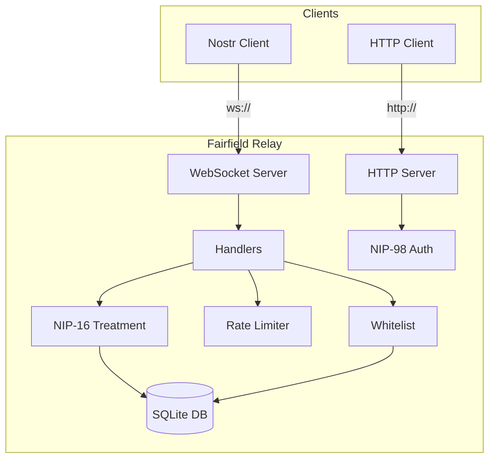
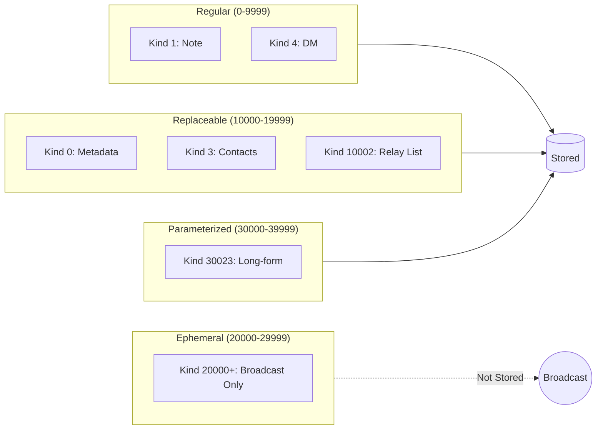
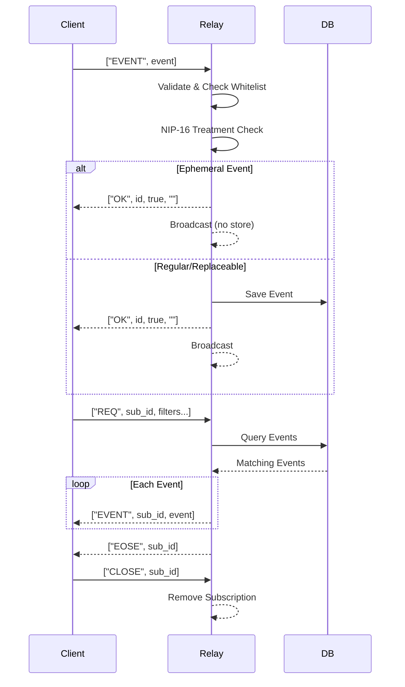

# Fairfield Nostr Relay

A whitelist-based Nostr relay with SQLite persistence, NIP-16/33/98 support, and did:nostr identity resolution.

## Features

- **Whitelist-Controlled Access** - Cohort-based access control with expiring memberships
- **SQLite Persistence** - Production-grade storage with better-sqlite3 and WAL mode
- **NIP-16 Event Treatment** - Proper handling of replaceable, ephemeral, and parameterized events
- **NIP-33 Parameterized Replaceable** - d-tag based event replacement for articles and profiles
- **NIP-98 HTTP Auth** - Schnorr signature authentication for HTTP endpoints
- **did:nostr Identity** - Decentralised identity resolution
- **Rate Limiting** - Configurable per-IP connection and event limits

## Quick Start

```bash
# Install dependencies
npm install

# Configure environment
cp .env.example .env
# Edit .env with your settings

# Run in development
npm run dev

# Build and run production
npm run build
npm start
```

## Architecture Overview



## Supported NIPs

| NIP | Description | Implementation |
|-----|-------------|----------------|
| NIP-01 | Basic Protocol | Full event/subscription handling |
| NIP-11 | Relay Information | `/.well-known/nostr.json` |
| NIP-16 | Event Treatment | Replaceable, ephemeral, regular events |
| NIP-33 | Parameterized Replaceable | d-tag based replacement |
| NIP-98 | HTTP Auth | Schnorr signature authentication |

## Event Kind Ranges



## Configuration

| Variable | Default | Description |
|----------|---------|-------------|
| `PORT` | `8080` | HTTP/WebSocket port |
| `HOST` | `0.0.0.0` | Bind address |
| `SQLITE_DATA_DIR` | `./data` | Database directory |
| `WHITELIST_PUBKEYS` | - | Comma-separated allowed pubkeys |
| `ADMIN_PUBKEYS` | - | Comma-separated admin pubkeys |
| `RATE_LIMIT_EVENTS_PER_SEC` | `10` | Max events per second per IP |
| `RATE_LIMIT_MAX_CONNECTIONS` | `10` | Max concurrent connections per IP |

## API Endpoints

### Health Check
```
GET /health
GET /
```

Returns relay status, version, and statistics.

### Whitelist Check
```
GET /api/check-whitelist?pubkey=<64-char-hex>
```

Check if a pubkey is whitelisted and get cohort information.

### NIP-98 Authenticated
```
GET /api/authenticated
Authorization: Nostr <base64-encoded-kind-27235-event>
```

Example authenticated endpoint demonstrating NIP-98.

### Relay Information (NIP-11)
```
GET /.well-known/nostr.json
Accept: application/nostr+json
```

## WebSocket Protocol



## Development

```bash
# Run tests
npm test

# Watch mode
npm run test:watch

# Coverage report
npm run test:coverage

# Build TypeScript
npm run build
```

## Project Structure

```
nostr-relay/
├── src/
│   ├── server.ts      # HTTP/WebSocket server
│   ├── handlers.ts    # Message handlers
│   ├── db.ts          # SQLite database
│   ├── whitelist.ts   # Access control
│   ├── rateLimit.ts   # Rate limiting
│   ├── nip16.ts       # Event treatment
│   ├── nip98.ts       # HTTP auth
│   └── did-nostr.ts   # Identity resolution
├── tests/
│   └── unit/          # Unit tests
├── data/              # SQLite database (gitignored)
└── dist/              # Compiled output
```

## Security Considerations

- **Whitelist Required**: By default, only whitelisted pubkeys can publish events
- **Signature Verification**: All events verified using Schnorr signatures
- **Rate Limiting**: Per-IP limits prevent abuse
- **NIP-98**: HTTP endpoints can require cryptographic authentication

## Licence

MIT
