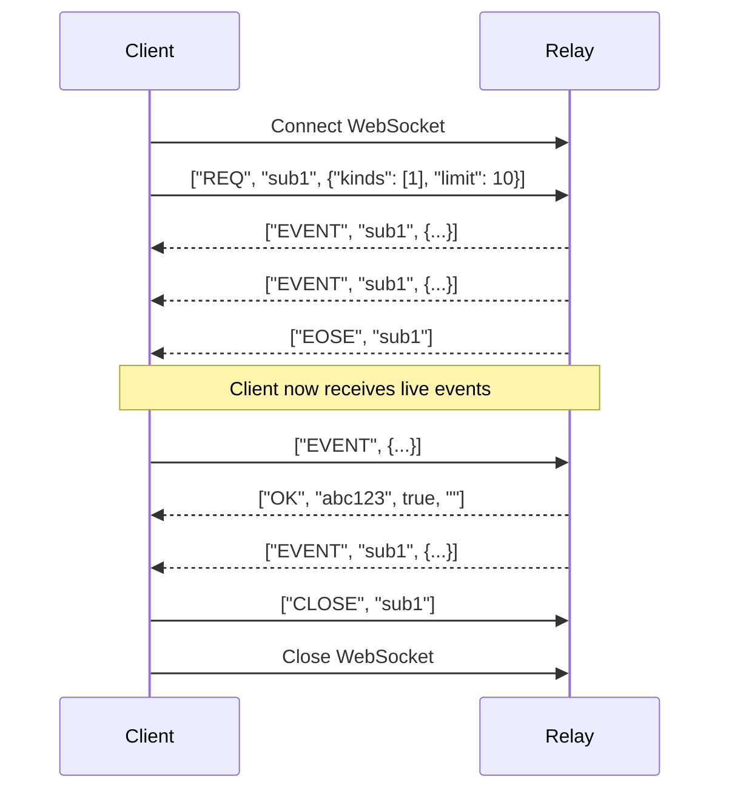

# API Reference

Complete API documentation for the Fairfield Nostr Relay.

## WebSocket API

Connect via WebSocket at `ws://<host>:<port>/`

### Event Types

#### EVENT - Publish an event

```json
["EVENT", <event>]
```

**Event Structure:**
| Field | Type | Description |
|-------|------|-------------|
| `id` | string | 64-char hex SHA-256 of serialised event |
| `pubkey` | string | 64-char hex public key |
| `created_at` | number | Unix timestamp |
| `kind` | number | Event kind |
| `tags` | array | Array of tag arrays |
| `content` | string | Event content |
| `sig` | string | 128-char hex Schnorr signature |

**Response:**
```json
["OK", "<event-id>", true|false, "<message>"]
```

**Error Messages:**
- `"invalid: event validation failed"` - Malformed event
- `"blocked: pubkey not whitelisted"` - Access denied
- `"invalid: event id verification failed"` - Hash mismatch
- `"invalid: signature verification failed"` - Bad signature
- `"rate limit exceeded"` - Too many events

---

#### REQ - Subscribe to events

```json
["REQ", "<subscription-id>", <filter>, ...]
```

**Filter Structure:**
| Field | Type | Description |
|-------|------|-------------|
| `ids` | array | Event IDs to match |
| `authors` | array | Pubkeys to match |
| `kinds` | array | Event kinds to match |
| `since` | number | Events after timestamp |
| `until` | number | Events before timestamp |
| `limit` | number | Maximum events (default: 500, max: 5000) |
| `#<tag>` | array | Tag values to match |

**Response:**
```json
["EVENT", "<subscription-id>", <event>]
...
["EOSE", "<subscription-id>"]
```

---

#### CLOSE - Unsubscribe

```json
["CLOSE", "<subscription-id>"]
```

No response is sent.

---

### Protocol Flow



---

## HTTP API

### GET /health

Health check and relay statistics.

**Response:**
```json
{
  "status": "healthy",
  "version": "2.2.0",
  "database": "better-sqlite3",
  "events": 1234,
  "whitelisted": 56,
  "dbSizeBytes": 10485760,
  "uptime": 3600.5,
  "nips": [1, 11, 16, 33, 98]
}
```

---

### GET /api/check-whitelist

Check whitelist status for a pubkey.

**Query Parameters:**
| Parameter | Required | Description |
|-----------|----------|-------------|
| `pubkey` | Yes | 64-char hex public key |

**Response (200 OK):**
```json
{
  "isWhitelisted": true,
  "isAdmin": false,
  "cohorts": ["members", "early-access"],
  "verifiedAt": 1704067200000,
  "source": "relay"
}
```

**Response (400 Bad Request):**
```json
{
  "error": "Invalid pubkey format"
}
```

---

### GET /api/authenticated

Example NIP-98 authenticated endpoint.

**Headers:**
```
Authorization: Nostr <base64-encoded-event>
```

The event must be kind 27235 with:
- `u` tag: URL being accessed
- `method` tag: HTTP method (or `*`)
- `created_at`: Within ±60 seconds of current time

**Response (200 OK):**
```json
{
  "authenticated": true,
  "pubkey": "abc123...",
  "didNostr": "did:nostr:abc123..."
}
```

**Response (401 Unauthorized):**
```json
{
  "error": "Invalid Schnorr signature"
}
```

---

### GET /.well-known/nostr.json

Relay information document (NIP-11).

**Request Headers:**
```
Accept: application/nostr+json
```

**Response:**
```json
{
  "name": "Fairfield Nostr Relay",
  "description": "Private whitelist-only relay with NIP-16/98 support",
  "pubkey": "admin-pubkey-here",
  "supported_nips": [1, 11, 16, 33, 98],
  "software": "fairfield-nostr-relay",
  "version": "2.2.0",
  "limitation": {
    "auth_required": false,
    "payment_required": false,
    "restricted_writes": true
  }
}
```

---

## NIP-98 Authentication

### Creating an Auth Event

```typescript
import { schnorr } from '@noble/curves/secp256k1';
import crypto from 'crypto';

function createAuthEvent(privateKey: string, url: string, method: string) {
  const pubkey = schnorr.getPublicKey(privateKey);
  const created_at = Math.floor(Date.now() / 1000);

  const event = {
    pubkey: Buffer.from(pubkey).toString('hex'),
    created_at,
    kind: 27235,
    tags: [
      ['u', url],
      ['method', method]
    ],
    content: ''
  };

  // Compute event ID
  const serialised = JSON.stringify([
    0, event.pubkey, event.created_at, event.kind, event.tags, event.content
  ]);
  const id = crypto.createHash('sha256').update(serialised).digest('hex');

  // Sign
  const sig = schnorr.sign(id, privateKey);

  return { ...event, id, sig: Buffer.from(sig).toString('hex') };
}

// Usage
const event = createAuthEvent(privateKey, 'http://localhost:8080/api/authenticated', 'GET');
const token = Buffer.from(JSON.stringify(event)).toString('base64');

fetch('http://localhost:8080/api/authenticated', {
  headers: { 'Authorization': `Nostr ${token}` }
});
```

### Alternative: Basic Auth Format

For git clients that only support Basic auth:

```
Authorization: Basic <base64(nostr:<token>)>
```

---

## Event Kinds

### Regular Events (Stored Permanently)

| Kind | Description |
|------|-------------|
| 1 | Short text note |
| 4 | Encrypted direct message |
| 5 | Event deletion |
| 6 | Repost |
| 7 | Reaction |

### Replaceable Events (Latest Only)

| Kind | Description |
|------|-------------|
| 0 | Profile metadata |
| 3 | Contact list |
| 10002 | Relay list metadata |

### Ephemeral Events (Broadcast, Not Stored)

| Kind | Description |
|------|-------------|
| 20000-29999 | Application-specific ephemeral |

### Parameterized Replaceable (By d-tag)

| Kind | Description |
|------|-------------|
| 30023 | Long-form content |
| 30078 | Application-specific data |

---

## Rate Limits

| Limit | Default | Description |
|-------|---------|-------------|
| Events per second | 10 | Per IP address |
| Concurrent connections | 10 | Per IP address |
| Query limit | 500 | Events per REQ filter |
| Maximum query limit | 5000 | Hard cap |

---

## Error Codes

| HTTP Status | WebSocket | Description |
|-------------|-----------|-------------|
| 200 | `["OK", id, true, ""]` | Success |
| 400 | `["NOTICE", "..."]` | Bad request |
| 401 | - | NIP-98 auth failed |
| 404 | - | Endpoint not found |
| - | `["OK", id, false, "blocked: ..."]` | Whitelist rejected |
| - | `["OK", id, false, "invalid: ..."]` | Validation failed |
| - | `["NOTICE", "rate limit exceeded"]` | Rate limited |
