# Architecture

This document describes the internal architecture of the Fairfield Nostr Relay.

## System Overview

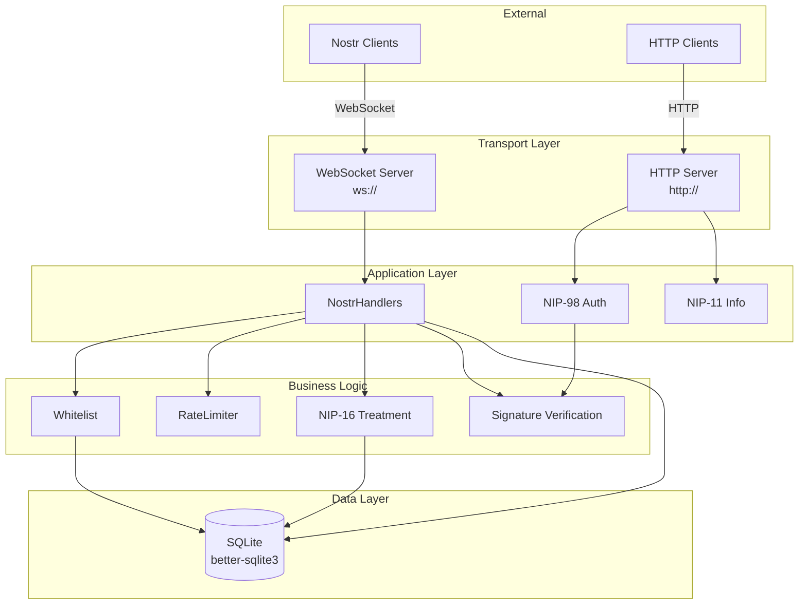

## Component Details

### Server (`server.ts`)

The main entry point orchestrating HTTP and WebSocket servers.

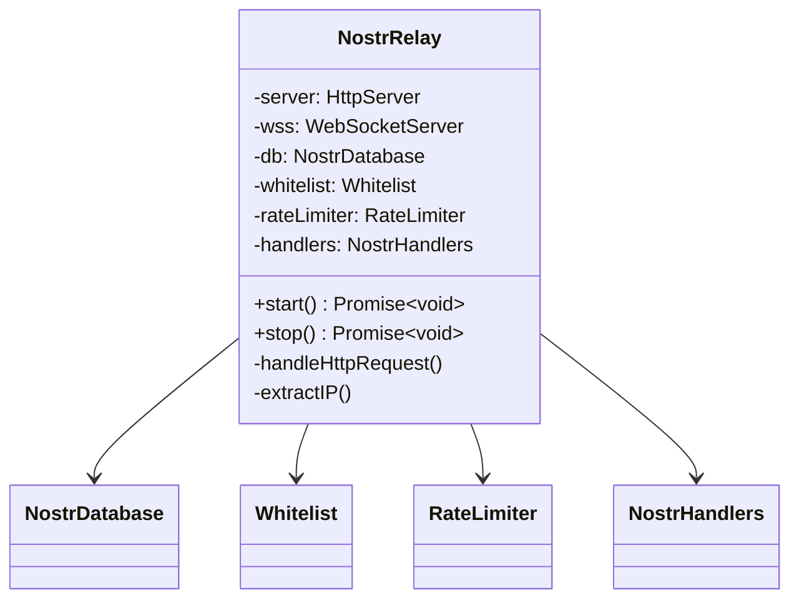

### Handlers (`handlers.ts`)

Processes Nostr protocol messages (EVENT, REQ, CLOSE).

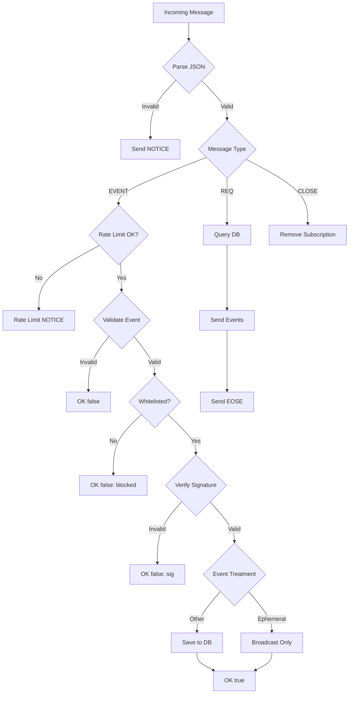

### Database (`db.ts`)

SQLite persistence with optimised indexes and WAL mode.

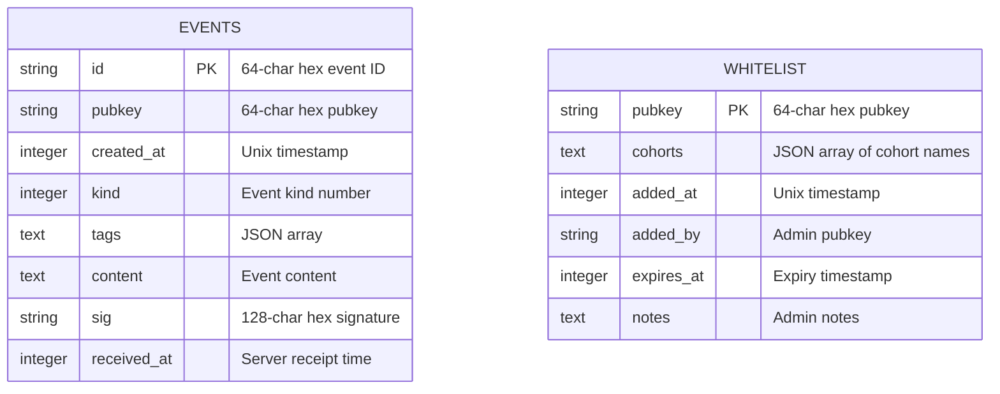

### NIP-16 Event Treatment (`nip16.ts`)

Determines how events are stored based on their kind.

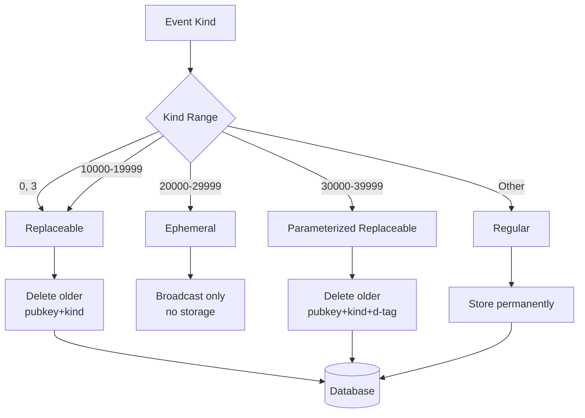

### NIP-98 HTTP Auth (`nip98.ts`)

Authenticates HTTP requests using signed Nostr events.

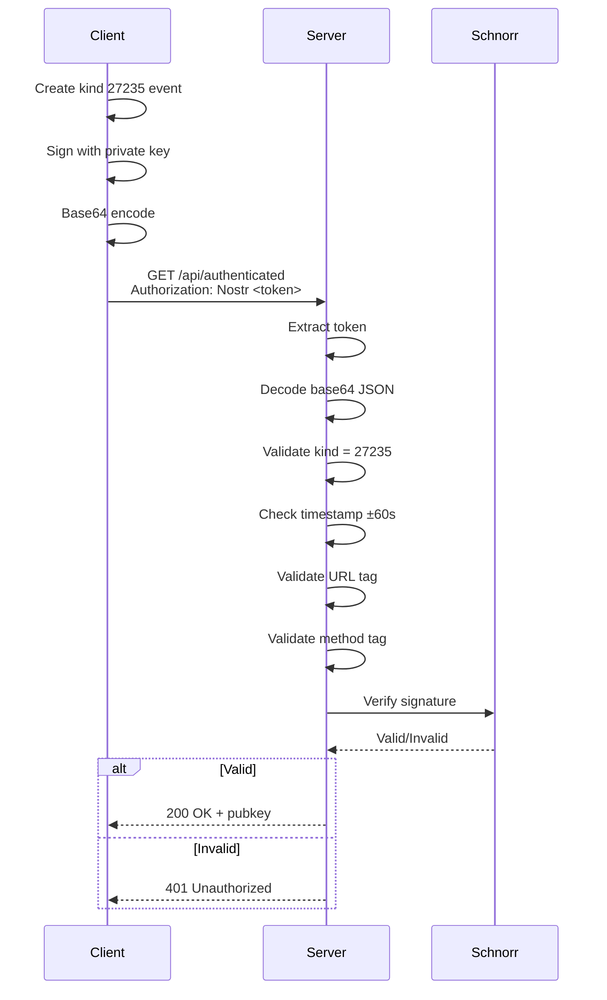

### did:nostr Identity (`did-nostr.ts`)

Resolves Nostr pubkeys as decentralised identifiers.

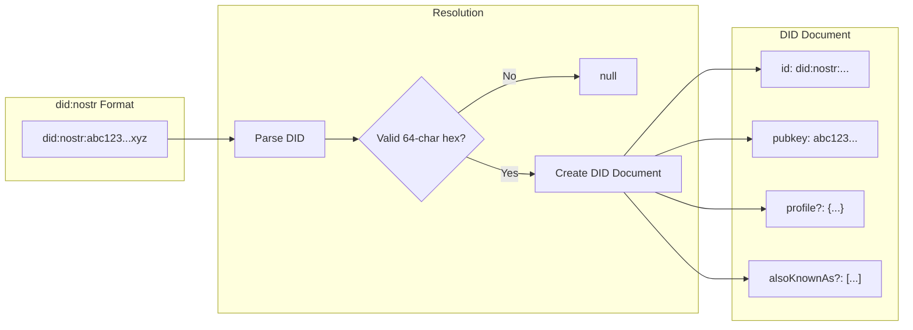

## Data Flow

### Event Publishing

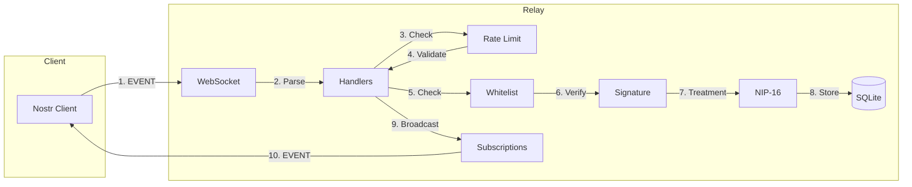

### Subscription Query

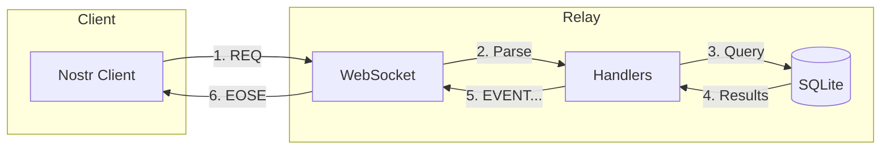

## Concurrency Model

The relay uses Node.js's event loop with synchronous SQLite operations via better-sqlite3:

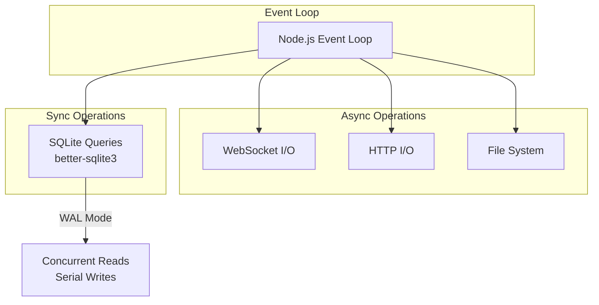

## Security Architecture

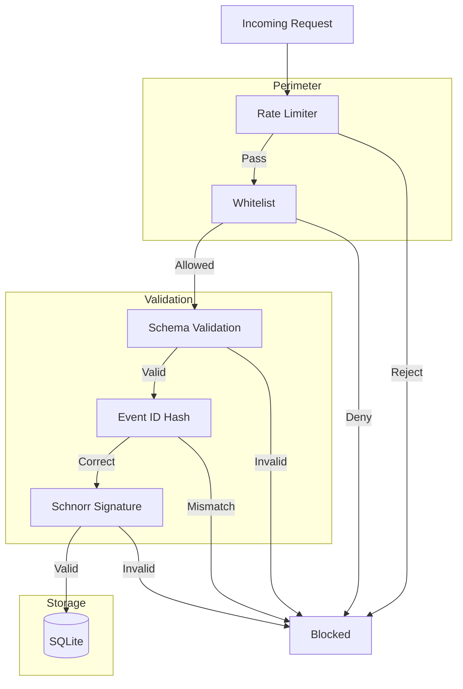
