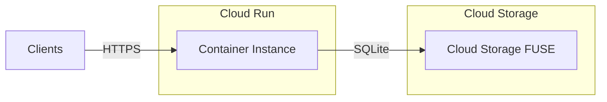
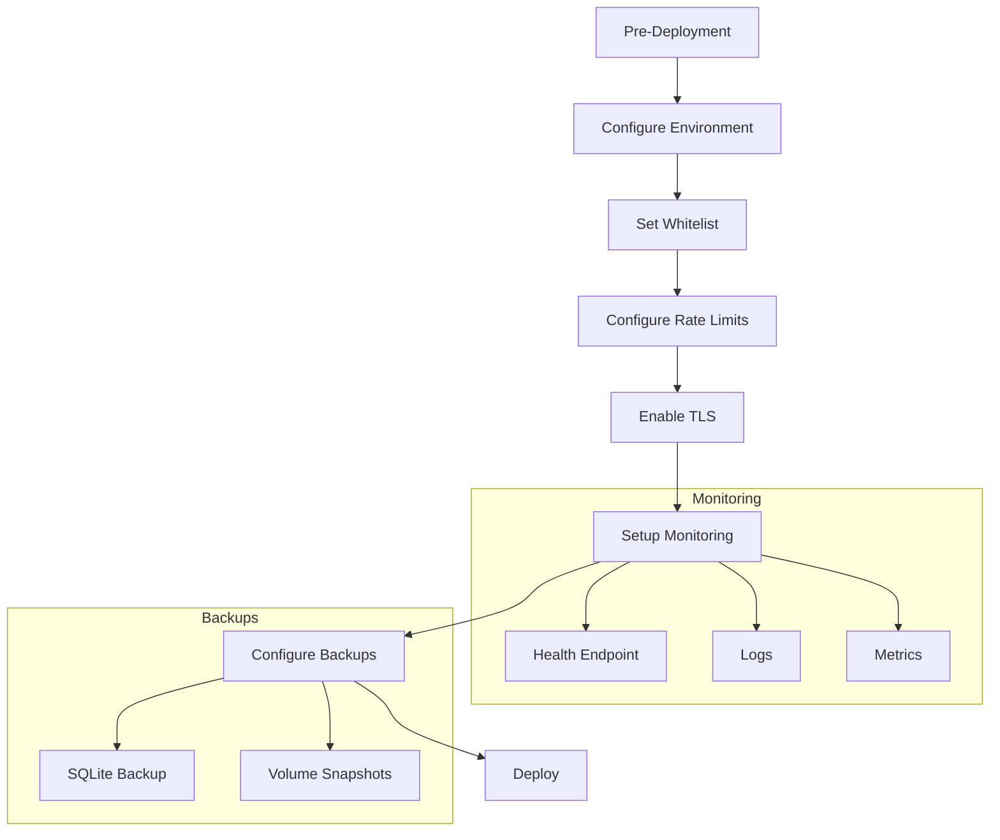
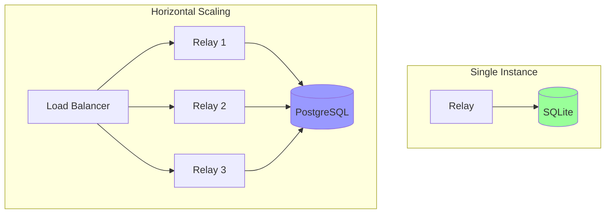

# Deployment Guide

Deploy the Fairfield Nostr Relay to production environments.

## Prerequisites

- Node.js 18+ (LTS recommended)
- npm or yarn
- Persistent storage for SQLite database

## Environment Configuration

Create a `.env` file with the following variables:

```bash
# Server
PORT=8080
HOST=0.0.0.0

# Database
SQLITE_DATA_DIR=/var/lib/nostr-relay/data

# Access Control
WHITELIST_PUBKEYS=pubkey1,pubkey2,pubkey3
ADMIN_PUBKEYS=admin-pubkey

# Rate Limiting (optional)
RATE_LIMIT_EVENTS_PER_SEC=10
RATE_LIMIT_MAX_CONNECTIONS=10
```

## Deployment Options

### Docker

```dockerfile
FROM node:20-alpine

WORKDIR /app

COPY package*.json ./
RUN npm ci --only=production

COPY dist/ ./dist/

ENV PORT=8080
ENV SQLITE_DATA_DIR=/data

VOLUME ["/data"]
EXPOSE 8080

CMD ["node", "dist/server.js"]
```

Build and run:

```bash
docker build -t nostr-relay .
docker run -d \
  --name nostr-relay \
  -p 8080:8080 \
  -v nostr-data:/data \
  -e WHITELIST_PUBKEYS="pubkey1,pubkey2" \
  -e ADMIN_PUBKEYS="admin-pubkey" \
  nostr-relay
```

### Docker Compose

```yaml
version: '3.8'

services:
  nostr-relay:
    build: .
    ports:
      - "8080:8080"
    volumes:
      - nostr-data:/data
    environment:
      - PORT=8080
      - SQLITE_DATA_DIR=/data
      - WHITELIST_PUBKEYS=${WHITELIST_PUBKEYS}
      - ADMIN_PUBKEYS=${ADMIN_PUBKEYS}
    restart: unless-stopped
    healthcheck:
      test: ["CMD", "curl", "-f", "http://localhost:8080/health"]
      interval: 30s
      timeout: 10s
      retries: 3

volumes:
  nostr-data:
```

### Google Cloud Run



**Deployment Steps:**

1. Build container image:
```bash
gcloud builds submit --tag gcr.io/PROJECT_ID/nostr-relay
```

2. Deploy with Cloud Storage mount:
```bash
gcloud run deploy nostr-relay \
  --image gcr.io/PROJECT_ID/nostr-relay \
  --platform managed \
  --region europe-west1 \
  --allow-unauthenticated \
  --set-env-vars "SQLITE_DATA_DIR=/mnt/data" \
  --execution-environment gen2 \
  --add-volume name=data,type=cloud-storage,bucket=nostr-relay-data \
  --add-volume-mount volume=data,mount-path=/mnt/data
```

### Systemd Service

Create `/etc/systemd/system/nostr-relay.service`:

```ini
[Unit]
Description=Fairfield Nostr Relay
After=network.target

[Service]
Type=simple
User=nostr
Group=nostr
WorkingDirectory=/opt/nostr-relay
ExecStart=/usr/bin/node dist/server.js
Restart=on-failure
RestartSec=10

Environment=NODE_ENV=production
Environment=PORT=8080
Environment=SQLITE_DATA_DIR=/var/lib/nostr-relay/data
EnvironmentFile=/etc/nostr-relay/config

[Install]
WantedBy=multi-user.target
```

Enable and start:

```bash
sudo systemctl daemon-reload
sudo systemctl enable nostr-relay
sudo systemctl start nostr-relay
```

## Reverse Proxy

### Nginx Configuration

```nginx
upstream nostr_relay {
    server 127.0.0.1:8080;
}

server {
    listen 443 ssl http2;
    server_name relay.example.com;

    ssl_certificate /etc/letsencrypt/live/relay.example.com/fullchain.pem;
    ssl_certificate_key /etc/letsencrypt/live/relay.example.com/privkey.pem;

    location / {
        proxy_pass http://nostr_relay;
        proxy_http_version 1.1;
        proxy_set_header Upgrade $http_upgrade;
        proxy_set_header Connection "upgrade";
        proxy_set_header Host $host;
        proxy_set_header X-Real-IP $remote_addr;
        proxy_set_header X-Forwarded-For $proxy_add_x_forwarded_for;
        proxy_set_header X-Forwarded-Proto $scheme;

        # WebSocket timeouts
        proxy_read_timeout 3600s;
        proxy_send_timeout 3600s;
    }
}
```

### Caddy Configuration

```
relay.example.com {
    reverse_proxy localhost:8080
}
```

## Production Checklist



### Security

- [ ] Configure whitelist pubkeys
- [ ] Set admin pubkeys
- [ ] Enable TLS via reverse proxy
- [ ] Configure firewall rules
- [ ] Set appropriate rate limits

### Reliability

- [ ] Configure health checks
- [ ] Set up log aggregation
- [ ] Configure automatic restarts
- [ ] Plan database backups

### Performance

- [ ] Tune SQLite cache size
- [ ] Configure connection limits
- [ ] Monitor memory usage

## Backup Strategy

SQLite database backup:

```bash
# Hot backup using sqlite3 .backup
sqlite3 /var/lib/nostr-relay/data/nostr.db ".backup '/backup/nostr-$(date +%Y%m%d).db'"

# Or copy WAL checkpoint
sqlite3 /var/lib/nostr-relay/data/nostr.db "PRAGMA wal_checkpoint(TRUNCATE);"
cp /var/lib/nostr-relay/data/nostr.db /backup/
```

## Monitoring

### Health Check

```bash
curl http://localhost:8080/health | jq .
```

### Prometheus Metrics (Future)

Metrics endpoint planned for future versions:
- `nostr_events_total` - Total events stored
- `nostr_connections_active` - Active WebSocket connections
- `nostr_events_per_second` - Event throughput

### Log Analysis

```bash
# View recent logs
journalctl -u nostr-relay -f

# Filter errors
journalctl -u nostr-relay --priority=err
```

## Scaling Considerations



For high-volume deployments, consider:
- PostgreSQL instead of SQLite
- Read replicas for query load
- Connection pooling
- CDN for static content
